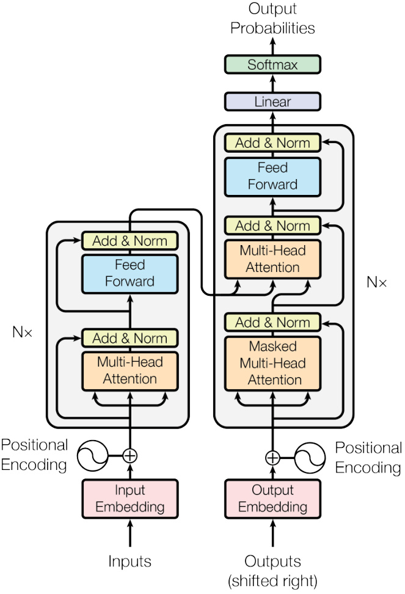
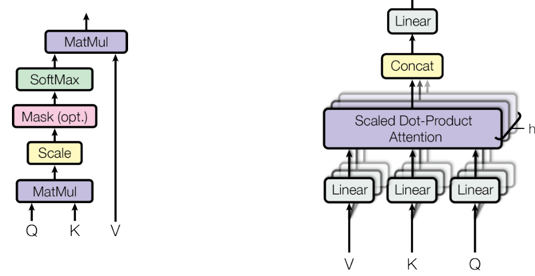
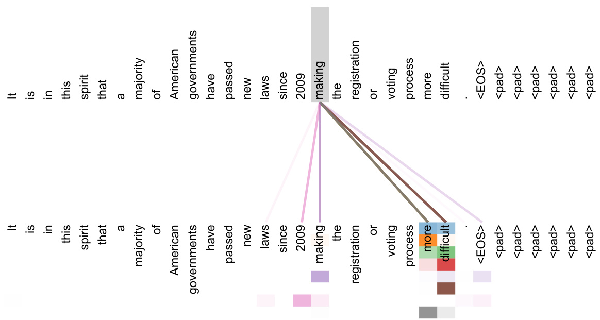
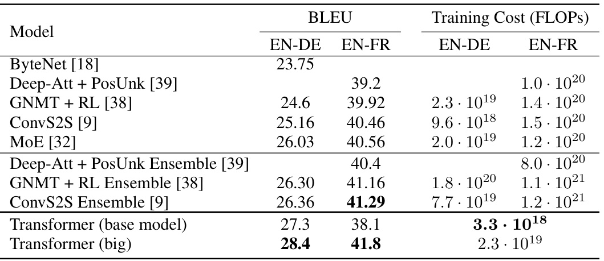
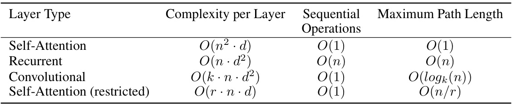

# [Attention Is All You Need](../01-Attention Is All You Need.pdf)

## **Dataset and Preprocessing:**

### **Datasets Used:**

- **WMT 2014 English-to-German Translation Task:**
  - Approximately 4.5 million sentence pairs.
  - Used for training the machine translation models.

- **WMT 2014 English-to-French Translation Task:**
  - Contains 36 million sentence pairs.
  - Used to demonstrate the scalability of the Transformer model.

- **English Constituency Parsing:**
  - **Wall Street Journal (WSJ) Portion of the Penn Treebank:**
    - About 40,000 training sentences.
  - **Semi-Supervised Setting:**
    - High-confidence and BerkeleyParser corpora with approximately 17 million sentences.

### **Preprocessing Steps:**

- **Tokenization and Encoding:**
  - **Byte-Pair Encoding (BPE):**
    - Applied to the English-German dataset.
    - Shared source-target vocabulary of about 37,000 tokens.
  - **Word-Piece Vocabulary:**
    - Used for the English-French dataset.
    - Vocabulary size of 32,000 tokens.

- **Batching:**
  - Sentence pairs are batched by approximate sequence length.
  - Each training batch contains approximately 25,000 source tokens and 25,000 target tokens.

### **Illustrative Examples:**

- Although specific examples are not provided, the datasets consist of parallel sentences used for machine translation tasks, ensuring the model learns from diverse linguistic patterns.

---

## **Network Architecture:**

### **Overall Architecture:**

- **The Transformer Model:**
  - An encoder-decoder architecture that relies entirely on **attention mechanisms**.
  - Dispenses with recurrence and convolutions entirely.
  - Allows for significantly more parallelization and requires less time to train.

- **Encoder and Decoder Stacks:**
  - Both consist of a stack of **$N=6$** identical layers.
  - Employ **multi-head self-attention** and **position-wise feed-forward networks**.

### **Visual Illustration:**

- While figures are referenced in the paper, the architecture can be visualized as:

  - **Encoder:**
    - Input Embedding + Positional Encoding
    - $\downarrow$
    - [Multi-Head Self-Attention $\rightarrow$ Add & Norm $\rightarrow$ Feed-Forward $\rightarrow$ Add & Norm] (Repeated $N$ times)
    - $\downarrow$
    - Output of Encoder Stack

  - **Decoder:**
    - Output Embedding + Positional Encoding
    - $\downarrow$
    - [Masked Multi-Head Self-Attention $\rightarrow$ Add & Norm $\rightarrow$ Encoder-Decoder Attention $\rightarrow$ Add & Norm $\rightarrow$ Feed-Forward $\rightarrow$ Add & Norm] (Repeated $N$ times)
    - $\downarrow$
    - Linear Transformation + Softmax
    - $\downarrow$
    - Output Probabilities

### **Detailed Layer-by-Layer Description:**



#### **Encoder Layer:**

1. **Multi-Head Self-Attention:**

   - **Input:** Output from the previous layer or embeddings.
   - **Computes:** Attention over all positions in the input sequence.

2. **Add & Norm:**

   - **Residual Connection:** Adds the input to the output of the sub-layer.
   - **Layer Normalization:** Applies normalization to the summed output.

3. **Position-Wise Feed-Forward Network (FFN):**

   - **Applies:** Two linear transformations with a ReLU activation in between.

4. **Add & Norm:**
- **Residual Connection and Layer Normalization** as before.

#### **Decoder Layer:**

1. **Masked Multi-Head Self-Attention:**

   - **Prevents:** Positions from attending to subsequent positions (future tokens).
   - **Ensures:** Auto-regressive property is maintained.

2. **Add & Norm**

3. **Encoder-Decoder Attention:**

   - **Attention over Encoder Output:** Allows the decoder to focus on relevant parts of the input sequence.

4. **Add & Norm**

5. **Position-Wise Feed-Forward Network (FFN)**

6. **Add & Norm**

### **Attention Mechanisms:**



#### **Scaled Dot-Product Attention:**

- **Formula:**

  $$
  \text{Attention}(Q, K, V) = \text{softmax}\left( \frac{Q K^\top}{\sqrt{d_k}} \right) V
  $$

- **Definitions:**
  - **$Q$ (Queries):** Matrix of query vectors.
  - **$K$ (Keys):** Matrix of key vectors.
  - **$V$ (Values):** Matrix of value vectors.
  - **$d_k$:** Dimension of the keys (and queries).

- **Purpose:**
  
  - Computes a weighted sum of the values, where the weights are determined by the compatibility of the queries with the keys.
  
      
  
- **Explanation:**
  
  - The dot product of queries and keys is scaled by $\frac{1}{\sqrt{d_k}}$ to mitigate the issue of large dot products when $d_k$ is large, which can push the softmax function into regions with extremely small gradients.

#### **Multi-Head Attention:**

- **Formula:**

  $$
  \begin{align*}
  \text{MultiHead}(Q, K, V) &= \text{Concat}(\text{head}_1, \dotsc, \text{head}_h) W^O \\
  \text{where head}_i &= \text{Attention}(Q W_i^Q, K W_i^K, V W_i^V)
  \end{align*}
  $$

- **Definitions:**
  - **$W_i^Q$, $W_i^K$, $W_i^V$:** Projection matrices for queries, keys, and values.
  - **$W^O$:** Output projection matrix.
  - **$h$:** Number of attention heads (e.g., $h=8$).

- **Purpose:**
  - Allows the model to attend to information from different representation subspaces at different positions.
  - Mitigates the averaging effect that can inhibit learning in single-head attention.

- **Explanation:**
  - Each attention head processes a version of the queries, keys, and values, enabling the model to capture various aspects of the input.

#### **Applications of Attention:**

1. **Encoder-Decoder Attention:**
   - Queries from the decoder, keys and values from the encoder output.
   - Enables the decoder to focus on relevant parts of the input sequence.

2. **Encoder Self-Attention:**
   - Queries, keys, and values all from the encoder.
   - Allows each position to attend to all positions in the previous layer of the encoder.

3. **Decoder Self-Attention:**
   - Similar to encoder self-attention but with masking to prevent attending to future positions.

### **Position-Wise Feed-Forward Networks:**

- **Formula:**

  $$
  \text{FFN}(x) = \text{max}(0, x W_1 + b_1) W_2 + b_2
  $$

- **Definitions:**
  - **$x$:** Input vector.
  - **$W_1$, $W_2$:** Weight matrices.
  - **$b_1$, $b_2$:** Bias vectors.

- **Purpose:**
  - Introduces non-linearity and complex transformations at each position independently.

- **Explanation:**
  - Each position in the sequence is processed separately and identically, allowing the model to capture position-specific transformations.

### **Embeddings and Positional Encoding:**

#### **Token Embeddings:**

- Learned embeddings convert input and output tokens to vectors of dimension $d_{\text{model}}$.

#### **Positional Encodings:**

- **Formula:**

  $$
  \begin{align*}
  \text{PE}_{(pos, 2i)} &= \sin\left( \frac{pos}{10000^{2i / d_{\text{model}}}} \right) \\
  \text{PE}_{(pos, 2i+1)} &= \cos\left( \frac{pos}{10000^{2i / d_{\text{model}}}} \right)
  \end{align*}
  $$

- **Definitions:**
  - **$pos$:** Position index in the sequence.
  - **$i$:** Dimension index.

- **Purpose:**
  - Injects information about the position of tokens in the sequence.
  - Allows the model to capture the order without using recurrence.

- **Explanation:**
  - The sinusoidal functions enable the model to generalize to sequence lengths not seen during training.

### **LaTeX-style Pseudo-code Representation:**


```latex
% Define hyperparameters
N = 6                       % Number of layers in encoder and decoder
d_model = 512               % Dimension of embeddings and hidden layers
h = 8                       % Number of attention heads
d_k = d_v = 64              % Dimension per head for keys, queries, and values

% Encoder
For l = 1 to N:
    % Multi-Head Self-Attention
    Q = K = V = Output from previous layer or input embeddings
    For each head i = 1 to h:
        Q_i = Q * W_i^Q      % Project queries
        K_i = K * W_i^K      % Project keys
        V_i = V * W_i^V      % Project values
        head_i = Attention(Q_i, K_i, V_i)
    MultiHead = Concat(head_1, ..., head_h) * W^O
    % Add & Norm
    Output = LayerNorm(MultiHead + Input)
    % Feed-Forward Network
    FFN_Output = FFN(Output)
    % Add & Norm
    Output = LayerNorm(FFN_Output + Output)

% Decoder
For l = 1 to N:
    % Masked Multi-Head Self-Attention
    Q = K = V = Output from previous layer or input embeddings
    Apply masking to prevent attention to future positions
    For each head i = 1 to h:
        Q_i = Q * W_i^Q
        K_i = K * W_i^K
        V_i = V * W_i^V
        head_i = Attention(Q_i, K_i, V_i)
    MultiHead = Concat(head_1, ..., head_h) * W^O
    % Add & Norm
    Output = LayerNorm(MultiHead + Input)
    % Encoder-Decoder Attention
    Q = Output from previous sub-layer
    K = V = Encoder outputs
    For each head i = 1 to h:
        Q_i = Q * W_i^Q
        K_i = K * W_i^K
        V_i = V * W_i^V
        head_i = Attention(Q_i, K_i, V_i)
    MultiHead = Concat(head_1, ..., head_h) * W^O
    % Add & Norm
    Output = LayerNorm(MultiHead + Output)
    % Feed-Forward Network
    FFN_Output = FFN(Output)
    % Add & Norm
    Output = LayerNorm(FFN_Output + Output)

% Final Linear Transformation and Softmax
Logits = Output * W^T       % Project to vocabulary size
Probabilities = Softmax(Logits)
```

---

## **Activation Functions:**

- **ReLU (Rectified Linear Unit):**

  - Used in the position-wise feed-forward networks.
  - Formula: $\text{ReLU}(x) = \max(0, x)$.

- **Softmax Function:**

  - Used in the attention mechanism to compute attention weights.
  - Formula:

    $$
    \text{softmax}(z_i) = \frac{\exp(z_i)}{\sum_{j} \exp(z_j)}
    $$

- **Purpose and Impact:**

  - **ReLU:** Introduces non-linearity, allowing the network to learn complex patterns.
  - **Softmax:** Converts raw attention scores into probabilities that sum to 1.

---

## **Cost Function and Optimization:**

### **Cost Function:**

- **Cross-Entropy Loss:**

  - Measures the difference between the predicted probability distribution and the true distribution.
  - Formula:

    $$
    \mathcal{L} = -\sum_{i} y_i \log(\hat{y}_i)
    $$

  - **Where:**
    - $y_i$: True distribution (one-hot encoded).
    - $\hat{y}_i$: Predicted probability distribution.

### **Optimization Algorithm:**

- **Adam Optimizer:**

  - Parameters:
    - $\beta_1 = 0.9$ (Exponential decay rate for the first moment estimates).
    - $\beta_2 = 0.98$ (Exponential decay rate for the second-moment estimates).
    - $\epsilon = 10^{-9}$ (Small constant for numerical stability).

- **Learning Rate Schedule:**

  - Formula:

    $$
    \text{lrate} = d_{\text{model}}^{-0.5} \cdot \min\left(\text{step\_num}^{-0.5}, \text{step\_num} \cdot \text{warmup\_steps}^{-1.5}\right)
    $$

  - **Definitions:**
    - **$d_{\text{model}}$:** Model dimension (512).
    - **$\text{step\_num}$:** Current training step.
    - **$\text{warmup\_steps}$:** Number of warmup steps (4000).

- **Purpose and Impact:**

  - **Learning Rate Schedule:** Allows for larger learning rates at the beginning, which helps in faster convergence, and then reduces the learning rate to fine-tune the model.

### **Regularization Techniques:**

- **Residual Dropout:**

  - **Dropout Rate:** $P_{\text{drop}} = 0.1$ for the base model.
  - **Applied to:**
    - The output of each sub-layer before adding to the sub-layer input.
    - The sums of the embeddings and the positional encodings.

- **Label Smoothing:**

  - **Value:** $\epsilon_{\text{ls}} = 0.1$.
  - **Purpose:**
    - Prevents the model from becoming too confident in its predictions.
    - Improves generalization and BLEU score.

---

## **Training Details:**

### **Number of Epochs and Batch Sizes:**

- **Training Steps:**
  - **Base Model:** 100,000 steps (~12 hours).
  - **Big Model:** 300,000 steps (~3.5 days).

- **Batch Size:**
  - Approximately 25,000 source tokens and 25,000 target tokens per batch.

### **Data Presentation Order:**

- **Batched by Approximate Sequence Length:**
  - Optimizes the utilization of computational resources.

### **Initialization Techniques:**

- **Embedding Scaling:**
  - The weights in the embedding layers are multiplied by $\sqrt{d_{\text{model}}}$.

### **Final Performance Metrics:**



- **BLEU Scores:**
  - **English-to-German:**
    - **Base Model:** Surpasses all previously published models and ensembles.
    - **Big Model:** Achieves a BLEU score of **28.4**, improving over existing results by over 2 BLEU points.
  - **English-to-French:**
    - **Big Model:** Achieves a BLEU score of **41.0**.

- **Beam Search Parameters:**
  - **Beam Size:** 4.
  - **Length Penalty $\alpha$:** 0.6.

---

## **Hardware and Compute Performance:**

### **Hardware Setup:**

- **Training Hardware:**
  - One machine with **8 NVIDIA P100 GPUs**.

### **Training Duration:**

- **Base Model:**
  - Each training step took about **0.4 seconds**.
  - Total training time: **12 hours**.

- **Big Model:**
  - Each training step took about **1.0 second**.
  - Total training time: **3.5 days**.

### **Computational Bottlenecks:**

- **Parallelization:**
  - Removal of recurrence allows for significant parallelization.
  - Training is more efficient compared to models using recurrent layers.

- **Performance Charts:**
  - Not provided, but the model demonstrates superior training speed and efficiency.

---

## **Key Results:**

### **Main Outcomes:**

- **Superior Translation Quality:**
  - The Transformer achieves higher BLEU scores than previous state-of-the-art models on machine translation tasks.

- **Training Efficiency:**
  - Requires significantly less time to train compared to recurrent or convolutional models.

### **Broader Impacts and Implications:**

- **Model Generalization:**
  - The Transformer generalizes well to other tasks, such as English constituency parsing.

- **Shift in Sequence Modeling:**
  - Demonstrates that attention mechanisms alone are sufficient for sequence transduction tasks.

- **Influence on Subsequent Research:**
  - Paved the way for the development of models like BERT and GPT.

---

## **Open Questions:**

### **Handling Long Sequences:**

- **Challenge:**
  - Self-attention has computational complexity of $O(n^2)$ with respect to sequence length $n$.

- **Potential Solutions:**
  - Restricting attention to local neighborhoods.
  - Using sparse or hierarchical attention mechanisms.

### **Applicability to Other Modalities:**

- **Extensions:**
  - Applying the Transformer to modalities beyond text, such as images, audio, and video.

### **Reducing Sequential Generation:**

- **Goal:**
  - Making the generation process less sequential to improve efficiency.

---

## **Innovative Insights and Personal Thoughts:**

### **Strengths of the Algorithm:**

- **Parallelization:**
  - Eliminating recurrence allows for parallel processing of sequence elements.

- **Simplified Architecture:**
  - Relying solely on attention mechanisms simplifies the model design.

- **State-of-the-Art Performance:**
  - Achieves superior results on machine translation tasks.

### **Weaknesses and Limitations:**

- **Computational Complexity:**
  
  
  
  - Self-attention scales quadratically with sequence length, which can be inefficient for very long sequences.
  
- **Memory Consumption:**
  - Large batch sizes and sequence lengths require significant memory resources.

### **Unique Insights:**

- **Multi-Head Attention:**
  - Allows the model to capture different types of relationships and patterns in the data.

- **Positional Encoding:**
  - The use of sinusoidal positional encodings enables the model to generalize to longer sequences.

### **Potential Improvements:**

- **Efficient Attention Mechanisms:**
  - Exploring linear or sparse attention to handle longer sequences efficiently.

- **Learned Positional Embeddings:**
  - Investigating the impact of learned positional embeddings versus fixed sinusoidal ones.

### **Practical Applications:**

- **Beyond Machine Translation:**
  - Text summarization, question answering, language modeling, and more.

- **Cross-Modal Applications:**
  - Adapting the Transformer for tasks in computer vision and speech processing.

### **Limitations:**

- **Hardware Requirements:**
  - High-performance GPUs are necessary for training large models.

- **Data Requirements:**
  - Large datasets are often needed to train effective models.


