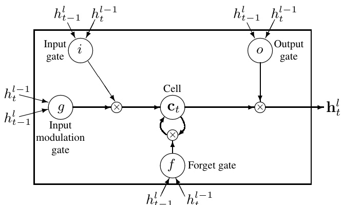
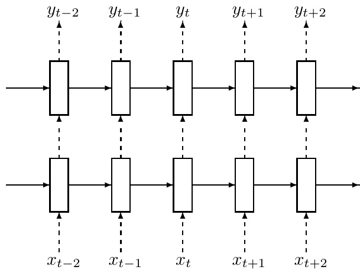
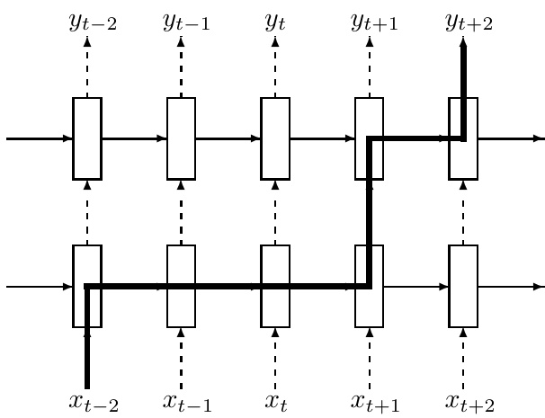
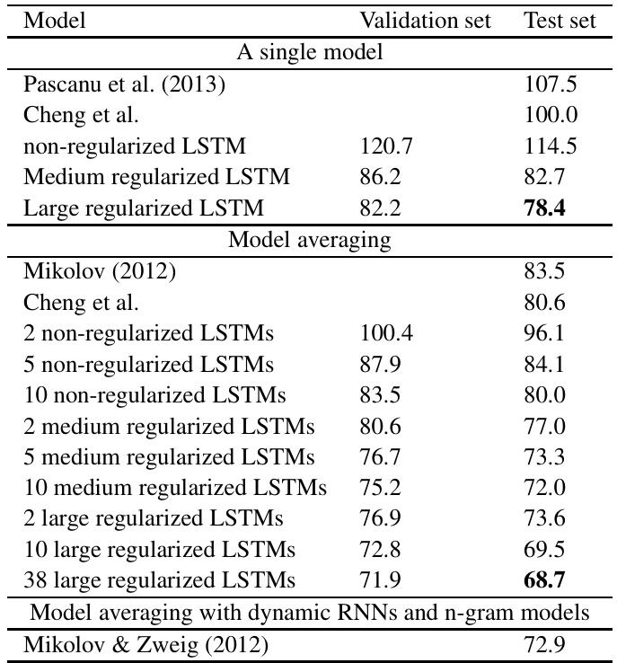
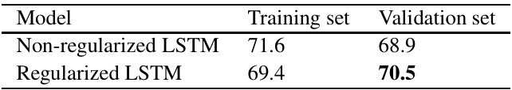
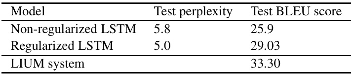
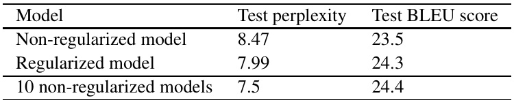

# R ECURRENT  N EURAL  N ETWORK  R EGULARIZATION  

Wojciech Zaremba ∗ New York University woj.zaremba@gmail.com  

Ilya Sutskever, Oriol Vinyals Google Brain { ilyasu,vinyals } @google.com  

# A BSTRACT  

We present a simple regularization technique for Recurrent Neural Networks (RNNs) with Long Short-Term Memory (LSTM) units. Dropout, the most suc- cessful technique for regularizing neural networks, does not work well with RNNs and LSTMs. In this paper, we show how to correctly apply dropout to LSTMs, and show that it substantially reduces overfitting on a variety of tasks. These tasks include language modeling, speech recognition, image caption generation, and machine translation.  

# 1 I NTRODUCTION  

The Recurrent Neural Network (RNN) is neural sequence model that achieves state of the art per- formance on important tasks that include language modeling Mikolov (2012), speech recognition Graves et al. (2013), and machine translation Kalchbrenner & Blunsom (2013). It is known that successful applications of neural networks require good regularization. Unfortunately, dropout Srivastava (2013), the most powerful regularization method for feedforward neural networks, does not work well with RNNs. As a result, practical applications of RNNs often use models that are too small because large RNNs tend to overfit. Existing regularization methods give relatively small improvements for RNNs Graves (2013). In this work, we show that dropout, when correctly used, greatly reduces overfitting in LSTMs, and evaluate it on three different problems.  

The code for this work can be found in  https://github.com/wojzaremba/lstm  

# 2 R ELATED WORK  

Dropout Srivastava (2013) is a recently introduced regularization method that has been very suc- cessful with feed-forward neural networks. While much work has extended dropout in various ways Wang & Manning (2013); Wan et al. (2013), there has been relatively little research in applying it to RNNs. The only paper on this topic is by Bayer et al. (2013), who focuses on “marginalized dropout” Wang & Manning (2013), a noiseless deterministic approximation to standard dropout. Bayer et al. (2013) claim that conventional dropout does not work well with RNNs because the re- currence amplifies noise, which in turn hurts learning. In this work, we show that this problem can be fixed by applying dropout to a certain subset of the RNNs’ connections. As a result, RNNs can now also benefit from dropout.  

Independently of our work, Pham et al. (2013) developed the very same RNN regularization method and applied it to handwriting recognition. We rediscovered this method and demonstrated strong empirical results over a wide range of problems. Other work that applied dropout to LSTMs is Pachitariu & Sahani (2013).  

There have been a number of architectural variants of the RNN that perform better on problems with long term dependencies Hochreiter & Schmidhuber (1997); Graves et al. (2009); Cho et al. (2014); Jaeger et al. (2007); Koutn´ ık et al. (2014); Sundermeyer et al. (2012). In this work, we show how to correctly apply dropout to LSTMs, the most commonly-used RNN variant; this way of applying dropout is likely to work well with other RNN architectures as well.  

In this paper, we consider the following tasks: language modeling, speech recognition, and ma- chine translation. Language modeling is the first task where RNNs have achieved substantial suc- cess Mikolov et al. (2010; 2011); Pascanu et al. (2013). RNNs have also been successfully used for speech recognition Robinson et al. (1996); Graves et al. (2013) and have recently been applied to machine translation, where they are used for language modeling, re-ranking, or phrase model- ing Devlin et al. (2014); Kalchbrenner & Blunsom (2013); Cho et al. (2014); Chow et al. (1987); Mikolov et al. (2013).  

# 3REGULARIZING RNNS WITH LSTM CELLS  

In this section we describe the deep LSTM (Section 3.1). Next, we show how to regularize them (Section 3.2), and explain why our regularization scheme works.  

We let subscripts denote timesteps and superscripts denote layers. All our states are  $n$  -dimensional. Let    $h_{t}^{l}\in\mathbb{R}^{n}$   be a hidden state in layer  $l$   in timestep    $t$  . Moreover, let    $T_{n,m}:\mathbb{R}^{n}\rightarrow\mathbb{R}^{m}$   be an affine transform   $(W x+b$   for some    $W$   and    $b$  ). Let  $\odot$  be element-wise multiplication and let  $h_{t}^{0}$    be an input word vector at timestep    $k$  . We use the activations  $h_{t}^{L}$    to predict  $y_{t}$  , since    $L$   is the number of layers in our deep LSTM.  

# 3.1LONG-SHORT TERM MEMORY UNITS  

The RNN dynamics can be described using deterministic transitions from previous to current hidden states. The deterministic state transition is a function  

$$
\mathbf{RNN}:h_{t}^{l-1},h_{t-1}^{l}\rightarrow h_{t}^{l}
$$  

For classical RNNs, this function is given by  

$$
h_{t}^{l}=f\big(T_{n,n}h_{t}^{l-1}+T_{n,n}h_{t-1}^{l}\big),\,\mathrm{where}\,\,f\in\{\mathrm{sign},\mathrm{tanh}\}
$$  

The LSTM has complicated dynamics that allow it to easily “memorize” information for an extended number of timesteps. The “long term” memory is stored in a vector of  memory cells    $c_{t}^{l}\in\mathbb{R}^{n}$  . Al- though many LSTM architectures that differ in their connectivity structure and activation functions, all LSTM architectures have explicit memory cells for storing information for long periods of time. The LSTM can decide to overwrite the memory cell, retrieve it, or keep it for the next time step. The LSTM architecture used in our experiments is given by the following equations Graves et al. (2013):  

$$
\begin{array}{r l}&{\mathrm{LSTM:}\ h_{t}^{l-1},h_{t-1}^{l},c_{t-1}^{l}\to h_{t}^{l},c_{t}^{l}}\\ &{\left(\begin{array}{l}{i}\\ {f}\\ {o}\\ {g}\end{array}\right)=\left(\begin{array}{l}{\mathrm{sign}}\\ {\mathrm{sign}}\\ {\mathrm{tanh}}\end{array}\right)T_{2n,4n}\left(h_{t-1}^{l-1}\right)}\\ &{c_{t}^{l}=f\odot c_{t-1}^{l}+i\odot g}\\ &{h_{t}^{l}=o\odot\mathrm{tanh}(c_{t}^{l})}\end{array}
$$  

In these equations,  sigm  and  tanh  are applied element-wise. Figure 1 illustrates the LSTM equa- tions.  

# 3.2 R EGULARIZATION WITH  D ROPOUT  

The main contribution of this paper is a recipe for applying dropout to LSTMs in a way that success- fully reduces overfitting. The main idea is to apply the dropout operator only to the non-recurrent  

  
Figure 1: A graphical representation of LSTM memory cells used in this paper (there are minor differences in comparison to Graves (2013)).  

  

Figure 2: Regularized multilayer RNN. The dashed arrows indicate connections where dropout is applied, and the solid lines indicate connections where dropout is not applied.  

connections (Figure 2). The following equation describes it more precisely, where  $\mathbf{D}$   is the dropout operator that sets a random subset of its argument to zero:  

$$
\begin{array}{r l}&{\left(\begin{array}{l}{i}\\ {f}\\ {o}\\ {g}\end{array}\right)=\left(\begin{array}{l}{\mathrm{sign}}\\ {\mathrm{sign}}\\ {\mathrm{tanh}}\end{array}\right)T_{2n,4n}\left(\begin{array}{l}{\mathbf{D}(h_{t}^{l-1})}\\ {h_{t-1}^{l}}\end{array}\right)}\\ &{c_{t}^{l}=f\odot c_{t-1}^{l}+i\odot g}\\ &{h_{t}^{l}=o\odot\mathrm{tanh}(c_{t}^{l})}\end{array}
$$  

Our method works as follows. The dropout operator corrupts the information carried by the units, forcing them to perform their intermediate computations more robustly. At the same time, we do not want to erase all the information from the units. It is especially important that the units remember events that occurred many timesteps in the past. Figure 3 shows how information could flow from an event that occurred at timestep    $t-2$   to the prediction in timestep  $t+2$   in our implementation of dropout. We can see that the information is corrupted by the dropout operator exactly    $L+1$   times,  

  

Figure 3: The thick line shows a typical path of information flow in the LSTM. The information is affected by dropout  $L+1$   times, where    $L$   is depth of network.  

the meaning of life is  that only if an end would be of the whole supplier. widespread rules are re- garded as the companies of refuses to deliver. in balance of the nation ’s information and loan growth associated with the carrier thrifts are in the process of slowing the seed and commercial paper. the meaning of life is  nearly in the first several months before the government was addressing such a move as president and chief executive of the nation past from a national commitment to curb grounds. meanwhile the government invests overcapacity that criticism and in the outer reversal of small-town america.  

Figure 4: Some interesting samples drawn from a large regularized model conditioned on “The meaning of life is”. We have removed “unk”, “N”,  $\cdots\!\!\Phi^{\prime\prime}$   from the set of permissible words.  

and this number is independent of the number of timesteps traversed by the information. Standard dropout perturbs the recurrent connections, which makes it difficult for the LSTM to learn to store information for long periods of time. By not using dropout on the recurrent connections, the LSTM can benefit from dropout regularization without sacrificing its valuable memorization ability.  

# 4 E XPERIMENTS  

We present results in three domains: language modeling (Section 4.1), speech recognition (Section 4.2), machine translation (Section 4.3), and image caption generation (Section 4.4).  

# 4.1 L ANGUAGE MODELING  

We conducted word-level prediction experiments on the Penn Tree Bank (PTB) dataset Marcus et al. (1993), which consists of    $929\mathbf{k}$   training words,  73 k validation words, and  $82\mathrm{k}$   test words. It has    $10\mathbf{k}$  words in its vocabulary. We downloaded it from Tomas Mikolov’s webpage † . We trained regularized LSTMs of two sizes; these are denoted the medium LSTM and large LSTM. Both LSTMs have two layers and are unrolled for  35  steps. We initialize the hidden states to zero. We then use the final hidden states of the current minibatch as the initial hidden state of the subsequent minibatch (successive minibatches sequentially traverse the training set). The size of each minibatch is 20.  

  

The medium LSTM has  650  units per layer and its parameters are initialized uniformly in  $[-0.05,0.05]$  . As described earlier, we apply  $50\%$   dropout on the non-recurrent connections. We train the LSTM for  39  epochs with a learning rate of  1 , and after  6  epochs we decrease it by a factor of  1 . 2  after each epoch. We clip the norm of the gradients (normalized by minibatch size) at  5 . Training this network takes about half a day on an NVIDIA K20 GPU.  

The large LSTM has  1500  units per layer and its parameters are initialized uniformly in  $\left[-0.04,0.04\right]$  . We apply    $65\%$   dropout on the non-recurrent connections. We train the model for 55  epochs with a learning rate of  1 ; after  14  epochs we start to reduce the learning rate by a factor of  1 . 15  after each epoch. We clip the norm of the gradients (normalized by minibatch size) at  10 Mikolov et al. (2010). Training this network takes an entire day on an NVIDIA K20 GPU.  

For comparison, we trained a non-regularized network. We optimized its parameters to get the best validation performance. The lack of regularization effectively constrains size of the network, forc- ing us to use small network because larger networks overfit. Our best performing non-regularized LSTM has two hidden layers with  200  units per layer, and its weights are initialized uniformly in  $[-0.1,0.1]$  . We train it for  4  epochs with a learning rate of  1  and then we decrease the learning rate by a factor of  2  after each epoch, for a total of  13  training epochs. The size of each minibatch is  20 , and we unroll the network for  20  steps. Training this network takes 2-3 hours on an NVIDIA K20 GPU.  

Table 1 compares previous results with our LSTMs, and Figure 4 shows samples drawn from a single large regularized LSTM.  

# 4.2 S PEECH RECOGNITION  

Deep Neural Networks have been used for acoustic modeling for over half a century (see Bourlard & Morgan (1993) for a good review). Acoustic modeling is a key component in map- ping acoustic signals to sequences of words, as it models    $p(s_{t}|X)$   where    $s_{t}$   is the phonetic state at time    $t$   and    $X$   is the acoustic observation. Recent work has shown that LSTMs can achieve excellent performance on acoustic modeling Sak et al. (2014), yet relatively small LSTMs (in terms of the number of their parameters) can easily overfit the training set. A useful metric for measuring the performance of acoustic models is frame accuracy, which is measured at each  $s_{t}$   for all timesteps  $t$  . Generally, this metric correlates with the actual metric of interest, the Word Error Rate (WER).  

  

  

Since computing the WER involves using a language model and tuning the decoding parameters for every change in the acoustic model, we decided to focus on frame accuracy in these experiments. Table 2 shows that dropout improves the frame accuracy of the LSTM. Not surprisingly, the training frame accuracy drops due to the noise added during training, but as is often the case with dropout, this yields models that generalize better to unseen data. Note that the test set is easier than the train- ing set, as its accuracy is higher. We report the performance of an LSTM on an internal Google Icelandic Speech dataset, which is relatively small (  $93\mathrm{k}$   utterances), so overfitting is a great concern.  

# 4.3 M ACHINE TRANSLATION  

We formulate a machine translation problem as a language modelling task, where an LSTM is trained to assign high probability to a correct translation of a source sentence. Thus, the LSTM is trained on concatenations of source sentences and their translations Sutskever et al. (2014) (see also Cho et al. (2014)). We compute a translation by approximating the most probable sequence of words using a simple beam search with a beam of size 12. We ran an LSTM on the WMT’14 English to French dataset, on the “selected” subset from Schwenk (2014) which has 340M French words and 304M English words. Our LSTM has 4 hidden layers, and both its layers and word embeddings have 1000 units. Its English vocabulary has 160,000 words and its French vocabulary has 80,000 words. The optimal dropout probability was 0.2. Table 3 shows the performance of an LSTM trained with and without dropout. While our LSTM does not beat the phrase-based LIUM SMT system Schwenk et al. (2011), our results show that dropout improves the translation performance of the LSTM.  

# 4.4IMAGE CAPTION GENERATION  

We applied the dropout variant to the image caption generation model of Vinyals et al. (2014). The image caption generation is similar to the sequence-to-sequence model of Sutskever et al. (2014), but where the input image is mapped onto a vector with a highly-accurate pre-trained convolutional neural network (Szegedy et al., 2014), which is converted into a caption with a single-layer LSTM (see Vinyals et al. (2014) for the details on the architecture). We test our dropout scheme on LSTM as the convolutional neural network is not trained on the image caption dataset because it is not large (MSCOCO (Lin et al., 2014)).  

Our results are summarized in the following Table 4. In brief, dropout helps relative to not using dropout, but using an ensemble eliminates the gains attained by dropout. Thus, in this setting, the main effect of dropout is to produce a single model that is as good as an ensemble, which is a reasonable improvement given the simplicity of the technique.  

# 5 C ONCLUSION  

We presented a simple way of applying dropout to LSTMs that results in large performance in- creases on several problems in different domains. Our work makes dropout useful for RNNs, and our results suggest that our implementation of dropout could improve performance on a wide variety of applications.  

  

# 6 A CKNOWLEDGMENTS  

We wish to acknowledge Tomas Mikolov for useful comments on the first version of the paper.  

# R EFERENCES  

Bayer, Justin, Osendorfer, Christian, Chen, Nutan, Urban, Sebastian, and van der Smagt, Patrick. On fast dropout and its applicability to recurrent networks.  arXiv preprint arXiv:1311.0701 , 2013. Bourlard, H. and Morgan, N.  Connectionist Speech Recognition: A Hybrid Approach . Kluwer Academic Publishers, 1993. Cheng, Wei-Chen, Kok, Stanley, Pham, Hoai Vu, Chieu, Hai Leong, and Chai, Kian Ming A. Language modeling with sum-product networks. Cho, Kyunghyun, van Merrienboer, Bart, Gulcehre, Caglar, Bougares, Fethi, Schwenk, Holger, and Bengio, Yoshua. Learning phrase representations using rnn encoder-decoder for statistical machine translation.  arXiv preprint arXiv:1406.1078 , 2014. Chow, Y, Dunham, M, Kimball, O, Krasner, M, Kubala, G, Makhoul, J, Price, P, Roucos, S, and Schwartz, R. Byblos: The bbn continuous speech recognition system. In  Acoustics, Speech, and Signal Processing, IEEE International Conference on ICASSP’87. , volume 12, pp. 89–92. IEEE, 1987. Devlin, J., Zbib, R., Huang, Z., Lamar, T., Schwartz, R., and Makhoul, J. Fast and robust neural network joint models for statistical machine translation. In  ACL , 2014. Graves, Alex. Generating sequences with recurrent neural networks.  arXiv preprint arXiv:1308.0850 , 2013. Graves, Alex, Liwicki, Marcus, Fern´ andez, Santiago, Bertolami, Roman, Bunke, Horst, and Schmidhuber, J¨ urgen. A novel connectionist system for unconstrained handwriting recognition.  Pattern Analysis and Machine Intelligence, IEEE Transactions on , 31(5):855–868, 2009. Graves, Alex, Mohamed, Abdel-rahman, and Hinton, Geoffrey. Speech recognition with deep recurrent neural networks. In  Acoustics, Speech and Signal Processing (ICASSP), 2013 IEEE International Conference on , pp. 6645–6649. IEEE, 2013. Hochreiter, Sepp and Schmidhuber, J¨ urgen. Long short-term memory.  Neural computation , 9(8):1735–1780, 1997. Jaeger, Herbert, Lukoˇ seviˇ cius, Mantas, Popovici, Dan, and Siewert, Udo. Optimization and applications of echo state networks with leaky-integrator neurons.  Neural Networks , 20(3):335–352, 2007. Kalchbrenner, N. and Blunsom, P. Recurrent continuous translation models. In  EMNLP , 2013. Koutn´ ık, Jan, Greff, Klaus, Gomez, Faustino, and Schmidhuber, J¨ urgen. A clockwork rnn.  arXiv preprint arXiv:1402.3511 , 2014. Lin, Tsung-Yi, Maire, Michael, Belongie, Serge, Hays, James, Perona, Pietro, Ramanan, Deva, Doll´ ar, Piotr, and Zitnick, C Lawrence. Microsoft coco: Common objects in context.  arXiv preprint arXiv:1405.0312 , 2014. Marcus, Mitchell P, Marcinkiewicz, Mary Ann, and Santorini, Beatrice. Building a large annotated corpus of english: The penn treebank.  Computational linguistics , 19(2):313–330, 1993. Mikolov, Tom´ aˇ s.  Statistical language models based on neural networks . PhD thesis, Ph. D. thesis, Brno University of Technology, 2012. Mikolov, Tomas and Zweig, Geoffrey. Context dependent recurrent neural network language model. In  SLT , pp. 234–239, 2012.  

Mikolov, Tomas, Karafi´ at, Martin, Burget, Lukas, Cernock\` y, Jan, and Khudanpur, Sanjeev. Recurrent neural network based language model. In  INTERSPEECH , pp. 1045–1048, 2010.  

Mikolov, Tomas, Deoras, Anoop, Povey, Daniel, Burget, Lukas, and Cernocky, Jan. Strategies for training large scale neural network language models. In  Automatic Speech Recognition and Understanding (ASRU), 2011 IEEE Workshop on , pp. 196–201. IEEE, 2011.  

Mikolov, Tomas, Le, Quoc V, and Sutskever, Ilya. Exploiting similarities among languages for machine trans- lation.  arXiv preprint arXiv:1309.4168 , 2013.  

Pachitariu, Marius and Sahani, Maneesh. Regularization and nonlinearities for neural language models: when are they needed?  arXiv preprint arXiv:1301.5650 , 2013.  

Pascanu, Razvan, Gulcehre, Caglar, Cho, Kyunghyun, and Bengio, Yoshua. How to construct deep recurrent neural networks.  arXiv preprint arXiv:1312.6026 , 2013.  

Pham, Vu, Kermorvant, Christopher, and Louradour, J´ erˆ ome. Dropout improves recurrent neural networks for handwriting recognition.  arXiv preprint arXiv:1312.4569 , 2013.  

Robinson, Tony, Hochberg, Mike, and Renals, Steve. The use of recurrent neural networks in continuous speech recognition. In  Automatic speech and speaker recognition , pp. 233–258. Springer, 1996.  

Sak, H., Vinyals, O., Heigold, G., Senior, A., McDermott, E., Monga, R., and Mao, M. Sequence discriminative distributed training of long short-term memory recurrent neural networks. In  Interspeech , 2014.  

Schwenk, Holger. University le mans, 2014. http://www-lium.univ-lemans.fr/˜schwenk/cslm_joint/paper .  

Schwenk, Holger, Lambert, Patrik, Barrault, Lo¨ ıc, Servan, Christophe, Afli, Haithem, Abdul-Rauf, Sadaf, and Shah, Kashif. Lium’s smt machine translation systems for wmt 2011. In  Proceedings of the Sixth Workshop on Statistical Machine Translation , pp. 464–469. Association for Computational Linguistics, 2011.  

Srivastava, Nitish.  Improving neural networks with dropout . PhD thesis, University of Toronto, 2013.  

Sundermeyer, Martin, Schl¨ uter, Ralf, and Ney, Hermann. Lstm neural networks for language modeling. In INTERSPEECH , 2012.  

Sutskever, Ilya, Vinyals, Oriol, and Le, Quoc VV. Sequence to sequence learning with neural networks. In Advances in Neural Information Processing Systems , pp. 3104–3112, 2014.  

Szegedy, Christian, Liu, Wei, Jia, Yangqing, Sermanet, Pierre, Reed, Scott, Anguelov, Dragomir, Erhan, Du- mitru, Vanhoucke, Vincent, and Rabinovich, Andrew. Going deeper with convolutions. arXiv preprint arXiv:1409.4842 , 2014.  

Vinyals, Oriol, Toshev, Alexander, Bengio, Samy, and Erhan, Dumitru. Show and tell: A neural image caption generator.  arXiv preprint arXiv:1411.4555 , 2014.  

Wan, Li, Zeiler, Matthew, Zhang, Sixin, Cun, Yann L, and Fergus, Rob. Regularization of neural networks using dropconnect. In  Proceedings of the 30th International Conference on Machine Learning (ICML-13) , pp. 1058–1066, 2013.  

Wang, Sida and Manning, Christopher. Fast dropout training. In  Proceedings of the 30th International Confer- ence on Machine Learning (ICML-13) , pp. 118–126, 2013.  