# Quantifying the Rise and Fall of Complexity in Closed Systems: The Coffee Automaton  

Scott Aaronson ∗ Sean M. Carroll † Lauren Ouellette ‡  

# Abstract  

In contrast to entropy, which increases monotonically, the “complexity” or “interestingness” of closed systems seems intuitively to increase at first and then decrease as equilibrium is ap- proached. For example, our universe lacked complex structures at the Big Bang and will also lack them after black holes evaporate and particles are dispersed. This paper makes an ini- tial attempt to quantify this pattern. As a model system, we use a simple, two-dimensional cellular automaton that simulates the mixing of two liquids (“coffee” and “cream”). A plausi- ble complexity measure is then the Kolmogorov complexity of a coarse-grained approximation of the automaton’s state, which we dub the “apparent complexity.” We study this complexity measure, and show analytically that it never becomes large when the liquid particles are non- interacting. By contrast, when the particles  do  interact, we give numerical evidence that the complexity reaches a maximum comparable to the “coffee cup’s” horizontal dimension. We raise the problem of proving this behavior analytically.  

CALT-68-2927  

# 1 Introduction  

Imagine a cup of coffee into which cream has just been poured. At first, the coffee and cream are separated. Over time, the two liquids diffuse until they are completely mixed. If we consider the coffee cup a closed system, we can say that its  entropy  is increasing over time, in accordance with the second law of thermodynamics. At the beginning, when the liquids are completely separated, the system is in a highly ordered, low-entropy state. After time has passed and the liquids have completely mixed, all of the initial structure is lost; the system has high entropy.  

Just as we can reason about the disorder of the coffee cup system, we can also consider its “complexity.” Informally, by complexity we mean the amount of information needed to describe everything “interesting” about the system. At first, when the cream has just been poured into the coffee, it is easy to describe the state of the cup: it contains a layer of cream on top of a layer of coffee. Similarly, it is easy to describe the state of the cup after the liquids have mixed: it contains a uniform mixture of cream and coffee. However, when the cup is in an intermediate state—where the liquids are mixed in some areas but not in others—it seems more difficult to describe what the contents of the cup look like.  

Thus, it appears that the coffee cup system starts out at a state of low complexity, and that the complexity first increases and then decreases over time. In fact, this rising-falling pattern of complexity seems to hold true for many closed systems. One example is the universe itself. The universe began near the Big Bang in a low-entropy, low-complexity state, characterized macro- scopically as a smooth, hot, rapidly expanding plasma. It is predicted to end in the high-entropy, low-complexity state of heat death, after black holes have evaporated and the acceleration of the universe has dispersed all of the particles (about   $10^{100}$    years from now). But in between, complex structures such as planets, stars, and galaxies have developed. There is no general principle that quantifies and explains the existence of high-complexity states at intermediate times in closed sys- tems. It is the aim of this work to explore such a principle, both by developing a more formal definition of “complexity,” and by running numerical experiments to measure the complexity of a simulated coffee cup system. The idea that complexity first increases and then decreases in as entropy increases in closed system has been suggested informally [4,7], but as far as we know this is the first quantitative exploration of the phenomenon.  

# 2 Background  

Before discussing how to define “complexity,” let’s start with the simpler question of how to define entropy in a discrete dynamical system. There are various definitions of entropy that are useful in different contexts. Physicists distinguish between the Boltzmann and Gibbs entropies of physical systems. (There is also the phenom eno logical thermodynamic entropy and the quantum-mechanical von Neumann entropy, neither of which are relevant here.) The Boltzmann entropy is an objective feature of a microstate, but depends on a choice of coarse-graining. We imagine coarse-graining the space of microstates into equivalence classes, so that each microstate    $x_{a}$   is an element of a unique macrostate    $X_{A}$  . The volume    $W_{A}$   of the macrostate is just the number of associated microstates  $x_{a}\,\in\,X_{A}$  . Then the Boltzmann entropy of a microstate    $x_{a}$   is the normalized logarithm of the volume of the associated macrostate:  

$$
S_{\mathrm{{Boht z m a n}}}(x_{a}):=k_{B}\log W_{A},
$$  

where    $k_{B}$   is Boltzmann’s constant (which we can set equal to 1). The Boltzmann entropy is independent of our knowledge of the system; in particular, it can be nonzero even when we know the exact microstate. The Gibbs entropy (which was also studied by Boltzmann), in contrast, refers to a distribution function    $\rho(x)$   over the space of microstates, which can be thought of as characterizing our ignorance of the exact state of the system. It is given by  

$$
S_{\mathrm{G i b b s}}[\rho]:=-\sum_{x}\rho(x)\log\rho(x).
$$  

In probability theory, communications, information theory, and other areas, the Shannon entropy of a probability distribution    $D=(p_{x})_{x}$   is the expected number of random bits needed to output a sample from the distribution:  

$$
H(D):=-\sum_{x}p_{x}\log p_{x}.
$$  

We see that this is essentially equivalent to the Gibbs entropy, with a slight change of notation and vocabulary.  

Finally, in computability theory, the entropy of an    $n$  -bit string    $x$   is often identified with its Kolmogorov complexity    $K(x)$  : the length of the shortest computer program that outputs    $x$  .   Strings that are highly patterned—meaning low in disorder—can be described by a short program that takes advantage of those patterns. For example, a string consisting of    $n$   ones could be output by a short program which simply loops    $n$   times, printing ‘1’ each time. Conversely, strings which have little regularity cannot be compressed in this way. For such strings, the shortest program to output them might simply be one that hard-codes the entire string.  

Fortunately, these notions of entropy are closely related to each other, so that one can often switch between them depending on convenience. The Gibbs and Shannon entropies are clearly equivalent. The Boltzmann entropy is equivalent to the Gibbs entropy under the assumption that the distribution function is flat over microstates within the given macrostate, and zero elsewhere– i.e. , given the knowledge of the system we would actually obtain via macroscopic observation. For a computable distribution    $D$   over    $n$  -bit strings, the Kolmogorov complexity of a string sampled from    $D$   tends to the entropy of    $D$   [9]. (Thus, the Kolmogorov complexity of a sequence of random numbers will be very high, even though there is no “interesting structure”in it.)  

Despite these formal connections, the three kinds of entropy are calculated in very different ways. The Boltzmann entropy is well-defined once a specific coarse-graining is chosen. To estimate the Shannon entropy    $H(D)$   of a distribution    $D$   (which we will henceforth treat as identical to the corresponding Gibbs entropy), one in general requires knowledge of the entire distribution    $D$  , which could potentially require exponentially many samples from    $D$  . At first glance, the Kolmogorov complexity    $K(x)$   seems even worse: it is well-known to be  uncomputable  (in fact, computing    $K(x)$  is equivalent to solving the halting problem). On the other hand, in practice one can often estimate  $K(x)$   reasonably well by the compressed file size, when    $x$   is fed to a standard compression program such as  gzip . And crucially, unlike Shannon entropy, Kolmogorov complexity is well-defined even for an individual string    $x$  . For these reasons, we chose to use    $K(x)$   (or rather, a computable approximation to it) as our estimate of entropy.  

Of course,  none  of the three measures of entropy capture “complexity,” in the sense discussed in Section 1. Boltzmann entropy, Shannon entropy, and Kolmogorov complexity are all maximized by “random” or “generic” objects and distributions, whereas a complexity measure should be low both for “simple” objects  and  for “random” objects, and large only for “interesting” objects that are neither simple nor random.  

This issue has been extensively discussed in the complex systems and algorithmic information theory communities since the 1980s. We are aware of four quantitative ideas for how to define “complexity” or “interestingness” as distinct from entropy. While the definitions look extremely different, it will turn out happily that they are all related to one another, much like with the different definitions of entropy. Note that our primary interest here is in the complexity of a configuration defined at a single moment in time. One may also associate measures of complexity to dynamical processes, which for the most part we won’t discuss.  

# 2.1 Apparent Complexity  

The first notion, and arguably the one that matches our intuition most directly, we call  apparent complexity .   By the apparent complexity of an object    $x$  , we mean    $H\left(f\left(x\right)\right)$  , where    $H$   is any of the entropy measures discussed previously, and    $f$   is some “denoising” or “smoothing” function—that is, a function that attempts to remove the “incidental” or “random” information in    $x$  , leaving only the “interesting, non-random” information. For example, if    $x$   is a bitmap image, then    $f\left(x\right)$   might simply be a blurred version of    $x$  .  

Apparent complexity has two immense advantages. First, it is simple: it directly captures the intuition that we want something  like  entropy, but that leaves out “incidental” information. For example, while the Kolmogorov complexity of a random sequence would be very large, the apparent complexity of the same sequence would typically be quite small, since the smoothing procedure would average out the random fluctuations. Second, we can plausibly hope to  compute (or at least, approximate) apparent complexity: we need “merely” solve the problems of computing  $H$   and    $f$  . It’s because of these advantages that the complexity measure we ultimately adopt for our experiments will be an approximate variant of apparent complexity.  

On the other hand, apparent complexity also has a large disadvantage: namely, the apparent arbitrariness in the choice of the denoising function    $f$  . Who decides which information about    $x$   is “interesting,” and which is “incidental”? Won’t    $f$   depend, not only on the type of object under study (bitmap images, audio recordings, etc.), but even more worryingly, on the prejudices of the investigator? For example, suppose we choose    $f$   to blur out details of an image that are barely noticeable to the human eye. Then will studying the time-evolution of    $H\left(f\left(x\right)\right)$   tell us anything about    $x$   itself, or only about various quirks of the human visual system?  

Fortunately, the apparent arbitrariness of the smoothing procedure is less of a problem than might initially be imagined. It is very much like the need for a coarse-graining on phase space when one defines the Boltzmann entropy. In either case, these apparently-arbitrary choices are in fact well-motivated on physical grounds. While one  could  choose bizarre non-local ways to coarse- grain or smooth a distribution, natural choices are typically suggested by our physical ability to actually observe systems, as well as knowledge of their dynamical properties (see for example [3]). When deriving the equations of fluid dynamics from kinetic theory, in principle one could choose to average over cells of momentum space rather than in position space; but there is no physical reason to do so, since interactions are local in position rather than momentum. Likewise, when we observe configurations (whether with our eyes, or with telescopes or microscopes), large-scale features are more easily discerned than small-scale ones. (In field theory this feature is formalized by the renormalization group.) It therefore makes sense to smooth configurations over local regions in space.  

Nevertheless, we would ideally like our complexity measure to  tell us  what the distinction be- tween “random” and “non-random” information consists of, rather than having to decide ourselves on a case-by-case basis. This motivates an examination of some alternative complexity measures.  

# 2.2 Sophistication  

The second notion—one that originates in work of Kolmogorov himself—is  sophistication . Roughly speaking, sophistication seeks to generalize Kolmogorov complexity to capture only the non-random information in a string—while using Kolmogorov complexity itself to define what is meant by “non- random.” Given an    $n$  -bit string    $x$  , let a  model  for    $x$   be a set    $S\subseteq\{0,1\}^{n}$    such that    $x\in S$  . Let    $K\left(S\right)$  be the length of the shortest program that enumerates the elements of    $S$  , in any order (crucially, the program must halt when it is done enumerating the elements). Also, let    $K\left(x|S\right)$   be the length of the shortest program that outputs    $x$   given as input a description of    $x$  . Then we can consider  $x$   to be a “gene c” element of    $S$   if    $K\left(x|S\right)\geq\log_{2}\left|S\right|-c$   for some small constant    $c$  . This means intuitively that  S  is a “maximal” model for  x : one can summarize all the interesting, non-random properties of    $x$   by simply saying that    $x\in S$  .  

Now the    $c$  - sophistication  of    $x$   or   $\operatorname{soph}_{c}\left(x\right)$  , defined by Koppel [8], is the minimum of    $K\left(S\right)$   over ls    $S$   for    $x$   suc  $K\left(S\right)+\log_{2}\left|S\right|\leq K\left(x\right)+c$  . (The optimal such    $S$   is said to “witness”  $\operatorname{soph}_{c}\left(x\right)$  ).) In words, soph  $\operatorname{soph}_{c}\left(x\right)$  ) is the smallest possible amount of “non-random” information in a program for    $x$   that consists of two parts—a “non-random” part (specifying    $S$  ) and a “random” part

 (specifying    $x$   within    $S$  )—assuming the program is also near-minimal. We observe the following:  

(i)   $\mathrm{sph}_{c}\left(x\right)\leq K\left(x\right)+O\left(1\right)$  , since we can always just take    $S=\{x\}$   as our model for    $x$  .  

(ii)  Most  strings    $x$   satisfy   $\mathrm{sech}_{c}\left(x\right)=O\left(1\right)$  , since we can take    $S=\left\{0,1\right\}^{n}$    as our model for    $x$  .  

(iii) If    $S$   witnesses   $\operatorname{soph}_{c}\left(x\right)$  , then   $\log_{2}{|S|}\leq K\left(x\right)-K\left(S\right)+c\leq K\left(x|S\right)+c$  , meaning that    $x$  must be a “generic” element of  S .  

It can be shown (see G´ acs, Tromp, and Vit´ anyi [6] or Antunes and Fortnow [1]) that there do exist highly “sophisticated” strings    $x$  , which satisfy   ${\mathrm{sph}}_{c}\left(x\right)\,\geq\,n-c-O\left(\log n\right)$  . Interestingly, the proof of that result makes essential use of the assumption that the program for    $S$   halts, after it has finished listing    $S$  ’s elements. If we dropped that assumption, then we could always achieve  $K\left(S\right)=O\left(\log n\right)$  , by simply taking    $S$   to be the set of all    $y\in\left\{0,1\right\}^{n}$    such that    $K\left(y\right)\le K\left(x\right)$  , and enumerating those    $y$  ’s in a dovetailing fashion.  

Recently, Mota et al. [10] studied a natural variant of sophistication, in which one only demands that    $S$   be a maximal model for    $x$    .e., that    $K\left(x|S\right)\geq\log_{2}\left|S\right|-c)$  not that    $S$   also lead to a near-optimal two-p rt program for  x  (i ., th  $K\left(S\right){+}{\log}_{2}\left|S\right|\leq K\left(x\right){+}c)$   | | ≤ ). M rmally, Mota et al. define the  na¨ ıve  c -sophistication  of  x , or nsoph  $\operatorname{nsoph}_{c}\left(x\right)$  ), to be the minimum of  $K\left(S\right)$  ) over all models  $S$     $x$   su  $K\left(x|S\right)\geq\log_{2}\left|S\right|-c$  . B i) above, it is clear that   $\mathrm{nsuph}_{c}\left(x\right)\leq\mathrm{suph}_{c}\left(x\right)$  . A priori  $\operatorname{nsuph}_{c}\left(x\right)$  ) could be much smaller soph  $\operatorname{soph}_{c}\left(x\right)$  ), thereby leading to two different sophistication notions. However, it follows from an important 2004 result of Vereshchagin and Vit´ anyi [13] that  $\mathrm{sph}_{c+O(\log n)}\left(x\right)\leq\mathrm{nsuph}_{c}\left(x\right)$   for all    $x$  , and hence the two notions are basically equivalent.  

Sophistication is sometimes criticized for being “brittle”: it is known that increasing the pa- rameter    $c$   only slightly can cause   $\operatorname{soph}_{c}\left(x\right)$   and   $\operatorname{nsoph}_{c}\left(x\right)$   to fall drastically, say from    $n-O\left(\log n\right)$  to    $O\left(1\right)$  . ple fix to that problem is to consider the quantities   $\begin{array}{r}{\operatorname*{min}_{c}\left\{c+\mathrm{sech}_{c}\left(x\right)\right\}}\end{array}$  and min  $\begin{array}{r}{\operatorname*{min}_{c}\left\{c+\mathrm{nscoh}_{c}\left(x\right)\right\}}\end{array}$   { } . Those are known, respectively, as the  coarse sophistication  $\operatorname{csoph}\left(x\right)$  and  na¨ ıve coarse sophistication    $\operatorname{ncsoph}\left(x\right)$  , and they satisfy   $\operatorname{arcosh}\left(x\right)\leq\operatorname{cosh}\left(x\right)\leq\operatorname{arcosh}\left(x\right)+$   $O\left(\log n\right)$  .  

The advantage of sophistication is that it captures, more cleanly than any other measure, what exactly we mean by “interesting” versus “random” information. Unlike with apparent complexity, with sophistication there’s no need to specify a smoothing function    $f$  , with the arbitrariness that seems to entail. Instead, if one likes, the definition of sophistication picks out a smoothing function for us: namely, whatever function maps    $x$   to its corresponding model    $S$  .  

Unfortunately, this conceptual benefit comes at a huge computational price. Just as    $K\left(x\right)$   is uncomputable, so one can show that the sophistication measures are uncomputable as well. But with    $K\left(x\right)$  , at least we can get better and better upper bounds, by finding smaller and smaller compressed representations for    $x$  . By contrast, even to  approximate  sophistication requires solving two coupled optimization problems: firstly over possible models    $S$  , and secondly over possible ways to specify    $x$   given    $S$  .  

A second disadvantage of sophistication is that, while there  are  highly-sophisticated strings, the only known way to produce such a string (even probabilistic ally) is via a somewhat-exotic diagonalization argument. (By contrast, for “reasonable” choices of smoothing function    $f$  , one can easily generate    $x$   for which the apparent complexity    $H\left(f\left(x\right)\right)$   is large.) Furthermore, this is not an accident, but an unavoidable consequence of sophistication’s generality. To see this, consider any short probabilistic program    $P$  : for example, the coffee automaton that we will study in this paper, which has a simple initial state and a simple probabilistic evolution rule. Then we claim that  with overwhelming probability,    $P$  ’s output    $x$   must have low sophistication. For as the model  $S$  , one can take the set of all possible outputs    of    $P$   such that   $\mathrm{Pr}\left[y\right]\approx\mathrm{Pr}\left[x\right]$  . This    $S$   takes only  $y$   $O\left(\log n\right)$   bits to  escribe (plus    $O\left(1\right)$   bits for    $P$   itself), and clearly    $K\left(x|S\right)\geq\log_{2}\left|S\right|-c$   with high probability over  x .  

For this reason, sophistication as defined above seems irrelevant to the coffee cup or other physical systems: it simply never becomes large for such systems! On the other hand, note that the two drawbacks of sophistication might “cancel each other out” if we consider  resource-bounded versions of sophistication: that is, versions where we impose constraints (possibly severe constraints) on both the program for generating    $S$  , and the program for generating    $x$   given    $S$  . Not only does the above argument fail for resource-bounded versions of sophistication, but those versions are the only ones we can hope to compute anyway! With Kolmogorov complexity, we’re forced to consider proxies (such as  gzip  file size) mostly just because    $K\left(x\right)$   itself is uncomputable. By contrast, even if we  could  compute   $\operatorname{soph}_{c}\left(x\right)$   perfectly, it would never become large for the systems that interest us here.  

# 2.3 Logical Depth  

A third notion, introduced by Bennett [2], is  logical depth . Roughly speaking, the logical depth of a string    $x$   is the amount of time taken by the shortest program that outputs    $x$  . (Actually, to avoid the problem of “brittleness,” one typically considers something like the minimum amount of time taken by any program that outputs    $x$   and whose length is at most    $K\left(x\right)+c$  , for some constant “fudge factor”    $c$  . This is closely analogous to what is done for sophistication.)  

The basic idea here is that, both for simple strings and for random ones, the shortest program will  also  probably run in nearly linear time. By contrast, one can show that there exist “deep” strings, which can be generated by short programs but only after large amounts of time.  

Like sophistication, logical depth tries to probe the internal structure of a minimal program for    $x$  —and in particular, to distinguish between the “interesting code” in that program and the “boring data” on which the code acts. The difference is that, rather than trying to measure the size  of the “interesting code,” one examines how long it takes to run.  

Bennett [2] has advocated logical depth as a complexity measure, on the grounds that logical depth encodes the “amount of computational effort” used to produce    $x$  , according to the “most probable” (i.e., lowest Kolmogorov complexity) hypothesis about how    $x$   was generated. On the other hand, an obvious disadvantage of logical depth is that it’s even less clear how to estimate it in practice than was the case for sophistication.  

A second objection to logical depth is that even short, fast programs can be extremely “compli- cated” in their behavior (as evidenced, for example, by cellular automata such as Conway’s Game of Life). Generating what many people would regard as a visually complex pattern—and what we  would regard as a complex, milk-tendril-filled state, in the coffee-cup system—simply need not take a long time! For this reason, one might be uneasy with the use of running time as a proxy for complexity.  

# 2.4 Light-Cone Complexity  

The final complexity measure we consider was proposed by Shalizi, Shalizi, and Haslinger [12]; we call it  light-cone complexity . In contrast to the previous measures, light-cone complexity does not even try to define the “complexity” of a string    $x$  , given only    $x$   itself. Instead, the definition of light-cone complexity assumes a  causal structure : that is, a collection of spacetime points    $\mathcal{A}$  (assumed to be fixed), together with a transitive, cycle-free binary relation indicating which points  $a\in\mathcal A$   are to the “future” of which other points in    $\mathcal{A}$  . The set of all points    $b\in\mathcal{A}$   to    $a$  ’s future is called    $a$  ’s  future light-cone , and is denoted    $F\left(a\right)$  . The set of all points    $b\in\mathcal{A}$   to    $a$  ’s past (that is, such that    $a$   is to    $b$  ’s future) is called    $a$  ’s  past light-cone , and is denoted    $P\left(a\right)$  . For example, if we were studying the evolution of a 1-dimensional cellular automaton, then    $\mathcal{A}$   would consist of all ordered pairs   $(x,t)$   (where    $x$   is position and    $t$   is time), and we would have  

$$
\begin{array}{r l}&{F\left(x,t\right)=\left\{\left(y,u\right):u>t,\quad|x-y|\leq u-t\right\},}\\ &{P\left(x,t\right)=\left\{\left(y,u\right):u<t,\quad|x-y|\leq t-u\right\}.}\end{array}
$$  

Now given a spacetime point    $a\in\mathcal A$  , let    $V_{a}$   be the actual value assumed by the finite automaton at    $a$   (for example, “alive” or “dead,” were we discussing Conway’s Game of Life or some other 2-state system). In general, the finite automaton might be probabilistic, in which case    $V_{a}$   is a random variable, with a Shannon entropy    $H\left(V_{a}\right)$   and so forth. Also, given a set    $S\,\subseteq\,{\mathcal{A}}$  , let  $V_{S}\,:=\,(V_{a})_{a\in S}$   be a c te description of the values at  all  points in    $S$  . Then the light-cone complexity at a point  a  ∈A , or   $\operatorname{LCC}\left(a\right)$  , can be defined as follows:  

$$
\begin{array}{r l}&{\operatorname{LCC}\left(a\right)=I\left(V_{P(a)}:V_{F(a)}\right)}\\ &{\qquad\qquad=H\left(V_{P(a)}\right)+H\left(V_{F(a)}\right)-H\left(V_{P(a)},V_{F(a)}\right).}\end{array}
$$  

In other words,   $\operatorname{LCC}\left(a\right)$   is the  mutual information  between    $a$  ’s past and future light-cones: the number of bits about    $a$  ’s future that are encoded by its past. If we want the light-cone complexity of (say) an entire spatial slice, we could then take the sum of   $\operatorname{LCC}\left(a\right)$   over all    $a$   in that slice, or some other combination.  

The intuition here is that, if the cellular automaton dynamics are “too simple,” then   $\operatorname{LCC}\left(a\right)$  will be small simply because    $H\left(V_{P\left(a\right)}\right)$   and    $H\left(V_{F(a)}\right)$    are both small. Conversely, if the dynamics are “too random,” then LCC ( ) will be small because    $H\left(V_{P(a)},V_{F(a)}\right)\approx H\left(V_{P(a)}\right)+H\left(V_{F(a)}\right)$        : although the past and future light-cones both have plenty of entropy, they are uncorrelated, so that knowledge of the past is of barely any use in predicting the future. Only in an intermediate regime, where there are interesting  non -random dynamics, should there be substantial uncertainty about    $V_{F(a)}$   that can be reduced by knowing    $V_{P\mathrm{(}a\mathrm{)}}$  .  

As Shalizi et al. [12] point out, a major advantage of light-cone complexity, compared to sophis- tication, logical depth, and so on, is that light-cone complexity has a clear “operational meaning”:  

it is easy to state the question that light-cone complexity is answering. That question is the fol- lowing: “how much could I possibly predict about the configurations in    $a$  ’s future, given complete information about    $a$  ’s past?” The reason to focus on light-cones, rather than other sets of points, is that the light-cones are automatically determined once we know the causal structure: there seems to be little arbitrariness about them.  

On the other hand, depending on the application, an obvious drawback of light-cone complexity is that it can’t tell us the “inherent” complexity of an object    $x$  , without knowing about    $x$  ’s past and future. If we wanted to use a complexity measure to make  inferences  about    $x$  ’s past and future, this might be seen as question-begging. A less obvious drawback arises if we consider a dynamical system that changes slowly with time: for example, a version of the coffee automaton where just a single cream particle is randomly moved at each time step. Consider such a system in its “late” stages: that is, after the coffee and cream have fully mixed. Even then, Shalizi et al.’s   $\operatorname{LCC}\left(a\right)$   measure will remain large, but not for any “interesting” reason: only because    $a$  ’s past light-cone will contain almost the same (random) information as its future light-cone, out to a very large distance! Thus, LCC seems to give an intuitively wrong answer in these cases (though no doubt one could address the problem by redefining LCC in some suitable way).  

The computational situation for LCC seems neither better nor worse to us than that for (say) apparent complexity or resource-bounded sophistication. Since the light-cones    $P\left(a\right)$   and    $V\left(a\right)$   are formally infinite, a first step in estimating   $\operatorname{LCC}\left(a\right)$  —as Shalizi et al. point out—is to impose some finite cutoff one needs to estimate the mutual information  $t$   on the number of steps into    $a$  ’s past and future one is willing to look.    $I\left(V_{P_{t}(a)}:V_{F_{t}(a)}\right)$    between the truncated light-cones Even then,  $P_{t}\left(a\right)$   and    $F_{t}\left(a\right)$  , a problem that na¨ ıvely requires a number of samples exponential in    $t$  . One could address this problem by simply taking    $t$   extremely small (Shalizi et al. set    $t=1$  ). Alternatively, if a large    $t$   was needed, one could use the same Kolmogorov-complexity-based approach that we adopt in this paper for apparent complexity. That is, one first replaces the mutual information by the mutual  algorithmic  information  

$$
K\left(V_{P_{t}(a)}:V_{F_{t}(a)}\right)=K\left(V_{P_{t}(a)}\right)+K\left(V_{F_{t}(a)}\right)-K\left(V_{P_{t}(a)},V_{F_{t}(a)}\right),
$$  

and then estimates  $K\left(x\right)$  ) using some computable proxy such as  gzip  file size.  

# 2.5 Synthesis  

It seems like we have a bestiary of different complexity notions. Fortunately, the four notions discussed above can all be related to each other; let us discuss how.  

First, one can view apparent complexity as a kind of “resource-bounded” sophistication. To see this, let    $f$   be any smoothing function. Then    $K\left(f\left(x\right)\right)$  , the Kolmogorov complexity of    $f\left(x\right)$  , is essentially equal to    $K\left(S_{f,x}\right)$  , where  

$$
S_{f,x}:=\left\{y:f\left(y\right)=f\left(x\right)\right\}.
$$  

Thus, if instead of minimizing over  all  models    $S$   for    $x$   that satisfy some condition, we consider only the particular model    $S_{f,x}$   above, then sophistication reduces to apparent complexity. Note that this argument establishes neither that apparent complexity is an upper bound on sophistication, nor that it’s a lower bound. Apparent complexity could be larger, if the minimization found some model    $S$   for    $x$   with    $K\left(S\right)\,\ll\,K\left(S_{f,x}\right)$  . But conversely, sophistication could also be larger, if the model    $S_{f,x}$   happened to satisfy    $K\left(x|S_{f,x}\right)\ll\log_{2}\left|S_{f,x}\right|$   (that is,    $x$   was a highly “non-generic” element of  $S_{f,x}$  ).  

Second, Antunes and Fortnow [1] proved a close relation between coarse sophistication and a version of logical depth. Specifically, the Busy Beaver function,   $\mathrm{BB}\left(k\right)$  , is defined as the maximum number of steps for which a    $k$  -bit program can run before halting when given a blank input. Then given a string    $x$  , Antunes and Fortnow [1] define the  Busy Beaver computational depth    $\mathrm{\depth}_{B B}\left(x\right)$  to be the minimum, over all programs    $p$   that output a model    $S$   for    $x$   in    $B B\left(k\right)$   steps or fewer, of    $\left|p\right|+k-K\left(x\right)$  . They then prove the striking result that csoph and   $\mathrm{{depth}}_{B B}$   are essentially equivalent: for all    $x\in\left\{0,1\right\}^{n}$  ,  

$$
\left|\mathrm{csch}\left(x\right)-\mathrm{depth}_{B B}\left(x\right)\right|=O\left(\log n\right).
$$  

Third, while light-cone complexity is rather different from the other three measures (due to its taking as input an entire causal history), it can be loosely related to apparent complexity as follows. If   $\operatorname{LCC}\left(a\right)$   is large, then the region around    $a$   must contain large “contingent structures”: structures that are useful for predicting future evolution, but that might have been different in a different run of the automaton. And one might expect those structures to lead to a large apparent complexity in    $a$  ’s vicinity. Conversely, if the apparent complexity is large, then one expects contingent structures (such as milk tendrils, in the coffee automaton), which could then lead to nontrivial mutual information between    $u$  ’s past and future light-cones.  

Having described four complexity measures, their advantages and disadvantages, and their relationships to each other, we now face the question of which measure to use for our experiment. While it would be interesting to study the rise and fall of light-cone complexity in future work, here we decided to restrict ourselves to complexity measures that are functions of the current state. That leaves apparent complexity, sophistication, and logical depth (and various approximations, resource-bounded versions, and hybrids thereof).  

Ultimately, we decided on a type of apparent complexity. Our reason was simple: because even after allowing resource bounds,  we did not know of any efficient way to approximate sophistication or logical depth . In more detail, given a bitmap image    $x$   of a coffee cup, our approach first “smears  $x$   out” using a smoothing function    $f$  , then uses the  gzip  file size of    $f\left(x\right)$   as an upper bound on the Kolmogorov complexity    $K\left(f\left(x\right)\right)$   (which, in turn, is a proxy for the Shannon entropy    $H\left(f\left(x\right)\right)$  of    $f\left(x\right)$   considered as a random variable). There are a few technical problems that arise when implementing this approach (notably, the problem of “border pixel artifacts”). We discuss those problems and our solutions to them in Section 4.  

Happily, as discussed earlier in this section, our apparent complexity measure can be related to the other measures. For example, apparent complexity can be seen as an  extremely  resource- bounded variant of sophistication, with the set    $S_{f,x}$   of equation (9) playing the role of the model  $S$  . As discussed in Section 2.1, one might object to our apparent complexity measure on the grounds that our smoothing function    $f$   is “arbitrary,” that we had no principled reason to choose it rather than some other function. Interestingly, though, one can answer that objection by taking inspiration from light-cone complexity. Our smoothing function    $f$   will  not  be completely arbitrary, for the simple reason that the regions over which we coarse-grain—namely, squares of contiguous cells—will correspond to the coffee automaton’s causal structure.  

# 3 The Coffee Automaton  

The coffee cup system that we use as our model is a simple stochastic cellular automaton. A two- dimensional array of bits describes the system’s state, with ones representing particles of cream, and zeros representing particles of coffee. The cellular automaton implementation used for this project is written in Python; source code is available for download.  

The automaton begins in a state in which the top half of the cells are filled with ones, and the bottom half is filled with zeros. At each time step, the values in the cells change according to a particular transition rule. We consider two different models of the coffee cup system, each having its own transition rule.  

# 3.1 Interacting Model  

In the interacting model of the coffee cup system, only one particle may occupy each cell in the state array. The transition rule for this model is as follows: at each time step, one pair of horizontally or vertically adjacent, differing particles is selected, and the particles’ positions are swapped. This model is  interacting  in the sense that the presence of a particle in a cell prevents another particle from entering that cell. The movements of particles in this model are not independent of one another.  

This model reflects the physical principle that two pieces of matter may not occupy the same space at the same time. However, the interactions between particles that make this model more realistic also make it harder to reason about theoretically.  

# 3.2 Non-Interacting Model  

In the non-interacting model of the coffee cup system, any number of cream particles may occupy a single cell in the state array. Coffee particles are not considered important in this model; they are simply considered a background through which the cream particles move. The transition rule for this model is as follows: at each time step, each cream particle in the system moves one step in a randomly chosen direction. This model is  non-interacting  in that the location of each cream particle is independent of all the others. The presence of a cream particle in a particular cell does not prevent another cream particle from also moving into that cell.  

We consider this model because it is easier to understand theoretically. Since the particles in the system do not interact, each particle can be considered to be taking an independent random walk. The dynamics of random walks are well-understood, so it is easy to make theoretical predictions about this model (see Appendix 9) and compare them to the experimental results.  

# 4 Approximating Apparent Complexity  

While Kolmogorov complexity and sophistication are useful theoretical notions to model our ideas of entropy and complexity, they cannot be directly applied in numerical simulations, because they are both uncomputable. As such, while we use these concepts as a theoretical foundation, we need to develop algorithms that attempt to approximate them.  

Evans et al. [5] propose an algorithm, called the optimal symbol compression ratio (OSCR) algorithm, which directly estimates Kolmogorov complexity and sophistication. Given an input string    $x$  , the OSCR algorithm produces a two-part code. The first part is a codebook, which maps symbols chosen from the original input string to new symbols in the encoded string. The second part of the code is the input string, encoded using the symbols in this codebook. The goal of OSCR is to select which symbols to put in the codebook such that the total size of the output—codebook size plus encoded string size—is minimized. The optimal codebook size for    $x$   is an estimate of  $K\left(S\right)$  , the sophistication of    $x$  . The optimal total size of the output for    $x$   is called the minimum description length (MDL) of the string, and is an estimate of    $K\left(x\right)$  .  

The OSCR approach seems promising because of its direct relationship to the functions we are interested in approximating. However, we implemented a version of this algorithm, and we found that our implementation does not perform well in compressing the automaton data. The output of the algorithm is noisy, and there is no obvious trend in either the entropy or complexity estimates. We conjecture that the noise is present because this compression method, unlike others we consider, does not take into account the two-dimensionality of the automaton state.  

An alternative metric adopts the idea of coarse-graining. Here we aim to describe a system’s state on a macroscopic scale—for example, the coffee cup as it would be seen by a human observer from a few feet away—by smoothing the state, averaging nearby values together. Conceptually, for an automaton state represented by a string    $x$  , its coarse-grained version is analogous to a typical set    $S$   which contains    $x$  . The coarse-grained state describes the high-level, “non-random” features of    $x$  —features which it has in common with all other states from which the same coarse-grained representation could be derived. Thus, the descriptive size of the coarse-grained state can be used as an estimate for the state’s sophistication,    $K\left(S\right)$  . To estimate the descriptive size of the coarse-grained state, we compress it using a general file compression program, such as  gzip  or  bzip . Shalizi [11] objects to the use of such compression programs, claiming that they do not provide consistently accurate entropy estimates and that they are too slow. In our experiments, we have not seen either of these problems; our simulations run in a reasonable amount of time and produce quite consistent entropy estimates (see, for instance, Figure 5). We therefore use such compression programs throughout, though we consider alternative approaches in Section 7.  

Having defined the notion of coarse-graining, we can then define a two-part code based on it. If the first part of the code—the typical set—is the coarse-grained state, then the second part is    $K\left(x|S\right)$  , the information needed to reconstruct the fine-grained state given the coarse-grained version. The total compressed size of both parts of the code is an estimate of the Kolmogorov complexity of the state,    $K\left(x\right)$  .  

We attempted to implement such a two-part code, in which the second part was a diffbetween the fine-grained and coarse-grained states. The fine-grained state,    $x$  , could be uniquely recon- structed from the coarse-grained array and the diff. In our implementation of this two-part code, our estimate of    $K\left(x|S\right)$   suffered from artifacts due to the way the diffwas represented. However, defining a two-part code based on coarse-graining is possible in general.  

In light of the artifacts produced by our implementation of the two-part code, we chose to pursue a more direct approach using coarse-graining. We continued to use the compressed size of the coarse-grained state as an approximation of    $K\left(S\right)$  . However, instead of approximating    $K\left(x|S\right)$  and using    $K\left(S\right)+K\left(x|S\right)$   as an estimate of    $K\left(x\right)$  , we approximated    $K\left(x\right)$   directly, by measuring the compressed size of the fine-grained array. This approach avoided the artifacts of the diff-based code, and was used to generate the results reported here.  

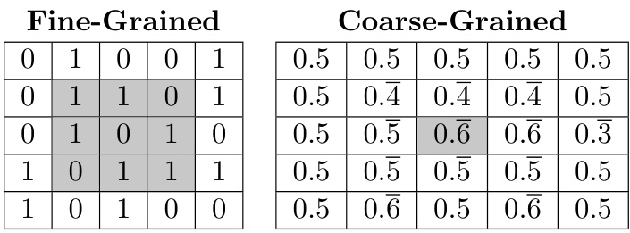  

Figure 1:  Illustration of the construction of the coarse-grained array, using an example grain size of 3. The values of the shaded cells at left are averaged to produce the value of the shaded cell at right.  

# 5 Coarse-Graining Experiment  

# 5.1 Method  

To derive a coarse-grained version of the automaton state from its original, fine-grained version, we construct a new array in which the value of each cell is the average of the values of the nearby cells in the fine-grained array. We define “nearby” cells as those within a    $g\times g$   square centered at the cell in question. The value of    $g$   is called the grain size, and here is selected experimentally. This procedure is illustrated in Figure 1.  

Given this array of averages, we then threshold its floating-point values into three buckets. Visually, these buckets represent areas which are mostly coffee (values close to 0), mostly cream (values close to 1), or mixed (values close to 0 . 5). The estimated complexity of the state,    $K\left(S\right)$  , is the file size of the thresholded, coarse-grained array after compression. Analogously, the estimated entropy of the automaton state is the compressed file size of the fine-grained array.  

# 5.2 Results and Analysis  

Results from simulation of the automaton using the coarse-graining metric are shown in Figure 2.  

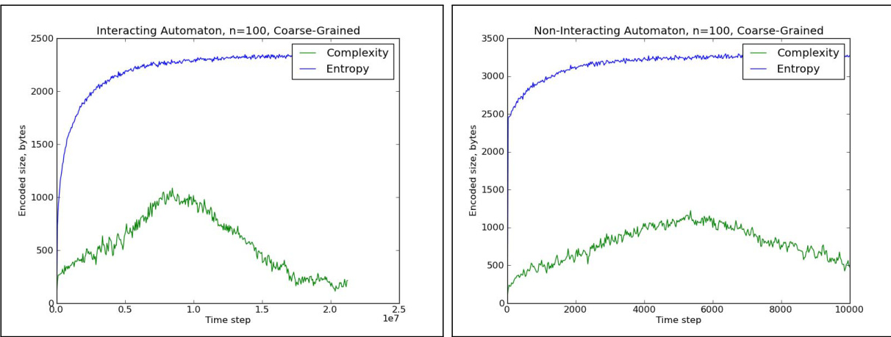  
Figure 2:  The estimated entropy and complexity of an automaton using the coarse-graining metric. Results for the interacting model are shown at left, and results for the non-interacting model are at right.  

Both the interacting and non-interacting models show the predicted increasing, then decreasing pattern of complexity. Both models also have an increasing entropy pattern, which is expected due to the second law of thermodynamics. The initial spike in entropy for the non-interacting automaton can be explained by the fact that all of the particles can move simultaneously after the first time step. Thus, the number of bits needed to represent the state of the non-interacting automaton jumps after the first time step. With the interacting automaton, by contrast, particles far from the coffee-cream border cannot move until particles closer to the border have moved, so there is less change in the automaton at each time step. Therefore, the estimated entropy of this model is predictably more continuous throughout.  

A visualization of the automaton’s changing state over time is provided in Figures 3 and 4. This visualization is generated by converting each cell’s value to a grayscale color value; lighter colors correspond to larger values. Visually, the fine-grained representation of the state continues to grow more complicated with time, while the coarse-grained representation first becomes first more and then less complicated.  

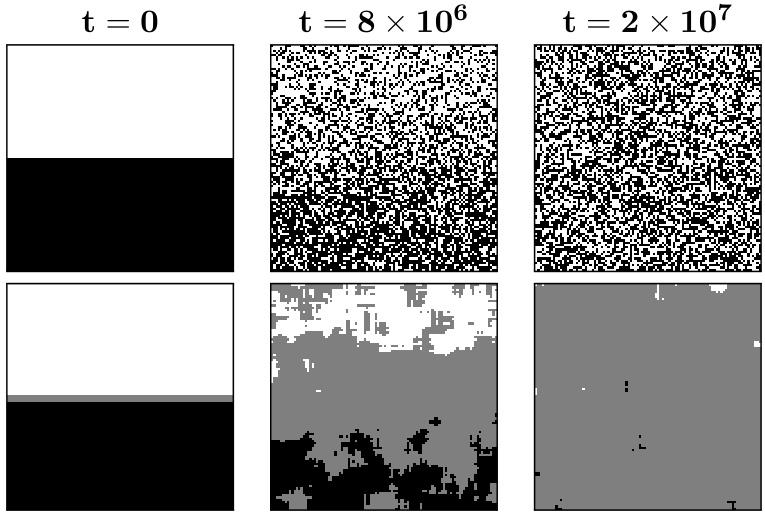  
Figure 3:  Visualization of the state of the interacting automaton of size 100 over time. The top row of images is the fine-grained array, used to estimate entropy. The bottom row is the coarse-grained array, used to estimate complexity. From left to right, the images represent the automaton state at the beginning of the simulation, at the complexity maximum, and at the end of the simulation.  

The  gzip  compression algorithm was used to generate the results in Figure 2, and is used throughout when a general file compression program is needed. The results achieved using the coarse-graining metric are qualitatively similar when different compression programs are used, as shown in Figure 5.  

Given these results, it is informative to examine how complexity varies with    $n$  , the size of the automaton.  

The well-fit quadratic curve for the maximum values of entropy (Figure 6) is expected. The maximum entropy of an automaton is proportional to the number of particles in the automaton. This is because, if the state of the automaton is completely random, then the compressed size of the state is equal to the uncompressed size–the number of particles. As the automaton size,    $n$  , increases, the number of particles increases to    $n^{2}$  .  

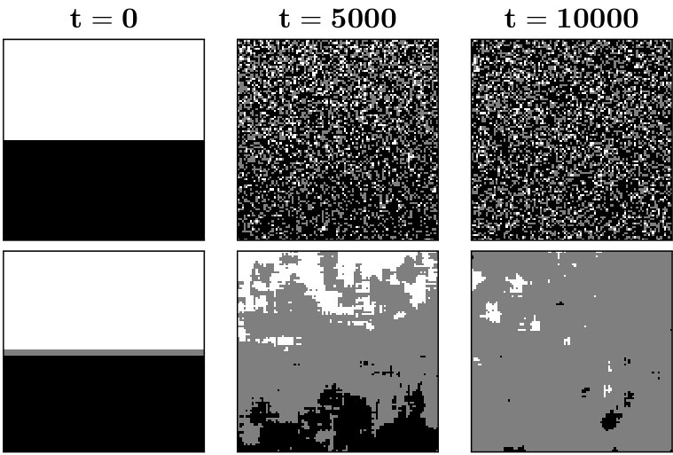  
Figure 4:  Visualization of the state of the non-interacting automaton of size 100 over time.  

The maximum values of complexity appear to increase linearly as the automaton size increases (Figure 7). That is, maximum complexity is proportional to the side length of the two-dimensional state array. This result is expected, since the automaton begins in a state which is symmetric along its vertical axis, and complexity presumably develops along a single dimension of the automaton. The time that it takes for the automaton to reach its complexity maximum appears to increase quadratically with the automaton size, or proportionally to the number of particles in the automaton (Figure 8). This result is also expected, since the time for    $n^{2}$    particles to reach a particular configuration is proportional to    $n^{2}$  .  

# 6 Adujsted Coarse-Graining Experiment  

# 6.1 Method  

Though the original coarse-graining approach produces the hypothesized complexity pattern, the method of thresholding used in the previous experiment—dividing the floating-point values into three buckets—has the potential to introduce artificial complexity. Consider, for example, an automaton state for which the coarse-grained array is a smooth gradient from 0 to 1. By definition, there will be some row of the array which lies on the border between two threshold values. Tiny fluctuations in the values of the coarse-grained array may cause the cells in this row to fluctuate between two threshold values. In such a case, the small fluctuations in this border row would artificially increase the measured complexity of the coarse-grained array. This case is illustrated in Figure 9.  

We propose an adjustment to the coarse-graining algorithm that helps to minimize these ar- tifacts. First, we use a larger number of thresholds—seven, in contrast to the three used in the original experiment. Additionally, we allow each cell in the array to be optionally, independently adjusted up or down by one threshold, in whatever manner achieves the smallest possible file size for the coarse-grained array.  

This adjustment helps to compensate for the thresholding artifacts–such random fluctuations  

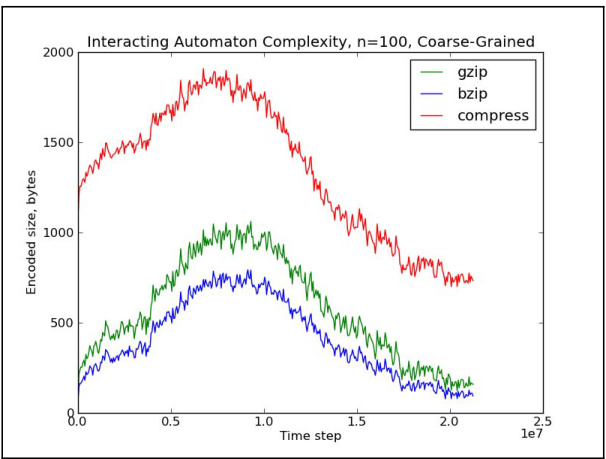  
Figure 5:  Coarse-grained complexity estimates for a single simulation of the interacting automaton, using multiple file compression programs.  

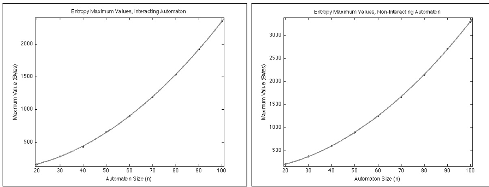  
Figure 6:  Graphs of automaton size versus entropy maximum value. Quadratic curve fits are shown, with  $r^{2}$    values of 0 . 9999 for both the interacting and non-interacting automaton.  

could be removed by adjusting the fluctuating pixels. However, since each pixel can be adjusted independently, there are   $2^{n^{2}}$    possible ways to adjust a given coarse-grained array.  

Because we cannot search through this exponential number of possible adjustments to find the optimal one, we develop an approximation algorithm to produce an adjustment that specifically targets pixels on the border between two thresholds. Given the properties of the automaton—it begins with rows of dark cells on top, and light cells on the bottom—it is likely that each row of the coarse-grained array will contain similar values. Thus, we adjust the coarse-grained array by using a majority algorithm. If a cell is within one threshold value of the majority value in its row, it is adjusted to the majority value.  

The hope is that  

(1) this adjustment will reduce artificial border complexity by “flattening” fluctuating border rows to a single color, (2) the adjustment will not eliminate actual complexity, since complicated structures will create  

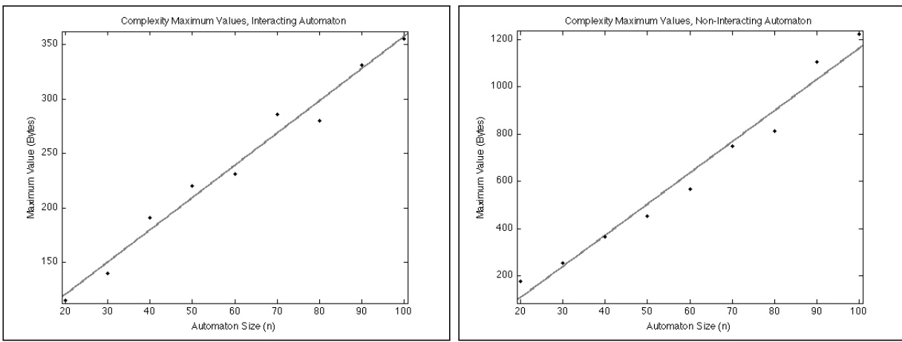  
Figure 7:  Graphs of automaton size versus complexity maximum value. Linear curve fits are shown, with  $r^{2}$    values of 0 . 9798 for the interacting automaton and 0 . 9729 for the non-interacting automaton.  

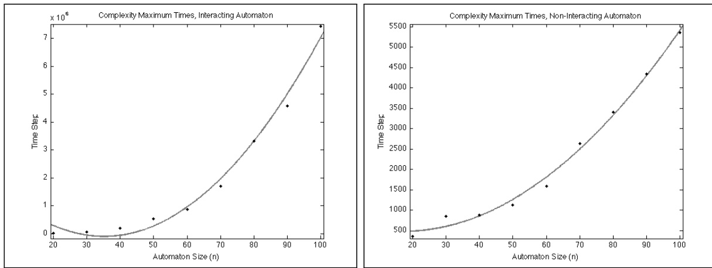  
Figure 8:  Graphs of automaton size versus time to complexity maximum. Quadratic curve fits are shown, with    $r^{2}$    values of 0.9878 for the interacting automaton and 0.9927 for the non-interacting automaton.  

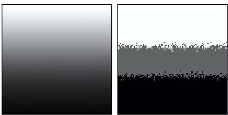  
Figure 9:  A coarse-grained array consisting of a smooth gradient from 0 to 1 is shown at left. At right is the same array after a small amount of simulated noise has been added and the values have been thresholded.  

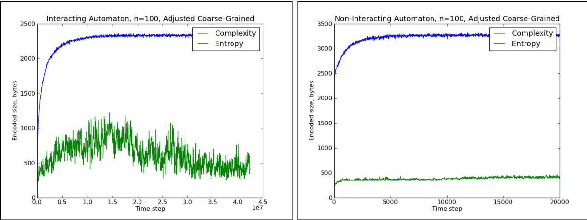  
Figure 10:  The estimated entropy and complexity of an automaton using the adjusted coarse-graining metric.  

value differences in the coarse-grained array that are large enough to span multiple thresholds.  

# 6.2 Results and Analysis  

Results from simulation of the automaton using the adjusted coarse-graining metric are shown in Figure 10. Visualizations of the automaton state are shown in Figures 11 and 12.  

While this metric is somewhat noisier than the original coarse-graining method, it results in a similarly-shaped complexity curve for the interacting automaton. For the non-interacting automa- ton, however, the complexity curve is flattened to a lower value.  

This result for the non-interacting automaton is actually borne out by theoretical predictions. The basic story is as follows; for details, see Appendix 9. If we consider the automaton state to “wrap around” from right to left, then by symmetry, the expected number of cream particles at a particular location in the automaton depends solely on the vertical position of that location. The expectations of all cells in a particular row will be the same, allowing the two-dimensional automaton state to be specified using a single dimension. Modeling each particle of cream as taking a random walk from its initial position, it is possible to calculate the expected number of particles at a given position as a function of time. Further, Chernoffbounds can be used to demonstrate that the actual number of particles in each grain of the coarse-grained state is likely to be close to the expectation, provided that the grain size is large enough. Since it is possible to specify the expected distribution of particles in the non-interacting automaton at all times using such a function, the complexity of the non-interacting automaton state is always low.  

We believe thresholding artifacts caused the apparent increase in complexity for the non- interacting automaton when regular coarse-graining was used. Our adjustment removes all of this estimated complexity from the non-interacting automaton, but preserves it in the interact- ing automaton. This evidence suggests that the interacting automaton model may actually have intermediate states of high complexity, even if the non-interacting model never becomes complex.  

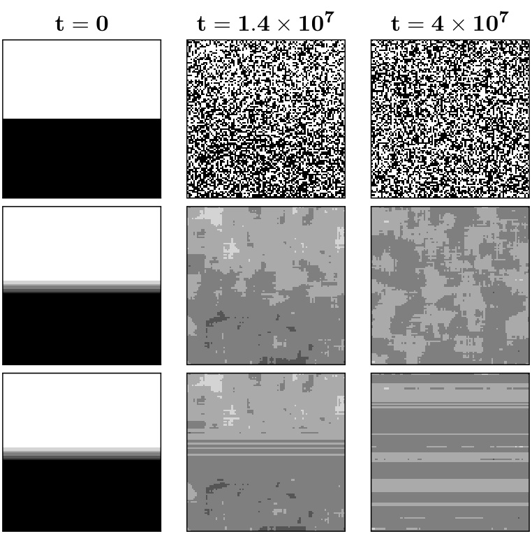  
Figure 11:  Visualization of the state of the interacting automaton of size 100 over time. The rows of images represent the fine-grained state, the original coarse-grained state, and the coarse-grained state after adjustment, respectively.  

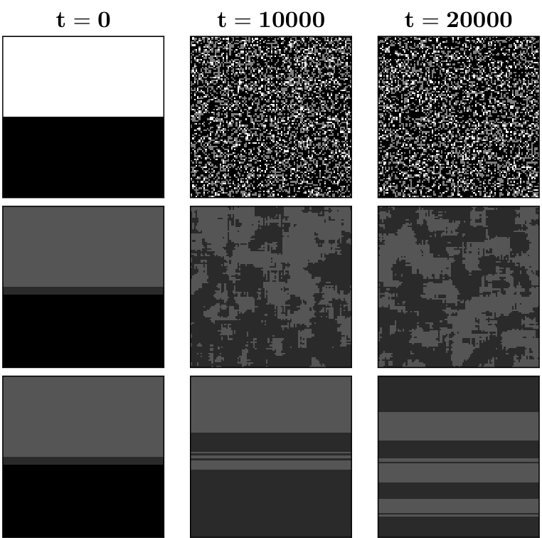  
Figure 12:  Visualization of the state of the non-interacting automaton of size 100 over time. Note that the coarse-grained images are darker than for the previous coarse-graining metric, because a larger number of thresholds were used.  

# 7 Conclusions and Further Work  

Of the metrics considered in this project, the coarse-graining approaches such as apparent com- plexity provide the most effective estimate of complexity that produces results which mirror human intuition. However, this metric suffers from the disadvantage that it is based on human intuition and perceptions of complexity. Ideally, a complexity metric would be found which produces sim- ilar results without relying on such assumptions. The OSCR approach seems promising for its independence from these assumptions and for its theoretical foundations. It is possible that a different implementation of this algorithm could produce better results than the one we used for this project.  

It would also be worthwhile to investigate other complexity metrics, beyond those already explored in this paper. Shalizi et al. [12] propose a metric based on the concept of light cones. They define    $C\left(x\right)$  , the complexity of a point    $x$   in the spacetime history, as the mutual information between descriptions of its past and future light cones. Letting    $P\left(x\right)$   be the past light cone and  $F\left(x\right)$   the future light cone,    $C\left(x\right)=H\left(P\left(x\right)\right)+H\left(F\left(x\right)\right)-H\left(P\left(x\right)\right.$   , F  ( x )). This metric is of particular interest because it avoids the problem of artifacts created by coarse-graining; it can also be approximated in a way that avoids the use of    ${\tt g z i p}$  . Running experiments with the automaton using the light cone metric, and comparing the results to those generated using coarse-graining, could provide more information about both metrics.  

Ultimately, numerical simulation is of limited use in reasoning about the problem of complexity. Approximation algorithms can provide only an upper bound, not a lower bound, on Kolmogorov complexity and sophistication. To show that a system really does become complex at intermediate points in time, it is necessary to find a lower bound for the system’s complexity. Future theoretical work could help provide such a lower bound, and could also generate further insight into the origins of complexity in closed systems.  

# 8 Acknowledgments  

We thank Alex Arkhipov, Charles Bennett, Ian Durham, Dietrich Leibfried, Aldo Pacchiano, and Luca Trevisan for helpful discussions.  

# 9 Appendix: The Non-Interacting Case  

Let’s consider the non-interacting coffee automaton on an    $n\times n$   grid with periodic boundary conditions. At each time step, each cream particle moves to one of the 4 neighboring pixels uniformly at random. Let    $a_{t}\left(x,y\right)$   be the number of cream particles at point   $(x,y)$   after    $t$   steps.  

Claim 1.  For all    $x,y,t$  , we have    $\mathrm{E}\left[a_{t}\left(x,y\right)\right]\leq1$  .  

Proof.  By induction on    $t$  . If    $t=0$  , then    $a_{0}\left(x,y\right)\in\left\lbrace0,1\right\rbrace$  . Furthermore, by linearity of expectation,  

$$
\left[a_{t+1}\left(x,y\right)\right]=\frac{\operatorname{E}\left[a_{t}\left(x-1,y\right)\right]+\operatorname{E}\left[a_{t}\left(x+1,y\right)\right]+\operatorname{E}\left[a_{t}\left(x,y-1\right)\right]+\operatorname{E}\left[a_{t}\left(x,y+1\right)\right]}{4}.
$$  

Now let    $B$   be an    $L\times L$   sq re of  ixels, located anywhere on the    $n\times n$   grid. Let    $a_{t}\left(B\right)$   be the number of cream particles in  B  after  t  steps. Clearly  

$$
a_{t}\left(B\right)=\sum_{\left(x,y\right)\in B}a_{t}\left(x,y\right).
$$  

So it follows from Claim 1 that   $\mathrm{E}\left[a_{t}\left(B\right)\right]\leq L^{2}$  .  

Fix some constant    $G$  , say 10. Then call    $B$   “bad” if    $a_{t}\left(B\right)$   differs from   $\mathrm{E}\left[a_{t}\left(B\right)\right]$   by more than  $L^{2}/G$  . Suppose that at some time step    $t$  , no    $B$   is bad. Also, suppose we form a coarse-grained image by coloring each    $B$   one of    $G$   shades of gray, depending on the value of  

$$
\left\lfloor{\frac{a_{t}\left(B\right)G}{L^{2}}}\right\rfloor
$$  

(or we color    $B$   white if    $a_{t}\left(B\right)>L^{2}$  ). Then it’s clear that the resulting image will be correctable, by adjusting each color by    $\pm1$  , to one where all the    $B$  ’s within the same row are assigned the same color—and furthermore, that color is simply  

$$
\left\lfloor{\frac{\operatorname{E}\left[a_{t}\left(B\right)\right]G}{L^{2}}}\right\rfloor.
$$  

If this happens, though, then the Kolmogorov complexity of the coarse-grained image can be at most   $\log_{2}{(n)}+\log_{2}{(t)}+O\left(1\right)$  . For once we’ve specified    $n$   and    $t$  , we can simply  calculate  the expected color for each    $B$  , and no color ever deviates from its expectation.  

So our task reduces to upper-bounding the probability that    $B$   is bad. By a Chernoffbound, since    $a_{t}\left(B\right)$   is just a sum of independent,   $0/1$   random variables,  

$$
\mathrm{Pr}\left[\left|a_{t}\left(B\right)-\mathrm{E}\left[a_{t}\left(B\right)\right]\right|>\delta\,\mathrm{E}\left[a_{t}\left(B\right)\right]\right]<2\exp\left(-\frac{\mathrm{E}\left[a_{t}\left(B\right)\right]\delta^{2}}{3}\right).
$$  

Plugging in    $L^{2}/G=\delta\operatorname{E}\left[a_{t}\left(B\right)\right]$  , we get  

$$
\mathrm{Pr}\left[\left|a_{t}\left(B\right)-\mathrm{E}\left[a_{t}\left(B\right)\right]\right|>\frac{L^{2}}{G}\right]<2\exp\left(-\frac{L^{4}}{3G^{2}\,\mathrm{E}\left[a_{t}\left(B\right)\right]}\right).
$$  

Since   $\mathrm{E}\left[a_{t}\left(B\right)\right]\leq L^{2}$    from above, this in turn is at most  

$$
2\exp\left(-\frac{L^{2}}{3G^{2}}\right).
$$  

Now, provided we choose a coarse-grain size  

$$
L\gg G\sqrt{3\ln\left(2n^{2}\right)}=\Theta\left(G\sqrt{\log n}\right),
$$  

the above will be much less than   $1/n^{2}$  . In that case, it follows by the union bound that, at each time step    $t$  , with high probability  none  of the    $L\times L$   squares    $B$   are bad (since there at most    $n^{2}$  such squares). This is what we wanted to show.  

# References  

[1] L. Antunes and L. Fortnow. Sophistication revisited.  Theory of Computing Systems , 45(1):150– 161, 2009.

 [2] C. H. Bennett. Logical depth and physical complexity. In  The Universal Turing Machine A Half-Century Survey , pages 207–235. Springer, 1995.

 [3] T. A Brun and J. B Hartle. Classical dynamics of the quantum harmonic chain.  Physical Review D , 60(12):123503, 1999.

 [4] S. M. Carroll.  From Eternity to Here: The Quest for the Ultimate Theory of Time . Dutton, 2010.

 [5] S. Evans, G. Saulnier, and S. Bush. A new universal two part code for estimation of string Kolmogorov complexity and algorithmic minimum sufficient statistic. In  DIMACS Workshop on Complexity and Inference , 2003.  http://www.stat.ucla.edu/\~cocteau/dimacs/evans. pdf .

 [6] P. G´ acs, J. Tromp, and P. M. B. Vit´ anyi. Algorithmic statistics.  IEEE Trans. Information Theory , 47(6):2443–2463, 2001.

 [7] M. Gell-Mann.  The Quark and the Jaguar: Adventures in the Simple and the Complex . Henry Holt and Company, 1994.

 [8] M. Koppel. Complexity, depth, and sophistication.  Complex Systems , 1(6):1087–1091, 1987.

 [9] M. Li and P. Vit´ anyi.  An Introduction to Kolmogorov Complexity and Its Applications (1st edition) . Springer-Verlag, 1993.

 [10] F. Mota, S. Aaronson, L. Antunes, and A. Souto. Sophistication as randomness deficiency. In  Descriptional Complexity of Formal Systems , volume 8031 of  Lecture Notes in Computer Science , pages 172–181, 2013.

 [11] C. R. Shalizi. Methods and techniques of complex systems science: an overview. In T. S. Deisboeck and J. Y. Kresh, editors,  Complex Systems Science in Biomedicine , pages 33–114. Springer, 2006. nlin.AO/0307015.

 [12] C. R. Shalizi, K. L. Shalizi, and R. Haslinger. Quantifying self-organization with optimal predictors.  Physical Review Letters , 93(118701), 2004. nlin.AO/0409024.

 [13] N. Vereshchagin and P. Vit´ anyi. Kolmogorov’s structure functions with an application to the foundations of model selection. In  IEEE Foundations of Computer Science (FOCS) , pages 751–760, 2002.  