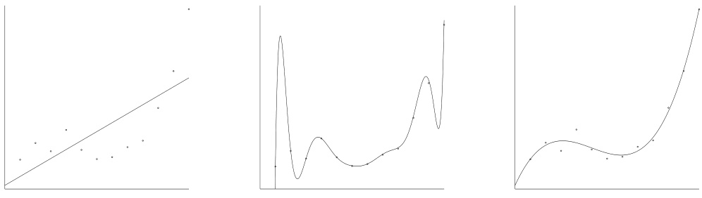
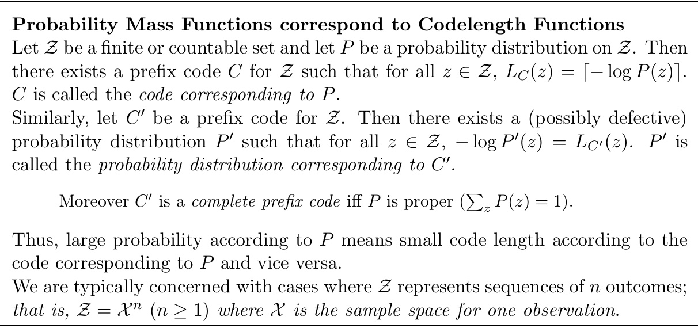
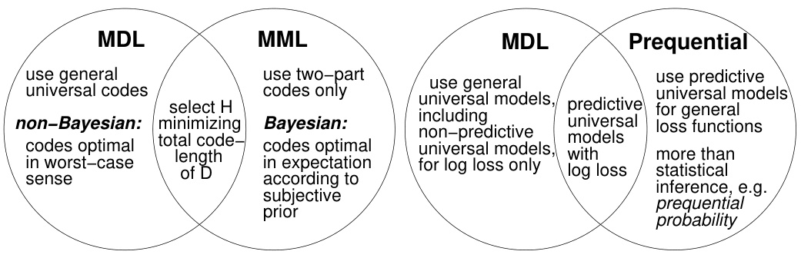

# A Tutorial Introduction to the Minimum Description Length Principle  

Peter Gr¨ unwald Centrum voor Wiskunde en Informatica Kruislaan 413, 1098 SJ Amsterdam The Netherlands pdg@cwi.nl www.grunwald.nl  

# Abstract  

This tutorial provides an overview of and introduction to Rissanen’s Minimum De- scription Length (MDL) Principle. The first chapter provides a conceptual, entirely non-technical introduction to the subject. It serves as a basis for the technical in- troduction given in the second chapter, in which all the ideas of the first chapter are made mathematically precise. This tutorial will appear as the first two chapters in the collection  Advances in Minimum Description Length: Theory and Applications [Gr¨ unwald, Myung, and Pitt 2004], to be published by the MIT Press.  

# Contents  

# 1 Introducing MDL 5  

1.1 Introduction and Overview . . . . . . . . . . . . . . . . . . . . . . . . . 5

 1.2 The Fundamental Idea:Learning as Data Compression . . . . . . . . . . 6 1.2.1 Kolmogorov Complexity and Ideal MDL . . . . . . . . . . . . . . 8 1.2.2 Practical MDL . . . . . . . . . . . . . . . . . . . . . . . . . . . . 8

 1.3 MDL and Model Selection . . . . . . . . . . . . . . . . . . . . . . . . . . 9

 1.4 Crude and Refined MDL . . . . . . . . . . . . . . . . . . . . . . . . . . . 12

 1.5 The MDL Philosophy . . . . . . . . . . . . . . . . . . . . . . . . . . . . 14

 1.6 MDL and Occam’s Razor . . . . . . . . . . . . . . . . . . . . . . . . . . 17

 1.7 History . . . . . . . . . . . . . . . . . . . . . . . . . . . . . . . . . . . . 19

 1.8 Summary and Outlook . . . . . . . . . . . . . . . . . . . . . . . . . . . . 20  

# 2 Tutorial on MDL 23  

2.1 Plan of the Tutorial . . . . . . . . . . . . . . . . . . . . . . . . . . . . . 23

 2.2 Information Theory I: Probabilities and Codelengths . . . . . . . . . . . 24 2.2.1 Prefix Codes . . . . . . . . . . . . . . . . . . . . . . . . . . . . . 25 2.2.2 The Kraft Inequality - Codelengths & Probabilities, I . . . . . . 26 2.2.3 The Information Inequality - Codelengths & Probabilities, II . . 31

 2.3 Statistical Preliminaries and Example Models . . . . . . . . . . . . . . . 32

 2.4 Crude MDL . . . . . . . . . . . . . . . . . . . . . . . . . . . . . . . . . . 34 2.4.1 Description Length of Data given Hypothesis . . . . . . . . . . . 35 2.4.2 Description Length of Hypothesis . . . . . . . . . . . . . . . . . . 35

 2.5 Information Theory II: Universal Codes and Models . . . . . . . . . . . 37 2.5.1 Two-part Codes as simple Universal Codes . . . . . . . . . . . . 39 2.5.2 From Universal Codes to Universal Models . . . . . . . . . . . . 40 2.5.3 NML as an  Optimal Universal Model  . . . . . . . . . . . . . . . . 42

 2.6 Simple Refined MDL and its Four Interpretations . . . . . . . . . . . . . 44 2.6.1 Compression Interpretation . . . . . . . . . . . . . . . . . . . . . 46 2.6.2 Counting Interpretation . . . . . . . . . . . . . . . . . . . . . . . 46 2.6.3 Bayesian Interpretation . . . . . . . . . . . . . . . . . . . . . . . 49 2.6.4 Prequential Interpretation . . . . . . . . . . . . . . . . . . . . . . 51  

2.7 General Refined MDL: Gluing it All Together . . . . . . . . . . . . . . . 54 2.7.1 Model Selection with Infinitely Many Models . . . . . . . . . . . 54 2.7.2 The Infinity Problem . . . . . . . . . . . . . . . . . . . . . . . . . 55 2.7.3 The General Picture . . . . . . . . . . . . . . . . . . . . . . . . . 58  

2.8 Beyond Parametric Model Selection . . . . . . . . . . . . . . . . . . . . 60

 2.9 Relations to Other Approaches to Inductive Inference . . . . . . . . . . 63 2.9.1 What is ‘MDL’? . . . . . . . . . . . . . . . . . . . . . . . . . . . 64 2.9.2 MDL and Bayesian Inference . . . . . . . . . . . . . . . . . . . . 64 2.9.3 MDL, Prequential Analysis and Cross-Validation . . . . . . . . . 67 2.9.4 Kolmogorov Complexity and Structure Function; Ideal MDL . . 67

 2.10 Problems for MDL? . . . . . . . . . . . . . . . . . . . . . . . . . . . . . 68 2.10.1 Conceptual Problems: Occam’s Razor . . . . . . . . . . . . . . . 68 2.10.2 Practical Problems with MDL . . . . . . . . . . . . . . . . . . . 70

 2.11 Conclusion . . . . . . . . . . . . . . . . . . . . . . . . . . . . . . . . . . 71  

# Chapter 1  

# Introducing the MDL Principle  

# 1.1 Introduction and Overview  

How does one decide among competing explanations of data given limited observations? This is the problem of  model selection . It stands out as one of the most important problems of inductive and statistical inference. The Minimum Description Length (MDL) Principle is a relatively recent method for inductive inference that provides a generic solution to the model selection problem. MDL is based on the following insight: any regularity in the data can be used to  compress  the data, i.e. to describe it using fewer symbols than the number of symbols needed to describe the data literally. The more regularities there are, the more the data can be compressed. Equating ‘learning’ with ‘finding regularity’, we can therefore say that the more we are able to compress the data, the more we have  learned  about the data. Formalizing this idea leads to a general theory of inductive inference with several attractive properties:  

1. Occam’s Razor  MDL chooses a model that trades-offgoodness-of-fit on the ob- served data with ‘complexity’ or ‘richness’ of the model. As such, MDL embodies a form of Occam’s Razor, a principle that is both intuitively appealing and infor- mally applied throughout all the sciences.  

2. No overfitting,  automatically  MDL procedures  automatically  and  inherently  pro- tect against overfitting and can be used to estimate both the parameters and the structure (e.g., number of parameters) of a model. In contrast, to avoid over- fitting when estimating the structure of a model, traditional methods such as maximum likelihood must be  modified  and extended with additional, typically  ad hoc  principles.  

3. Bayesian interpretation  MDL is closely related to Bayesian inference, but avoids 1 some of the interpretation difficulties of the Bayesian approach , especially in the realistic case when it is known a priori to the modeler that none of the models under consideration is true. In fact:  

4. No need for ‘underlying truth’  In contrast to other statistical methods, MDL procedures have a clear interpretation independent of whether or not there exists some underlying ‘true’ model.  

5. Predictive interpretation  Because data compression is formally equivalent to a form of probabilistic prediction, MDL methods can be interpreted as searching for a model with good predictive performance on  unseen  data.  

In this chapter, we introduce the MDL Principle in an entirely non-technical way, concentrating on its most important applications, model selection and avoiding over- fitting. In Section 1.2 we discuss the relation between learning and data compression. Section 1.3 introduces model selection and outlines a first, ‘crude’ version of MDL that can be applied to model selection. Section 1.4 indicates how these ‘crude’ ideas need to be refined to tackle small sample sizes and differences in model complexity between models with the same number of parameters. Section 1.5 discusses the philosophy un- derlying MDL, and considers its relation to Occam’s Razor. Section 1.7 briefly discusses the history of MDL. All this is summarized in Section 1.8.  

# 1.2 The Fundamental Idea: Learning as Data Compression  

We are interested in developing a method for  learning  the laws and regularities in data. The following example will illustrate what we mean by this and give a first idea of how it can be related to descriptions of data.  

Regularity  . . . Consider the following three sequences. We assume that each se- quence is 10000 bits long, and we just list the beginning and the end of each sequence.  

00010001000100010001  . . . 0001000100010001000100010001 (1.1) 01110100110100100110  . . . 1010111010111011000101100010 (1.2) 00011000001010100000  . . . 0010001000010000001000110000 (1.3)  

The first of these three sequences is a 2500-fold repetition of  0001 . Intuitively, the sequence looks regular; there seems to be a simple ‘law’ underlying it; it might make sense to conjecture that future data will also be subject to this law, and to predict that future data will behave according to this law. The second sequence has been generated by tosses of a fair coin. It is intuitively speaking as ‘random as possible’, and in this sense there is no regularity underlying it. Indeed, we cannot seem to find such a regularity either when we look at the data. The third sequence contains approximately four times as many 0s as 1s. It looks less regular, more random than the first; but it looks less random than the second. There is still some discernible regularity in these data, but of a statistical rather than of a deterministic kind. Again, noticing that such a regularity is there and predicting that future data will behave according to the same regularity seems sensible.  

...and Compression We claimed that any regularity detected in the data can be used to  compress  the data, i.e. to describe it in a short manner. Descriptions are always relative to some  description method  which maps descriptions    $D^{\prime}$    in a unique manner to data sets    $D$  . A particularly versatile description method is a general-purpose computer  C  Pascal language like  or . A description of    $D$   is then any computer program that prints    $D$   and then halts. Let us see whether our claim works for the three sequences above. Using a language similar to Pascal, we can write a program  

# for   $\texttt{i}=\texttt{1}$   to 2500 ;  print  ‘ 0001 ‘;  next ;  halt  

which prints sequence (1) but is clearly a lot shorter. Thus, sequence (1) is indeed highly compressible. On the other hand, we show in Section 2.2, that if one generates a sequence like (2) by tosses of a fair coin, then with extremely high probability, the shortest program that prints (2) and then halts will look something like this:  

print  ‘ 011101001101000010101010 ........ 1010111010111011000101100010 ‘;  halt  

This program’s size is about equal to the length of the sequence. Clearly, it does nothing more than repeat the sequence.  

The third sequence lies in between the first two: generalizing    $n=10000$   to arbitrary length    $n$  , we show in Section 2.2 that the first sequence can be compressed to    $O(\log n)$  bits; with overwhelming probability, the second sequence cannot be compressed at all; and the third sequence can be compressed to some length    $\alpha n$  , with   $0<\alpha<1$  .  

Example 1.1 [compressing various regular sequences]  The regularities underly- ing sequences (1) and (3) were of a very particular kind. To illustrate that  any  type of regularity in a sequence may be exploited to compress that sequence, we give a few more examples:  

The Number    $\pi$   Evidently, there exists a computer program for generating the first  $n$   digits of    $\pi$   – such a program could be based, for example, on an infinite se- ries expansion of    $\pi$  . This computer program has constant size, except for the specification of    $n$   which takes no more than    $O(\log n)$   bits. Thus, when    $n$   is very large, the size of the program generating the first    $n$   digits of    $\pi$   will be very small compared to    $n$  : the    $\pi$  -digit sequence is deterministic, and therefore extremely regular.  

Physics Data  Consider a two-column table where the first column contains numbers representing various heights from which an object was dropped. The second col- umn contains the corresponding times it took for the object to reach the ground. Assume both heights and times are recorded to some finite precision. In Sec- tion 1.3 we illustrate that such a table can be substantially compressed by first describing the coefficients of the second-degree polynomial    $H$   that expresses New- ton’s law; then describing the heights; and then describing the deviation of the time points from the numbers predicted by    $H$  .  

Natural Language  Most sequences of words are not valid sentences according to the English language. This fact can be exploited to substantially compress English text, as long as it is syntactically mostly correct: by first describing a grammar for English, and then describing an English text    $D$   with the help of that grammar [Gr¨ unwald 1996],    $D$   can be described using much less bits than are needed without the assumption that word order is constrained.  

# 1.2.1 Kolmogorov Complexity and Ideal MDL  

To formalize our ideas, we need to decide on a description method, that is, a formal language in which to express properties of the data. The most general choice is a general-purpose  $^2$    computer language such as    $\mathrm{C}$   or  Pascal . This choice leads to the definition of the  Kolmogorov Complexity  [Li and Vit´ anyi 1997] of a sequence as the length of the shortest program that prints the sequence and then halts. The lower the Kolmogorov complexity of a sequence, the  more regular  it is. This notion seems to be highly dependent on the particular computer language used. However, it turns out that for every two general-purpose programming languages    $A$   and    $B$   and every data sequence    $D$  , the length of the shortest program for    $D$   written in language    $A$   and the length of the shortest program for    $D$   written in language    $B$   differ by no more than a constant    $c$  , which does not depend on the length of    $D$  . This so-called  invari- ance theorem  says that,  as long as the sequence    $D$   is long enough , it is not essential which computer language one chooses, as long as it is general-purpose. Kolmogorov complexity was introduced, and the invariance theorem was proved, independently by Kolmogorov [1965], Chaitin [1969] and Solomonoff[1964]. Solomonoff’s paper, called A Theory of Inductive Inference , contained the idea that the ultimate model for a sequence of data may be identified with the shortest program that prints the data. Solomonoff’s ideas were later extended by several authors, leading to an ‘idealized’ ver- sion of MDL [Solomonoff1978; Li and Vit´ anyi 1997; G´ acs, Tromp, and Vit´ anyi 2001]. This idealized MDL is very general in scope, but not practically applicable, for the following two reasons:  

1. uncomputability  It can be shown that there exists no computer program that, for every set of data    $D$  , when given    $D$   as input, returns the shortest program that prints    $D$   [Li and Vit´ anyi 1997].  

2. arbitrariness/dependence on syntax  In practice we are confronted with small data samples for which the invariance theorem does not say much. Then the hypothesis chosen by idealized MDL may depend on arbitrary details of the syntax of the programming language under consideration.  

# 1.2.2 Practical MDL  

Like most authors in the field, we concentrate here on non-idealized, practical versions of MDL that explicitly deal with the two problems mentioned above. The basic idea is to scale down Solomonoff’s approach so that it does become applicable. This is achieved by using description methods that are less expressive than general-purpose computer languages. Such description methods    $C$   should be restrictive enough so that for any data sequence    $D$  , we can always compute the length of the shortest description of    $D$   that is attainable using method    $C$  ; but they should be general enough to allow us to compress many of the intuitively ‘regular’ sequences. The price we pay is that, using the ‘practical’ MDL Principle, there will always be some regular sequences which we will not be able to compress. But we already know that there can be  no  method for inductive inference at all which will always give us all the regularity there is — simply because there can be no automated method which for any sequence    $D$   finds the shortest computer program that prints    $D$   and then halts. Moreover, it will often be possible to guide a suitable choice of    $C$   by a priori knowledge we have about our problem domain. For example, below we consider a description method    $C$   that is based on the class of all polynomials, such that with the help of    $C$   we can compress all data sets which can meaningfully be seen as points on some polynomial.  

# 1.3 MDL and Model Selection  

Let us recapitulate our main insights so far:  

# MDL: The Basic Idea  

The goal of statistical inference may be cast as trying to find regularity in the data. ‘Regularity’ may be identified with ‘ability to compress’. MDL combines these two insights by  viewing learning as data compression : it tells us that, for a given set of hypotheses    $\mathcal{H}$   and data set    $D$  , we should try to find the hypothesis or combination of hypotheses in    $\mathcal{H}$   that compresses    $D$   most.  

This idea can be applied to all sorts of inductive inference problems, but it turns out to be most fruitful in (and its development has mostly concentrated on) problems of  model selection  and, more generally, dealing with  overfitting . Here is a standard example (we explain the difference between ‘model’ and ‘hypothesis’ after the example).  

Example 1.2 [Model Selection and Overfitting]  Consider the points in Figure 1.1. We would like to learn how the    $y$  -values depend on the    $x$  -values. To this end, we may want to fit a polynomial to the points. Straightforward linear regression will give us the leftmost polynomial - a straight line that seems overly simple: it does not capture the regularities in the data well. Since for any set of    $n$   points there exists a polynomial of the   $(n-1)$  -st degree that goes exactly through all these points, simply looking for the polynomial with the least error will give us a polynomial like the one in the second picture. This polynomial seems overly complex: it reflects the random fluctuations in the data rather than the general pattern underlying it. Instead of picking the overly simple or the overly complex polynomial, it seems more reasonable to prefer  

  
Figure 1.1: A simple, a complex and a trade-off(3rd degree) polynomial.  

a relatively simple polynomial with small but nonzero error, as in the rightmost picture. This intuition is confirmed by numerous experiments on real-world data from a broad variety of sources [Rissanen 1989; Vapnik 1998; Ripley 1996]: if one naively fits a high- degree polynomial to a small sample (set of data points), then one obtains a very good fit to the data. Yet if one  tests  the inferred polynomial on a second set of data coming from the same source, it typically fits this test data very badly in the sense that there is a large distance between the polynomial and the new data points. We say that the polynomial  overfits  the data. Indeed, all model selection methods that are used in practice either implicitly or explicitly choose a trade-offbetween goodness-of-fit and complexity of the models involved. In practice, such trade-offs lead to much better predictions of test data than one would get by adopting the ‘simplest’ (one degree) or most ‘complex  $^3$  ’ (  $n-1$  -degree) polynomial. MDL provides one particular means of achieving such a trade-off.  

It will be useful to make a precise distinction between ‘model’ and ‘hypothesis’:  

# Models vs. Hypotheses  

We use the phrase  point hypothesis  to refer to a  single  probability distribution or function. An example is the polynomial   $5x^{2}+4x+3$  . A point hypothesis is also known as a ‘simple hypothesis’ in the statistical literature. We use the word  model  to refer to a family (set) of probability distributions or functions with the same functional form. An example is the set of all second- degree polynomials. A model is also known as a ‘composite hypothesis’ in the statistical literature. We use  hypothesis  as a generic term, referring to both point hypotheses and mod- els.  

In our terminology, the problem described in Example 1.2 is a ‘hypothesis selection problem’ if we are interested in selecting both the degree of a polynomial and the cor- responding parameters; it is a ‘model selection problem’ if we are mainly interested in selecting the degree.  

To apply MDL to polynomial or other types of hypothesis and model selection, we have to make precise the somewhat vague insight ‘learning may be viewed as data compression’. This can be done in various ways. In this section, we concentrate on the earliest and simplest implementation of the idea. This is the so-called  two-part code version of MDL:  

# 4 Crude , Two-part Version of MDL Principle (Informally Stated)  

Let    ${\mathcal{H}}^{(1)},{\mathcal{H}}^{(2)},\ldots.$   be a list of candidate models (e.g.,    $\mathcal{H}^{(k)}$    is the set of    $k$  -th degree polynomials), each containing a set of point hypotheses (e.g., individual polynomi- als). The best point hypothesis    $H\in{\mathcal{H}}^{(1)}\cup{\mathcal{H}}^{(2)}\cup.\,.\,.$   to explain the data    $D$   is the one which minimizes the sum    $L(H)+L(D|H)$  , where  

•    $L(H)$   is the length, in bits, of the description of the hypothesis; and  

•    $L(D|H)$   is the length, in bits, of the description of the data when encoded with the help of the hypothesis.  

The best  model  to explain    $D$   is the smallest model containing the selected    $H$  .  

Example 1.3 [Polynomials, cont.]  In our previous example, the candidate hypothe- ses were polynomials. We can describe a polynomial by describing its coefficients in a certain precision (number of bits per parameter). Thus, the higher the degree of a poly- nomial or the precision, the more  $^5$    bits we need to describe it and the more ‘complex’ it becomes. A description of the data ‘with the help of’ a hypothesis means that the better the hypothesis fits the data, the shorter the description will be. A hypothesis that fits the data well gives us a lot of  information  about the data. Such information can always be used to compress the data (Section 2.2). Intuitively, this is because we only have to code the  errors  the hypothesis makes on the data rather than the full data. In our polynomial example, the better a polynomial    $H$   fits    $D$  , the fewer bits we need to encode the discrepancies between the actual    $y$  -values    $y_{i}$   and the predicted    $y$  -values  $H(x_{i})$  . We can typically find a very complex point hypothesis (large    $L(H)$  ) with a very good fit (small    $L(D|H).$  ). We can also typically find a very simple point hypothesis (small    $L(H)$  ) with a rather bad fit (large    $L(D|H))$  . The sum of the two description lengths will be minimized at a hypothesis that is quite (but not too) ‘simple’, with a good (but not perfect) fit.  

# 1.4 Crude and Refined MDL  

Crude MDL picks the    $H$   minimizing the sum    $L(H)+L(D|H)$  . To make this procedure well-defined, we need to agree on precise definitions for the codes (description methods) giving rise to lengths    $L(D|H)$   and    $L(H)$  . We now discuss these codes in more detail. We will see that the definition of    $L(H)$   is problematic, indicating that we somehow need to ‘refine’ our crude MDL Principle.  

Definition of    $L(D|H)$  Consider a two-part code as described above, and assume for the time being that all    $H$   under consideration define probability distributions. If    $H$   is a polynomial, we can turn it into a distribution by making the additional assumption that the    $Y$  -values are given by    $Y=H(X)+Z$  , where    $Z$   is a normally distributed noise term.  

For each    $H$   we need to define a code with length    $L(\cdot\mathrm{~\ensuremath~{~\vert~}~}H)$   such that    $L(D|H)$  can be interpreted as ‘the codelength of    $D$   when encoded with the help of    $H^{\prime}$  . It turns out that for probabilistic hypotheses, there is only one reasonable choice for this code. It is the so-called  Shannon-Fano code , satisfying, for all data sequences  $D$  ,    ${\cal L}({\cal D}|H)\,=\,-\log P({\cal D}|H)$  , where    $P(D|H)$   is the probability mass or density of    $D$  according to    $H$   – such a code always exists, Section 2.2.  

Definition of    $L(H)$  : A Problem for Crude MDL It is more problematic to find a good code for hypotheses    $H$  . Some authors have simply used ‘intuitively rea- sonable’ codes in the past, but this is not satisfactory: since the description length  $L(H)$   of any fixed point hypothesis    $H$   can be very large under one code, but quite short under another, our procedure is in danger of becoming arbitrary. Instead, we need some additional principle for designing a code for    $\mathcal{H}$  . In the first publications on MDL [Rissanen 1978; Rissanen 1983], it was advocated to choose some sort of  mini- max code  for    $\mathcal{H}$  , minimizing, in some precisely defined sense, the shortest worst-case total description length    $L(H)+L(D|H)$  , where the worst-case is over all possible data sequences. Thus, the MDL Principle is employed at a ‘meta-level’ to choose a code for    $H$  . However, this code requires a cumbersome discretization of the model space  $\mathcal{H}$  , which is not always feasible in practice. Alternatively, Barron [1985] encoded    $H$  by the shortest computer program that, when input    $D$  , computes    $P(D|H)$  . While it can be shown that this leads to similar codelengths, it is computationally problematic. Later, Rissanen [1984] realized that these problems could be side-stepped by using a one-part  rather than a  two-part code . This development culminated in 1996 in a com- pletely precise prescription of MDL for many, but certainly not all practical situations [Rissanen 1996]. We call this modern version of MDL  refined MDL :  

Refined MDL In refined MDL, we associate a code for encoding    $D$   not with a single  $H\,\in\,{\mathcal{H}}$  , but with the full model    $\mathcal{H}$  . Thus, given model    $\mathcal{H}$  , we encode data not in two parts but we design a single  one-part code  with lengths   $L(D|\mathcal{H})$  |H ). This code is designed such that  whenever there is a member of (parameter in)  $\mathcal{H}$   that fits the data well, in the sense that    $L(D\mid H)$   is small, then the codelength    $L(D|\mathcal{H})$  |H  will also be small . Codes with this property are called  universal codes  in the information-theoretic literature [Barron, Rissanen, and Yu 1998]. Among all such universal codes, we pick the one that is  minimax optimal  in a sense made precise in Section 2.5. For example, the set    $\mathcal{H}^{(3)}$    of third-degree polynomials is associated with a code with lengths   $\bar{L}(\cdot\mid\mathcal{H}^{(3)})$  · | H such that, the better the data    $D$   are fit by the best-fitting third-degree polynomial, the shorter the codelength   $L(D\mid{\mathcal{H}})$   | H ).   $L(D\mid{\mathcal{H}})$   | H ) is called the  stochastic complexity  of the data given the model.  

Parametric Complexity The second fundamental concept of refined MDL is the parametric complexity  of a parametric m el    $\mathcal{H}$   which we denote by    $\mathbf{COMP}(\mathcal{H})$  . This is a measure of the ‘richness’ of model  H , indicating its ability to fit random data. This complexity is related to the degrees-of-freedom in    $\mathcal{H}$  , but also to the geometrical structure of    $\mathcal{H}$  ; ee Example 1.4. To see how it relates to stochastic complexity, let, for ,   $\hat{H}$  given data    $D$   denote the distribution in    $\mathcal{H}$   which maximizes the probability, and hence minimizes the codelength    $L(D\mid{\hat{H}})$  ) of    $D$  . It turns out that  

stochastic complexity of    $D$   given    $\mathcal{H}=L(D\mid\hat{H})+\mathbf{SOMP}(\mathcal{H})$  H .  

Refined MDL model selection between two parametric models (such as the models of first and second degree polynomials) now proceeds by selecting the model such that the stochastic complexity of the given data    $D$   is smallest. Although we used a one-part code to encode data, refined MDL model selection still involves a trade-offbetween two terms: a goodness-of-fit term    $L(D\mid{\hat{H}})$  ) and a co plexity term    $\mathbf{COMP}(\mathcal{H})$  . However, because we do not explicitly encode hypotheses  H  any more, there is no arbitrariness any more. The resulting procedure can be interpreted in several different ways, some of which provide us with rationales for MDL beyond the pure coding interpretation

 (Sections 2.6.1–2.6.4):  

1. Counting/differential geometric interpretation  The parametric complexity of a model is the logarithm of the number of  essentially different ,  distinguishable point hypotheses within the model.  

2. Two-part code interpretation  For large samples, the stochastic complexity can be interpreted as a two-part codelength of the data after all, where hypotheses    $H$  are encoded with a special code that works by first discretizing the model space  $\mathcal{H}$   into a set of ‘maximally distinguishable hypotheses’, and then assigning equal codelength to each of these.  

3. Bayesian interpretation  In many cases, refined MDL model selection coincides with Bayes factor model selection based on a  non-informative prior  such as  Jef- freys’ prior  [Bernardo and Smith 1994].  

4. Prequential interpretation  Refined MDL model selection can be interpreted as selecting the model with the best predictive performance when sequentially pre- dicting  unseen  test data, in the sense described in Section 2.6.4. This makes it an instance of Dawid’s [1984]  prequential  model validation and also relates it to cross-validation  methods.  

Refined MDL allows us to compare models of different functional form. It even accounts for the phenomenon that different models with the same number of parameters may not be equally ‘complex’:  

Example 1.4  Consider two models from psychophysics describing the relationship be- tween physical dimensions (e.g., light intensity) and their psychological counterparts (e.g. brightness) [Myung, Balasubramanian, and Pitt 2000]:    $y\,=\,a x^{b}+Z$   (Stevens’ model) and    $y=a\ln(x+b)+Z$   (Fechner’s model) where    $Z$   is a normally distributed noise term. Both models have two free parameters; nevertheless, it turns out that in a sense, Stevens’ model is more  flexible  or  complex  than Fechner’s. Roughly speaking, this means there are a lot more data patterns that can be  explained  by Stevens’ model than can be explained by Fechner’s model. Myung, Balasubramanian, and Pitt [2000] generated many samples of size 4 from Fechner’s model, using some fixed parameter values. They then fitted both models to each sample. In 67% of the trials, Stevens’ model fitted the data better than Fechner’s, even though the latter generated the data. Indeed, in refined MDL, the ‘complexity’ associated with Stevens’ model is much larger than the complexity associated with Fechner’s, and if both models fit the data equally well, MDL will prefer Fechner’s model.  

Summarizing, refined MDL removes the arbitrary aspect of crude, two-part code MDL and associates parametric models with an inherent ‘complexity’ that does not depend on any particular description method for hypotheses. We should, however, warn the reader that we only discussed a special, simple situation in which we compared a finite number of parametric models that satisfy certain regularity conditions. Whenever the models do not satisfy these conditions, or if we compare an infinite number of models, then the refined ideas have to be extended. We then obtain a ‘general’ refined MDL Principle, which employs a combination of one-part and two-part codes.  

# 1.5 The MDL Philosophy  

The first central MDL idea is that every regularity in data may be used to compress that data; the second central idea is that learning can be equated with finding regu- larities in data. Whereas the first part is relatively straightforward, the second part of the idea implies that  methods for learning from data must have a clear interpretation independent of whether any of the models under consideration is ‘true’ or not . Quoting J. Rissanen [1989], the main originator of MDL:  

“We never want to make the false assumption that the observed data actually were generated by a distribution of some kind, say Gaussian, and then go on to analyze the consequences and make further deductions. Our deductions may  

Jorma Rissanen [1989]  

Based on such ideas, Rissanen has developed a radical philosophy of learning and statistical inference that is considerably different from the ideas underlying mainstream statistics, both frequentist and Bayesian. We now describe this philosophy in more detail:  

1. Regularity as Compression According to Rissanen, the goal of inductive in- ference should be to ‘squeeze out as much regularity as possible’ from the given data. The main task for statistical inference is to distill the meaningful information present in the data, i.e. to separate structure (interpreted as the regularity, the ‘meaningful information’) from noise (interpreted as the ‘accidental information’). For the three sequences of Example 1.2, this would amount to the following: the first sequence would be considered as entirely regular and ‘noiseless’. The second sequence would be con- sidered as entirely random - all information in the sequence is accidental, there is no structure present. In the third sequence, the structural part would (roughly) be the pattern that 4 times as many 0s than 1s occur; given this regularity, the description of exactly which of all sequences with four times as many 0s than 1s occurs, is the accidental information.  

2. Models as Languages Rissanen interprets models (sets of hypotheses) as nothing more than languages for describing useful properties of the data – a model    $\mathcal{H}$   is  identified with its corresponding universal code   $L(\cdot\mid\mathcal{H})$  · | H ). Different individual hypotheses within the models express different regularities in the data, and may simply be regarded as statistics , that is, summaries of certain regularities in the data.  These regularities are present and meaningful independently of  ether some    $H^{*}\,\in\,{\mathcal{H}}$   is the ‘true state of nature’ or not . Suppose that the model  H  under consideration is probabilistic. In traditional theories, one typically assumes that some    $P^{*}\in{\mathcal{H}}$    erates the data, and then ‘noise’ is defined as a random quantity relative to this  P  $P^{*}$  . In the MDL view ‘noise’ is defined relative to the odel    $\mathcal{H}$   as the residual number of bits needed to encode the data once the model  H  is given. Thus, noise is  not  a random variable: it is a function only of the chosen model and the  actually observed data . Indeed, there is no place for a ‘true distribution’ or a ‘true state of nature’ in this view – there are only models and data. To bring out the difference to the ordinary statistical viewpoint, consider the phrase ‘these experimental data are quite noisy’. According to a traditional interpretation, such a statement means that the data were generated by a distribution with high variance. According to the MDL philosophy, such a phrase means only that the data are not compressible with the currently hypothesized model – as a matter of principle, it can  never  be ruled out that there exists a different model under which the data are very compressible (not noisy) after all!  

3. We Have Only the Data Many (but not all  $^6$  ) other methods of inductive inference are based on the idea that there exists some ‘true state of nature’, typically a distribution assumed to lie in some model    $\mathcal{H}$  . The methods are then designed as a means to identify or approximate this state of nature based on as little data as possible. According to Rissanen  $7$  , such methods are fundamentally flawed. The main reason is that the methods are designed under the assumption that the true state of nature is in the assumed model    $\mathcal{H}$  , which is often not the case. Therefore,  such methods only admit a clear interpretation under assumptions that are typically violated in practice . Many cherished statistical methods are designed in this way - we mention hypothesis testing, minimum-variance unbiased estimation, several non-parametric methods, and even some forms of Bayesian inference – see Example 2.22. In contrast, MDL has a clear interpretation which  depends only on the data , and not on the assumption of any underlying ‘state of nature’.  

Example 1.5 [Models that are Wrong, yet Useful]  Even though the models under consideration are often wrong, they can nevertheless be very  useful . Ex- amples are the successful ‘Naive Bayes’ model for spam filtering, Hidden Markov Models for speech recognition (is speech a stationary ergodic process? probably not), and the use of linear models in econometrics and psychology. Since these models are evidently wrong, it seems strange to base inferences on them using methods that are designed under the assumption that they contain the true distri- bution. To be fair, we should add that domains such as spam filtering and speech recognition are not what the fathers of modern statistics had in mind when they designed their procedures – they were usually thinking about much simpler do- mains, where the assumption that some distribution    $P^{*}\in{\mathcal{H}}$   is ‘true’ may not be so unreasonable.  

4. MDL and Consistency Let    $\mathcal{H}$   be a probabilistic model, such that each    $P\in{\mathcal{H}}$   is a probability distribution. Roughly, a statistical procedure is called  consistent  relative to    $\mathcal{H}$   if, for all    $P^{*}\,\in\,\mathcal{H}$  , the following holds: suppose data are distributed according to    $P^{*}$  . Then given enough data, the learning method will learn a good approximation of    $P^{*}$  with high probability. Many traditional statistical methods have been designed with consistency in mind (Section 2.3).  

The fact that in MDL, we do not assume a true distribution may suggest that we do not care about statistical consistency. But this is not the case: we would still like our statistical method to be such that in the  idealized  case where one of the distributions in one of the models under consideration actually generates the data, our method is able to identify this distribution, given enough data. If even in the idealized special case where a ‘truth’ exists within our models, the method fails to learn it, then we certainly cannot trust it to do something reasonable in the more general case, where there may not be a ‘true distribution’ underlying the data at all. So: consistency  is  important in the MDL philosophy, but it is used  as a sanity check (for a method that has been developed without making distributional assumptions) rather than as a design principle .  

In fact, mere consistency is not sufficient. We would like our method to con- verge to the imagined true    $P^{*}$  fast , based on as small a sample as possible. Two- part code MDL with ‘clever’ codes achieves good rates of convergence in this sense (Barron and Cover [1991], complemented by [Zhang 2004], show that in many situa- tions, the rates are  minimax optimal ). The same seems to be true for refined one-part code MDL [Barron, Rissanen, and Yu 1998], although there is at least one surprising exception where inference based on the NML and Bayesian universal model behaves abnormally – see [Csisz´ ar and Shields 2000] for the details.  

Summarizing this section, the MDL philosophy is quite agnostic about whether any of the models under consideration is ‘true’, or whether something like a ‘true distribution’ even exists. Nevertheless, it has been suggested [Webb 1996; Domingos 1999] that MDL embodies a naive belief that ‘simple models’ are ‘a priori more likely to be true’ than complex models. Below we explain why such claims are mistaken.  

# 1.6 MDL and Occam’s Razor  

When two models fit the data equally well, MDL will choose the one that is the ‘sim- plest’ in the sense that it allows for a shorter description of the data. As such, it imple- ments a precise form of Occam’s Razor –  even though as more and more data becomes available, the model selected by MDL may become more and more ‘complex’!  Occam’s Razor is sometimes criticized for being either (1) arbitrary or (2) false [Webb 1996; Domingos 1999]. Do these criticisms apply to MDL as well?  

‘1. Occam’s Razor (and MDL) is arbitrary’ Because ‘description length’ is a syntactic notion it may seem that MDL selects an arbitrary model: different codes would have led to different description lengths, and therefore, to different models. By changing the encoding method, we can make ‘complex’ things ‘simple’ and vice versa. This overlooks the fact we are not allowed to use just any code we like! ‘Refined’ MDL tells us to use a specific code, independent of any specific parameter iz ation of the model, leading to a notion of complexity that can also be interpreted without any reference to ‘description lengths’ (see also Section 2.10.1).  

‘2. Occam’s Razor is false’ It is often claimed that Occam’s razor is false - we often try to model real-world situations that are arbitrarily complex, so why should we favor simple models? In the words of G. Webb  $^8$  : ‘What good are simple models of a complex world?’  

The short answer is: even if the true data generating machinery is very complex, it may be a good strategy to prefer simple models for small sample sizes. Thus, MDL (and the corresponding form of Occam’s razor) is a  strategy  for inferring models from data (“choose simple models at small sample sizes”), not a statement about how the world works (“simple models are more likely to be true”) – indeed, a strategy cannot be true or false, it is ‘clever’ or ‘stupid’. And the strategy of preferring simpler models is clever even if the data generating process is highly complex, as illustrated by the following example:  

Example 1.6 [‘Infinitely’ Complex Sources]  Suppose that data are subject to the law    $Y\,=\,g(X)\,+\,Z$   where    is some continuous function and    $Z$   is some noise term  $g$  with mean 0. If    is not a polynomial, but    $X$   only takes values in a finite interval,  $g$  say   $[-1,1]$  , we may still approximate    $g$   arbitrarily well by taking higher and higher degree polynomials. For example, let    $g(x)=\exp(x)$  . Then, if we use MDL to learn a polynomial for data    $D\,=\,\bigl((x_{1},y_{1}),.\,.\,,(x_{n},y_{n})\bigr)$  , the degree of the polynomial  ${\ddot{f}}^{(n)}$  selected by MDL at sample size    $n$   will increase with    $n$  , and with high probability,  ${\ddot{f}}^{(n)}$    converges to    $g(x)=\exp(x)$   in the sense that   $\begin{array}{r}{\operatorname*{max}_{x\in[-1,1]}|\ddot{f}^{(n)}(x)-g(x)|\rightarrow0}\end{array}$  0. Of course, if we had better prior knowledge about the problem we could have tried to learn  using a model class    $\mathcal{M}$   containing the function    $y=\exp(x)$  . But in general, both our  $g$  imagination and our computational resources are limited, and we may be forced to use imperfect models.  

If, based on a small sample, we choose the best-fitting polynomial   $\hat{f}$   within the set of  all  polynomials, then, even though   $\hat{f}$   will fit the data very well, it is likely to be quite unrelated to the ‘true’    $g$  , and   $\hat{f}$   may lead to disastrous predictions of future data. The reason is that, for small samples, the set of all polynomials is very large compared to the set of possible data patterns that we might have observed. Therefore, any particular data pattern can only give us very limited information about which high-degree polynomial best approximates    $g$  . On the other hand, if we choose the best-fitting   $\hat{f}^{\circ}$  in some much smaller set such as the set of second-degree polynomials, then it is highly probable that the prediction quality (mean squared error) of   $\hat{f}^{\circ}$  on future data is about the same as its mean squared error on the data we observed: the size (complexity) of the contemplated model is relatively small compared to the set of possible data patterns that we might have observed. Therefore, the particular pattern that we do observe gives us a lot of information on what second-degree polynomial best approximates    $g$  .  

Thus, (a)   $\hat{f}^{\circ}$  typically leads to better predictions of future data than   $\hat{f}$  ; and (b) unlike   $\hat{f}$  ,   $\hat{f}^{\circ}$  is  reliable  in that it gives a correct impression of how good it will pre- dict future data  even if the ‘true’  g  is ‘infinitely’ complex . This idea does not just appear in MDL, but is also the basis of Vapnik’s [1998] Structural Risk Minimization approach and many standard statistical methods for non-parametric inference. In such approaches one acknowledges that the data generating machinery can be infinitely com- plex (e.g., not describable by a finite degree polynomial). Nevertheless, it is still a good strategy to approximate it by simple hypotheses (low-degree polynomials) as long as the sample size is small. Summarizing:  

The Inherent Difference between Under- and Overfitting If we choose an overly simple model for our data, then the best-fitting point hy- pothesis within the model is likely to be almost the best predictor, within the simple model, of future data coming from the same source. If we overfit (choose a very complex model) and there is noise in our data, then,  even if the complex model contains the ‘true’ point hypothesis , the best-fitting point hypothesis within the model is likely to lead to very bad predictions of future data coming from the same source.  

This statement is very imprecise and is meant more to convey the general idea than to be completely true. As will become clear in Section 2.10.1, it becomes provably true if we use MDL’s measure of model complexity; we measure prediction quality by logarithmic loss; and we assume that one of the distributions in    $\mathcal{H}$   actually generates the data.  

# 1.7 History  

The MDL Principle has mainly been developed by J. Rissanen in a series of papers starting with [Rissanen 1978]. It has its roots in the theory of  Kolmogorov  or  algorith- mic  complexity [Li and Vit´ anyi 1997], developed in the 1960s by Solomonoff[1964], Kolmogorov [1965] and Chaitin [1966, 1969]. Among these authors, Solomonoff(a former student of the famous philosopher of science, Rudolf Carnap) was explicitly in- terested in inductive inference. The 1964 paper contains explicit suggestions on how the underlying ideas could be made practical, thereby foreshadowing some of the later work on two-part MDL. While Rissanen was not aware of Solomonoff’s work at the time, Kolmogorov’s [1965] paper did serve as an inspiration for Rissanen’s [1978] development of MDL.  

Another important inspiration for Rissanen was Akaike’s [1973] AIC method for model selection, essentially the first model selection method based on information- theoretic ideas. Even though Rissanen was inspired by AIC, both the actual method and the underlying philosophy are substantially different from MDL.  

MDL is much closer related to the  Minimum Message Length Principle , devel- oped by Wallace and his co-workers in a series of papers starting with the ground- breaking [Wallace and Boulton 1968]; other milestones are [Wallace and Boulton 1975] and [Wallace and Freeman 1987]. Remarkably, Wallace developed his ideas without be- ing aware of the notion of Kolmogorov complexity. Although Rissanen became aware of Wallace’s work before the publication of [Rissanen 1978], he developed his ideas mostly independently, being influenced rather by Akaike and Kolmogorov. Indeed, despite the close resemblance of both methods in practice, the underlying philosophy is quite different - see Section 2.9.  

The first publications on MDL only mention two-part codes. Important progress was made by Rissanen [1984], in which prequential codes are employed for the first time and [Rissanen 1987], introducing the Bayesian mixture codes into MDL. This led to the development of the notion of stochastic complexity as the shortest codelength of the data given a model [Rissanen 1986; Rissanen 1987]. However, the connection to Shtarkov’s  normalized maximum likelihood code  was not made until 1996, and this pre- vented the full development of the notion of ‘parametric complexity’. In the mean time, in his impressive Ph.D. thesis, Barron [1985] showed how a specific version of the two- part code criterion has excellent frequentist statistical consistency properties. This was extended by Barron and Cover [1991] who achieved a breakthrough for two-part codes: they gave clear prescriptions on how to design codes for hypotheses, relating codes with good minimax codelength properties to rates of convergence in statistical consistency theorems. Some of the ideas of Rissanen [1987] and Barron and Cover [1991] were, as it were, unified when Rissanen [1996] introduced a new definition of stochastic com- plexity based on the  normalized maximum likelihood code  (Section 2.5). The resulting theory was summarized for the first time by Barron, Rissanen, and Yu [1998], and is called ‘refined MDL’ in the present overview.  

# 1.8 Summary and Outlook  

We discussed how regularity is related to data compression, and how MDL employs this connection by viewing learning in terms of data compression. One can make this precise in several ways; in  idealized  MDL one looks for the shortest program that generates the given data. This approach is not feasible in practice, and here we concern ourselves with  practical  MDL. Practical MDL comes in a crude version based on two-part codes and in a modern, more refined version based on the concept of  universal coding . The basic ideas underlying all these approaches can be found in the boxes spread throughout the text.  

These methods are mostly applied to model selection but can also be used for other problems of inductive inference. In contrast to most existing statistical methodology, they can be given a clear interpretation irrespective of whether or not there exists some ‘true’ distribution generating data – inductive inference is seen as a search for regular properties in (interesting statistics of) the data, and there is no need to assume anything outside the model and the data. In contrast to what is sometimes thought, there is  no  implicit belief that ‘simpler models are more likely to be true’ – MDL does embody a preference for ‘simple’ models, but this is best seen as a strategy for inference that can be useful even if the environment is not simple at all.  

In the next chapter, we make precise both the crude and the refined versions of practical MDL. For this, it is absolutely essential that the reader familiarizes him- or herself with two basic notions of coding and information theory: the relation between codelength functions and probability distributions, and (for refined MDL), the idea of universal coding – a large part of the chapter will be devoted to these.  

# Notes  

1 .  See Section 2.9.2, Example 2.22.  

2 .  By this we mean that a universal Turing Machine can be implemented in it [Li and Vit´ anyi 1997].  

3 .  Strictly speaking, in our context it is not very accurate to speak of ‘simple’ or ‘complex’ polyno- mials; instead we should call the  set  of first degree polynomials ‘simple’, and the  set  of 100-th degree polynomials ‘complex’.  

4 .  The terminology ‘crude MDL’ is not standard. It is introduced here for pedagogical reasons, to make clear the importance of having a single, unified principle for designing codes. It should be noted that Rissanen’s and Barron’s early theoretical papers on MDL already contain such prin- ciples, albeit in a slightly different form than in their recent papers. Early practical applications [Quinlan and Rivest 1989; Gr¨ unwald 1996] often do use  ad hoc  two-part codes which really are ‘crude’ in the sense defined here.  

5 .  See the previous note.  

6 .  For example, cross-validation cannot easily be interpreted in such terms of ‘a method hunting for the true distribution’.  

7 .  The present author’s own views are somewhat milder in this respect, but this is not the place to discuss them.  

8 .  Quoted with permission from KDD Nuggets 96:28, 1996.  

# Chapter 2  

# Minimum Description Length Tutorial  

# 2.1 Plan of the Tutorial  

In Chapter 1 we introduced the MDL Principle in an informal way. In this chapter we give an introduction to MDL that is mathematically precise. Throughout the text, we assume some basic familiarity with probability theory. While some prior exposure to basic statistics is highly useful, it is not required. The chapter can be read without any prior knowledge of information theory. The tutorial is organized according to the following plan:  

•  The first two sections are of a preliminary nature:  

–  Any understanding of MDL requires some minimal knowledge of information theory – in particular the relationship between probability distributions and codes. This relationship is explained in Section 2.2. –  Relevant statistical notions such as ‘maximum likelihood estimation’ are reviewed in Section 2.3. There we also introduce the Markov chain model which will serve as an example model throughout the text.  

•  Based on this preliminary material, in Section 2.4 we formalize a simple version of the MDL Principle, called the  crude two-part MDL Principle  in this text. We explain why, for successful practical applications, crude MDL needs to be refined.  

•  Section 2.5 is once again preliminary: it discusses  universal coding , the information- theoretic concept underlying refined versions of MDL.  

•  Sections 2.6–2.8 define and discuss refined MDL. They are the key sections of the tutorial:  

–  Section 2.6 discusses basic refined MDL for comparing a finite number of simple statistical models and introduces the central concepts of  parametric  

and  stochastic complexity . It gives an  asymptotic expansion  of these quanti- ties and interprets them from a compression, a geometric, a Bayesian and a predictive point of view.  

–  Section 2.7 extends refined MDL to harder model selection problems, and in doing so reveals the general, unifying idea, which is summarized in Fig- ure 2.4.  

–  Section 2.8 briefly discusses how to extend MDL to applications beyond model section.  

•  Having defined ‘refined MDL’ in Sections 2.6–2.8, the next two sections place it in context:  

–  Section 2.9 compares MDL to other approaches to inductive inference, most notably the related but different  Bayesian  approach. –  Section 2.10 discusses perceived as well as real problems with MDL. The perceived problems relate to MDL’s relation to Occam’s Razor, the real problems relate to the fact that applications of MDL sometimes perform suboptimally in practice.  

•  Finally, Section 2.11 provides a conclusion.  

# Reader’s Guide  

Throughout the text, paragraph headings reflect the most important concepts. Boxes summarize the most important findings. Together, paragraph headings and boxes provide an overview of MDL theory. It is possible to read this chapter without having read the non-technical overview of Chapter 1. However, we strongly recommend reading at least Sections 1.3 and Section 1.4 before embarking on the present chapter.  

# 2.2 Information Theory I: Probabilities and Codelengths  

This first section is a mini-primer on information theory, focusing on the relationship between probability distributions and codes. A good understanding of this relationship is essential for a good understanding of MDL. After some preliminaries, Section 2.2.1 introduces prefix codes, the type of codes we work with in MDL. These are related to probability distributions in two ways. In Section 2.2.2 we discuss the first relationship, which is related to the  Kraft inequality : for every probability mass function    $P$  , there exists a code with lengths    $-\log P$  , and vice versa. Section 2.2.3 discusses the second relationship, related to the  information inequality , which says that if the data are distributed according to    $P$  , then the code with lengths    $-\log P$   achieves the minimum expected codelength. Throughout the section we give examples relating our findings to our discussion of regularity and compression in Section 1.2 of Chapter 1.  

Preliminaries and Notational Conventions - Codes We use log to denote log- arithm to base 2. For real-valued    $x$   we use    $\lceil x\rceil$  to denote the  ceiling  of  $x$  , that   rounded up to the nearest integer. We often abbreviate    to  x  $x^{n}$  . Let  X  $x$   $x_{1},\dots,x_{n}$  be a finite or countable set. A  code  for    $\mathcal{X}$   is defined as a 1-to-1 mapping from    $\mathcal{X}$   to  $\cup_{n\geq1}\{0,1\}^{n}$  .    $\cup_{n\geq1}\{0,1\}^{n}$    is the set of binary strings (sequences of 0s and 1s) of length 1 or larger. For a given code    $C$  , we use    $C(x)$   to denote the encoding of    $x$  . Every code  $C$   induces a function    $L_{C}:\mathcal{X}\to\mathbb{N}$   called the  codelength function .    $L_{C}(x)$   is the number of bits (symbols) needed to encode    $x$   using code    $C$  .  

1 Our definition of code implies that we only consider  lossless  encoding in MDL : for any description    $z$   it is always possible to retrieve the unique    $x$   that gave rise to it. More precisely, because the code    $C$   must be 1-to-1, there is at most one    $x$   with    $C(x)=z$  . Then    $x=C^{-1}(z)$  , where the inverse    $C^{-1}$    of    $C$   is sometimes called a ‘decoding function’ or ‘description method’.  

Preliminaries and Notational Conventions - Probability Let    $P$   be a proba- bility distribution defined on a finite or countable set    $\mathcal{X}$  . We use    $P(x)$     deno e the probability of    $x$  , and we denote the corresponding random variable by  X . If  P  is a function on finite or countable    $\mathcal{X}$   such that    $\textstyle\sum_{x}P(x)<1$   1, we call    $P$   a  defective  distri- bution. A defective distribution may be thought of as a probability distribution that puts some of its mass on an imagined outcome that in reality will never appear.  

A  probabilistic source    $P$   is a sequence of probability distributions    $P^{(1)},P^{(2)},.\,.\,.$   on

  $\mathcal{X}^{1},\mathcal{X}^{2},\ldots.$   such that for   $n$   $P^{(n)}$    and    $P^{(n+1)}$    are  compatible :    $P^{(n)}$    is equal to the  $P^{(n+1)}$   

 ‘marginal’ distribution of  P restricted to    $n$   outcomes. That is, for all    $x^{n}\in\mathcal{X}^{n}$  ,

  $\begin{array}{r}{P^{(n)}(x^{n})=\sum_{y\in\mathcal{X}}P^{(n+1)}(x^{n},y)}\end{array}$  ). Whenever this cannot cause any confusion, we write  $P(x^{n})$  ) rather than    $P^{(n)}(x^{n})$  . A probabilistic source may be thought of as a probability 2 distribution on infinite sequences . We say that the data are  i.i.d.  (independently and identically distributed) under source    $P$   if for each    $n$  ,    $x^{n}\in\mathcal{X}^{n}$  ,    $\textstyle P(x^{n})=\prod_{i=1}^{n}P(x_{i})$  ).  

# 2.2.1 Prefix Codes  

In MDL we only work with a subset of all possible codes, the so-called  prefix codes . A prefix code  $^3$    is a code such that no codeword is a prefix of any other codeword. For example, let    $\mathcal{X}=\{a,b,c\}$  . Then the code    $C_{1}$   defined by    $C_{1}(a)=0$  ,    $C_{1}(b)=10$  ,  $C_{1}(c)=11$   is prefix. The code    $C_{2}$   with    $C_{2}(a)=0,C_{2}(b)=10$   and    $C_{2}(c)=01$  , while allowing for lossless decoding, is  not  a prefix code since   $0$   is a prefix of 01. The prefix requirement is natural, and nearly ubiquitous in the data compression literature. We now explain why.  

Example 2.1  Suppose we plan to encode a sequence of symbols   $(x_{1},\ldots,x_{n})\,\in\,\mathcal{X}^{n}$  .  

We already designed a code    $C$   for the elements in    $\mathcal{X}$  . The natural thing to do is to encode   $\left(x_{1},\ldots,x_{n}\right)$   by the concatenated string    $C(x_{1})C(x_{2})\,.\,.\,C(x_{n})$  . In order for this method to succeed for all  $n$  ll   $(x_{1},\cdot\cdot\cdot,x_{n})\in\mathcal{X}^{n}$  , the resulting procedure must define a code, i.e. the function  C  $C^{(n)}$    mapping   $\left(x_{1},\ldots,x_{n}\right)$   to    $C(x_{1})C(x_{2})\,.\,.\,C(x_{n})$   must be invertible. If it were not, we would have to use some marker such as a comma to separate the codewords. We would then really be using a ternary rather than a binary alphabet.  

Since we always want to construct codes for sequences rather than single symbols, we only allow codes    $C$   such that the extension    $C^{(n)}$    defines a code for all    $n$  . We say that such codes have ‘uniquely decodable extensions’. It is easy to see that (a) every prefix code has uniquely decodable extensions. Conversely, although this is not at all easy to see, it turns out that (b), for every code    $C$   with uniquely decodable extensions, there exists a prefix code    $C_{0}$   such that for all    $n,x^{n}\;\in\;\mathcal{X}^{n}$  ,    $L_{C^{(n)}}(x^{n})\;=\;L_{C_{0}^{(n)}}(x^{n})$  [Cover and Thomas 1991]. Since in MDL we are only interested in code- lengths , and never in actual codes, we can restrict ourselves to prefix codes without loss of generality.  

Thus, the restriction to prefix code may also be understood as a means to send concatenated messages while avoiding the need to introduce extra symbols into the alphabet.  

Whenever in the sequel we speak of ‘code’, we really mean ‘prefix code’. We call a prefix code    $C$   for a set    $\mathcal{X}$   complete  if there exists no other prefix code at compresses at least one    $x$   more and no    $x$   less then    $C$  , i.e. if there exists no code  C   such that for all    $x$  ,    $L_{C^{\prime}}(x)\leq L_{C}(x)$   with strict inequality for at least one    $x$  .  

# 2.2.2 The Kraft Inequality - Codelengths and Probabilities, Part I  

In this subsection we relate prefix codes to probability distributions. Essential for understanding the relation is the fact that no matter what code we use,  most sequences cannot be compressed , as demonstrated by the following example:  

Example 2.2 [Compression and Small Subsets: Example 1.2, Continued.] In Example 1.2 we featured the following three sequences:  

00010001000100010001  . . . 0001000100010001000100010001 (2.1) 01110100110100100110  . . . 1010111010111011000101100010 (2.2) 00011000001010100000  . . . 0010001000010000001000110000 (2.3)  

We showed that (a) the first sequence - an    $n$  -fold repetition of 0001 - could be sub- stantially compressed if we use as our code a general-purpose programming language (assuming that valid programs must end with a  halt -statement or a closing bracket, such codes satisfy the prefix property). We also claimed that (b) the second sequence,    $n$  independent outcomes of fair coin tosses, cannot be compressed, and that (c) the third sequence could be compressed to  αn  bits, with   $0<\alpha<1$  . We are now in a position to prove statement (b): strings which are ‘intuitively’ random cannot be substantially compressed. Let us take some arbitrary but fixed description method over the data alphabet consisting of the set of all binary sequences of length    $n$  . Such a code maps binary strings to binary strings. There are   $2^{n}$    possible data sequences of length    $n$  . Only two of these can be mapped to a description of length 1 (since there are only two binary strings of length 1: ‘  $0^{\circ}$  ’ and ‘1’). Similarly, only a subset of at most   $2^{m}$    sequences an have a description of length    $m$  . Th eans that at most    $\textstyle\sum_{i=1}^{m}2^{m}\,<\,2^{m+1}$   data sequences can have a description length  ≤  $\leq m$  . The fraction of data seq ces of length n  that can be compressed by more than  k  bits is therefore at most 2  $2^{-k}$    and as such decreases exponentially in    $k$  . If data are generated by    $n$   tosses of a fair coin, then all   $2^{n}$  possibilities for the data are equally probable, so the probability that we can compress the data by more than    $k$   bits is smaller than   $2^{-k}$  . For example, the probability that we can compress the data by more than 20 bits is smaller than one in a million.  

We note that  after  the data (2.2) has been observed, it is always possible to design a code which uses arbitrarily few bits to encode this data - the actually observed sequence may be encoded as ‘1’ for example, and no other sequence is assigned a codeword. The point is that with a code that has been designed  before  seeing any data, it is virtually impossible to substantially compress randomly generated data.  

The example demonstrates that achieving a short description length for the data is equivalent to identifying the data as belonging to a tiny, very  special  subset out of all a priori possible data sequences.  

A Most Important Observation Let    $\mathcal{Z}$   be finite or countable. For concreteness, we may take    ${\mathcal{Z}}=\{0,1\}^{n}$    for some large    $n$  , say    $n=10000$  . From Example 2.2 we know that, no matter what code we use to encode values in    $\mathcal{Z}$  , ‘most’ outcomes in    $\mathcal{Z}$   will not be substantially compressible: at most two outcomes can have description length  $1=-\log{1/2}$  ; at most four outcomes can have length   $2=-\log{1/4}$  , and so on. Now consider any probability distribution on    $\mathcal{Z}$  . Since the probabilities    $P(z)$   must sum up to one   $\begin{array}{r}{(\sum_{z}P(z)=1)}\end{array}$  ) = 1), ‘most’ outcomes in    $\mathcal{Z}$   must have small probability in the following sense: at most 2 outcomes can have probability    $\geq1/2$  ; at most 4 outcomes can have probability    $\geq1/4$  ; at most 8 can have    $\geq1/8$  -th etc. This suggests an analogy between codes and probability distributions: each code induces a code length function that assigns a number to each    $z$  , where most    $z$  ’s are assigned large numbers. Similarly, each distribution assigns a number to each    $z$  , where most    $\mathcal{L}$  ’s are assigned small numbers.  

It turns out that this correspondence can be made mathematically precise by means of the  Kraft inequality  [Cover and Thomas 1991]. We neither precisely state nor prove this inequality; rather, in Figure 2.1 we state an immediate and fundamental conse- quence:  probability mass functions correspond to codelength functions . The following example illustrates this and at the same time introduces a type of code that will be frequently employed in the sequel:  

Example 2.3 [Uniform Distribution Corresponds to Fixed-length Code]  Sup- pose    $\mathcal{Z}$   has    $M$   elements. The uniform distribution    $P_{U}$   assigns probabilities   $1/M$   to each  

  
Figure 2.1: The most important observation of this tutorial.  

element. We can arrive at a code corresponding to  $P_{U}$   as follows. First, order and num- ber the elements in    $\mathcal{Z}$   as   $0,1,\ldots,M-1$  . Then, for each    $z$   with number    $j$  , set    $C(z)$   to be equal to    $j$   represented as a binary number with    $\lceil\log M\rceil$  bits. The resulting code has, for all    $z\in{\mathcal{Z}}$  ,    $L_{C}(z)\,=\,\lceil\log M\rceil\,=\,\lceil-\log P_{U}(z)\rceil$  .  This is a code corresponding to    $P_{U}$  (Figure 2.1). In general, there exist several codes corresponding to    $P_{U}$  , one for each or- dering of    $\mathcal{Z}$  . But all these codes share the same length function    $L_{U}(z):=\lceil-\log P_{U}(z)\rceil.$  . ; therefore,    $L_{U}(z)$   is the unique codelength function corresponding to    $P_{U}$  .  

For example, if    $M=4$  ,    $\mathcal{Z}=\{a,b,c,d\}$  , we can take    $C(a)=00,C(b)=01,C(c)=$   $10,C(d)=11$   and then    $L_{U}(z)=2$   for all    $z\in{\mathcal{Z}}$  . In general, codes corresponding to uniform distributions assign fixed lengths to each    $z$   and are called  fixed-length  codes. To map a non-uniform distribution to a corresponding code, we have to use a more intricate construction [Cover and Thomas 1991].  

In practical applications, we almost always deal with probability distributions    $P$   and strings    $x^{n}$    such that    $P(x^{n})$   decreases exponentially in    $n$  ; for example, this will typically be the case if data are i.i.d., such that    $P(x^{n})=\prod P(x_{i})$  .  en    $-\log P(x^{n})$   increases linearly in  n  and the effect of rounding off  $-\log P(x^{n})$  − ) becomes negligible. Note that n   the code corresponding to the product distribution of  P  on  X  $\mathcal{X}^{n}$  does not have to be the  $n$  -fold extension of the code for the original distribution    $P$   on    $\mathcal{X}$   – if we were to require that, the effect of rounding offwould be on the order of    $n$   . Instead, we  directly  design a code for the distribution on the larger space    ${\mathcal{Z}}={\mathcal{X}}^{n}$  . In this way, the effect of rounding 4 changes the codelength by at most 1 bit, which is truly negligible. For this and other reasons, we henceforth simply neglect the integer requirement for codelengths. This simplification allows us to  identify  codelength functions and (defective) probability  

# New Definition of Code Length Function  

In MDL we are  NEVER  concerned with actual encodings; we are only concerned with code  length  functions. The set of all codelength functions for finite or count- able sample space  $\mathcal{Z}$   is defined as:  

$$
\mathcal{L}_{\mathcal{Z}}=\big\{L:\mathcal{Z}\to[0,\infty]\;|\;\sum_{z\in\mathcal{X}}2^{-L(z)}\leq1\big\},
$$  

or equivalently,    $\mathcal{L}_{\mathcal{Z}}$   is the set of those functions    $L$   on    $\mathcal{Z}$   such that there exists a funct n    $Q$     $\begin{array}{r}{\sum_{z}Q(z)\;\leq\;1}\end{array}$   ≤ 1 and for all    $z$  ,    $L(z)~=~-\log Q(z)$  . (  $Q(z)\;=\;0$  corresponds to  $L(z)=\infty$  ).  

Again,  Z  usually represents a sample of    $n$   outcomes:    ${\mathcal{Z}}={\mathcal{X}}^{n}$    (  $n\geq1$  ) where    $\mathcal{X}$   is the sample space for one observation.  

# Figure 2.2: Code lengths are probabilities.  

mass functions, such that a short codelength corresponds to a high probability and vice versa. Furthermore, as we will see, in MDL we are not interested in the details of actual encodings    $C(z)$  ; we only care about the code lengths    $L_{C}(z)$  . It is so useful to think about these as log-probabilities, and so convenient to allow for non-integer non- probabilities, that we will simply  redefine  prefix code length functions as (defective) probability mass functions that can have non-integer code lengths – see Figure 2.2. The following example illustrates idealized codelength functions and at the same time introduces a type of code that will be frequently used in the sequel:  

Example 2.4 ‘Almost’ Uniform Code for the Positive Integers  Suppose we want to encode a number    $k\,\in\,\{1,2,.\,.\,.\}$  . In Example 2.3, we saw that in order to encode a number between 1 and    $M$  , we need   $\log M$   bits. What if we cannot determine the maximum    $M$   in advance? We cannot just encode    $k$   using the uniform code for  $\{1,\ldots,k\}$  , since the resulting code would not be prefix. So in general, we will need more than   $\log k$   bits. Yet there exists a prefix-free code which performs ‘almost’ as well as   $\log k$  . The simplest of such codes works as follows.    $k$   is described by a codeword starting with    $\lceil\log k\rceil$  0s. This is followed by a 1, and then    $k$   is encoded using the uniform code for    $\{1,\dots,2^{\vert\log k\vert}\}$  . With this protocol, a decoder can first reconstruct  $\lceil\log k\rceil$  by ounting all   $0$  ’s before the leftmost 1 in he encoding. He then has an upper bound on  k  and can use this knowledge to decode  k  itself. This protocol uses less than  $2\lceil\log k\rceil+1$   bits. Working with idealized, non-integer code-lengths we can simplify this to   $2\log k+1$   bits. To see this, consider the function    $P(x)=2^{-2\log x-1}$  . An easy calculation gives  

$$
\sum_{x\in1,2,\ldots}P(x)=\sum_{x\in1,2,\ldots}2^{-2\log x-1}={\frac{1}{2}}\sum_{x\in1,2,\ldots}x^{-2}<{\frac{1}{2}}+{\frac{1}{2}}\sum_{x=2,3,\ldots}{\frac{1}{x(x-1)}}=1,
$$  

so that    $P$   is a (defective) probability distribution. Thus, by our new definition (Fig- ure 2.2), there exists a prefix code with, for all    $k$  ,    $L(k)=-\log P(k)=2\log k+1$  . We call the resulting code the ‘simple standard code for the integers’. In Section 2.5 we will see that it is an instance of a so-called ‘universal’ code.  

The idea can be refined to lead to codes with lengths   $\log k+O(\log\log k)$  ; the ‘best’ possible refinement, with code lengths    $L(k)$   increasing monotonically but as slowly as possible in    $k$  , is known as ‘the universal code for the integers’ [Rissanen 1983]. However, for our purposes in this tutorial, it is good enough to encode integers    $k$   with   $2\log k+1$  bits.  

Example 2.5 [Example 1.2 and 2.2, Continued.]  We are now also in a posi- tion to prove the third and final claim of Examples 1.2 and 2.2. Consider the three sequences (2.1), (2.2) and (2.3) on page 26 again. It remains to investigate how much the third sequence can be compressed. Assume for concreteness that, before seeing the sequence, we are told that the sequence contains a fraction of 1s equal to   $1/5+\epsilon$   for some small unknown    $\epsilon$  . By the Kraft inequality, Figure 2.1, for all distributions    $P$  , there exists some code on sequences of length    $n$   such that for all  $x^{n}\in\mathcal{X}^{n}$  ,    $L(x^{n})=\lceil-\log P(x^{n})\rceil$  he fact that the fraction of 1s is approximately equal to   $1/5$   suggests to model  x  $x^{n}$    as independent outcomes of a coin with bias  $1/5$  -th. The corresponding distribution    $P_{0}$   satisfies  

$$
-\log P_{0}(x^{n})=\log\biggl(\frac{1}{5}\biggr)^{n_{[1]}}\biggl(\frac{4}{5}\biggr)^{n_{[0]}}=n\bigl[-\bigl(\frac{1}{5}+\epsilon\bigr)\log\frac{1}{5}-\bigl(\frac{4}{5}-\epsilon\bigr)\log\frac{4}{5}\bigr]=}\\ {n[\log5-\frac{8}{5}+2\epsilon],}\end{array}
$$  

where    $n_{[j]}$   denotes the number of occurrences of symbol    $j$   in    $x^{n}$  . For small enough    $\epsilon$  , the part between brackets is smaller than 1, so that, using the code    $L_{0}$   with lengths  $-\log{P_{0}}$  , the sequence can be encoded using    $\alpha n$   bits were    $\alpha$   satisfies   $0<\alpha<1$  . Thus, using the code    $L_{0}$  , the sequence can be compressed by a linear amount, if we use a specially designed code that assigns short codelengths to sequences with about four times as many 0s than 1s.  

We note that  after  the data (2.3) has been observed, it is always possible to design a code which uses arbitrarily few bits to encode    $x^{n}$    - the actually observed sequence may be encoded as ‘1’ for example, and no other sequence is assigned a codeword. The point is that with a code that has been designed  before  seeing the actual sequence, given  only  the knowledge that the sequence will contain approximately four times as many 0s than 1s, the sequence is guaranteed to be compressed by an amount linear in    $n$  .  

Continuous Sample Spaces How does the correspondence work for continuous- 5 valued  $\mathcal{X}$  ? In this tutorial we only consider    $P$   on  $\mathcal{X}$   such that    $P$   admits a density .  

Whenever in the following we make a general statement ab  sample spaces    $\mathcal{X}$   and  R distributions    $P$  ,    $\mathcal{X}$   may be finite, countable or any subset of , f  any integer    $l\geq1$  , and    $P(x)$   represents the probability mass function or density of  P , as the case may be. In the continuous case, all sums should be read as integrals. The correspon- dence between probability distributions and codes may be extended to distributions on continuous-valued    $\mathcal{X}$  : we may think of    $L(x^{n}):=-\log P(x^{n})$   as a code-length function corresponding to    ${\mathcal{Z}}={\mathcal{X}}^{n}$    encoding the values in    $\mathcal{X}^{n}$    at unit precision; here    $P(x^{n})$   is the density of    $x^{n}$    according to    $P$  . We refer to [Cover and Thomas 1991] for further details.  

# 2.2.3 The Information Inequality - Codelengths & Probabilities, II  

In the previous subsection, we established the first fundamental relation between prob- ability distributions and codelength functions. We now discuss the second relation, which is nearly as important.  

In the correspondence to codelength functions, probability distributions were treated as mathematical objects and  nothing else . That is, if we decide to use a code    $C$   to en- code our data, this definitely does  not  necessarily mean that we assume our data to be drawn according to the probability distribution corresponding to    $L$  : we may have no idea what distribution generates our data; or conceivably, such a distribution may not 6 even exist . Nevertheless,  if  the data are distributed according to some distribution  $P$  ,  then  the code corresponding to    $P$   turns out to be the optimal code to use, in an ex- pected sense – see Figure 2.3. This result may be recast as follows: for all distributions  $P$   and    $Q$   with    $Q\neq P$  ,  

$$
E_{P}[-\log Q(X)]>E_{P}[-\log P(X)].
$$  

In this form, the result is known as the  information inequality . It is easily proved using concavity of the logarithm [Cover and Thomas 1991].  

The information inequality says the following: suppose    $Z$   is distributed according to    $P$   (‘generated by    $P$  ’). Then, among all possible codes for    $\mathcal{Z}$  , the code with lengths  $-\log P(Z)$   ‘on average’ gives the shortest encodings of outcomes of    $P$  . Why should we be interested in the average? The  law of large numbers  [Feller 1968] implies that, for large samples of data distributed according to    $P$  , with high    $P$  -probability, the code that gives the shortest expected lengths will also give the shortest  actual  codelengths, which is what we are really interested in. This will hold if data are i.i.d., but also more generally if    $P$   defines a ‘stationary and ergodic’ process.  

Example 2.6  Let us briefly illustrate this. Let    $P^{*}$  ,    $Q_{A}$   and    $Q_{B}$   be three proba- bility distributions on    $\mathcal{X}$  , extended to    ${\mathcal{Z}}={\mathcal{X}}^{n}$    by independence. Hence    $P^{*}(x^{n})=$   $\prod P^{*}(x_{i})$   and similarly for    $Q_{A}$   and    $Q_{B}$  . Suppose we obtain a sample generated by  $P^{*}$  ∗ . Mr. A and Mrs. B both want to encode the sample using as few bits as possible, but neither knows that    $P^{*}$  has actually been used to generate the sample. A decides to use the code corresponding to distribution    $Q_{A}$   and B decides to use the code cor- responding to    $Q_{B}$  . Suppose that    $E_{P^{*}}[-\log Q_{A}(X)]\,<\,E_{P^{*}}[-\log Q_{B}(X)]$  . Then, by the law of large numbers , with  P  $P^{*}$  -probability 1,    $n^{-1}[-\log Q_{j}(X_{1},.\,.\,.\,,X_{n})]\to$   $E_{P^{*}}[-\log Q_{j}(X)]$  ,  for both    $j\in\{A,B\}$   (note    $\begin{array}{r}{-\log Q_{j}(X^{n})=-\sum_{i=1}^{n}\log Q_{j}(X_{i}))}\end{array}$  It follows that, with probability 1, Mr. A will need less (linearly in    $n$  ) bits to encode    $X_{1},\dots,X_{n}$   than Mrs. B.  

The qualitative content of this result is not so surprising: in a large sample generated by    $P$  , the frequency of each    $x\,\in\,\mathcal{X}$   will be approximately equal to the probability  $P(x)$  . In order to obtain a short codelength for    $x^{n}$  , we should use a code that assigns a small codelength to those symbols in    $\mathcal{X}$   with high frequency (probability), and a large codelength to those symbols in    $\mathcal{X}$   with low frequency (probability).  

Summary and Outlook In this section we introduced (prefix) codes and thoroughly discussed the relation between probabilities and codelengths. We are now almost ready to formalize a simple version of MDL – but first we need to review some concepts of statistics.  

# 2.3 Statistical Preliminaries and Example Models  

In the next section we will make precise the crude form of MDL informally presented in Section 1.3. We will freely use some convenient statistical concepts which we review in this section; for details see, for example, [Casella and Berger 1990]. We also describe the model class of  Markov chains  of arbitrary order, which we use as our running example. These admit a simpler treatment than the polynomials, to which we return in Section 2.8.  

7   Statistical Preliminaries A  probabilistic model  $\mathcal{M}$   is a set of probabilistic sources. Typically one uses the word ‘model’ to denote sources of the same functional form. We often index the elements    $P$   of a model    $\mathcal{M}$   using some parameter    $\theta$  . In that case we ite    $P$   as    $P(\cdot\mid\theta)$  , and    $\mathcal{M}$   as    ${\mathcal{M}}=\{P(\cdot\mid\theta)\mid\theta\in\Theta\}$  , for some  parameter space    $\Theta$  . If M  can be parameterized by some connected   $\Theta\subseteq\mathbb{R}^{k}$    for some    $k\geq1$   and the mapping  $\theta\rightarrow P(\cdot\mid\theta)$   is smooth (appropriately defined), we call    $\mathcal{M}$   a  parametric model  or  family . For example, the model    $\mathcal{M}$   of all normal distributions on    $\mathcal{X}=\mathbb{R}$   is parametric model that can be parameterized by    $\theta=(\mu,\sigma^{2})$   where    $\mu$   is the mean and  σ  $\sigma^{2}$    is the variance of the distribution indexed by    $\theta$  . The family of all Markov chains of all orders is a model, but not a parametric model. We call a model    $\mathcal{M}$   an  i.i.d. model  if, according to all  $P\in\mathcal{M}$  ,    $X_{1},X_{2},.\cdot\cdot.$   are i.i.d. We call    $\mathcal{M}$     $k$  -dimensional  if    $k$   is the smallest integer    $k$   so that  $\mathcal{M}$   can be smoothly parameterized by some   $\Theta\subseteq\mathbb{R}^{k}$  .  

For a given model    $\mathcal{M}$   and sample    $D\,=\,x^{n}$  , the  maximum likelihood  (ML)    $P$   is the    $P\;\in\;{\mathcal{M}}$   maximizing    $P(x^{n})$  . For a parametric model with parameter space   $\Theta$  ,    $\hat{\theta}$    the maximum likelihood  estimator θ  is the function that, for each    $n$  , maps    $x^{n}$  to the  $\theta\in\Theta$   that maximizes the likelihood    $P(x^{n}\mid\theta)$  . The ML estimator ma be viewed as a ‘learning algorithm’. This is a procedure that, when input a sample  x  $x^{n}$    of arbitrary length, outputs a parameter or hypothe s    $P_{n}\in\mathcal{M}$   a learning algorithm is consistent  relative to distance measure  d  if for all  P  $P^{*}\,\in\,\mathcal{M}$  ∈M , if data are distributed according to    $P^{*}$  , then the output    $P_{n}$   converges to    $P^{*}$  in the sense that    $d(P^{*},P_{n})\to0$  with    $P^{*}$  -probability 1. Thus, if    $P^{*}$  is the ‘true’ state of nature, then given enough data, the learning algorithm will learn a good approximation of    $P^{*}$  with very high probability.  

Example 2.7 [Markov and Bernoulli models]  Recall that a    $k$  -th order Markov chain on    $\mathcal{X}=\{0,1\}$   is a probabilistic source such that for every    $n>k$  ,  

$$
{\begin{array}{r}{P(X_{n}=1\mid X_{n-1}=x_{n-1},\ldots,X_{n-k}=x_{n-k})=\qquad\qquad\qquad\qquad\qquad\qquad\qquad}\\ {P(X_{n}=1\mid X_{n-1}=x_{n-1},\ldots,X_{n-k}=x_{n-k},\ldots,X_{1}=x_{1}).}\end{array}}
$$  

That is, the probability distribution on    $X_{n}$   depends only on the    $k$   symbols preceding    $n$  . Thus, there are   $2^{k}$    possible distributions of    $X_{n}$  , and each such distribution is identified with a  state  of the Markov chain. To fully identify the chain, we also need to specify the starting state , defining the first    $k$   outcomes    $X_{1},\ldots,X_{k}$  . The    $k$  -th order  Markov model is the set of all    $k$  -th order Markov chains, i.e. all sources satisfying (2.6) equipped with a starting state.  

The special case of the 0-th order Markov model is the  Bernoulli  or  biased coin model, which we denote by    $\mathcal{B}^{(0)}$    We can parameterize the Bernoulli model by a param- eter    $\theta\in[0,1]$   representing the probability of observing a 1. Thus,    ${\mathcal{B}}^{(0)}=\{P(\cdot\mid\theta)\mid\theta\in$   $[0,1]\}$  , with    $P(x^{n}\mid\theta)$   by definition equal to  

$$
P(x^{n}\mid\theta)=\prod_{i=1}^{n}P(x_{i}\mid\theta)=\theta^{n_{[1]}}(1-\theta)^{n_{[0]}},
$$  

where    $n_{[1]}$   stands for the number of 1s, and    $n_{[0]}$   for the number of 0s in the sample. Note that the Bernoulli model is i.i.d. The log-likelihood is given by  

$$
\log P(x^{n}\mid\theta)=n_{[1]}\log\theta+n_{[0]}\log(1-\theta).
$$  

Taking the derivative of (2.7) with respect to    $\theta$  , we see that for fixed    $x^{n}$  , the log- likelihood is maximized by setting the probability of 1 equal to the observed frequency. Since the logarithm is a monotonically increasing function, the likelihood is maximized at the same value: the ML estimator is given by   ${\hat{\theta}}(x^{n})=n_{[1]}/n$  .  

Similarly, the first-order Markov model    $\mathcal{B}^{(1)}$    can be parameterized by a vector    $\theta=$   $(\theta_{[1|0]},\theta_{[1|1]})\in[0,1]^{2}$    together with a starting state in    $\{0,1\}$  . Here    $\theta_{[1|j]}$   represents the probability of observing a 1 following the symbol    $j$  . The log-likelihood is given by  

$\log P(x^{n}\mid\theta)=n_{[1\mid1]}\log\theta_{[1\mid1]}+n_{[0\mid1]}\log(1-\theta_{[1\mid1]})+n_{[1\mid0]}\log\theta_{[1\mid0]}+n_{[0\mid0]}\log(1-\theta_{[1\mid1]})$  0] ) ,  

denoting the number of times outcome    $i$   is observed in state (previous outcome)  $n_{[i|j]}$   $j$  . This is maximized by setting   $\hat{\theta}=(\hat{\theta}_{[1|0]},\hat{\theta}_{[1|1]})$  ), with   $\hat{\theta}_{[i|j]}=n_{[i|j]}=n_{[j i]}/n_{[j]}$   set to the conditional frequency of    $i$   preceded by    $j$  . In general, a    $k$  -th order Markov chain has  $2^{k}$    parameters and the corresponding likelihood is maximized by setting the parameter  $\theta_{[i|j]}$   equal to the number of times    $i$   was observed in state    $j$   divided by the number of times the chain was in state    $j$  .  

Suppose now we are given data    $D\,=\,x^{n}$    and we want to find the Markov chain that best explains    $D$  . Since we do not want to restrict ourselves to chains of fixed order, we run a large risk of overfitting: simply picking, among all Markov chains of each order, the ML Markov chain that maximizes the probability of the data, we typically end up with a chain of order    $n-1$   with starting state given by the sequence   , and  $x_{1},\dotsc,x_{n-1}$   $P(X_{n}=x_{n}\mid X^{n-1}=x^{n-1})=1$  . Such a chain will assign probability 1 to    $x^{n}$  . Below we show that MDL makes a more reasonable choice.  

# 2.4 Crude MDL  

Based on the information-theoretic (Section 2.2) and statistical (Section 2.3) prelimi- naries discussed before, we now formalize a first, crude version of MDL.  

Let    $\mathcal{M}$   be a class of probabilistic sources (not necessarily Ma kov chains). Suppose we observe a sample    $D=(x_{1},\ldots,x_{n})\in\mathcal{X}^{n}$  . Recall ‘the crude  $^8$    two-part code MDL Principle’ from Section 1.3, page 11:  

9 Crude , Two-part Version of MDL Principle  ${\mathcal{H}}^{(1)},{\mathcal{H}}^{(2)},\ldots.$   be a set of candidate models. The best point hypothesis    $H\,\in$   $\mathcal{H}^{(1)}\cup\mathcal{H}^{(2)}\cup\ldots.$  H   ∪H   ∪  to explain data    $D$   is the one which minimizes the sum    $L(H)+$   $L(D|H)$  , where •    $L(H)$   is the length, in bits, of the description of the hypothesis; and    $L(D|H)$   is the length, in bits, of the description of the data when encoded  

with the help of the hypothesis.  

In this section, we implement this crude MDL Principle by giving a precise definition of the terms    $L(H)$   and    $L(D|H)$  . To make the first term precise, we must design a code    $C_{1}$   for encoding hypotheses  H  such that    $L(H)=L_{C_{1}}(H)$  . For the second term, we must design a set of codes    $C_{2,H}$   (one for each    $H\in{\mathcal{M}}$  ) such that for all    $D\in\mathcal{X}^{n}$  ,  $L(D|H)=L_{C_{2,H}}(D)$  . We start by describing the codes    $C_{2,H}$  .  

# 2.4.1 Description Length of Data given Hypothesis  

Given a sample of size    $n$  , each hypothesis    $H$   may be viewed as a probability distribution on    $\mathcal X^{n}$  . We denote the corresponding probability mass function by    $P(\cdot\mid H)$  .   need to associate with    $P(\cdot\mid H)$   a code, or really, just a codelength function for  X  $\mathcal X^{n}$  . We already know that there exists a code with length function    $L$   such that for all    $x^{n}\in\mathcal{X}^{n}$  ,  $L(x^{n})=-\log P(x^{n}\mid H)$  . This is the code that we will pick. It is a natural choice for two reasons:  

1. With this choice, the code length    $L(x^{n}\mid H)$   is equal to minus the log-likelihood of    $x^{n}$    according to    $H$  , which is a standard statistical notion of ‘goodness-of-fit’.  

2.  If  the data turn out to be distributed according to    $P$  ,  then  the code    $L(\cdot\mid H)$   will uniquely minimize the expected code length (Section 2.2).  

The second item implies that our choice is, in a sense, the only reasonable choice 10 . To see this, suppose    $\mathcal{M}$   is a finite i.i.d. model containing, say,    $M$   distributions. Suppose we assign an arbitrary but finite code length    $L(H)$   to each    $H\in{\mathcal{M}}$  - pose    $X_{1},X_{2},.\;.\;.\;.$   are actually distributed i.i.d. according to some ‘true’  H  $H^{*}\in{\mathcal{M}}$  ∈M . By the reasoning of Example 2.6, we see that MDL will select the true distribution  $P(\cdot\mid H^{*})$  r all large    $n$  , with probability 1. This means that MDL is  consistent for finite  M . If we were to assign codes to distributions in some other manner not satisfying    $L(D\mid H)\,=\,-\log P(D\mid H)$  , then there would exist distributions  $P(\cdot\mid H)$   such that    $L(D|H)\,\neq\,-\log P(D|H)$  ). But by Figure 2.1, there  must  be some distribution    $P(\cdot\mid H^{\prime})$   with    $L(\cdot|H)=-\log P(\cdot\mid H^{\prime})$  . Now let    $\mathcal{M}=\{H,H^{\prime}\}$  and suppose data are distributed a ording to    $P(\cdot\mid H^{\prime})$  . Then, by the reasoning of Example 2.6, MDL would select  H  rather than  H ′   for all large    $n$  ! Thus, MDL would be inconsistent even in this simplest of all imaginable cases – there would then be no hope for good performance in the considerably more complex situations we intend to use it for 11 .  

# 2.4.2 Description Length of Hypothesis  

In its weakest and crudest form, the two-part code MDL Principle does not give any guidelines as to how to encode hypotheses (probability distributions). Every code for encoding hypotheses is allowed,  as long as such a code does not change with the sample size    $n$  .  

To see the danger in allowing codes to depend on    $n$  , consider the Markov chain example: if we were allowed to use different codes for different    $n$  , we could use, for each    $n$  , a code assigning a uniform distribution to all Markov chains of order    $n-1$  

with all parameters equal to 0 or 1. Since there are only a finite number   $\left(2^{n-1}\right)$   of these, this is possible. But then, for each    $n$  ,    $x^{n}\in\mathcal{X}^{n}$  , MDL would select the ML Markov chain of order    $n-1$  . Thus, MDL would coincide with ML and, no matter how large    $n$  , we would overfit.  

Consistency of Two-part MDL Remarkably, if we fix an arbitrary code for all hypotheses, identical for all sample sizes    $n$  , this is sufficient to make MDL consistent  $12$  for a wide variety of models, including the Markov chains. For example, let    $L$   be the length function corresponding to some code for the Markov chains. Suppose some Markov chain    $P^{*}$  generates the data such that    $L(P^{*})<\infty$  under our coding scheme. Then, broadly speaking, for every    $P^{*}$  of every order, with probability 1 there exists some    $n_{0}$   such that for all samples larger than    $n_{0}$  , two-part MDL will select    $P^{*}$  – here  $n_{0}$   may depend on    $P^{*}$  and    $L$  .  

While this results indicates that MDL may be doing something sensible, it certainly does not justify the use of arbitrary codes - different codes will lead to preferences of different hypotheses, and it is not at all clear how a code should be designed that leads to good inferences with small, practically relevant sample sizes.  

Barron and Cover [1991] have developed a precise theory of how to design codes    $C_{1}$  in a ‘clever’ way, anticipating the developments of ‘refined MDL’. Practitioners have often simply used ‘reasonable’ coding schemes, based on the following idea. Usually there exists some ‘natural’ decom on of the models under consideration,    $\mathcal{M}=$   ${\bigcup_{k>0}\mathcal{M}^{(k)}}$     where the dimension of  M  $\mathcal{M}^{(k)}$   gr  $k$  but is n ecessari y equal to  $k$   In the Mar n example, we  e  B  $\mathcal{B}=\bigcup\mathcal{B}^{(k)}$    S   B   wh  $\mathcal{B}^{(k)}$    is the  k -th order,  $2^{k}$  -parameter Markov model. Then  within  each submodel  M  $\mathcal{M}^{(k)}$  , we may use a fixed-  $\theta\in\Theta^{(k)}$   $\Theta^{(k)}$    length code for  θ  ∈ . Since the set Θ is typically a continuum, we somehow need to discretize it to achieve this.  

Example 2.8 [a Very Crude Code for the Markov Chains]  We can describe a Markov chain of order    $k$   by first describing    $k$  , and then describing a parameter vector    $\theta\in[0,1]^{k^{\prime}}$    with    $k^{\prime}=2^{k}$  . We describe    $k$   using our simple code fo the integers (Example 2.4). This takes   $2\log k+1$   bits. We now have to describe the  k -component parameter vector. We saw in Example 2.7 that for any    $x^{n}$  , the best-fitting (ML)    $k$  - th order Markov chain can be identified with    $k^{\prime}$    frequencies. It is not hard to see that these frequencies are uniquely determined by the counts    $n_{[1|0...00]},n_{[1|0...01]},.\,.\,.\,,n_{[1|1...11]}$  . Each individual count must be in the   $(n+1)$  -element set    $\{0,1,\ldots,n\}$  . Since we assume 13  $n$   is given in advance , we may use a simple fixed-length code to encode this count, taking   $\log(n+1)$   bits (Example 2.3). Thus, once    $k$   is fixed, we can describe such a Markov chain by a uniform code using    $k^{\prime}\log(n+1)$   bits. With the code just defined we get for any    $P\in{\mathcal{B}}$  , indexed by parameter   $\Theta^{(k)}$  ,  

$$
L(P)=L(k,\Theta^{(k)})=2\log k+1+k\log(n+1),
$$  

so that with these codes, MDL tells us to pick the    $k,\theta^{(k)}$    minimizing  

$$
L(k,\theta^{(k)})+L(D\mid k,\theta^{(k)})=2\log k+1+k\log(n+1)-\log P(D\mid k,\theta^{(k)}),
$$  

Why (not) this code? We may ask two questions about this code. First, why did we only reserve codewords for    $\theta$   that are potentially ML estimators for the given data? The reason is that, given    $k^{\prime}=2^{k}$  , the codelength    $L(D\mid k,\theta^{(k)})$   is minimized by  ${\hat{\theta}}^{(k)}(D)$  ), the ML estimator within  θ  $\theta^{(k)}$  . Reserving codewords for    $\theta\in[0,1]^{k^{\prime}}$    that cannot be ML estimates would only serve to lengthen    $L(D\mid k,\theta^{(k)})$   and can never shorten    $L(k,\theta^{(k)})$  . Thus, the total description length needed to encode    $D$   will increase. Since our stated goal is to minimize description lengths, this is undesirable.  

However, by the same logic we may also ask whether we have not reserved  too many codewords for    $\theta\in[0,1]^{k^{\prime}}$  . And in fact, it turns out that we have: the distance between two adjacent ML estimators is    $O(1/n)$  . Indeed, if we had used a coarser precision, only reserving codewords for parameters with distances    $O(1/{\sqrt{n}})$  , we would obtain smaller code lengths - (2.8) would become  

$$
L(k,\theta^{(k)})+L(D\mid k,\theta^{(k)})=-\log P(D\mid k,\hat{\theta}^{(k)})+\frac{k}{2}\log n+c_{k},
$$  

where    is a small constant depending on    $k$  , but not    [Barron and Cover 1991]. In  $c_{k}$   $n$  Section 2.6 we show that (2.9) is in some sense ‘optimal’.  

The Good News and the Bad News The good news is (1) we have found a principled, non-arbitrary manner to encode data    $D$   given a probability distribution  $H$  , namely, to use the code with lengths    $-\log P(D\;\mid\;H)$  ; and (2), asymptotically, any  code for hypotheses will lead to a consistent criterion. The bad news is that we have not found clear guidelines to design codes for hypotheses    $H\,\in\,\mathcal{M}$  . We found some intuitively reasonable codes for Markov chains, and we then reasoned that these could be somewhat ‘improved’, but what is conspicuously lacking is a sound theoretical principle  for designing and improving codes.  

We take the good news to mean that our idea may be worth pursing further. We take the bad news to mean that we do have to modify or extend the idea to get a meaningful, non-arbitrary and practically relevant model selection method. Such an extension was already suggested in Rissanen’s early works [Rissanen 1978; Rissanen 1983] and refined by Barron and Cover [1991]. However, in these works, the principle was still restricted to two-part codes. To get a fully satisfactory solution, we need to move to ‘universal codes’, of which the two-part codes are merely a special case.  

# 2.5 Information Theory II: Universal Codes and Models  

We have just indicated why the two-part code formulation of MDL needs to be refined. It turns out that the key concept we need is that of  universal coding . Broadly speaking, a code  L  that is universal relative to a set of candidate codes    $\mathcal{L}$   allows us to compress every sequence    $x^{n}$    almost as well as the code in  $\mathcal{L}$   that compresses that particular sequence most. Two-part codes are universal (Section 2.5.1), but there exist other universal codes such as the Bayesian mixture code (Section 2.5.2) and the Normalized Maximum Likelihood (NML) code (Section 2.5.3). We also discuss  universal models , which are just the probability distributions corresponding to universal codes. In this section, we are not concerned with learning from data; we only care about compressing data as much as possible. We reconnect our findings with learning in Section 2.6.  

Coding as Communication Like many other topics in coding, ‘universal coding’ can best be explained if we think of descriptions as  messages : we can always view a description as a message that some sender or  encoder , say Mr. A, sends to some receiver or  decoder , say Mr. B. Before sending any messages, Mr. A and Mr. B meet in person. They agree on the set of messages that A may send to B. Typically, this will be the set  $\mathcal{X}^{n}$    of sequences   , where each    is an outcome in the space    $\mathcal{X}$   . They also  $x_{1},\dots,x_{n}$   $x_{i}$  agree upon a (prefix) code that will be used by A to send his messages to B. Once this has been done, A and B go back to their respective homes and A sends his messages to B in the form of binary strings. The unique decodability property of prefix codes implies that, when B receives a message, he should always be able to decode it in a unique manner.  

Universal Coding Suppose our encoder/sender is about to observe a sequence    $x^{n}\in$   $\mathcal{X}^{n}$    which he plans to  mpress as much as possible. Equivalently, he wants to send an encoded version of  x  $x^{n}$    to the receiver using as few bits as possible. Sender and   14 receiver have a set of  candidate codes    $\mathcal{L}$   for    $\mathcal{X}^{n}$  available . T y believe or hope that one of these codes will allow for substantial compression of  x  $x^{n}$  . However, they must decide on a code for    $\mathcal X^{n}$    before sender observes the actual    $x^{n}$  , and they do not know which  code in    $\mathcal{L}$   will lead to good compression of the actual    $x^{n}$  . What i the best n thing they can do? They may be tempted to try the following: upon seeing  x  $x^{n}$  , sender simply encodes/sends    $x^{n}$    using the    $L\,\in\,\mathcal{L}$   that minimizes    $L(x^{n})$   among all    $L\,\in\,\mathcal{L}$  But this naive scheme will not work: since decoder/receiver does not know what  x  $x^{n}$  has been sent before decoding the message, he does not know which of the codes in  $\mathcal{L}$   has been used by sender/encoder. Therefore, decoder cannot decode the message: the resulting protocol does not constitute a uniquely decodable, let alone a prefix code. Indeed, as we show below, in general  no  code  L  exists such that for all    $x^{n}\,\in\,\mathcal{X}^{n}$  ,  $\begin{array}{r}{\bar{L}(x^{n})\leq\operatorname*{min}_{L\in\mathcal{L}}L(x^{n})}\end{array}$   ≤ ): in word there exists no code which, no matter what    $x^{n}$    is, always mimics the best code for  x  $x^{n}$  .  

Example 2.9  Suppose we think that our sequence can be reasonably well-compressed by a code corresponding to some biased coin model. For simplicity, we restrict ourselves to a finite number of such models. Thus, let    ${\mathcal L}=\{L_{1},.\,.\,.\,,L_{9}\}$   where    $L_{1}$   is the code length function corresponding to the Bernoulli model    $P(\cdot\mid\theta)$   with parameter    $\theta=0.1$  ,  $L_{2}$   corresponds to    $\theta=0.2$   and so on. From (2.7) we see that, for example,  

$$
\begin{array}{l}{{L_{8}(x^{n})=-\log P(x^{n}|0.8)=-n_{[0]}\log0.2-n_{[1]}\log0.8}}\\ {{L_{9}(x^{n})=-\log P(x^{n}|0.9)=-n_{[0]}\log0.1-n_{[1]}\log0.9.}}\end{array}
$$  

Both    $L_{8}(x^{n})$   and    $L_{9}(x^{n})$   are linearly increasing in the number of 1s in    $x^{n}$  . However, if the frequency    $n_{\mathrm{1}}/n$   is approximately 0 . 8, then   $\operatorname*{min}_{L\in{\mathcal{L}}}L(x^{n})$   will be achieved for    $L_{8}$  . If  $n_{\mathrm{1}}/n\approx0.9$   then   $\operatorname*{min}_{L\in{\mathcal{L}}}L(x^{n})$   is achieved for    $L_{9}$  . More generally, if    $n_{\mathrm{1}}/n\approx j/10$   then 15   using a code   $L_{j}$   achieves the minimum . We would like to send    $x^{n}$  L  such that for all    $x^{n}$  , we need at most   ${\hat{L}}(x^{n})$  ) bits, where  ${\hat{L}}(x^{n})$  ) is defined as   $\begin{array}{r}{\hat{L}(x^{n}):=\operatorname*{min}_{L\in\mathcal{L}}L(x^{n})}\end{array}$  ). Since    $-\log$   is monotonically decreasing,   ${\hat{L}}(x^{n})=-\log P(x^{n}\mid{\hat{\theta}}(x^{n}))$   −   | )). We already gave an informal explanation as to why a code with lengths   $\hat{L}$   does not exist. We can now explain this more formally as follows: if such a code were to exist, it would correspond to some distribution   $P$  . Then we would have for all    $x^{n}$  ,   $\bar{L}(x^{n})\,=\,-\log\bar{P}(x^{n})$   − ). But, by definition, for all    $x^{n}\,\in\,\mathcal{X}^{n}$  ,   ${\bar{L}}(x^{n})\;\leq\;{\hat{L}}(x^{n})\;=\;-\log P(x^{n}|{\hat{\theta}}(x_{\cdot}^{n}))$   ≤  − | )) where   ${\widehat{\theta}}(x^{n})\in$   ∈  $\{0.1,.\cdot\cdot,0.9\}$  . Thus we get for all    $x^{n}$  ,  $-\log P(x^{n})\leq-\log P(x^{n}\mid\theta(x^{n}))$   ≤−   | )) or  $\bar{P}(x^{n})\ge$   ≥  $P(x^{n}\mid\hat{\theta}(x^{n}))$  ,  so that, since    $|\mathcal{L}|>1$  ,  

$$
\sum_{x^{n}}{\bar{P}}(x^{n})\geq\sum_{x^{n}}P(x^{n}\mid{\hat{\theta}}(x^{n}))=\sum_{x^{n}}\operatorname*{max}_{\theta}P(x^{n}\mid\theta)>1,
$$  

where the st ine r any two    $\theta_{1},\theta_{2}$   wi    $\theta_{1}\neq\theta_{2}$  , there is at least one  x  $x^{n}$    with  $P(x^{n}\mid\theta_{1})\,>\,P(x^{n}\mid\theta_{2})$    |   | ). (2.10) says that   $P$   is not a probability distribution. It follows that  L  cannot be a codelength function. The argument can be extended beyond the Bernoulli model of the example above: as long as    $|\mathcal{L}|>1$  , and all codes in    $\mathcal{L}$   correspon  to a non-defective distribut n, (2.10) must still hold, so that there exists no code  L  with   $\bar{L}(x^{n})=\hat{L}(x^{n})$  ) for all  x  $x^{n}$  . The underlying reason that no such code exists is the fact that probabilities must sum up to something    $\leq1$  ; or equivalently, that there exists no coding scheme assigning short code words to many different messages – see Example 2.2.  

Since there exists no code which, no matter what    $x^{n}$    is, always mimics the best code for  $x^{n}$  , it may make sense to look for the next best thing: does there exist a code which, for all    $x^{n}\,\in\,\mathcal{X}^{n}$  , is ‘nearly’ (in some sense) as good as   ${\hat{L}}(x^{n})$  )? It turns out that in many cases, the answer is  yes : there typically exists codes  L  such that no matter what  $x^{n}$    arrives,   ${\bar{L}}(x^{n})$  ) is not much larger than   ${\hat{L}}(x^{n})$  ), which may be viewed as the code that is best ‘with hindsight’ (i.e., after seeing    $x^{n}$  ). Intuitively, codes which satisfy this property are called universal codes - a more precise definition follows below. The first (but perhaps not foremost) example of a universal code is the  two-part code  that we have encountered in Section 2.4.  

# 2.5.1 Two-part Codes as simple Universal Codes  

Example 2.10 [finite    $\mathcal{L}]$   Let    $\mathcal{L}$   be  in Example 2.9. We can devise a code   $L_{2}$  2-p for all    $x^{n}\in\mathcal{X}^{n}$    as follows: to encode  x  $x^{n}$  , we first encode the    $j\,\in\,\{1,\dots.\,,9\}$   such that  $\begin{array}{r}{L_{j}(x^{n})=\operatorname*{min}_{L\in\mathcal{L}}L(x^{n})}\end{array}$  , using a uniform code. This takes log 9 bits. We then encode  $x^{n}$    itself using the code indexed by    $j$  . This takes    $L_{j}$   bits. Note that in contrast to the naive scheme discussed in Example 2.9, the resulting scheme properly defines a prefix code: a decoder can decode    $x^{n}$    by first decoding    $j$  , and then decoding    $x^{n}$    using    $L_{j}$  .  

Thus, for  every possible    $x^{n}\in\mathcal{X}^{n}$  , we obtain  

$$
{\bar{L}}_{\mathrm{2-p}}(x^{n})=\operatorname*{min}_{L\in{\mathcal{L}}}L(x^{n})+\log9.
$$  

For all    $L\in{\mathcal{L}}$  ,   $\operatorname*{min}_{x^{n}}$     $L(x^{n})$   grows linearly in    $n$  :  $\begin{array}{r}{\operatorname*{min}_{\theta,x^{n}}-\log P(x^{n}\mid\theta)=-n\log0.9\approx}\end{array}$   $0.15n$  . Unless    $n$   is  very  small, no matter what    $x^{n}$    arises, the extra number of bits we need using   $L_{\mathrm{2-p}}$   compared to  ${\hat{L}}(x^{n})$  ) is negligible.  

More generally, let    ${\mathcal L}=\{L_{1},.\,.\,.\,,L_{M}\}$   where    $M$   can be arbitrarily large, and the    $L_{j}$  can be any codelength functions we like; they do not necessarily represent Bernoulli distributions any more. By the reasoning of Example 2.10, there exists a (two-part) code such that for  all    $x^{n}\in\mathcal{X}^{n}$  ,  

$$
{\bar{L}}_{\mathrm{2-p}}(x^{n})=\operatorname*{min}_{L\in{\mathcal{L}}}L(x^{n})+\log M.
$$  

In most applications   $\operatorname*{min}L(x^{n})$   grows linearly in    $n$  , and we see from (2.11) that, as soon as    $n$   becomes substantially larger than   $\log M$  , the relative difference in performance between our universal code and  ${\hat{L}}(x^{n})$  ) becomes negligible. In general, we do not always want to use a uniform code for the elements in    $\mathcal{L}$  ; note that any arbitrary code on    $\mathcal{L}$  will give us an analogue of (2.11), but with a worst-case overhead larger than   $\log M$   - corresponding to the largest codelength of any of the elements in    $\mathcal{L}$  .  

Example 2.11 [Countably Infinite    $\mathcal{L}]$   We can also construct a 2-part code for ar- bitrary countably infinite sets of codes    ${\mathcal{L}}=\{L_{1},L_{2},.\,.\,.\}$  : we first encode some  k  using our simple code for the integers (Example 2.4). With this code we need   $2\log k+1$   bits to encode integer    $k$  . We then encode    $x^{n}$    using the code    $L_{k}$  .   $\bar{L}_{\mathrm{2-p}}$   is now defined as the code we get if, for any    $x^{n}$  , we encode    $x^{n}$    using the    $L_{k}$   minimizing the total two-part description length   $2\log k+1+L_{k}(x^{n})$  .  

In contrast to the case of finite    $\mathcal{L}$  , there does  not  exist a constant    $c$   any more such that for all    $n,x^{n}\,\in\,\mathcal{X}^{n}$  ,  $\begin{array}{r}{\bar{L}_{\mathrm{2-p}}(x^{n})\leq\operatorname*{inf}_{L\in\mathcal{L}}L(x^{n})+c}\end{array}$   ≤ . Instead we have the following weaker, but still remarkable property: for all    $k$  , all    $n$  , all    $x^{n}$  ,   $\bar{L}_{\mathrm{2-p}}(x^{n})\,\le\,L_{k}(x^{n})\,+$   ≤  $2\log k+1$  , so that also,  

$$
\bar{L}_{\mathrm{2-p}}(x^{n})\leq\operatorname*{inf}_{L\in\{L_{1},\ldots,L_{k}\}}L(x^{n})+2\log k+1.
$$  

For any    $k$  , as    $n$   grows larger, the code  $\bar{L}_{\mathrm{2-p}}$   starts to mimic whatever    $L\in\{L_{1},.\,.\,.\,,L_{k}\}$  compresses the data most. However, the larger    $k$  , the larger    $n$   has to be before this happens.  

# 2.5.2 From Universal Codes to Universal Models  

Instead of postulating a set of candidate codes    $\mathcal{L}$  , we may equivalently postulate a set

  $\mathcal{M}$   of candidate probabilistic sources, such that    $\mathcal{L}$   is the set of codes corresponding to

  $\mathcal{M}$  . We already implicitly did this in Example 2.9. The reasoning is now as follows: we think that one of the    $P\in\mathcal{M}$   will assign a high  

likelihood to the data to be observed. Therefore we would like to design a code that, for all    $x^{n}$    we might observe, performs essentially as well as the code corresponding to the best-fitting, maximum likelihood (minimum codelength)    $P\in\mathcal{M}$   for    $x^{n}$  . Similarly, we can think of universal codes such as the two-part code in terms of the (possibly defective, see Section 2.2 and Figure 2.1))  distributions  corresponding to it. Such distributions corresponding to universal codes are called  universal models . The use of mapping universal codes back to distributions is illustrated by the  Bayesian universal model  which we now introduce.  

Universal model: Twice Misleading Terminology  The words ‘universal’ and ‘model’ are somewhat of a misnomer: first, these codes/models are only ‘universal’ relative to a restricted ‘universe’    $\mathcal{M}$  . Second, the use of the word ‘model’ will be very confusing to statisticians, who (as we also do in this paper) call a family of distributions such as    $\mathcal{M}$   a ’model’. But the phrase originates from information theory, where a ‘model’ often refers to a single distribution rather than a family. Thus, a ‘universal model’ is a single distribution, representing a statistical ‘model’  $\mathcal{M}$  .  

Example 2.12 [Bayesian Universal Model]  Let    $\mathcal{M}$   be  finite r countable set of probabilistic sources, parameterized by some parameter set Θ. Let  W  be a distribution on   $\Theta$  . Adopting terminology from Bayesian statistics,    $W$   is usually called a  prior distribution . We can construct a new probabilistic source  $\bar{P}_{\mathrm{Bayes}}$   by taking a weighted (according to    $W$  ) average or mixture over the distributions in    $\mathcal{M}$  . That is, we define for all    $n$  ,    $x^{n}\in\mathcal{X}$  ,  

$$
{\bar{P}}_{\mathrm{Bayes}}(x^{n}):=\sum_{\theta\in\Theta}P(x^{n}\mid\theta)W(\theta).
$$  

It is easy to check that  $\bar{P}_{\mathrm{Bayes}}$   is a probabilistic source according to our definition. In case   $\Theta$   is continuous, the sum gets replaced by an integral but otherwise nothing changes in the definition. In Bayesian statistics,  $P_{\mathrm{Bayes}}$   is called the  Bayesian marginal likelihood  or  Bayesian mixture  [Bernardo and Smith 1994]. To see that   $\bar{P}_{\mathrm{Bayes}}$   is a universal model, note that for all    $\theta_{0}\in\Theta$  ,  

$$
-\log{\bar{P}}_{\mathrm{Bayes}}(x^{n}):=-\log\sum_{\theta\in\Theta}P(x^{n}\mid\theta)W(\theta)\leq-\log P(x^{n}\mid\theta_{0})+c_{\theta_{0}}
$$  

where the inequality follows because a sum is at least as large as each of its terms, and    $c_{\theta}\,=\,-\log W(\theta)$   depends on    $\theta$   but not on    $n$  . Thus,   $P_{\mathrm{Bayes}}$   is a universal model or equivalently, the code with len hs    $-\log P_{\mathrm{Bayes}}$   is a universal code. Note that the derivation in (2.13) only works if Θ is finite or countable; the case of continuous   $\Theta$   is treated in Section 2.6.  

Bayes is Better than Two-part The Bayesian model is in a sense superior to the two-part code. Namely, in the two-part code we first encode an element of    $\mathcal{M}$   or its parameter set   $\Theta$   using some code    $L_{0}$  . Such a code must correspond to some ‘prior’ distribution    $W$   on    $\mathcal{M}$   so that the two-part code gives codelengths  

$$
\bar{L}_{\mathrm{2-p}}(x^{n})=\operatorname*{min}_{\theta\in\Theta}-\log P(x^{n}|\theta)-\log W(\theta)
$$  

where    $W$   depends on the specific code    $L_{0}$   that was used. Using the Bayes code with prior    $W$  , we get as in (2.13),  

$$
-\log{\bar{P}}_{\mathrm{Bayes}}(x^{n})=-\log\sum_{\theta\in\Theta}P(x^{n}\mid\theta)W(\theta)\leq\operatorname*{min}_{\theta\in\Theta}-\log P(x^{n}|\theta)-\log W(\theta).
$$  

The inequality becomes strict whenever    $P(x^{n}|\theta)\,>\,0$   for more than one value of    $\theta$  . Comparing to (2.14), we see that in general the Bayesian code is preferable over the two-part code: for all    $x^{n}$    it never assigns codelengths larger than  $L_{\mathrm{2-p}}(x^{n})$  ), and in many cases it assigns strictly shorter codelengths for some    $x^{n}$  . But this raises two important issues: (1) what exactly do we mean by ‘better’ anyway? (2) can we say that ‘some prior distributions are better than others’? These questions are answered below.  

# 2.5.3 NML as an  Optimal Universal Model  

We can measure the performance of universal models relative to a set of candidate sources  $\mathcal{M}$   using the  regret :  

Definition 2.13 [Regret] et  M  be a class of probabilistic sources. Let  $P$   be a prob- ability distribution on    $\mathcal{X}^{n}$    (  $P$   is not necessarily in    $\mathcal{M}$  ). For given    $x^{n}$  , the  regret  of    $\bar{P}$  relative to    $\mathcal{M}$   is defined as  

$$
-\log\bar{P}(x^{n})-\operatorname*{min}_{P\in\mathcal{M}}\{-\log P(x^{n})\}.
$$  

The regret of   $\bar{P}$   relative to    $\mathcal{M}$   fo  $x^{n}$    is the additional number of bits needed to encode  $x^{n}$    using the code/distribution  P , as compared to the number of bits that had been needed if we had used code/distribution in    $\mathcal{M}$   that was  optimal (‘best-fitting’) w hind-sight . For simplicity, from now on we tacitly assume that for all the models  M we work with, there is a single   ${\widehat{\theta}}(x^{n})$  ) maximizing the likelihood for every    $x^{n}\in\mathcal{X}^{n}$  . In that case (2.15) simplifies to  

$$
-\log{\bar{P}}(x^{n})-\{-\log{P(x^{n}\mid\hat{\theta}(x^{n}))}\}.
$$  

We would like to measure the quality of a universal model   $P$   in terms of its regret. However,   $P$   may have small (even    $<\,0$  ) regret for some    $x^{n}$  , and very large regret for other    $x^{n}$  . We must somehow find a measure of quality that takes into account  all  $x^{n}\in\mathcal{X}^{n}$  . We take a worst-case approach, and look for universal models  $P$   with small worst-case  regret, where the worst-case is over all sequences. Formally, the  maximum or  worst-case regret  of   $P$   relative to    $\mathcal{M}$   is defined as  

$$
\mathcal{R}_{\operatorname*{max}}(\bar{P}){:=}\operatorname*{max}_{x^{n}\in\mathcal{X}^{n}}\{-\log\bar{P}(x^{n})-\{-\log P(x^{n}\mid\hat{\theta}(x^{n}))\}\}.
$$  

If we use    $\mathcal{R}_{\operatorname*{max}}$   as our quality measure, then the ‘optimal’ universal model relative to  $\mathcal{M}$  , for given sample size    $n$  , is the distribution minimizing  

$$
\operatorname*{min}_{\bar{P}}~\mathcal{R}_{\operatorname*{max}}(\bar{P})=\operatorname*{min}_{\bar{P}}~\operatorname*{max}_{x^{n}\in\mathcal{X}^{n}}~\big\{-\log\bar{P}(x^{n})-\{-\log P(x^{n}\mid\hat{\theta}(x^{n}))\}\big\}
$$  

where the minimum is over  all  defective distributions on    $\mathcal X^{n}$  . The   $P$   minimizing (2.16) corresponds to the code minimizing the additional number of bits compared to code in  $\mathcal{M}$   that is be  in hindsight in the worst-case over all possible    $x^{n}$  . It turns out that we can solve for   $\bar{P}$   in (2.16). To this end, we first define the  complexity  of a given model  $\mathcal{M}$   as  

$$
\mathbf{COMP}_{n}(\mathcal{M})\!:=\!\log\sum_{x^{n}\in\mathcal{X}^{n}}P(x^{n}\mid\hat{\theta}(x^{n})).
$$  

This quantity plays a fundamental role in refined MDL, Section 2.6. To get a first idea of why    $\mathbf{COMM}_{n}$   is called model complexity, note that the more sequences    $x^{n}$    with large    $P(x^{n}\mid{\hat{\theta}}(x^{n}))$  )), the larger    $\mathbf{COMP}_{n}(\mathcal{M})$  . I other words, the more sequences that can be fit well by an element of , the larger ’s complexity.  

Proposition 2.14 [Shtarkov 1987]  Suppose that    $\mathbf{COMP}_{n}(\mathcal{M})$   is finite. Then the minimax regret (2.16) is uniquely achieved for the distribution    $P_{\mathrm{n{m l}}}$   given by  

$$
\bar{P}_{\mathrm{nml}}(x^{n}){:=}\frac{P(x^{n}\mid\hat{\theta}(x^{n}))}{\sum_{y^{n}\in\mathcal{X}^{n}}P(y^{n}\mid\hat{\theta}(y^{n}))}.
$$  

The distribution  $P_{\mathrm{n{m l}}}$   is known as the  Shtarkov distribution  or the  normalized maximum likelihood  (NML) distribution .  

Proof Plug in  $P_{\mathrm{n{m l}}}$   in (2.16) and notice that for all    $x^{n}\in\mathcal{X}^{n}$  ,  

$$
-\log\bar{P}(x^{n})-\{-\log P(x^{n}\mid\hat{\theta}(x^{n}))\}=\mathcal{R}_{\operatorname*{max}}(\bar{P})=\mathbf{COMP}_{n}(\mathcal{M}),
$$  

so that   $P_{\mathrm{n{m l}}}$   achieves the  same  regret, equal to    $\mathbf{COMP}_{n}(\mathcal{M})$  ,  no matter what    $x^{n}$  actually obtains . Since every distribution    $P$   on    $\mathcal X^{n}$    with    $P\neq P_{\mathrm{n{m l}}}$   must satisfy    $P(z^{n})<$   $P_{\mathrm{nml}}\bigl(z^{n}\bigr)$  ) for at least one    $z^{n}\in\mathcal{X}^{n}$  , it follows that  

$$
\begin{array}{r l}&{\mathcal{R}_{\operatorname*{max}}(P)\geq-\log P(z^{n})+\log P(z^{n}\mid\hat{\theta}(z^{n}))>\phantom{X X X X X X X X X X X}}\\ &{\phantom{X X X X X X X X X X}-\log\bar{P}_{\mathrm{nml}}(z^{n})+\log P(z^{n}\mid\hat{\theta}(z^{n}))=\mathcal{R}_{\operatorname*{max}}(\bar{P}_{\mathrm{nml}}).}\end{array}
$$  

2  

$P_{\mathrm{n{m l}}}$   is quite literally a ‘normalized maximum likelihood’ distribution: it tries to assign to each    $x^{n}$    the probability of    $x^{n}$    according to the ML distribution for    $x^{n}$  . By (2.10), this is not possible: the resulting ‘probabilities’ add to something larger than   $1$  . But we can normalize these ‘probabilities’ by dividing  their sum    $\textstyle\sum_{y^{n}\in\chi^{n}}P(y^{n}\mid{\widehat{\theta}}(y^{n}))$  and then we obtain a probability distribution on  X  $\mathcal X^{n}$    after all.  

Whenever    $\mathcal{X}$   is finite, the sum  COMP  $_n(\mathcal{M})$   is finite so that the NML distribution is well-defined. If    $\mathcal{X}$   is countably infinite or continuous-valued, the sum  COMP  $_n(\mathcal{M})$  may be infinite and then the NML distribution may be undefined. In that case, there exists    $n o$   universal model achieving constant regret as in (2.19). If    $\mathcal{M}$   is parametric, then  $P_{\mathrm{n{m l}}}$   is typically well-defined as long as we suitably restrict the parameter space. The parametric case forms the basis of ‘refined MDL’ and will be discussed at length in the next section.  

# Summary: Universal Codes and Models  

Let    $\mathcal{M}$   be a f ily of probabilistic sources. A  universal model in an individual sequence sense  $^{,16}$    relative to    $\mathcal{M}$  , in this text simply called a ‘universal model for  $\mathcal{M}'$  , is a sequence of distributions   $\bar{P}^{(1)},\bar{P}^{(2)},.\,.\,.$   on    $\mathcal{X}^{1},\mathcal{X}^{2},\ldots.$   respectively, such that for all    $P\in\mathcal{M}$  , for all    $\epsilon>0$  ,  

$$
\operatorname*{max}_{x^{n}\in\mathcal{X}^{n}}\frac{1}{n}\bigg\{-\log\bar{P}^{(n)}(x^{n})-[-\log P(x^{n})]\bigg\}\leq\epsilon~\mathrm{as}~~n\to\infty.
$$  

Multiplying both sides with    $n$   we see that   $P$   is universal if for every    $P\,\in\,\mathcal M$  , the codelength difference    $-\log P(x^{n})+\log P(x^{n})$  ) increases sublinearly in    $n$  . If    $\mathcal{M}$  is finite, then the two-part, Bayes and NML distributions are universal in a very strong sense: rather than just increasing sublinearly, the codelength difference is bounded by a constant.  

We already discussed two-part, Bayesian and minimax optimal (NML) universal models, but there several other types. We mention prequential universal models (Section 2.6.4), the  Kolmogorov  universal model,  conditionalized  two-part codes [Rissanen 2001] and Cesaro-average codes [Barron, Rissanen, and Yu 1998].  

# 2.6 Simple Refined MDL and its Four Interpretations  

In Section 2.4, we indicated that ‘crude’ MDL needs to be refined. In Section 2.5 we introduced universal models. We now show how universal models, in particular the minimax optimal universal model  $P_{\mathrm{n{m l}}}$  , can be used to define a refined version of MDL model selection. Here we only discuss the simplest case: suppose we are given data    $D\;=\;(x_{1},.\,.\,.\,,x_{n})$   and two models    $\mathcal{M}^{(1)}$    and    $\mathcal{M}^{\left(2\right)}$    such that    $\mathbf{COMP}_{n}(\mathcal{M}^{(1)})$  and    $\mathbf{COMP}_{n}(\mathcal{M}^{(2)})$   ( tion   are both finite. For example, we could have some binary data and  M  $\mathcal{M}^{(1)}$    and  M  $\mathcal{M}^{\left(2\right)}$    are the first- and second-order Markov models (Example 2.7), both considered possible explanations for the data. We show how to deal with an infinite number of models and/or models with infinite    $\mathbf{COM}\mathbf{P}_{n}$   in Section 2.7.  

Denote by  $\bar{P}_{\mathrm{nml}}(\cdot\mid\mathcal{M}^{(j)})$  · | M ) the NML dist ion on    $\mathcal{X}^{n}$    corresponding to model    $\mathcal{M}^{(j)}$  . Refined MDL tells us to pick the model  M  $\mathcal{M}^{(j)}$    maximizing the  normalized  maximum likelihood   $\bar{P}_{\mathrm{nml}}(D\mid\mathcal{M}^{(j)})$  ), or, by (2.18), equivalently, minimizing  

$$
-\log\bar{P}_{\mathrm{nml}}(D\mid\mathcal{M}^{(j)})=-\log P(D\mid\hat{\theta}^{(j)}(D))+\mathbf{COMP}_{n}(\mathcal{M}^{(j)})
$$  

From a coding theoretic point of view, we associate with each    $\mathcal{M}^{(j)}$    a code with lengths  $\bar{P}_{\mathrm{nml}}(\cdot~\mid\mathcal{M}^{(j)})$  · | M ), and we pick the model minimizing the codelength of the data. The delength    $-\log\bar{P}_{\mathrm{nml}}(D\mid\mathcal{M}^{(j)})$  | M ) has been called the  stochastic complexity of the data D  relative to model  M  $\mathcal{M}^{(j)}$    [Rissanen 7], whereas    $\mathbf{COMP}_{n}(\mathcal{M}^{(j)})$   is called the  para- metric complexity  or  model cost  of  M  $\mathcal{M}^{(j)}$    (in this survey we simply call it ‘complexity’). We have already indicated in the pre section that    $\mathbf{COMP}_{n}(\mathcal{M}^{(j)})$   measures some-  $\mathcal{M}^{(j)}$   $-\log P(D\mid\hat{\theta}^{(j)}(D))$  thing like the ‘complexity’ of model  M . On the other hand,   )) is minus the maximized log-likelihood of the data, so it measures something like (minus) fit or  error  – in the linear regression case, it can be directly related to the mean squared error, Section 2.8. Thus, (2.20) embodies a trade-offbetween lack of fit (measured by minus log-likelihood) and complexity (measured by    $\mathbf{COMP}_{n}(\mathcal{M}^{(j)}))$  . The  confidence in the decision is given by the codelength difference  

$$
\biggl|-\log{\bar{P}_{\mathrm{nml}}(D\mid\mathcal{M}^{(1)})}-[-\log{\bar{P}_{\mathrm{nml}}(D\mid\mathcal{M}^{(2)})}]\biggl|.
$$  

In general,  −  $-\log P_{\mathrm{nml}}(D\mid\mathcal{M})$   | M ) can only be evaluated numerically – the only exception this author is aware of is when    $\mathcal{M}$   is the Gaussian family, Example 2.20. In many cases even numerical evaluation is computationally problematic. But the re-interpretations of  $P_{\mathrm{n{m l}}}$   we provide below also indicate that in many cases,    $-\log P(D\mid{\mathcal{M}})$   | M ) is relatively easy to approximate.  

Example 2.15 [Refined MDL and GLRT] Generalized likelihood ratio testing  $\mathcal{M}^{(j)}$     $\log P(D\mid\hat{\theta}^{(j)}(D))+$  [Casella and Berger 1990] tells us to pick the   maximizing   $c$   where    $c$   is determined by the desired type-I and type-II errors. In practice one often applies a naive variation 17 , simply picking the model    $\mathcal{M}^{(j)}$    maximizing   $\log P(D\mid$   $\hat{\theta}^{(j)}(D)$  )). This amounts to ignoring the complexity terms    $\mathbf{COMP}_{n}(\mathcal{M}^{(j)})$   in (2.20): MDL tries to avoid overfitting by picking the model maximizing the  normalized  rather than the ordinary likelihood. The more distributions in    $\mathcal{M}$   that fit the data well, the larger the normalization term.  

The hope is that the normalization term    $\mathbf{COMP}_{n}(\mathcal{M}^{(j)})$   strikes the right balance between complexity and fit. Whether it really does depends on whether    $\mathbf{COM}\mathbf{P}_{n}$   is a ‘good’ measure of complexity. In the remainder of this section we shall argue that it is, by giving four different interpretations of  COMP  $_n$   and of the resulting trade-off (2.20):  

1. Compression interpretation. 2. Counting interpretation. 3. Bayesian interpretation. 4. Prequential (predictive) interpretation.  

# 2.6.1 Compression Interpretation  

Rissanen’s original goal was to select the model that detects the most regularity in the data; he identified this with the ‘model that allows for the most compression of data    $x^{n}$  ’. To make this precise, a code is associated with each model. The NML code with lengths    $-\log\bar{P}_{\mathrm{nml}}(\cdot\mid\mathcal{M}^{(j)})$  · | M ) seems to be a very reasonable choice for such a code because of the following two properties:  

1. The better the best-fitting distribution in    $\mathcal{M}^{(j)}$    fits the data, the shorter the codelength    $-\log\bar{P}_{\mathrm{nml}}(D\mid\mathcal{M}^{(j)})$   | M ).  $\mathcal{M}^{(j)}$    2. No distribution in   is given a prior preference over any other distribution, since the regret of   $\bar{P}_{\mathrm{nml}}(\cdot\mid\mathcal{M}^{(j)})$  · | M ) is the same for all    $D\in\mathcal X^{n}$    (Equation (2.19)).  $P_{\mathrm{n{m l}}}$   is the  only  complete prefix code with this property, which may be restated as:   $P_{\mathrm{n{m l}}}$   treats  all distributions within each    $\mathcal{M}^{(j)}$    on the same footing!  

Therefore, if one is willing to accept the basic ideas underlying MDL as  first principles , then the use of NML in model selection is now justified to some extent. Below we give additional justifications that are not directly based on data compression; but we first provide some further interpretation of    $-\log P_{\mathrm{nml}}$  .  

Compression and Separating Structure from Noise We present the following ideas in an imprecise fashion – Rissanen and Tabus [2004] recently showed how to make them precise. The stochastic complexity of data    $D$   relative to    $\mathcal{M}$  , given by (2.20) can be interpreted as the amount of information in the data relative to    $\mathcal{M}$  , measured in bits. Although a one-part codelength, it still consists of two terms: a term    $\mathbf{COMP}_{n}(\mathcal{M})$  measuring the amount of  structure  or  meaningful information  in the data (as ‘seen through    $\mathcal{M}^{\dagger}$  ’), and a term    $-\log P(D\mid\hat{\theta}(D))$  )) measuring the amount of  noise  or  acci- dental information  in the data. To see that this second term measures noise, consider the regression example, Example 1.2, again. As will be seen in Section 2.8, Equation (2.40), in that case    $-\log P(D\mid\hat{\theta}(D))$  )) becomes equal to a linear function of the mean squared error of the best-fitting polynomial in the set of    $k$  -th degree polynomials. To see that the first term measures structure, we reinterpret it below as the number of bits needed to specify a ‘distinguishable’ distribution in    $\mathcal{M}$  , using a uniform code on all ‘distinguishable’ distributions.  

# 2.6.2 Counting Interpretation  

The parametric complexity can be interpreted as measuring (the log of) the  number of distinguishable distributions in the model . Intuitively, the more distributions a model contains, the more patterns it can fit well so the larger the risk of overfitting. However, if two distributions are very ‘close’ in the sense that they assign high likelihood to the same patterns, they do not contribute so much to the complexity of the overall model. It seems that we should measure complexity of a model in terms of the number of distributions it contains that are ‘essentially different’ (distinguishable), and we now show that  COMP  measures something like this. Consider a finite model    $\mathcal{M}$   with  $_n$  parameter set   $\Theta=\{\theta_{1},.\,.\,.\,,\theta_{M}\}$  . Note that  

$$
\begin{array}{r l}{\displaystyle\sum_{x^{n}\in\mathcal{X}^{n}}P(x^{n}|\hat{\theta}(x^{n}))=\displaystyle\sum_{j=1..M}\sum_{x^{n}:\hat{\theta}(x^{n})=\theta_{j}}P(x^{n}|\theta_{j})=}&{}\\ {\displaystyle\sum_{j=1..M}\big(1-\displaystyle\sum_{x^{n}:\hat{\theta}(x^{n})\neq\theta_{j}}P(x^{n}|\theta_{j})\big)=M-\displaystyle\sum_{j}P(\hat{\theta}(x^{n})\neq\theta_{j}|\theta_{j}).}&{}\end{array}
$$  

We may think of    $P(\hat{\theta}(x^{n})\,\neq\,\theta_{j}|\theta_{j})$   ̸ | ) as the probability, according to    $\theta_{j}$  , that the data look as if they come from some    $\theta\:\neq\:\theta_{j}$  . Thus, it is the probability that    $\theta_{j}$   is  mis- taken  for another distribution in   $\Theta$  . Therefore, for finite    $\mathcal{M}$  , Rissanen’s model com- plexity is the logarithm of the  number of distributions minus the summed probability that some    $\theta_{j}$   is ‘mistaken’ for some    $\theta\,\neq\,\theta_{j}$  . Now suppose    $\mathcal{M}$   is i.i.d. By the law of large numbers [Feller 1968], we immediately see that the ‘sum of mistake probabilities’  $\textstyle\sum_{j}P({\widehat{\theta}}(x^{n})\,\neq\,\theta_{j}|\theta_{j})$  ) tends to   $0$   as    $n$   grows. It follows that for large    $n$  , the model complexity converges to   $\log M$  . For large    $n$  , the distributions in    $\mathcal{M}$   are ‘perfectly dis- tinguishable’ (the probability that a sample coming from one is more representative of another is negligible), and then the parametric complexity    $\mathbf{COMP}_{n}(\mathcal{M})$   of    $\mathcal{M}$   is simply the log of the number of distributions in    $\mathcal{M}$  .  

Example 2.16 [NML vs. Two-part Codes]  Incidentally, this shows that for finite i.i.d.    $\mathcal{M}$  , the two-part code with uniform prior    $W$   on    $\mathcal{M}$   is asymptotically minimax optimal: for all    $n$  , the regret of the 2-part code is   $\log M$   (Equation 2.11), whereas we just showed that for    $n\to\infty$  ,    $\mathcal{R}(P_{\mathrm{nml}})={\bf C O M P}_{n}({\mathcal{M}})\to\log M$  M  → . However, for small    $n$  , some distributions in  M  may be mistaken for one another; the number of  distinguishable distributions in    $\mathcal{M}$   is then smaller than the actual number of distributions, and this is reflected in    $\mathbf{COMP}_{n}(\mathcal{M})$   being (sometimes much) smaller than   $\log M$  .  

For the more interesting case of parametric models, containing infinitely many distribu- tions, Balasubramanian [1997, 2004] has a somewhat different counting interpretation of    $\mathbf{COMP}_{n}(\mathcal{M})$   as a ratio between two volumes. Rissanen and Tabus [2004] give a more direct counting interpretation of    $\mathbf{COMP}_{n}(\mathcal{M})$  . These extensions are both based on the asymptotic expansion of  $P_{\mathrm{n{m l}}}$  , which we now discuss.  

Asymptotic Expansion of    $P_{\mathrm{n{m l}}}$   and COMP Let    $\mathcal{M}$   be a    $k$  -dimensional para-  $_n$  metric model. Under regularity conditions on    $\mathcal{M}$   and the parameter iz ation   $\Theta\ \rightarrow

$   $\mathcal{M}$  , to be detailed below, we obtain the following asymptotic expansion of  COMP  $_n

$  [Rissanen 1996; Takeuchi and Barron 1997; Takeuchi and Barron 1998; Takeuchi 2000]:  

$$
\mathbf{COMP}_{n}(\mathcal{M})=\frac{k}{2}\log\frac{n}{2\pi}+\log\int_{\theta\in\Theta}\sqrt{|I(\theta)|}d\theta+o(1).
$$  

Here    $k$   is the number of parameters (degrees of freedom) in model    $\mathcal{M}$  ,    $n$   is the sample size, and    $o(1)\rightarrow0$   as    $n\to\infty$  .    $|I(\theta)|$   is the determinant of the    $k\times k$   Fisher information  

$$
I_{i j}(\theta^{*}){:=}\mathrm{E}_{\theta^{*}}\biggl\{-\frac{\partial^{2}}{\partial\theta_{i}\partial\theta_{j}}\log P(X|\theta)\biggr\}_{\theta=\theta^{*}}.
$$  

This is generalized to non-i.i.d. models as follows:  

$$
I_{i j}(\theta^{*})\mathrel{\mathop:}=\operatorname*{lim}_{n\to\infty}\frac{1}{n}\mathrm{E}_{\theta^{*}}\biggl\{-\frac{\partial^{2}}{\partial\theta_{i}\partial\theta_{j}}\log P\bigl(X^{n}|\theta\bigr)\biggr\}_{\theta=\theta^{*}}.
$$  

(2.21) only holds if the model    $\mathcal{M}$  , its parameter iz ation   $\Theta$   and the sequence    $x_{1},x_{2},\ldots.$  all satisfy certain conditions. Specifically, we require:  

1.  COMP  ${\bf\nabla}_{n}(\mathcal{M})<\infty$  and  $\begin{array}{r}{\int\sqrt{|I(\theta)|}d\theta<\infty}\end{array}$  ;  

2.   ${\widehat{\theta}}(x^{n})$  ) does not come arbitrarily close to the boundary of   $\Theta$  : for some    $\epsilon>0$  , for all large    $n$  ,   ${\widehat{\theta}}(x^{n})$  ) remains farther than    $\epsilon$   from the boundary of   $\Theta$  .  

3.    $\mathcal{M}$   and   $\Theta$   satisfy certain further conditions. A simple sufficient condition is that  $\mathcal{M}$   be an exponential family [Casella and Berger 1990]. Roughly, this is a family that can be parameterized so that for all    $x$  ,    $P(x\mid\beta)\:=\:\exp(\beta t(x))f(x)g(\beta)$  , where    $t:\mathcal{X}\,\rightarrow\,\mathbb{R}$   is a function of    $X$  . The Bernoulli model is an exponential family, as can be seen by setting    $\beta\ :=\ \ln(1\,-\,\theta)\,-\,\ln\theta$   and    $t(x)\;=\;x$  . Also the multinomial, Gaussian, Poisson, Gamma, exponential, Zipf and many other models are exponential families; but, for example, mixture models are not.  

More general conditions are given by Takeuchi and Barron [1997, 1998, 2000]. Essen- tially, if    $\mathcal{M}$   behaves ‘asymptotically’ like an exponential family, then (2.21) still holds. For example, (2.21) holds for the Markov models and for AR and ARMA processes.  

Example 2.17 [Complexity of the Bernoulli Model]  The Bernoulli model    $\mathcal{B}^{(0)}$  can be parameterized in a 1-1 way by the unit interval (Example 2.7). Thus,    $k=1$  . An easy calculation shows that the Fisher information is given by    $\theta(1-\theta)$  . Plugging this into (2.21) and calculating  $\textstyle{\int{\sqrt{|\theta(1-\theta)|}}d\theta}$  |  − |  gives  

$$
\mathbf{COMP}_{n}(\mathcal{B}^{(0)})=\frac{1}{2}\log n+\frac{1}{2}\log\frac{\pi}{2}-3+o(1)=\frac{1}{2}\log n-2.674251935+o(1).
$$  

Computing the integral of the Fisher determinant is not easy in general. Hanson and Fu [2004] compute it for several practically relevant models.  

Whereas for finite    $\mathcal{M}$  ,    $\mathbf{COMP}_{n}(\mathcal{M})$   remains finite, for parametric models it gener- ally grows logarithmically in    $n$  . Since typically    $-\log P(x^{n}\mid{\hat{\theta}}(x^{n}))$  )) grows linearly in  $n$  , it is still the case that for  fixed  dimensionality    $k$   (i.e. for a fixed    $\mathcal{M}$   that is    $k$  - dimensional) and large    $n$  , the part of the codelength    $-\log P_{\mathrm{nml}}(x^{n}\mid\mathcal{M})$    | M ) due to the complexity of    $\mathcal{M}$   is very small compared to the part needed to encode data    $x^{n}$    with  ${\widehat{\theta}}(x^{n})$  ). The term  $\begin{array}{r}{\int_{\Theta}\sqrt{|I(\theta)|}d\theta}\end{array}$  | |  may be interpreted as the contribution of the  functional  

form  of    $\mathcal{M}$   to the model complexity [Balasubramanian 2004]. It does not grow with  $n$   so that, when selecting between two models, it becomes irrelevant and can be ig- nored for  very  large    $n$  . But for small    $n$  , it can be important, as can be seen from Example 1.4, Fechner’s and Stevens’ model. Both models have two parameters, yet the  $\textstyle{\int_{\Theta}{\sqrt{|I(\theta)|}}d\theta}$  p | | -term is much larger for Fechner’s than for Stevens’ model. In the experiments of Myung, Balasubramanian, and Pitt [2000], the parameter set was re- stricted to   $0<a<\infty,0<b<3$   for Stevens’ model and   $0<a<\infty,0<b<\infty$  for Fechner’s model. The variance of the error    $Z$   was set to 1 in both models. With these values, the difference in  $\textstyle{\int_{\Theta}{\sqrt{|I(\theta)|}}d\theta}$  p | |  is 3.804, which is non-negligible for small sam- ples. Thus, Stevens’ model contains more distinguishable distributions than Fechner’s, and is better able to capture random noise in the data – as Townsend [1975] already speculated almost 30 years ago. Experiments suggest that for regression models such as Stevens’ and Fechner’s’, as well as for Markov models and general exponential families, the approximation (2.21) is reasonably accurate already for small samples. But this is certainly not true for general models:  

The Asymptotic Expansion of   $\mathbf{COMM}_{n}$   Should Be Used with Care! (2.21) does  not  hold for all parametric models; and for some models for which it does hold, the    $o(1)$   term may only converge to 0 only for quite large sample sizes. Foster and Stine [1999, 2004] show that the approximation (2.21) is, in general, only valid if    $k$   is much smaller than    $n$  .  

Two-part codes and   $\mathbf{COMP}_{n}(\mathcal{M})$  We now have a clear guiding principle (mini- max regret) which we can use to construct ‘optimal’ two-part codes, that achieve the minimax regret among all  two-part codes . How do such optimal two-part codes compare to the NML codelength? Let    $\mathcal{M}$   be a    $k$  -dimensional model. By slightly adjusting the arguments of [Barron and Cover 1991, Appendix], one can show that, under regularity conditions, the minimax optimal two-part code   $\bar{P}_{\mathrm{2-p}}$   achieves regret  

$$
-\log{\bar{P}}_{2\cdot\mathrm{p}}(x^{n}\mid\mathcal{M})+\log P(x^{n}\mid\hat{\theta}(x^{n}))=\frac{k}{2}\log\frac{n}{2\pi}+\log\int_{\theta\in\Theta}\sqrt{|I(\theta)|}d\theta+f(k)+o(\tau).
$$  

where    $f:\mathbb{N}\to\mathbb{R}$   is a bounded positive function satisfying   $\begin{array}{r}{\operatorname*{lim}_{k\to\infty}f(k)=0}\end{array}$  . Thus, for large    $k$  ,  optimally designed  two-part codes are about as good as NML. The problem with two-part code MDL is that  in practice , people often use much cruder codes with much larger minimax regret.  

# 2.6.3 Bayesian Interpretation  

The Bayesian method of statistical inference provides several alternative approaches to model selection. The most popular of these is based on  Bayes factors  [Kass and Raftery 1995].  

The Bayes factor method is very closely related to the refined MDL approach. As-  $\mathcal{M}^{(1)}$     $\mathcal{M}^{\left(2\right)}$  suming uniform priors on models   and   , it tells us to select the model with largest marginal likelihood  ${\bar{P}}_{\mathrm{Bayes}}(x^{n}\mid{\mathcal{M}}^{(j)})$    | M ), where  $P_{\mathrm{Bayes}}$   is as in (2.12), with the sum  $\boldsymbol{w}^{(j)}$     $\mathcal{M}^{(j)}$  replaced by an integral, and  w is the density of the prior distribution on   :  

$$
\bar{P}_{\mathrm{Bayes}}(x^{n}\mid\mathcal{M}^{(j)})=\int P(x^{n}\mid\theta)w^{(j)}(\theta)d\theta.
$$  

$\mathcal{M}$   is Exponential Family Let now   $\bar{P}_{\mathrm{Bayes}}=\bar{P}_{\mathrm{Bayes}}(\cdot\mid\mathcal{M})$  · | M ) for some fixed model    $\mathcal{M}$  . Under regularity conditions on    $\mathcal{M}$  , we can perform a  Laplace approximation  of the in- tegral in (2.12). For the special case that    $\mathcal{M}$   is an exponential family, we obtain the fol- lowing expression for the regret [Jeffreys 1961; Schwarz 1978; Kass and Raftery 1995; Balasubramanian 1997]:  

$$
-\log{\bar{P}}_{\mathrm{Bayes}}(x^{n})-[-\log P(x^{n}\mid\hat{\theta}(x^{n}))]=\frac{k}{2}\log\frac{n}{2\pi}-\log w(\hat{\theta})+\log\sqrt{|I(\hat{\theta})|}+o(1).
$$  

Let us compare this with (2.21). Under the regularity conditions needed for (2.21), the quantity on the right of (2.23) is within    $O(1)$   of    $\mathbf{COMP}_{n}(\mathcal{M})$  . Thus, the code length achieved with  $\bar{P}_{\mathrm{Bayes}}$   is within a constant of the minimax optimal    $-\log P_{\mathrm{nml}}(x^{n})$  ). Since

  $-\log P(x^{n}\mid{\hat{\theta}}(x^{n}))$  )) increases linearly in    $n$  , this means that if we compare two models

  $\mathcal{M}^{(1)}$  M   and  M  $\mathcal{M}^{\left(2\right)}$  , then for large enough    $n$  , Bayes and refined MDL select the same model. If we equip the Bayesian universal model with a special prior known as the Jeffreys-Bernardo  prior [Jeffreys 1946; Bernardo and Smith 1994],  

$$
w_{\mathrm{Jeffsys}}(\theta)=\frac{\sqrt{|I(\theta)|}}{\int_{\theta\in\Theta}\sqrt{|I(\theta)|}d\theta},
$$  

then Bayes and refined NML become even more closely related: plugging in (2.24) into (2.23), we find that the right-hand side of (2.23) now simply  coincides  with (2.21). A concrete example of Jeffreys’ prior is given in Example 2.19. Jeffreys introduced his prior as a ‘least informative prior’, to be used when no useful prior knowledge about the parameters is available [Jeffreys 1946]. As one may expect from such a prior, it is invariant under continuous 1-to-1 re parameter iz at ions of the parameter space. The present analysis shows that, when    $\mathcal{M}$   is an exponential family, then it also leads to asymptotically minimax codelength regret: for large    $n$  ,  refined NML model selection becomes indistinguishable from Bayes factor model selection with Jeffreys’ prior .  

$\mathcal{M}$   is not an Exponential Family Under weak conditions on    $\mathcal{M}$  ,   $\Theta$   and the se- quence    $x^{n}$  , we get the following generalization of (2.23):  

$$
\begin{array}{l}{-\log\bar{P}_{\mathrm{Bayes}}(x^{n}\mid\mathcal{M})=}\\ {\qquad\qquad-\log P(x^{n}\mid\hat{\theta}(x^{n}))+\displaystyle\frac{k}{2}\log\frac{n}{2\pi}-\log w(\hat{\theta})+\log\sqrt{\left|\hat{I}(x^{n})\right|}+o(1).}\end{array}
$$  

Here   ${\hat{I}}(x^{n})$  ) is the so-called  observed information , sometimes also called  observed Fisher information ; see [Kass and Voss 1997] for a definition. If    $\mathcal{M}$   is an exponential family, then the observed Fisher information at    $x^{n}$    coincides with the Fisher information at  ${\widehat{\theta}}(x^{n})$  ), leading to (2.23). If    $\mathcal{M}$   is not exponential, then if data are distributed according to one of the distributions in    $\mathcal{M}$  , the observed Fisher information still converges with probability 1 to the expected Fisher information. If    $\mathcal{M}$   is neither exponential, nor are the data actually generated by a distribution in    $\mathcal{M}$  , then there may be    $O(1)$  - discrepancies between    $-\log P_{\mathrm{nml}}$   and    $-\log P_{\mathrm{Bayes}}$   even for large    $n$  .  

# 2.6.4 Prequential Interpretation  

Distributions as Prediction Strategies Let    $P$   be a distribution on    $\mathcal X^{n}$  . Applying the definition of conditional probability, we can write for every    $x^{n}$  :  

$$
P(x^{n})=\prod_{i=1}^{n}{\frac{P(x^{i})}{P(x^{i-1})}}=\prod_{i=1}^{n}P(x_{i}\mid x^{i-1}),
$$  

so that also  

$$
-\log P(x^{n})=\sum_{i=1}^{n}-\log P(x_{i}\mid x^{i-1})
$$  

us abbreviate    $P(X_{i}\,=\,\cdot\,\mid\,X^{i-1}\,=\,x^{i-1})$  ) to  $P(X_{i}\mid x^{i-1})$  .  $P(X_{i}\mid x^{i-1})$   (capital  $X_{i})$  ) is the  distribution  (not a single number) of  X  given  x  $x^{i-1}$  ;  $P(x_{i}\mid x^{i-1})$  ) (lower case  $x_{i})$  ) is the  probability  (a single number) of actual outcome    $x_{i}$   given  x  $x^{i-1}$  . We can think of    $-\log P(x_{i}\mid x^{i-1})$  he  loss  incurred when predicting    $X_{i}$   based on the conditional distribution  $P(X_{i}\mid x^{i-1})$   | ), and the actual outcome turned out to be    $x_{i}$  . Here ‘loss’ is measured using the so-called  logarithmic score , also known simply as ‘log loss’. Note that the more likely    $x$   is judged to be, the smaller the loss incurred when    $x$   actu- ally obtains. The log loss has a natural interpretation in terms of sequential  gambling

 [Cover and Thomas 1991], but its main interpretation is still in terms of coding: by

 (2.27), the codelength needed to encode    $x^{n}$    based on distribution    $P$   is just the  accu- mulated log loss incurred when    $P$   is used to sequentially predict the    $i$  -th outcome based on the past    $(i-1)$  -st outcomes .  

(2.26) gives a fundamental re-interpretation of probability distributions as predic- tion strategies, mapping each individual sequence of  past observations    $x_{1},\dots,x_{i-1}$   to a probabilistic prediction of the next outcome    $P(X_{i}\mid x^{i-1})$  . Conversely, ( .26) also shows that every probabilistic prediction strategy for sequential prediction of  n  outcomes may be thought of as a probability distributi n  $\mathcal X^{n}$  : a strategy is identified with a function mapping all potential initial segments  x  $x^{i-1}$    to the prediction that is made for the next outcome    $X_{i}$  , after having seen    $x^{i-1}$  . Thus, it is a function    $S:\cup_{0\leq i<n}\mathcal{X}^{i}\rightarrow\mathcal{P}_{\mathcal{X}}$  e

  $\mathcal{P}_{\mathcal{X}}$   is the set of distributions on    $\mathcal{X}$  . We can now define, for each    $i<n$  , all  x  $x^{i}\in\mathcal{X}^{i}$    ∈X ,

  $\textstyle P(X_{i}\mid x^{i-1}){:=}S(x^{i-1})$  . We can turn these partial distributions into a distribution on n  

  $\mathcal{X}^{n}$  X by sequentially plugging them into (2.26).  

Log Loss for Universal Models Let    $\mathcal{M}$   be some parametric model and let  P be some universal model/code relative to    $\mathcal{M}$  . What do the individual predictions  ${\bar{P}}(X_{i}\mid x^{i-1})$   | ) look like? Readers familiar with Bayesian statistics will realize that for i.i.d. models, the Bayesian predictive distribution   $P_{\mathrm{Bayes}}(X_{i}\mid x^{i-1})$   | ) converges to the ML distribution    $P(\cdot\mid\hat{\theta}(x^{i-1})\big)$  )); Example 2.19 provides a concrete case. It seems reasonable to assume that something similar holds not just for  $P_{\mathrm{Bayes}}$   but for universal models in general. This in turn suggests that we may approximate the conditional distributions   ${\bar{P}}(X_{i}\mid x^{i-1})$  ) of any ‘good’ universal model by the maximum likelihood predictions  P  $P(\cdot\mid\hat{\theta}(x^{i-1}))$  · | )). Indeed, we can recursively define the  ‘maximum likelihood plug-in’  distribution  $P_{\mathrm{plu g-in}}$   by setting, for    $i=1$   to    $n$  ,  

$$
\bar{P}_{\mathrm{plug-in}}(X_{i}=\cdot\mid x^{i-1}){:=}P(X=\cdot\mid\hat{\theta}(x^{i-1})).
$$  

Then  

$$
-\log\bar{P}_{\mathrm{plug-in}}(x^{n}){:=}\sum_{i=1}^{n}-\log P(x_{i}\mid\hat{\theta}(x^{i-1})).
$$  

Indeed, it turns out that under regularity conditions on    $\mathcal{M}$   and    $x^{n}$  ,  

$$
-\log\bar{P}_{\mathrm{plug-in}}(x^{n})=-\log P(x^{n}\mid\hat{\theta}(x^{n}))+\frac{k}{2}\log n+O(1),
$$  

showing that   $P_{\mathrm{plu g-in}}$   acts as a universal model relative to    $\mathcal{M}$  , its performance being within a constant of the minimax optimal  $P_{\mathrm{n{m l}}}$  . The construction of  $P_{\mathrm{plu g-in}}$   can be easily extended to non-i.i.d. models, and then, under regularity conditions, (2.30) still holds; we omit the details.  

We note that all general proofs of (2.30) that we are aware of show that (2.30) holds with probability 1 or in expectation for sequences generated by some distribution in    $\mathcal{M}$   [Rissanen 1984; Rissanen 198 issanen 1989]. Note that the expressions (2.21) and (2.25) for the regret of   $P_{\mathrm{n{m l}}}$   and  $\bar{P}_{\mathrm{Bayes}}$   hold for a much wider class of sequences; they also hold with probability 1 for i.i.d. sequences generated by sufficiently regular distributions  outside    $\mathcal{M}$  . Not much is known about the regret obtained by  $\bar{P}_{\mathrm{plu g-in}}$   for such sequences, except for some special cases such as if    $\mathcal{M}$  is the Gaussian model.  

In general, there is no need to use the ML estimator   ${\widehat{\theta}}(x^{i-1})$  ) in the definition (2.28). Instead, we may try some other estimator which asymptotically converges to the ML estimator – it turns out that some estimators considerably outperform the ML estima- tor in the sense that (2.29) becomes a much better approximation of    $-\log P_{\mathrm{nml}}$  , see Example 2.19. Irrespective of whether we use the ML estimator or something else, we call model selection based on (2.29) the  prequential  form of MDL in honor of A.P. Dawid’s ‘prequential analysis’, Section 2.9. It is also known as ‘predictive MDL’. The validity of (2.30) was discovered independently by Rissanen [1984] and Dawid [1984].  

The prequential view gives us a fourth interpretation of refined MDL model selec- tion: given models    $\mathcal{M}^{(1)}$    and    $\mathcal{M}^{\left(2\right)}$  , MDL tells us to pick the model that minimizes the accumulated prediction error resulting from sequentially predicting future outcomes given all the past outcomes.  

Example 2.18 [GLRT and Prequential Model Selection]  How does this differ from the naive version of the generalized likelihood ratio test (GLRT) that we intro- duced in Example 2.15? In GLRT, we associate with each model the log-likelihood (minus log loss) that can be obtained by the ML estimator. This is the predictor within the model that minimizes log loss  with hindsight ,  after  having seen the data. In contrast, prequential model selection associates with each model the log-likelihood (minus log loss) that can be obtained by using a sequence of ML estimators   ${\widehat{\theta}}(x^{i-1})$  to predict data    $x_{i}$  . Crucially, the data on which ML estimators are evaluated has not been used in constructing the ML estimators themselves. This makes the prediction scheme ‘honest’ (different data are used for training and testing) and explains why it automatically protects us against overfitting.  

Example 2.19 [Laplace and Jeffreys]  Consider the prequential distribution for the Bernoulli model, Example 2.7, defined as in (2.28). We show that if we take   $\hat{\theta}$   in (2.28) equal to the ML estimator    $n_{[1]}/n$  , then the resulting  $\bar{P}_{\mathrm{plu g-in}}$   is not a universal model; but a slight modification of the ML estimator makes   $\bar{P}_{\mathrm{plu g-in}}$   a very good universal model. Suppose that    $n\geq3$   and   $(x_{1},x_{2},x_{3})=(0,0,1)-\mathrm{a}$   not-so-unlikely initial segment according to most    $\theta$  . Then  $P_{\mathrm{plug-in}}(X_{3}=1\mid x_{1},x_{2})=P(X=1\mid\theta(x_{1},x_{2}))=0$   |  | )) = 0, so that by (2.29),  

$$
-\log\bar{P}_{\mathrm{plug-in}}(x^{n})\geq-\log\bar{P}_{\mathrm{plug-in}}(x_{3}\mid x_{1},x_{2})=\infty,
$$  

whence  $P_{\mathrm{plu g-in}}$   is not universal. Now let us consider the modified ML estimator  

$$
\hat{\theta}_{\lambda}(x^{n}){:=}\frac{n_{[1]}+\lambda}{n+2\lambda}.
$$  

If we take    $\lambda=0$  , we get the ordinary ML estimator. If we take    $\lambda=1$  , then an exercise involving beta-integrals shows that, for all    $i,x^{i}$  ,    $P(X_{i}\mid\hat{\theta}_{1}(x^{i-1}))=\bar{P}_{\mathrm{Bayes}}(X_{i}\mid x^{i-1})$   | ), where  $P_{\mathrm{Bayes}}$   is defined relative to the uniform prior    $w(\theta)\equiv1$  . Thus   ${\hat{\theta}}_{1}(x^{i-1})$  ) corre- sponds to the Bayesian predictive distribution for the uniform prior. This prediction rule was advocated by the great probabilist P.S. de Laplace, co-originator of Bayesian statistics. It may be interpreted as ML estimation based on an  extended  sample, con- taining some ‘virtual’ data: an extra 0 and an extra 1.  

Even better, a similar calculation shows that if we take    $\lambda=1/2$  , the resulting esti- mator is equal to  ${\bar{P}}_{\mathrm{Bayes}}(X_{i}\mid x^{i-1})$   | ) defined relative to  Jeffreys or . Asymptotically,  $\bar{P}_{\mathrm{Bayes}}$   with Jeffreys’ prior achieves the same codelengths as   $P_{\mathrm{n{m l}}}$   (Section 2.6.3). It follows that  $P_{\mathrm{plu g-in}}$   with the slightly modified ML estimator is asymptotically indistin- guishable from the optimal universal model  $\bar{P}_{\mathrm{n{m l}}}$  !  

For more general models    $\mathcal{M}$  , such simple modifications of the ML estimator usually do not correspond to a Bayesian predictive distribution; for example,   $\mathcal{M}$   is not convex (closed under taking mixtures) then a point estimator (an element of ) typically does not correspond to the Bayesian predictive distribution (a mixture of elements of    $\mathcal{M}$  ). Nevertheless, modifying the ML estimator by adding some virtual data    $y_{1},\dotsc,y_{m}$   and replacing    $P(X_{i}\mid\hat{\theta}(x^{i-1}))$  )) by    $P(X_{i}\mid\hat{\theta}(x^{i-1},y^{m}))$  )) in the definition (2.28) may still lead to good universal models. This is of great practical importance, since, using (2.29),  $-\log P_{\mathrm{plug-in}}(x^{n})$  ) is often much easier to compute than    $-\log P_{\mathrm{Bayes}}(x^{n})$  ).  

Summary We introduced the refined MDL Principle for model selection in a re- stricted setting. Refined MDL amounts to selecting the model under which the data achieve the smallest  stochastic complexity , which is the codelength according to the minimax optimal universal model. We gave an asymptotic expansion of stochastic and parametric complexity, and interpreted these concepts in four different ways.  

# 2.7 General Refined MDL: Gluing it All Together  

In the previous section we introduced a ‘refined’ MDL principle based on minimax re- gret. Unfortunately, this principle can be applied only in very restricted settings. We now show how to extend refined MDL, leading to a general MDL Principle, applicable to a wide variety of model selection problems. In doing so we glue all our previous insights (including ‘crude MDL’) together, thereby uncovering a single general, under- lying principle, formulated in Figure 2.4. Therefore,  if one understands the material in this section, then one understands the Minimum Description Length Principle.  

First, Section 2.7.1, we show how to compare infinitely many models. Then, Sec- tion 2.7.2, we show how to proceed for models    $\mathcal{M}$   for which the parametric complexity is undefined. Remarkably, a single, general idea resides behind our solution of both problems, and this leads us to formulate, in Section 2.7.3, a single, general refined MDL Principle.  

# 2.7.1 Model Selection with Infinitely Many Models  

Suppose we want to compare more than two models for the same data. If the number  $\mathcal{M}^{(k)}$    to be compared is finite, we can proceed as before and pick the model   with smallest    $-\log\bar{P}_{\mathrm{nml}}(x^{n}\mid\mathcal{M}^{(k)})$    | M ). If the number of models is infinite, we have to be more careful. Say we compare models    $\mathcal{M}^{(1)},\mathcal{M}^{(2)},\ldots.$   for data    $x^{n}$  . We may be tempted to pick the model minimizing    $-\log\bar{P}_{\mathrm{nml}}(x^{n}\mid\mathcal{M}^{(k)})$    | M ) over all    $k\in\{1,2,.\,.\,.\}$  , but in some cases this gives unintended results. To illustrate, consider the extreme case that every  $\mathcal{M}^{(k)}$    contains just one distribution. For example, let    $\mathcal{M}^{(1)}=\{P_{1}\},\mathcal{M}^{(2)}=\{P_{2}\},\ldots.$  where    $\{P_{1},P_{2},.\,.\,.\}$   is the set of  all  Markov chains with rational-valued parameters. In that case,    $\mathbf{SOMP}_{n}(\mathcal{M}^{(k)})\,=\,0$   for all    $k$  , and we would always select the maximum likelihood Markov chain that assigns probability 1 to data    $x^{n}$  . Typically this will be a chain of very high order, severely overfitting the data. This cannot be right! A better idea is to pick the model minimizing  

$$
-\log\bar{P}_{\mathrm{nml}}(x^{n}\mid\mathcal{M}^{(k)})+L(k),
$$  

where    $L$   is the codelength function of some code for encoding model indices    $k$  . We would typically choose the standard prior for the integers,    $L(k)=2\log k\!+\!1$  , Example 2.4. By using (2.32) we avoid the overfitting problem mentioned above: if    $\mathcal{M}^{(1)}=\{P_{1}\},\mathcal{M}^{(2)}=$   $\{P_{2}\},\cdot\cdot\cdot$   where    $P_{1},P_{2},.\,.\,.$   is a list of all the rational-parameter Markov chains, (2.32) would reduce to two-part code MDL (Section 2.4) which is asymptotically consistent. On the other hand, if    $\mathcal{M}^{(k)}$    represents the set of    $k$  -th order Markov chains, the term    $L(k)$  is typ y negligible compared to    $\mathbf{COMP}_{n}(\mathcal{M}^{(k)})$  , the complexity ter ociated with  M  $\mathcal{M}^{(k)}$    that is hidden in    $-\log\bar{P}_{\mathrm{nml}}(\mathcal{M}^{(k)})$  M ): thus, the complexity of  M  $\mathcal{M}^{(k)}$    comes from the fact that for large    $k$  ,  M  $\mathcal{M}^{(k)}$    contains many distinguishable distributions; not from the much smaller term    $L(k)\approx2\log k$  .  

To make our previous approach for a finite set of models compatible with (2.32), we can reinterpret it as follows: we assign uniform codelengths (a uniform prior) to the  $\mathcal{M}^{(1)},\dots,\mathcal{M}^{(M)}$    under consideration, so that for    $k=1,\ldots,M$  ,    $L(k)=\log M$  . We then pick the model minimizing (2.32). Since    $L(k)$   is constant over    $k$  , it plays no role in the minimization and can be dropped from the equation, so that our procedure reduces to our original refined MDL model selection method. We shall henceforth assume that we always  encode the model index, either implicitly (if the number of models is finite) or explicitly. The general principle behind this is explained in Section 2.7.3.  

# 2.7.2 The Infinity Problem  

For some of the most commonly used models, the parametric complexity    $\mathbf{COMP}(\mathcal{M})$  is undefined. A prime example is the Gaussian location model, which we discuss below. As we will see, we can ‘repair’ the situation using the same general idea as in the previous subsection.  

Example 2.20 Parametric Complexity of the Norma Distributions  Let    $\mathcal{M}$  be the family of Normal distributions with fixed variance  σ  $\sigma^{2}$    and varying mean    $\mu$  , identified by their densities  

$$
P(x|\mu)=\frac{1}{\sqrt{2\pi}\sigma}e^{-\frac{(x-\mu)^{2}}{2\sigma^{2}}},
$$  

extended to sequences    $x_{1},\dots,x_{n}$   by taking product densities. As is well-known [Casella and Berger 1990], the ML estimator   ${\hat{\mu}}(x^{n})$  ) is equal to the sample mean:   $\begin{array}{r}{\hat{\mu}(x^{n})=n^{-1}\sum_{i=1}^{n}x_{i}}\end{array}$   P . An easy calculation shows that  

$$
\mathbf{COMP}_{n}(\mathcal{M})=\int_{x^{n}}P(x^{n}\mid\hat{\mu}(x^{n}))d x^{n}=\infty,
$$  

where we abbreviated    $d x_{1}\cdot\cdot\cdot\,d x_{n}$   to    $d x^{n}$  . Therefore, we cannot use basic MDL model selection. It also turns out that    $I(\mu)=\sigma^{-2}$    so that  

$$
\int_{\Theta}\sqrt{|I(\theta)|}d\theta=\int_{\mu\in\mathbb{R}}\sqrt{|I(\mu)|}d\mu=\infty.
$$  

Thus, the Bayesian universal model approach with Jeffreys’ prior cannot be applied either. Does this mean that our MDL model selection and complexity definitions break down even in such a simple case? Luckily, it turns out that they can be repaired, as we now show. Barron, Rissanen, and Yu [1998] and Foster and Stine [2001] show that, for all intervals   $[a,b]$  ,  

$$
\int_{x^{n}:\hat{\mu}(x^{n})\in[a,b]}P(x^{n}\mid\hat{\mu}(x^{n}))d x^{n}=\frac{b-a}{\sqrt{2\pi}\sigma}\cdot\sqrt{n}.
$$  

Suppose for the moment that it is known that  µ  lies in some set   $[-K,K]$   for some fixed  $K$  . Let    $\mathcal{M}_{K}$   be the set of conditional distributions thus obtained:    ${\mathcal{M}}_{K}=\{P^{\prime}(\cdot\mid\mu)\mid$   $\mu\,\in\,\mathbb{R}\}$  , where    $P^{\prime}(x^{n}\mid\mu)$   is the density of    $x^{n}$    according to the normal distribution with mean    $\mu$  , cond  $\begin{array}{r}{|n^{-1}\sum x_{i}|\,\le\,K}\end{array}$  . By (2 he ‘conditional’  imax regret distribution   $\bar{P}_{\mathrm{nml}}(\cdot\mid\mathcal{M}_{K})$  n   · | M ) is well-defined for all  K >  0. That is, for all  x  $x^{n}$  with  $|{\hat{\mu}}(x^{n})|\leq K$  ,  

$$
\bar{P}_{\mathrm{nml}}(x^{n}\mid\mathcal{M}_{K})=\frac{P^{\prime}(x^{n}\mid\hat{\mu}(x^{n}))}{\int_{x^{n}\,:\,|\hat{\mu}(x^{n})|<K}P^{\prime}(x^{n}\mid\hat{\mu}(x^{n}))d x^{n}},
$$  

with regret (or ‘conditional’ complexity),  

$$
\mathbf{COMP}_{n}(\mathcal{M}_{K})=\log\int_{|\hat{\mu}(x^{n})|<K}P^{\prime}(x^{n}\mid\hat{\mu}(x^{n}))d x^{n}=\log K+\frac{1}{2}\log\frac{n}{2\pi}-\log\sigma+1.
$$  

This suggests to redefine the complexity of the full model    $\mathcal{M}$   so that its regret depends on the area in which  µ  falls. The most straightforward way of achieving this is to define a  meta-universal model  for    $\mathcal{M}$  , combining the NML with a two-part code: we encode data by first encoding some value for    $K$  . We then encode the actual data    $x^{n}$    using the code  $\bar{P}_{\mathrm{nml}}(\cdot|\mathcal{M}_{K})$  ·|M ). The resulting code  $P_{\mathrm{{zeta}}}$   is a universal code for    $\mathcal{M}$   with lengths  

$$
-\log\bar{P}_{\mathrm{meta}}(x^{n}|\mathcal{M}){:=}\operatorname*{min}_{K}\;\big\{-\log\bar{P}_{\mathrm{meta}}(x^{n}\mid\mathcal{M}_{K})+L(K)\big\}.
$$  

The idea is now to base MDL model selection on   $P_{\mathrm{Theta}}(\cdot|\mathcal{M})$  ·|M ) as in (2.34 rather than on the (undefined)  $P_{\mathrm{nml}}(\cdot|\mathcal{M})$  ·|M ). To make this work, we need to choose  L  in a clever manner. A good choice is to encode    $K^{\prime}=\log K$   as an integer, using the standard code for the integers. To see why, note that the regret of   $P_{\mathrm{{zeta}}}$   now becomes:  

$$
\begin{array}{r l}{-\log\bar{P}_{\mathrm{meta}}(x^{n}\mid\mathcal{M})-[-\log P(x^{n}\mid\hat{\mu}(x^{n}))]=}&{{}}\\ {\underset{K:\log K\in\{1,2,\ldots\}}{\operatorname*{min}}\;\{\log K+\displaystyle\frac{1}{2}\log\frac{n}{2\pi}-\log\sigma+1+2\log\lceil\log K\rceil\;\}+1\leq}&{{}}\\ {\log\vert\hat{\mu}(x^{n})\vert+2\log\log\vert\hat{\mu}(x^{n})\vert+\displaystyle\frac{1}{2}\log\frac{n}{2\pi}-\log\sigma+4\leq}&{{}}\\ {\mathbf{C O M}\mathbf{P}_{n}(\mathcal{M}_{\vert\hat{\mu}\vert})+2\log\mathbf{C O M}\mathbf{P}_{n}(\mathcal{M}_{\vert\hat{\mu}\vert})+3.}&{{}}\end{array}
$$  

If we had known a good bound    $K$   on    $|\hat{\mu}|$  |  a priori , we could have used the NML model  $\bar{P}_{\mathrm{nml}}(\cdot~\vert~\mathcal{M}_{K})$  · | M ). With ‘maximal’ a priori knowledge, we would have used the model  $P_{\mathrm{nml}}\big(\cdot\ |\ \mathcal{M}_{|\hat{\mu}|}\big)$  ), leading to regret  COMP  ${}_{n}(\mathcal{M}_{\lvert\hat{\mu}\rvert})$  ). The regret achieved by   $P_{\mathrm{{zeta}}}$   is almost  as good as this ‘smallest possible regret-with-hindsight’    $\mathbf{COMP}_{n}(\mathcal{M}_{|\hat{\mu}|})$  ): the difference is much smaller than, in fact logarithmic in,    $\mathbf{COMP}_{n}(\mathcal{M}_{\vert\hat{\mu}\vert})$  ) itself,  no matter what    $x^{n}$    we observe . This is the underlying reason why we choose to encode    $K$   with log-precision: the basic idea in refined MDL was to minimize worst-case regret, or additional code-length  compared to the code that achieves the minimal code-length with hindsight. Here, we use this basic idea on a meta-level: we design a code such that the  additional regret  is minimized, compared to the code that achieves the minimal regret with hindsight.  

This meta-two-part coding idea was introduced by Rissanen [1996]. It can be extended to a wide range of models with    $\mathbf{COMP}_{n}(\mathcal{M})=\infty$  ; for example, if the    $X_{i}$   represent outcomes of a Poisson or geometric distribution, one can encode a bound on    $\mu$   just like in Example 2.20. If    $\mathcal{M}$   is the full Gaussian model w h both    and    $\sigma^{2}$    allowed to vary,  $\mu$  one has to encode a bound on  µ  and a bound on ˆ  ${\hat{\sigma}}^{2}$  . Essentially the same holds for linear regression problems, Section 2.8.  

Renormalized Maximum Likelihood Meta-two-part coding is just one possible solution to the problem of undefined    $\mathbf{COMP}_{n}(\mathcal{M})$  . It is suboptimal, the main reason being the use of 2-part codes. Indeed, these 2-part codes are not complete (Section 2.2): they reserve several codewords for the same data    $D\,=\,(x_{1},\cdot\,\cdot\,\cdot\,,x_{n})$   (one for each in- teger value of   $\log K$  ); therefore, there must exist more efficient (one-part) codes   $P_{\mathrm{{zeta}}}^{\prime}$  such that for all    $x^{n}\ \in\ \mathcal{X}^{n}$  ,   $P_{\mathrm{mea}}^{\prime}(x^{n})\;>\;P_{\mathrm{mea}}(x^{n})$  ); in keeping with the idea that we should minimize description length, such alternative codes are preferable. This realization has led to a search for more efficient and intrinsic solutions to the prob- lem. Foster and Stine [2001] consider the possibility of restricting the  parameter values rather than the data, and develop a general framework for comparing universal codes for models with undefined    $\mathbf{COMP}(\mathcal{M})$  . Rissanen [2001] suggests the following elegant solution. He defines the  Renormalized Maximum Likelihood (RNML) distribution  $P_{\mathrm{rnml}}$  . In our Gaussian example, this universal model would be defined as follows. Let  $\hat{K}(x^{n})$  be the bound on   ${\hat{\mu}}(x^{n})$  ) that maximizes  $\bar{P}_{\mathrm{nml}}(x^{n}\mid\mathcal{M}_{K})$    | M ) for the actually given    $K$  . That is,  $\hat{K}(x^{n})=|\hat{\mu}(x^{n})|$   | | . Then   $P_{\mathrm{rnml}}$   is defined as, for all    $x^{n}\in\mathcal{X}^{n}$  ,  

$$
\bar{P}_{\mathrm{nrml}}(x^{n}|\mathcal{M})=\frac{\bar{P}_{\mathrm{nml}}(x^{n}|\mathcal{M}_{\hat{K}(x^{n})})}{\int_{x^{n}\in\mathbb{R}^{n}}\bar{P}_{\mathrm{nml}}(x^{n}\mid\mathcal{M}_{\hat{K}(x^{n})})d x^{n}}.
$$  

Model selection between a finite set of models now proceeds by selecting the model maximizing the    $_{r e}$  - normalized likelihood (2.36).  

Region Indifference All the approaches considered thus far slightly prefer some regions of the parameter space over others. In spite of its elegance, even the Rissanen renormalization is slightly ‘arbitrary’ in this way: had we chosen the origin of the real line differently, the same sequence    $x^{n}$    would have achieved a different codelength  $-\log P_{\mathrm{rnml}}(x^{n}\;\;|\;\;\mathcal{M})$    | M ). In recent work, Liang and Barron [2004a, 2004b] consider a novel and quite different approach for dealing with infinite    $\mathbf{COMP}_{n}(\mathcal{M})$   that partially addresses this problem. They make use of the fact that, while Jeffreys’  prior  is improper (  $.\textstyle{\int}{\sqrt{|I(\theta)|}}d\theta$  | |  is infinite), using Bayes’ rule we can still compute Jeffreys’  posterior  based on the first few observations, and this posterior turns out to be a proper probability measure after all. Liang and Barron use universal models of a somewhat different type than   $P_{\mathrm{n{m l}}}$  , so it remains to be investigated whether their approach can be adapted to the form of MDL discussed here.  

# 2.7.3 The General Picture  

Section 2.7.1 illustrates that, in  all  applications of MDL, we first define a  single  uni- versal model that allows us to code all sequences with length equal to the given sample size. If the set of models is finite, we use the uniform prior. We do this in order to be as ‘honest’ as possible, treating all models under consideration on the same footing. But if the set of models becomes infinite, there exists no uniform prior any more. Therefore, we must choose a non-uniform prior/non-fixed length code to encode the model index. In order to treat all models still ‘as equally as possible’, we should use some code which is ‘close’ to uniform, in the sense that the codelength increases only very slowly with  $k$  . We choose the standard prior for the integers (Example 2.4), but we could also have chosen different priors, for example, a prior    $P(k)$   which is uniform on    $k\,=\,1..M$   for some large    $M$  , and    $P(k)\propto k^{-2}$    for    $k\,>\,M$  . Whatever prior we choose, we are forced to encode a slight preference of some models over others; see Section 2.10.1.  

Section 2.7.2 applies the same idea, but implemented at a meta-level: we try to  $\mathcal{M}^{(k)}$      associate with   a code for encoding outcomes in    $\mathcal{X}^{n}$  that achieves uniform (  $=$  minimax) regret for every sequence    $x^{n}$  . If this is not possible, we still try to assign regret as ‘uniformly’ as we can, by carving up the parameter space in regions with larger and larger minimax regret, and devising a universal code that achieves regret not much larger than the minimax regret achievable within the smallest region containing the ML estimator. Again, the codes we used encoded a slight preference of some regions of the parameter space over others, but our aim was to keep this preference as small as possible. The general idea is summarized in Figure 2.4, which provides an (informal) definition of MDL, but only in a restricted context. If we go beyond that context, these prescriptions cannot be used literally – but extensions in the same spirit suggest themselves. Here is a first example of such an extension:  

Example 2.21 [MDL and Local Maxima in the Likelihood]  In practice we often work with models for which the ML estimator cannot be calculated efficiently; or at least, no algorithm for efficient calculation of the ML estimator is known. Examples are finite and Gaussian mixtures and Hidden Markov models. In such cases one typically resorts to methods such as EM or gradient descent, which find a  local  maximum of the likelihood surface (function)    $P(x^{n}\mid\theta)$  , leading to a  local  maximum likelihood estimator (LML)   ${\dot{\theta}}(x^{n})$  ). Suppose we need to select between a finite number of such  

# GENERAL ‘REFINED’ MDL PRINCIPLE for Model Selection  

Suppose we plan to select between models    $\mathcal{M}^{(1)},\mathcal{M}^{(2)},\ldots.$   for data    $\begin{array}{r l}{D}&{{}=}\end{array}$   $\left(x_{1},\dots,x_{n}\right)$  . MDL tells us to design a universal code   $P$   for    $\mathcal X^{n}$  , in which the index    $k$   of    $\mathcal{M}^{(k)}$    is encoded explicitly. The resulting code has two parts, the two sub-codes being defined such that  

1. All models    $\mathcal{M}^{(k)}$    are treated on the same footing, as far as possible: we assign a uniform prior to these models, or, if that is not a possible, a prior ‘close to’ uniform. 2. All distributions within each    $\mathcal{M}^{(k)}$    are treated on the same footing, as far as possible: we use the minimax regret universal model  $\bar{P}_{\mathrm{nml}}(x^{n}\mid\mathcal{M}^{(k)})$    | M ). If this model is undefined or too hard to compute, we instead use a different universal model that achieves regret ‘close to’ the minimax regret for each submodel of    $\mathcal{M}^{(k)}$    in the sense of (2.35).  

In the end, we encode data    $D$   using a hybrid two-part/one-part universal model, explicitly encoding the models we want to select between and implicitly encoding any distributions contained in those models.  

Figure 2.4: The Refined MDL Principle.  

models. We may be tempted to pick the model    $\mathcal{M}$   maximizing the normalized likelihood  $P_{\mathrm{nml}}(x^{n}\mid\mathcal{M})$    | M ). However, if we then plan to use the local estimator   ${\dot{\theta}}(x^{n})$  ) for predicting future data, this is  not  the right thing to do. To see this, note that, if suboptimal estimators   $\dot{\theta}$   are to be used, the ability of model    $\mathcal{M}$   to fit arbitrary data patterns may be severely diminished! Rather than using   $P_{\mathrm{n{m l}}}$  , we should redefine it to take into account the fact that  $\dot{\theta}$   is not the global ML estimator:  

$$
\bar{P}_{\mathrm{nml}}^{\prime}(x^{n}){:=}\frac{P(x^{n}\mid\dot{\theta}(x^{n}))}{\sum_{x^{n}\in\mathcal{X}^{n}}P(x^{n}\mid\dot{\theta}(x^{n}))},
$$  

leading to an adjusted parametric complexity  

$$
\mathbf{COMP}_{n}^{\prime}(\mathcal{M}){:=}\log\sum_{x^{n}\in\mathcal{X}^{n}}P(x^{n}\mid\dot{\theta}(x^{n})),
$$  

which, for every estimator  $\dot{\theta}$   different from  $\hat{\theta}$   must  be strictly smaller than  COMP  $_n(\mathcal{M})$  .  

Summary We have shown how to extend refined MDL beyond the restricted settings of Section 2.6. This uncovered the general principle behind refined MDL for model selection, given in Figure 2.4. General as it may be, it only applies to model selection – in the next section we briefly discuss extensions to other applications.  

# 2.8 Beyond Parametric Model Selection  

The general principle as given in Figure 2.4 only applies to model selection. It can be extended in several directions. These range over many different tasks of inductive inference – we mention  prediction ,  transduction  (as defined in [Vapnik 1998]),  cluster- ing  [Kontkanen, Myllym¨ aki, Buntine, Rissanen, and Tirri 2004] and  similarity detec- tion  [Li, Chen, Li, Ma, and Vit´ anyi 2003]. In these areas there has been less research and a ‘definite’ MDL approach has not yet been formulated.  

MDL  has  been developed in some detail for some other inductive tasks: non- parametric  inference,  parameter estimation  and  regression  and  classification  problems. We give a very brief overview of these - for details we refer to [Barron, Rissanen, and Yu 1998; Hansen and Yu 2001] and, for the classification case, [Gr¨ unwald and Langford 2004].  

Non-Parametric Inference Sometimes the model class    $\mathcal{M}$   is so large that it can- not be finitely parameterized. For example, let    $\mathcal{X}=[0,1]$   be the unit interval and let

  $\mathcal{M}$   be the i.i.d. model consisting of  all  distributions on    $\mathcal{X}$   with densities    $f$   such that

  $-\log f(x)$   is a continuous function on    $\mathcal{X}$  .    $\mathcal{M}$   is clearly ‘non-parametric’: it cannot be meaningfully parameterized by a connected finite-dimensional parameter set   $\Theta^{(k)}\subseteq\mathbb{R}^{k}$  . We may still try to learn a distribution from    $\mathcal{M}$   in various ways, for example by  his- togram density estimation  [Rissanen, Speed, and Yu 1992] or  kernel density estimation [Rissanen 1989]. MDL is quite suitable for such applications, in which we typically se- lect a density    $f$   from a class    $\mathcal{M}^{(n)}\subset\mathcal{M}$  , where    $\mathcal{M}^{(n)}$    grows with    $n$  , and every    $P^{*}\in\mathcal{M}$  

can be arbitrarily well approximated by members of    $\mathcal{M}^{(n)},\mathcal{M}^{(n+1)},\ldots.$   in the sense that   $\begin{array}{r}{\operatorname*{lim}_{n\rightarrow\infty}\operatorname*{inf}_{P\in\mathcal{M}^{(n)}}D(P^{*}\|P)=0}\end{array}$   [Barron, Rissanen, and Y 998]. Here    $D$   is the Kullback-Leibler  divergence [Cover and Thomas 1991] between  P  $P^{*}$  and  P .  

MDL Parameter Estimation: Three Approaches The ‘crude’ MDL method (Section 2.4) was a means of doing model selection and parameter estimation at the same time. ‘Refined’ MDL only dealt with selection of  models . If instead, or at the same time, parameter estimates are needed, they may be obtained in three different ways. Historically the first way [Rissanen 1989; Hansen and Yu 2001] was to simply use  $\mathcal{M}^{(k)}$   $\mathcal{M}^{(k)}$  the refined MDL Princi to pick a parametric model   nd then, within   , pick the ML estimator   $\hat{\theta}^{(k)}$  . After all, we associate with  M  $\mathcal{M}^{(k)}$    the distribution   $P_{\mathrm{n{m l}}}$  with codelengths ‘as close as possible’ to those achieved by the ML estimator. This suggests that within    $\mathcal{M}^{(k)}$  , we should prefer the ML estimator. But upo er inspec- tion, Figure 2.4 suggests to use a two-part code also to select    $\theta$   within  M  $\mathcal{M}^{(k)}$  ; namely, we should discretize the parameter space in such a way that the resulting 2-part code achieves the minimax regret among all two-part codes; we then pick the (quantized)    $\theta$  minimizing the two-part code length. Essentially this approach has been worked out in detail by Barron and Cover [1991]. The resulting estimators may be called  two-part code MDL estimators . A third possibility is to define  predictive  MDL estimators such as the Laplace and Jeffreys estimators of Example 2.19; once again, these can be un- derstood as an extension of Figure 2.4 [Barron, Rissanen, and Yu 1998]. These second and third possibilities are more sophisticated than the first. However, if  the model    $\mathcal{M}$   is finite-dimensional parametric and  n  is large , then both the two-part and the predictive MDL estimators will become indistinguishable from the maximum likelihood estima- tors. For this reason, it has sometimes been claimed that MDL parameter estimation is just ML parameter estimation. Since for small samples, the estimates can be quite different, this statement is misleading.  

Regression In regression problems we are interested in learning how the values  of a  regression  variable    $Y$   depend on the values    of the  regres-  $y_{1},\dotsc,y_{n}$   $x_{1},\dots,x_{n}$  sor  variable    $X$  . We assume or hope that there exists some function    $h:\mathcal{X}\to\mathcal{Y}$   so that  $h(X)$   predicts the value    $Y$   reasonably well, and we want to learn such an    $h$   from data. To this end, we assume a set of  candidate predictors  (functions)    $\mathcal{H}$  . In Example 1.2, we took    $\mathcal{H}$   to be the set of all polynomials. In the standard formulation of this problem, we take    $h$   to express that  

$$
\begin{array}{r}{Y_{i}=h(X_{i})+Z_{i},}\end{array}
$$  

where the    $Z_{i}$   are i.i.d. Gaussian random variables with mean   $0$   and some variance  $\sigma^{2}$  , independent of    $X_{i}$  . That is, we assume Gaussian noise: (2.38) implies that the conditional density of    $y_{1},\dotsc,y_{n}$  , given    $x_{1},\dots,x_{n}$  , is equal to the product of    $n$   Gaussian densities:  

$$
P(y^{n}\mid x^{n},\sigma,h)=\bigg(\frac{1}{\sqrt{2\pi}\sigma}\bigg)^{n}\exp\!\bigg({-\frac{\sum_{i=1}^{n}(y_{i}-h(x_{i}))^{2}}{2\sigma^{2}}}\bigg).
$$  

When the Codelength for    $x^{n}$    Can Be Ignored If all models under consideration represent  conditional  densities or probability mass functions    $P(Y\mid X)$  , then the codelength for    $X_{1},\dots,X_{n}$   can be ignored in model and parameter selection. Examples are applications of MDL in  classification  and regression .  

Figure 2.5: Ignoring codelengths. With this choice, the log-likelihood becomes a linear function of the squared error:  

$$
-\log P(y^{n}\mid x^{n},\sigma,h)={\frac{1}{2\sigma^{2}}}\sum_{i=1}^{n}(y_{i}-h(x_{i}))^{2}+{\frac{n}{2}}\log2\pi\sigma^{2}.
$$  

Let us now assume that    $\mathcal{H}=\cup_{k\geq1}\mathcal{H}^{(k)}$    where for each    $k$  ,    $\mathcal{H}^{(k)}$    is a set of functions  $h:\mathcal{X}\to\mathcal{Y}$  . For exam  $\mathcal{H}^{(k)}$    may be the set of    $k$  -th degree polynomials.  

W  mod  $\mathcal{H}^{(k)}$  e can ciate a set of densities (2.39), one for each   $(h,\sigma^{2})$  with  h  $h\in\mathcal{H}^{(k)}$   ∈H   and  σ  $\sigma^{2}\in\mathbb{R}^{+}$    ∈ . Let  M  $\mathcal{M}^{(k)}$    be the resulting set of conditional distributions. Each    $P(\cdot\mid h,\sigma^{2})\in\mathcal{M}^{(k)}$    is identified by the parameter vector   $\left(\alpha_{0},.\,.\,.\,,\alpha_{k},\sigma^{2}\right)$   so that  $\begin{array}{r}{h(x)\!:=\!\sum_{j=0}^{k}\alpha_{j}x^{j}}\end{array}$  . By Section 2.7.1, (2.8) MDL tells us to select the model minimizing  

$$
-\log\bar{P}(y^{n}\mid\mathcal{M}^{(k)},x^{n})+L(k)
$$  

where we may take    $L(k)=2\log k+1$  , and  $\bar{P}(\cdot\mid\mathcal{M}^{(k)},\cdot)$  · | M  · ) is now a  conditional  universal model with small minimax regret. (2.41) ignores the codelength of    $x_{1},\dots,x_{n}$  . Intu- itively, this is because we are only interested in learning how    $y$   depends  on    $x$  ; therefore, we do not care how many bits are needed to encode    $x$  . Formally, this may be under- stood as follows: we really  are  encoding the    $x$  -values as well, but we do so using a fixed code that does not depend on the hypothesis    $h$   under consideration. Thus, we are really trying to find the model    $\mathcal{M}^{(k)}$    minimizing  

$$
-\log\bar{P}(y^{n}\mid\mathcal{M}^{(k)},x^{n})+L(k)+L^{\prime}(x^{n})
$$  

where    $L^{\prime}$    represents some code for    $\mathcal X^{n}$  . Since this codelength does not involve    $k$  , it can be dropped from the minimization; see Figure 2.5. We will not go into the precise definition of  $\bar{P}(y^{n}\mid\mathcal{M}^{(k)},x^{n})$    | M ). Ideally, it should be an NML distribution, but just as in Example 2.20, this NML distribution is not well-defined. We can get reasonable alter- native universal models after all using any of the methods described in Section 2.7.2; see [Barron, Rissanen, and Yu 1998] and [Rissanen 2000] for details.  

‘Non-probabilistic’ Regression and Classification In the approach we just de- scribed, we modeled the noise as being normally distributed. Alternatively, it has been tried to  directly  try to learn functions    $h\in{\mathcal{H}}$   from the data, without making any prob- abilistic assumptions about the noise [Rissanen 1989; Barron 1990; Yamanishi 1998; Gr¨ unwald 1998; Gr¨ unwald 1999]. The idea is to learn a function    $h$   that leads to good predictions of future data from the same source in the spirit of Vapnik’s [1998]  statis- tical learning theory . Here prediction quality is measured by some fixed loss function; different loss functions lead to different instantiations of the procedure. Such a version of MDL is meant to be more robust, leading to inference of a ‘good’    $h\in{\mathcal{H}}$   irrespective of the details of the noise distribution. This loss-based approach has also been the method of choice in applying MDL to  classification  pro ems. Here    $y$   takes on values in a finite set, and the goal is to match each  feature  X  (for example, a bit map of a handwritten digit) with its corresponding  label  or  class  (e.g., a digit). While sev- eral versions of MDL for classification have been proposed [Quinlan and Rivest 1989; Rissanen 1989; Kearns, Mansour, Ng, and Ron 1997], most of these can be reduced to the same approach based on a   $0/1$  -valued loss function [Gr¨ unwald 1998]. In recent work [Gr¨ unwald and Langford 2004] we show that this MDL approach to classification without making assumptions about the noise may behave suboptimally: we exhibit situations where no matter how large    $n$  , MDL keeps overfitting, selecting an overly complex model with suboptimal predictive behavior. Modifications of MDL suggested by Barron [1990] and Yamanishi [1998] do not suffer from this defect, but they do not admit a natural coding interpretation any longer. All in all, current versions of MDL that avoid probabilistic assumptions are still in their infancy, and more research is needed to find out whether they can be modified to perform well in more general and realistic settings.  

Summary In the previous sections, we have covered basic refined MDL (Section 2.6), general refined MDL (Section 2.7), and several extensions of refined MDL (this section). This concludes our technical description of refined MDL. It only remains to place MDL in its proper context: what does it  do  compared to other methods of inductive inference? And how  well  does it  perform , compared to other methods? The next two sections are devoted to these questions.  

# 2.9 Relations to Other Approaches to Inductive Inference  

How does MDL compare to other model selection and statistical inference methods? In order to answer this question, we first have to be precise about what we mean by ‘MDL’; this is done in Section 2.9.1. We then continue in Section 2.9.2 by summarizing MDL’s relation to  Bayesian inference , Wallace’s  MML Principle , Dawid’s  prequential model validation ,  cross-validation  and an ‘idealized’ version of MDL based on Kolmogorov complexity. The literature has also established connections between MDL and Jaynes’ [2003]  Maximum Entropy Principle  [Feder 1986; Li and Vit´ anyi 1997; Gr¨ unwald 1998; Gr¨ unwald 2000; Gr¨ unwald and Dawid 2004] and Vapnik’s [1998]  structural risk mini- mization principle  [Gr¨ unwald 1998], but there is no space here to discuss these. Rela- tions between MDL and Akaike’s  AIC  [Burnham and Anderson 2002] are subtle. They are discussed by, for example, Speed and Yu [1993].  

# 2.9.1 What is ‘MDL’?  

‘MDL’ is used by different authors in somewhat different meanings. Some authors use MDL as a broad umbrella term for all types of inductive inference based on data compression. This would, for example, include the ‘idealized’ versions of MDL based on Kolmogorov complexity and Wallaces’s MML Principle, to be discussed below. On the other extreme, for historical reasons, some authors use the  MDL Criterion  to describe a very specific (and often not very successful) model selection criterion equivalent to BIC, discussed further below.  

Here we adopt the meaning of the term that is embraced in the survey [Barron, Rissanen, and Yu 1998], written by arguably the three most important contributors to the field: we use MDL for general  inference based on universal models . These include, but are not limited to approaches in the spirit of Figure 2.4. For example, some authors have based their infer- ences on ‘expected’ rather than ‘individual sequence’ universal models [Barron, Rissanen, and Yu 1998; Liang and Barron 2004a]. Moreover, if we go beyond model selection (Section 2.8), then the ideas of Figure 2.4 have to be modified to some extent. In fact, one of the main strengths of “MDL” in this broad sense is that it can be applied to ever more exotic modeling situations, in which the models do not resemble anything that is usually en- countered in statistical practice. An example is the model of context-free grammars, already suggested by Solomonoff[1964]. In this tutorial, we call applications of MDL that strictly fit into the scheme of Figure 2.4  refined MDL for model/hypothesis se- lection ; when we simply say ‘MDL’, we mean ‘inductive inference based on universal models’. This form of inductive inference goes hand in hand with Rissanen’s radical MDL  philosophy , which views learning as finding useful properties of the data, not necessarily related to the existence of a ‘truth’ underlying the data. This view was out- lined in Chapter 1, Section 1.5. Although MDL practitioners and theorists are usually sympathetic to it, the different interpretations of MDL listed in Section 2.6 make clear that MDL applications can also be justified without adopting such a radical philosophy.  

# 2.9.2 MDL and Bayesian Inference  

Bayesian statistics  [Lee 1997; Bernardo and Smith 1994] is one of the most well-known, frequently and successfully applied paradigms of statistical inference. It is often claimed that ‘MDL is really just a special case of Bayes  $^{19}$  ’. Although there are close similarities, this is simply not true. To see this quickly, consider the basic quantity in refined MDL: the NML distribution   $P_{\mathrm{n{m l}}}$  , Equation (2.18). While   $P_{\mathrm{n{m l}}}$   – although defined in a completely different manner – turns out to be closely related to the Bayesian marginal likelihood, this is no longer the case for its ‘localized’ version (2.37). There is no mention of anything like this code/distribution in any Bayesian textbook! Thus, it must be the case that Bayes and MDL are somehow different.  

MDL as a Maximum Probability Principle For a more detailed analysis, we need to distinguish between the two central tenets of modern Bayesian statistics: (1) Probability distributions are used to represent uncertainty, and to serve as a basis for making predictions; rather than standing for some imagined ‘true state of nature’. (2) All inference and decision-making is done in terms of prior and posterior distributions. MDL sticks with (1) (although here the ‘distributions’ are primarily interpreted as ‘codelength functions’), but not (2): MDL allows the use of arbitrary universal mod- els such as NML and prequential universal models; the Bayesian universal model does not have a special status among these. In this sense, Bayes offers the statistician  less freedom in choice of implementation than MDL. In fact, MDL may be reinterpreted as a  maximum probability principle , where the maximum is relative to some given model, in the worst-case over all sequences (Rissanen [1987, 1989] uses the phrase ‘ global  max- imum likelihood principle’). Thus, whenever the Bayesian universal model is used in an MDL application, a prior should be used that minimizes worst-case codelength re- gret, or equivalently, maximizes worst-case relative probability. There is no comparable principle for choosing priors in Bayesian statistics, and in this respect, Bayes offers a lot  more  freedom than MDL.  

Example 2.22  There is a conceptual problem with Bayes’ use of prior distribu- tions: in practice, we very often want to use models which we  a priori  know to be wrong – see Example 1.5. If we use Bayes for such models, then we are forced to put a prior distribution on a set of distributions which we know to be wrong - that is, we have degree-of-belief 1 in something we know not to be the case. From an MDL viewpoint, these priors are interpreted as tools to achieve short codelengths rather than degrees-of-belief and there is nothing strange about the situation; but from a Bayesian viewpoint, it seems awkward. To be sure, Bayesian inference often gives good results even if the model    $\mathcal{M}$   is known to be wrong; the point is that (a) if one is a strict Bayesian, one would never apply Bayesian inference to such misspecified    $\mathcal{M}$  , and (b), the Bayesian theory offers no  ar explanation of why Bayesian inference might still give good results for such  M . MDL provides both codelength and predictive-sequential interpretations of Bayesian inference, which help explain why Bayesian inference may do something reasonable even if    $\mathcal{M}$   is misspecified. To be fair, we should add that there exists variations of the Bayesian philosophy (e.g. De Finetti [1974]’s) which avoid the conceptual problem we just described.  

MDL and BIC In the first paper on MDL, Rissanen [1978] used a two-part code and showed that, asymptotically, and under regularity conditions, the two-part codelength of    $x^{n}$    based on a    $k$  -parameter model    $\mathcal{M}$   with an optimally discretized parameter space is given by  

$$
-\log P(x^{n}\mid\hat{\theta}(x^{n}))+\frac{k}{2}\log n,
$$  

thus ignoring    $O(1)$  -terms, which, as we have already seen, can be quite important. In the same year Schwarz [1978] showed that, for large enough    $n$  , Bayesian model selection between two exponential families amounts to selecting the model minimizing (2.42), ignoring    $O(1)$  -terms as well. As a result of Schwarz’s paper, model selection based on (2.42) became known as the    $B I C$   (Bayesian Information Criterion) . Not taking into account the functional form of the model    $\mathcal{M}$  , it often does not work very well in practice.  

It has sometimes been claimed that   $\mathrm{{MDL}=B I C}$  ; for example, [Burnham and Anderson 2002, page 286] write “Rissanen’s result is equivalent to BIC”. This is wrong, even for the 1989 version of MDL that Burnham and Anderson refer to – as pointed out by Foster and Stine [2004], the BIC approximation only holds if the number of parame- ters    $k$   is kept fixed and    $n$   goes to infinity. If we select between nested families of models where the maximum number of parameters    $k$   considered is either infinite or grows with    $n$  , then model selection based on both  $P_{\mathrm{n{m l}}}$   and on   $P_{\mathrm{Bayes}}$   tends to select quite different models than BIC - if    $k$   gets closer to    $n$  , the contribution to    $\mathbf{COMP}_{n}(\mathcal{M})$   of each additional parameter becomes much smaller than   $0.5\log n$   [Foster and Stine 2004]. However, researchers who claim MDL = BIC have a good excuse: in early work, Rissa- nen himself has used the phrase ‘MDL criterion’ to refer to (2.42), and unfortunately, the phrase has stuck.  

MDL and MML MDL shares some ideas with the  Minimum Message Length (MML) Principle  which predates MDL by 10 years. Key references are [Wallace and Boulton 1968; Wallace and Boulton 1975] and [Wallace and Freeman 1987]; a long list is in [Comley and Dowe 2004]. Just as in MDL, MML chooses the hypothesis minimizing the code-length of the data. But the  codes  that are used are quite different from those in MDL. First of all, in MML one  always  uses two-part codes, so that MML automatically selects both a model family and parameter values. Second, while the MDL codes such as  $P_{\mathrm{n{m l}}}$   minimize  worst-case relative code-length  (regret), the two-part codes used by MML are designed to min- imize  expected absolute  code-length. Here the expectation is taken over a subjective prior distribution defined on the collection of models and parameters under considera- tion. While this approach contradicts Rissanen’s philosophy, in practice it often leads to similar results.  

Indeed, Wallace and his co-workers stress that their approach is fully (subjective) Bayesian . Strictly speaking, a Bayesian should report his findings by citing the full posterior distribution. But sometimes one is interested in a single model, or hypothesis for the data. A good example is the inference of phylogenetic trees in biological applica- tions: the full posterior would consist of a mixture of several of such trees, which might all be quite different from each other. Such a mixture is almost impossible to interpret – to get insight in the data we need a single tree. In that case, Bayesians often use the MAP (Maximum A Posteriori) hypothesis which maximizes the posterior, or the posterior mean parameter value. The first approach has some unpleasant properties, for example, it is not invariant under re parameter iz ation. The posterior mean approach cannot be used if different model families are to be compared with each other. The MML method provides a theoretically sound way of proceeding in such cases.  

  
Figure 2.6: Rissanen’s MDL, Wallace’s MML and Dawid’s Prequential Approach.  

# 2.9.3 MDL, Prequential Analysis and Cross-Validation  

In a series of papers, A.P. Dawid [1984, 1992, 1997] put forward a methodology for probability and statistics based on sequential prediction which he called the  prequential approach . When applied to model selection problems, it is closely related to MDL -  $\mathcal{M}^{(j)}$    Dawid proposes to construct, for each model   under consideration, a ‘probabil- ity forecasting system’ (a sequential prediction strategy) where the    $i+1$  -st outcome is predicted based on either the Bayesian posterior   $P_{\mathrm{Bayes}}(\theta|x^{i})$  | ) or on some estima- tor   ${\widehat{\theta}}(x^{i})$  ). Then the model is selected for which the associated sequential prediction strategy minimizes the accumulated prediction error. Related ideas were put forward by Hjorth [1982] under the name  forward validation  and Rissanen [1984]. From Sec- tion 2.6.4 we see that this is just a form of MDL - strictly speaking,  every  universal code can be thought of as as prediction strategy, but for the Bayesian and the plug-in universal models (Sections 2.6.3, 2.6.4) the interpretation is much more natural than 20 for others . Dawid mostly talks about such ‘predictive’ universal models. On the other hand, Dawid’s framework allows to adjust the prediction loss to be measured in terms of arbitrary loss functions, not just the log loss. In this sense, it is more general than MDL. Finally, the prequential idea goes beyond statistics: there is also a ‘pre- quential approach’ to probability theory developed by Dawid [Dawid and Vovk 1999] and Shafer and Vovk [2001].  

Note that the prequential approach is similar in spirit to cross-validation. In this sense MDL is related to cross-validation as well. The main differences are that in MDL and the prequential approach, (1) all predictions are done  sequentially  (the future is never used to predict the past), and (2) each outcome is predicted  exactly once .  

# 2.9.4 Kolmogorov Complexity and Structure Function; Ideal MDL  

Kolmogorov complexity [Li and Vit´ anyi 1997] has played a large but mostly inspira- tional role in Rissanen’s development of MDL. Over the last fifteen years, several ‘ide- alized’ versions of MDL have been proposed, which are more directly based on Kol- mogorov complexity theory [Barron 1985; Barron and Cover 1991; Li and Vit´ anyi 1997; Vereshchagin and Vit´ anyi 2002]. These are all based on two-part codes, where hypothe-  

Pascal ses are described using a universal programming language such as  $\mathrm{C}$   or . For example, in one proposal [Barron and Cover 1991], given data    $D$   one picks the distri- bution minimizing  

$$
K(P)+\left[-\log P(D)\right],
$$  

where the minimum is taken over  all  computable probability distributions, and    $K(P)$  is the length of the shortest computer program that, when input   $(x,d)$  , outputs    $P(x)$  to    $d$   bits precision. While such a procedure is mathematically well-defined, it cannot be used in practice. The reason is that in general, the    $P$   minimizing (2.43) cannot be effectively computed. Kolmogorov himself used a variation of (2.43) in which one adopts, among all    $P$   with    $K(P)-\log P(D)\approx K(D)$  , the    $P$   with smallest    $K(P)$  . Here  $K(D)$   is the Kolmogorov complexity of  D , that is, the length of the shortest computer program that prints    $D$   and then halts. This approach is known as the Kolmogorov structure function  or  minimum sufficient statistic  approach [Vit´ anyi 2004]. In this approach, the idea of separating data and noise (Section 2.6.1) is taken as basic, and the hypothesis selection procedure is defined in terms of it. The selected hypothesis may now be viewed as capturing all structure inherent in the data - given the hypothesis, the data cannot be distinguished from random noise. Therefore, it may be taken as a basis for  lossy  data compression – rather than sending the whole sequence, one only sends the hypothesis representing the ‘structure’ in the data. The receiver can then use this hypothesis to generate ‘typical’ data for it - this data should then ‘look just the same’ as the original data D. Rissanen views this separation idea as perhaps the most fundamental aspect of ‘learning by compression’. Therefore, in recent work he has tried to relate MDL (as defined here, based on lossless compression) to the Kolmogorov structure function, thereby connecting it to lossy compression, and, as he puts it, ‘opening up a new chapter in the MDL theory’ [Vereshchagin and Vit´ anyi 2002; Vit´ anyi 2004; Rissanen and Tabus 2004].  

Summary and Outlook We have shown that MDL is closely related to, yet distinct from, several other methods for inductive inference. In the next section we discuss how well it  performs  compared to such other methods.  

# 2.10 Problems for MDL?  

Some authors have criticized MDL either on conceptual grounds (the idea makes no sense) [Webb 1996; Domingos 1999] or on practical grounds (sometimes it does not work very well in practice) [Kearns, Mansour, Ng, and Ron 1997; Pednault 2003]. Are these criticisms justified? Let us consider them in turn.  

# 2.10.1 Conceptual Problems: Occam’s Razor  

The most-often heard conceptual criticisms are invariably related to Occam’s razor. We have already discussed in Section 1.5 of the previous chapter why we regard these criticisms as being entirely mistaken. Based on our newly acquired technical knowledge of MDL, let us discuss these criticisms a little bit further:  

1. ‘Occam’s Razor (and MDL) is arbitrary’ (page 17) If we restrict ourselves to refined MDL for comparing a finite number of models for which the NML distribution is well-defined, then there is  nothing  arbitrary about MDL - it is exactly clear what codes we should use for our inferences. The NML distribution and its close cousins, the Jeffreys’ prior marginal likelihood  $P_{\mathrm{Bayes}}$   and the asymptotic expansion (2.21) are all invariant to continuous 1-to-1 re parameter iz at ions of the model: parameterizing our model in a different way (choosing a different ‘description language’) does not change the inferred description lengths.  

If we go beyond models for which the NML distribution is defined, and/or we com- pare an infinite set of models at the same time, then some ‘subjectivity’  is  introduced – while there are still tough restrictions on the codes that we are allowed to use, all such codes prefer some hypotheses in the model over others. If one does not have an a priori preference over any of the hypotheses, one may interpret this as some arbitrariness being added to the procedure. But this ‘arbitrariness’ is of an infinitely milder sort than the arbitrariness that can be introduced if we allow completely arbitrary codes for the encoding of hypotheses as in crude two-part code MDL, Section 2.4.  

Things get more subtle if we are interested not in model selection (find the best order Markov chain for the data) but in infinite-dimensional estimation (find the best Markov chain parameters for the data, among the set    $\mathcal{B}$   of all Markov chains of each order). In the latter case, if we are to apply MDL, we somehow have to carve u  $\mathcal{B}$  sets    $\mathcal{M}^{(0)}\subseteq\mathcal{M}^{(1)}\subseteq\ldots\subseteq\mathcal{B}$  . Suppose that we have already  $\mathcal{M}^{(1)}\,=\,\mathcal{B}^{(1)}$   B   as the set of 1-st order Markov chains. We normally take  $\mathcal{M}^{(0)}=\mathcal{B}^{(0)}$  M  B   , the set of 0-t er Markov chains (Bernoulli distributions). But we could also have defined  M  $\mathcal{M}^{(0)}$    as the set of all 1-st order Markov chains with P  $\operatorname{P}(X_{i+1}=1\mid X_{i}=1)=P(X_{i+1}=0\mid X_{i}=0)$  0). This defines a one-dimen onal subset of  $\mathcal{B}^{(1)}$    that is  not  e to  B  $\mathcal{B}^{(0)}$  . While there are several go easons  $^{21}$    for choosing  B  $\mathcal{B}^{(0)}$    rather than    $\mathcal{M}^{(0)}$  , there may be no indication that  B  $\mathcal{B}^{(0)}$    is somehow a priori more likely t an  M  $\mathcal{M}^{(0)}$  . While MDL tells us that we somehow have to carve up the full set  B , it does not give us precise guidelines on how to do this – different carvings may be equally justified and lead to different inferences for small samples. In this sense, there is indeed some form of arbitrariness in this type of MDL applications. But this is unavoidable: we stress that this type of arbitrariness is enforced by  all  combined model/parameter selection methods - whether they be of the Structural Risk Minimization type [Vapnik 1998], AIC- type [Burnham and Anderson 2002], cross-validation or any other type. The only alternative is treating all hypotheses in the huge class    $\mathcal{B}$   on the same footing, which amounts to maximum likelihood estimation and extreme overfitting.  

2. ‘Occam’s razor is false’ (page 17) We often try to model real-world situations that can be arbitrarily complex, so why should we favor simple models? We gave in informal answer on page 17 where we claimed that  even if the true data generating machinery is very complex, it may be a good strategy to prefer simple models for small sample sizes.  

We are now in a position to give one formalization of this informal claim: it is simply the fact that MDL procedures, with their built-in preference for ‘simple’ models with small parametric complexity, are typically  statistically consistent  achieving  good rates of convergence  (page 16), whereas methods such as maximum likelihood which do not take model complexity into account are typically  in -consistent whenever they are applied to complex enough models such as the set of polynomials of each degree or the set of Markov chains of all orders. This has implications for the quality of predictions: with complex enough models, no matter how many training data we observe, if we use the maximum likelihood distribution to predict future data from the same source, the prediction error we make will not converge to the prediction error that could be obtained if the true distribution were known; if we use an MDL submodel/parameter estimate (Section 2.8), the prediction error  will  converge to this optimal achieveable error.  

Of course, consistency is not the only desirable property of a learning method, and it may be that in some particular settings, and under some particular performance measures, some alternatives to MDL outperform MDL. Indeed this can happen – see below. Yet it remains the case that all methods the author knows of that successfully deal with models of arbitrary complexity have a built-in preference for selecting sim- pler models at small sample sizes – methods such as Vapnik’s [1998] Structural Risk Minimization, penalized minimum error estimators [Barron 1990] and the Akaike crite- rion [Burnham and Anderson 2002] all trade-offcomplexity with error on the data, the result invariably being that in this way, good convergence properties can be obtained. While these approaches measure ‘complexity’ in a manner different from MDL, and attach different relative weights to error on the data and complexity, the fundamental idea of finding a  trade-off between ‘error’ and ‘complexity’ remains.  

# 2.10.2 Practical Problems with MDL  

We just described some perceived problems about MDL. Unfortunately, there are also some real ones: MDL is not a perfect method. While in many cases, the methods described here perform very well  $^{22}$    there are also cases where they perform suboptimally compared to other state-of-the-art methods. Often this is due to one of two reasons:  

1. An asymptotic formula like (2.21) was used and the sample size was not large enough to justify this [Navarro 2004]. 2.   $P_{\mathrm{n{m l}}}$   was undefined for the models under consideration, and this was solved by cutting offthe parameter ranges at  ad hoc  values [Lanterman 2004].  

In these cases the problem probably lies with the use of invalid approximations rather than with the MDL idea itself. More research is needed to find out when the asymp- totics and other approximations can be trusted, and what is the ‘best’ way to deal with undefined  $P_{\mathrm{n{m l}}}$  . For the time being, we suggest to avoid using (2.21) whenever possible, and to never cut offthe parameter ranges at arbitrary values – instead, if  $\mathbf{COMP}_{n}(\mathcal{M})$   becomes infinite, then some of the methods described in Section 2.7.2 should be used. Given these restrictions,   $P_{\mathrm{n{m l}}}$   and Bayesian inference with Jeffreys’ prior are the preferred methods, since they both achieve the minimax regret. If they are either ill-defined or computationally prohibitive for the models under consideration, one can use a prequential method or a sophisticated two-part code such as described by Barron and Cover [1991].  

MDL and Misspecification However, there is a class of problems where MDL is problematic in a more fundamental sense. Namely, if none of the distributions un- der consideration represents the data generating machinery very well, then both MDL and Bayesian inference may sometimes do a bad job in finding the ‘best’ approxima- tion within this class of not-so-good hypotheses. This has been observed in practice  $^{23}$  [Kearns, Mansour, Ng, and Ron 1997; Clarke 2002; Pednault 2003]. Gr¨ show that MDL can behave quite unreasonably for some classification problems in which the true distribution is not in    $\mathcal{M}$  . This is closely related to the problematic behavior of MDL for classification tasks as mentioned in Section 2.8. All this is a bit ironic, since MDL was explicitly designed  not  to depend on the untenable assumption that some  $P^{*}\in\mathcal{M}$   generates the data. But empirically we find that while it generally works quite well if some    $P^{*}\in\mathcal{M}$   generates the data, it may sometimes fail if this is not the case.  

# 2.11 Conclusion  

MDL is a versatile method for inductive inference: it can be interpreted in at least four different ways, all of which indicate that it does something reasonable. It is typically asymptotically consistent, achieving good rates of convergence. It achieves all this  without  having been designed for consistency, being based on a philosophy which makes no metaphysical assumptions about the existence of ‘true’ distributions. All this strongly suggests that it is a good method to use in practice. Practical evidence shows that in many contexts it is, in other contexts its behavior can be problematic. In the author’s view, the main challenge for the future is to improve MDL for such cases, by somehow extending and further refining MDL procedures in a non ad-hoc manner. I am confident that this can be done, and that MDL will continue to play an important role in the development of statistical, and more generally, inductive inference.  

Further Reading MDL can be found on the web at  www.mdl-research.org . Good places to start further exploration of MDL are [Barron, Rissanen, and Yu 1998] and [Hansen and Yu 2001]. Both papers provide excellent introductions, but they are geared towards a more specialized audience of information theorists and statisticians, respec- tively. Also worth reading is Rissanen’s [1989] monograph. While outdated as an introduction to MDL  methods , this famous ‘little green book’ still serves as a great introduction to Rissanen’s radical but appealing  philosophy , which is described very eloquently.  

Acknowledgments The author would like to thank Jay Myung, Mark Pitt, Steven de Rooij and Teemu Roos, who read a preliminary version of this chapter and suggested several improvements.  

# Notes  

1 .  But see Section 2.9.4.  

2 .  Working directly with distributions on infinite sequences is more elegant, but it requires measure theory, which we want to avoid here. 3 .  Also known as  instantaneous codes  and called, perhaps more justifiably, ‘prefix-free’ codes in [Li and Vit´ anyi 1997]. 4 .  For example, with non-integer codelengths the notion of ‘code’ becomes invariant to the size of the alphabet in which we describe data. 5 .  As understood in elementary probability, i.e. with respect to Lebesgue measure. 6 .  Even if one adopts a Bayesian stance and postulates that an agent can come up with a (subjective) distribution for  every  conceivable domain, this problem remains: in practice, the adopted distribution may be so complicated that we cannot design the optimal code corresponding to it, and have to use some  ad hoc -instead. 7 .  Henceforth, we simply use ‘model’ to denote probabilistic models; we typically use    $\mathcal{H}$   to denote sets of hypotheses such as polynomials, and reserve    $\mathcal{M}$   for probabilistic models. 8 .  The terminology ‘crude MDL’ is not standard. It is introduced here for pedagogical reasons, to make clear the importance of having a single, unified principle for designing codes. It should be noted that Rissanen’s and Barron’s early theoretical papers on MDL already contain such prin- ciples, albeit in a slightly different form than in their recent papers. Early practical applications [Quinlan and Rivest 1989; Gr¨ unwald 1996] often do use  ad hoc  two-part codes which really are ‘crude’ in the sense defined here. 9 .  See the previous endnote. 10 .  but see [Gr¨ unwald 1998], Chapter 5 for more discussion. 11 .  See Section 1.5 of Chapter 1 for a discussion on the role of consistency in MDL. 12 .  See, for example [Barron and Cover 1991], [Barron 1985] 13 .  Strictly speaking, the assumption that    $_n$   is given in advance (i.e., both encoder and decoder know  $_n$  ) contradicts the earlier requirement that the code to be used for encoding hypotheses is not allowed to depend on    $_n$  . Thus, strictly speaking, we should first encode some    $n$   explicitly, using   $2\log n+1$   bits (Example 2.4), and then pick the    $_n$   (typically, but not necessarily equal to the actual sample size) that allows for the shortest three-part codelength of the data (first encode    $_n$  , then   $(k,\theta)$  , then the data). In practice this will not significantly alter the chosen hypothesis, unless for some quite special data sequences. 14 .  As explained in Figure 2.2, we identify these codes with their length functions, which is the only aspect we are interested in. 15 .  The reason is that, in the full Bernoulli model with parameter    $\theta\in[0,1]$  , the maximum likelihood estimator is given by    $n_{\mathrm{1}}/n$  , see Example 2.7. Since the likelihood   $\log P(x^{n}\mid\theta)$   is a continuous function of    $\theta$  , this implies that if the frequency    $n_{\mathrm{1}}/n$   in    $x^{n}$    is approximately (but not precisely)    $j/10$  , then the ML estimator in the restricted model    $\{0.1,\hdots,0.9\}$   is still given by   $\hat{\theta}\,=\,j/10$  10. Then   $\log{P(x^{n}|\theta)}$   is maximized by   $\hat{\theta}=j/10$  10, so that the    $L\in{\mathcal{L}}$   that minimizes codelength corresponds to    $\theta=j/10$  . 16 .  What we call ‘universal model’ in this text is known in the literature as a ‘universal model in the individual sequence sense’ – there also exist universal models in an ‘expected sense’, see Section 2.9.1. These lead to slightly different versions of MDL.  

17 .  To be fair, we should add that this naive version of GLRT is introduced here for educational purposes only. It is not recommended by any serious statistician! 18 .  The standard definition of Fisher information [Kass and Voss 1997] is in terms of first derivatives of the log-likelihood; for most parametric models of interest, the present definition coincides with the standard one. 19 .  The author has heard many people say this at many conferences. The reasons are probably his- torical: while the underlying philosophy has always been different, until Rissanen introduced the use of   $P_{\mathrm{n{m l}}}$  , most actual implementations of MDL ‘looked’ quite Bayesian. 20 .  The reason is that the Bayesian and plug-in models can be interpreted as probabilistic sources. The NML and the two-part code models are no probabilistic sources, since   $\bar{P}^{(n)}$    and   $\bar{P}^{(n+1}$  ) are not compatible in the sense of Section 2.2. 21 .  For example,    $\mathcal{B}^{(0)}$    is better interpretable. 22 .  We mention [Hansen and Yu 2000; Hansen and Yu 2001] reporting excellent behavior of MDL in re- gression contexts; and [Allen, Madani, and Greiner 2003; Kontkanen, Myllym¨ aki, Silander, and Tirri 1999; Modha and Masry 1998] reporting excellent behavior of predictive (prequential) coding in Bayesian net- work model selection and regression. Also, ‘objective Bayesian’ model selection methods are frequently and successfully used in practice [Kass and Wasserman 1996]. Since these are based on non-informative priors such as Jeffreys’, they often coincide with a version of refined MDL and thus indicate successful performance of MDL.  

23 .  But see Viswanathan., Wallace, Dowe, and Korb [1999] who point out that the problem of [Kearns, Mansour, Ng, and Ron 1997 disappears if a more reasonable coding scheme is used.  

# Bibliography  

Akaike, H. (1973). Information theory as an extension of the maximum likelihood principle. In B. N. Petrov and F. Csaki (Eds.),  Second International Symposium on Information Theory , Budapest, pp. 267–281. Akademiai Kiado. Allen, T. V., O. Madani, and R. Greiner (2003, July). Comparing model selection criteria for belief networks. Under submission. Balasubramanian, V. (1997). Statistical inference, Occam’s Razor, and statistical mechanics on the space of probability distributions.  Neural Computation 9 , 349– 368. Balasubramanian, V. (2004). MDL, Bayesian inference and the geometry of the space of probability distributions. In P. D. Gr¨ unwald, I. J. Myung, and M. A. Pitt (Eds.),  Advances in Minimum Description Length: Theory and Applications . MIT Press.Barron, A. (1990). Complexity regularization with application to artificial neural networks. In G. Roussas (Ed.),  Nonparametric Functional Estimation and Related Topics , Dordrecht, pp. 561–576. Kluwer Academic Publishers. Barron, A. and T. Cover (1991). Minimum complexity density estimation.  IEEE Transactions on Information Theory 37 (4), 1034–1054. Barron, A. R. (1985).  Logically Smooth Density Estimation . Ph. D. thesis, Depart- ment of EE, Stanford University, Stanford, Ca. Barron, A. R., J. Rissanen, and B. Yu (1998). The Minimum Description Length Principle in coding and modeling.  IEEE Transactions on Information The- ory 44 (6), 2743–2760. Special Commemorative Issue: Information Theory: 1948- 1998. Bernardo, J. and A. Smith (1994).  Bayesian theory . John Wiley. Burnham, K. P. and D. R. Anderson (2002).  Model Selection and Multimodel Infer- ence . New York: Springer-Verlag. Casella, G. and R. Berger (1990).  Statistical Inference . Wadsworth. Chaitin, G. (1966). On the length of programs for computing finite binary sequences. Journal of the ACM 13 , 547–569.  

Chaitin, G. (1969). On the length of programs for computing finite binary sequences: statistical considerations.  Journal of the ACM 16 , 145–159. Clarke, B. (2002). Comparing Bayes and non-Bayes model averaging when model approximation error cannot be ignored. Under submission. Comley, J. W. and D. L. Dowe (2004). Minimum Message Length and generalised Bayesian nets with asymmetric languages. In P. D. Gr¨ unwald, I. J. Myung, and M. A. Pitt (Eds.),  Advances in Minimum Description Length: Theory and Ap- plications . MIT Press. Cover, T. and J. Thomas (1991).  Elements of Information Theory . New York: Wiley Interscience. Csisz´ ar, I. and P. Shields (2000). The consistency of the BIC Markov order estimator. The Annals of Statistics 28 , 1601–1619. Dawid, A. (1984). Present position and potential developments: Some personal views, statistical theory, the prequential approach.  Journal of the Royal Statistical So- ciety, Series A 147 (2), 278–292. Dawid, A. (1992). Prequential analysis, stochastic complexity and Bayesian infer- ence. In J. Bernardo, J. Berger, A. Dawid, and A. Smith (Eds.),  Bayesian Statis- tics , Volume 4, pp. 109–125. Oxford University Press. Proceedings of the Fourth Valencia Meeting. Dawid, A. (1997). Prequential analysis. In S. Kotz, C. Read, and D. Banks (Eds.), Encyclopedia of Statistical Sciences , Volume 1 (Update), pp. 464–470. Wiley- Interscience. Dawid, A. P. and V. G. Vovk (1999). Prequential probability: Principles and prop- erties.  Bernoulli 5 , 125–162. De Finetti, B. (1974).  Theory of Probability. A critical introductory treatment . Lon- don: John Wiley & Sons. Domingos, P. (1999). The role of Occam’s razor in knowledge discovery.  Data Mining and Knowledge Discovery 3 (4), 409–425. Feder, M. (1986). Maximum entropy as a special case of the minimum description length criterion.  IEEE Transactions on Information Theory 32 (6), 847–849. Feller, W. (1968).  An Introduction to Probability Theory and Its Applications , Vol- ume 1. Wiley. Third edition. Foster, D. and R. Stine (1999). Local asymptotic coding and the minimum description length.  IEEE Transactions on Information Theory 45 , 1289–1293. Foster, D. and R. Stine (2001). The competitive complexity ratio. In  Proceedings of the 2001 Conference on Information Sciences and Systems . WP8 1-6. Foster, D. P. and R. A. Stine (2004). The contribution of parameters to stochastic complexity. In P. D. Gr¨ unwald, I. J. Myung, and M. A. Pitt (Eds.),  Advances in Minimum Description Length: Theory and Applications . MIT Press.  

G´ acs, P., J. Tromp, and P. Vit´ anyi (2001). Algorithmic statistics.  IEEE Transactions on Information Theory 47 (6), 2464–2479. Gr¨ unwald, P. D. (1996). A minimum description length approach to grammar infer- ence. In G. S. S. Wermter, E. Riloff(Ed.),  Connectionist, Statistical and Sym- bolic Approaches to Learning for Natural Language Processing , Number 1040 in Springer Lecture Notes in Artificial Intelligence, pp. 203–216. Gr¨ unwald, P. D. (1998).  The Minimum Description Length Principle and Reasoning under Uncertainty . Ph. D. thesis, University of Amsterdam, The Netherlands. Available as ILLC Dissertation Series 1998-03. Gr¨ unwald, P. D. (1999). Viewing all models as ‘probabilistic’. In  Proceedings of the Twelfth Annual Workshop on Computational Learning Theory (COLT’ 99) , pp. 171–182. Gr¨ unwald, P. D. (2000). Maximum entropy and the glasses you are looking through. In  Proceedings of the Sixteenth Conference on Uncertainty in Artificial Intelli- gence (UAI 2000) , pp. 238–246. Morgan Kaufmann Publishers. Gr¨ unwald, P. D. and A. P. Dawid (2004). Game theory, maximum entropy, minimum discrepancy, and robust Bayesian decision theory.  Annals of Statistics 32 (4). Gr¨ unwald, P. D. and J. Langford (2004). Suboptimal behaviour of Bayes and MDL in classification under misspecification. In  Proceedings of the Seventeenth Annual Conference on Computational Learning Theory (COLT’ 04) . Gr¨ unwald, P. D., I. J. Myung, and M. A. Pitt (Eds.) (2004).  Advances in Minimum Description Length: Theory and Applications . MIT Press. Hansen, M. and B. Yu (2000). Wavelet thresholding via MDL for natural images. IEEE Transactions on Information Theory 46 , 1778–1788. Hansen, M. and B. Yu (2001). Model selection and the principle of minimum descrip- tion length.  Journal of the American Statistical Association 96 (454), 746–774. Hanson, A. J. and P. C.-W. Fu (2004). Applications of MDL to selected families of models. In P. D. Gr¨ unwald, I. J. Myung, and M. A. Pitt (Eds.),  Advances in Minimum Description Length: Theory and Applications . MIT Press. Hjorth, U. (1982). Model selection and forward validation.  Scandinavian Journal of Statistics 9 , 95–105. Jaynes, E. (2003).  Probability Theory: the logic of science . Cambridge University Press. Edited by G. Larry Bretthorst. Jeffreys, H. (1946). An invariant form for the prior probability in estimation prob- lems.  Proceedings of the Royal Statistical Society (London) Series A 186 , 453–461. Jeffreys, H. (1961).  Theory of Probability  (Third ed.). London: Oxford University Press.Kass, R. and A. E. Raftery (1995). Bayes factors.  Journal of the American Statistical Association 90 (430), 773–795.  

Kass, R. and P. Voss (1997).  Geometrical Foundations of Asymptotic Inference . Wiley Interscience. Kass, R. and L. Wasserman (1996). The selection of prior distributions by formal rules.  Journal of the American Statistical Association 91 , 1343–1370. Kearns, M., Y. Mansour, A. Ng, and D. Ron (1997). An experimental and theoretical comparison of model selection methods.  Machine Learning 27 , 7–50. Kolmogorov, A. (1965). Three approaches to the quantitative definition of informa- tion.  Problems Inform. Transmission 1 (1), 1–7. Kontkanen, P., P. Myllym¨ aki, W. Buntine, J. Rissanen, and H. Tirri (2004). An MDL framework for data clustering. In P. D. Gr¨ unwald, I. J. Myung, and M. A. Pitt (Eds.),  Advances in Minimum Description Length: Theory and Applications . MIT Press.Kontkanen, P., P. Myllym¨ aki, T. Silander, and H. Tirri (1999). On supervised selec- tion of Bayesian networks. In K. Laskey and H. Prade (Eds.),  Proceedings of the 15th International Conference on Uncertainty in Artificial Intelligence (UAI’99) . Morgan Kaufmann Publishers. Lanterman, A. D. (2004). Hypothesis testing for Poisson versus geometric distri- butions using stochastic complexity. In P. D. Gr¨ unwald, I. J. Myung, and M. A. Pitt (Eds.),  Advances in Minimum Description Length: Theory and Applications . MIT Press.Lee, P. (1997).  Bayesian Statistics – an introduction . Arnold & Oxford University Press.Li, M., X. Chen, X. Li, B. Ma, and P. Vit´ anyi (2003). The similarity metric. In  Proc. 14th ACM-SIAM Symp. Discrete Algorithms (SODA) . Li, M. and P. Vit´ anyi (1997).  An Introduction to Kolmogorov Complexity and Its Applications  (revised and expanded second ed.). New York: Springer-Verlag. Liang, F. and A. Barron (2004a). Exact minimax predictive density estimation and MDL. In P. D. Gr¨ unwald, I. J. Myung, and M. A. Pitt (Eds.),  Advances in Minimum Description Length: Theory and Applications . MIT Press. Liang, F. and A. Barron (2004b). Exact minimax strategies for predictive density estimation. To appear in  IEEE Transactions on Information Theory . Modha, D. S. and E. Masry (1998). Prequential and cross-validated regression esti- mation.  Machine Learning 33 (1), 5–39. Myung, I. J., V. Balasubramanian, and M. A. Pitt (2000). Counting probability dis- tributions: Differential geometry and model selection.  Proceedings of the National Academy of Sciences USA 97 , 11170–11175. Navarro, D. (2004). Misbehaviour of the Fisher information approximation to Mini- mum Description Length. Under submission. Pednault, E. (2003). Personal communication.  

Quinlan, J. and R. Rivest (1989). Inferring decision trees using the minimum de- scription length principle.  Information and Computation 80 , 227–248. Ripley, B. (1996).  Pattern Recognition and Neural Networks . Cambridge University Press.Rissanen, J. (1978). Modeling by the shortest data description.  Automatica 14 , 465– 471. Rissanen, J. (1983). A universal prior for integers and estimation by minimum de- scription length.  The Annals of Statistics 11 , 416–431. Rissanen, J. (1984). Universal coding, information, prediction and estimation.  IEEE Transactions on Information Theory 30 , 629–636. Rissanen, J. (1986). Stochastic complexity and modeling.  The Annals of Statistics 14 , 1080–1100. Rissanen, J. (1987). Stochastic complexity.  Journal of the Royal Statistical Society, series B 49 , 223–239. Discussion: pages 252–265. Rissanen, J. (1989).  Stochastic Complexity in Statistical Inquiry . World Scientific Publishing Company. Rissanen, J. (1996). Fisher information and stochastic complexity.  IEEE Transac- tions on Information Theory 42 (1), 40–47. Rissanen, J. (2000). MDL denoising.  IEEE Transactions on Information The- ory 4  $\it6$  (7), 2537–2543. Rissanen, J. (2001). Strong optimality of the normalized ML models as universal codes and information in data.  IEEE Transactions on Information Theory 47 (5), 1712–1717. Rissanen, J., T. Speed, and B. Yu (1992). Density estimation by stochastic complex- ity.  IEEE Transactions on Information Theory 38 (2), 315–323. Rissanen, J. and I. Tabus (2004). Kolmogorov’s structure function in MDL theory and lossy data compression. In P. D. Gr¨ unwald, I. J. Myung, and M. A. Pitt (Eds.), Advances in Minimum Description Length: Theory and Applications . MIT Press. Schwarz, G. (1978). Estimating the dimension of a model.  The Annals of Statis- tics   $\ensuremath{\mathcal{C}}(2)$  , 461–464. Shafer, G. and V. Vovk (2001).  Probability and Finance – It’s only a game!  Wiley. Shtarkov, Y. M. (1987). Universal sequential coding of single messages.  (translated from) Problems of Information Transmission 23 (3), 3–17. Solomonoff, R. (1964). A formal theory of inductive inference, part 1 and part 2. Information and Control 7 , 1–22, 224–254. Solomonoff, R. (1978). Complexity-based induction systems: comparisons and con- vergence theorems.  IEEE Transactions on Information Theory 24 , 422–432.  

Speed, T. and B. Yu (1993). Model selection and prediction: normal regression.  Ann. Inst. Statist. Math. 45 (1), 35–54. Takeuchi, J. (2000). On minimax regret with respect to families of stationary stochas- tic processes (in Japanese). In  Proceedings IBIS 2000 , pp. 63–68. Takeuchi, J. and A. Barron (1997). Asymptotically minimax regret for exponential families. In  Proceedings SITA ’97 , pp. 665–668. Takeuchi, J. and A. Barron (1998). Asymptotically minimax regret by Bayes mix- tures. In  Proceedings of the 1998 International Symposium on Information Theory (ISIT 98) . Townsend, P. (1975). The mind-body equation revisited. In C.-Y. Cheng (Ed.),  Psy- chological Problems in Philosophy , pp. 200–218. Honolulu: University of Hawaii Press.Vapnik, V. (1998).  Statistical Learning Theory.  John Wiley. Vereshchagin, N. and P. M. B. Vit´ anyi (2002). Kolmogorov’s structure functions with an application to the foundations of model selection. In  Proc. 47th IEEE Symp. Found. Comput. Sci. (FOCS’02) . Viswanathan., M., C. Wallace, D. Dowe, and K. Korb (1999). Finding cutpoints in noisy binary sequences - a revised empirical evaluation. In  Proc. 12th Australian Joint Conf. on Artif. Intelligence , Volume 1747 of  Lecture Notes in Artificial Intelligence (LNAI) , Sidney, Australia, pp. 405–416. Vit´ anyi, P. M. (2004). Algorithmic statistics and Kolmogorov’s structure function. In P. D. Gr¨ unwald, I. J. Myung, and M. A. Pitt (Eds.),  Advances in Minimum Description Length: Theory and Applications . MIT Press. Wallace, C. and D. Boulton (1968). An information measure for classification.  Com- puting Journal 11 , 185–195. Wallace, C. and D. Boulton (1975). An invariant Bayes method for point estimation. Classification Society Bulletin 3 (3), 11–34. Wallace, C. and P. Freeman (1987). Estimation and inference by compact coding. Journal of the Royal Statistical Society, Series B 49 , 240–251. Discussion: pages 252–265. Webb, G. (1996). Further experimental evidence against the utility of Occam’s razor. Journal of Artificial Intelligence Research 4 , 397–417. Yamanishi, K. (1998). A decision-theoretic extension of stochastic complexity and its applications to learning.  IEEE Transactions on Information Theory 44 (4), 1424–1439. Zhang, T. (2004). On the convergence of MDL density estimation. In Y. Singer and J. Shawe-Taylor (Eds.),  Proceedings of the Seventeenth Annual Conference on Computational Learning Theory (COLT’ 04) , Lecture Notes in Computer Science. Springer-Verlag.  