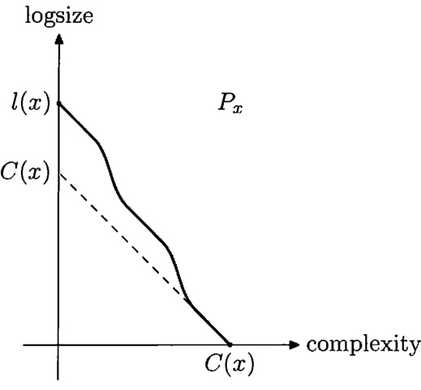
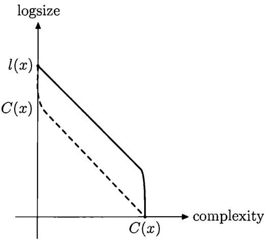
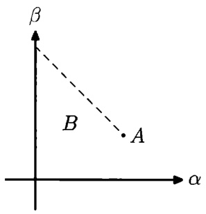

CHAPTER 14  

# Algorithmic statistics  

14.1. The framework and randomness deficiency  

Generally speaking, mathematical statistics deals with the following problem: there are some experimental data, and we look for a reasonable theory that explains these data (is consistent with tliese data). It turns out that the notion of complexity is helpful in understanding this problem. This is a topic of algorithmic statistics.  

Consider the following (simplified) example. A “black box", switched on,has produced a sequence of bits, say, of length  $10^{6}$  .(This sequelice could alsobe  $2^{1.000,000}-1.)$  internal structure of the black box could we get by analyzing this sequence? Or, at least, wliat conjectures about this internal structure look compatible with these data?  

Classical statistics is not well suited to tli is situation.If we had information from several independent copies of our device,or if we could switch on the device many times (and have good reason to believe that the results are independent),or if we had some probabilistic distribution that depends on a parameter and needed tochoosethemostsuitablevalueofthisparaneter—inallthesecasesthestatistic would know what to do.Butif our experiment cannot be repeated(whichisnot uncommon in practice, by the way)and we have no a priori inforinatioi1 about the family of possible distributions,statistics does not tell uswhat to do.Indeed,we haveasetofall  $2^{1,000,000}$  possible outcomes,and no structure on this set,so what can we say about one specific outcome?  

Common sense nevertheless supports some conclusions even in this case.For example, if our device produced  $10^{\mathfrak{G}}$  zeros, then many people would think that the device is indeed very simple and can produce only zeros. Similarly, if the sequence was  $010101\cdot\cdot\cdot$  (alternating zeros and ones),people would probably believe that the black box is a simple mechanism of a fip-fop type.And if the sequence had no visible regularities, people would probably think that the device is some kind of random bit generator.So the conclusions could be quite different,and it would be interesting togive somemore formal supportfor our common sense reasoning  

In the first example (a zero string) the “explanation" (hypothesis) is a singleton: we think that perhaps the device can produce only this string.In the second example (and in all similar situations when the dlevice produces a binary string  $_x$  Oof a very small complexity) the same explanation looks reasonable: we believe that the device is made just for producing this specific string  $\pmb{x}$  .Sothesetofpossibilities isasingleton  $\{x\}$  .On the other hand, in the third example (a random-looking sequence) the “explanation set" is the set of all strings.  

There are some intermediate examples.Imagine that our device produced a sequence of length  $10^{6}$  where the first 500,0oo bits are zeros and the second half is a random-looking sequence of length 500,0o0 without any visible regularities. Then we may guess that the device first produces 500, 000 zeros and then switches to another mode and produces 500,000 random bits. Here the explanation set has  $2^{500,000}$  500,000zeros.  

The general framework that covers all our examples, can be explained as follows: given a string  $\boldsymbol{\mathscr{x}}$  ，we suggest somefinite set  $A$  that contains  $_x$  and can be considered as a reasonable explanation for  $\boldsymbol{\mathscr{x}}$  .What do we mean by“reasonable"?Here are two natural requirements:  

·the set  $A$   should be simple (its Kolmogorov complexity  $C(A)$  shouldbe small); ·the string  $\textbf{\em x}$  should be a “typical" element of  $A$  

More specifically,Kolmogorov complexity  $C(A)$  ofafiniteset  $A$  isthecomplex- ity of the list of its elements (written in some fixed order, e.g., sorted in alphabetic order, and encoded by a binary string). It does not depend on the specific ordering (lexicographical or any other computable total ordering) and on the encoding (up toaconstant)  

The notion of a “typical representative of a set" can also be made more precise using Kolmogorov complexity.Recall that if a set  $A$  consists of  $N$  elements,then the conditional complexity  $C(x\,|\,A)$  of every  $\boldsymbol{\mathscr{x}}$  in  $A$  doesnotexceed  $\log N+O(1)$  (each element can be described by its ordinal number in  $A$  —assumingthat  $A$  is known). For most  $_x$  in  $A$  the complexity  $C(x\,|\,A)$  is close to  $\log N$  , since only very few elements have smaller complexity. Informally speaking, an element  $\textbf{\em x}$  is typical in  $A$  if  $d(x\,|\,A)$   is negligible.  

Letus reformulate thisin the followingway.Consider a finite set  $A$  ,anelement  ${\mathfrak{x}}\in A$  ,and the difference  

$$
d(x\,|\,A)=\log|A|-C(x\,|\,A).
$$  

As we have seen, this difference is non-negative (up to  $O(1),$  0.We call it the ran- dom ness deficiency of  $\boldsymbol{\mathscr{x}}$  as an element of  $A$  .Note that we do not use this formula to define  $d(x|A)$  if  $_x$  is not in  $A$  ; in this case  $d(x|A)$  is undefined. (It is also natural to let  $d(x\,|\,A)$  be  $+\infty$  when  $x\notin A$  , since in this case the explanation  $A$  is completely unsuitablefor  $\boldsymbol{\mathscr{x}}$  

An element  $\boldsymbol{\mathscr{x}}$  is typical in  $A$  if  $d(x|A)$  is negligible  

345|Prove that for a given  $A$  the probability of the event “a randomly chosen element  $x\in A$  has deficiency greater than  $k"$  does not exceed  $2^{-k}$  

(Here probability means just the fraction of elements with given property in  $A$  In fact, to make this statement true, we need to replace  $\log\left|A\right|$  by  $\lfloor\log A\rfloor$  ;since complexity is defineduptoa constantanyway,we are notthatpedantic.  

Let us note also that the function  $d$  (with two arguments  $_x$  and  $A$  )islower semicomputable (enumerable from below):We can effectively provide more and more precise lower bounds for it, but we cannot say when its value was achieved. (Indeed, function  $C$  is upper semicomputable.)  

346 Assume that a function  $\delta(x\,|\,A)$  is given, where  $\pmb{x}$  is a string and  $A$  is a set containing that string and  $\delta$  has the following properties: (a)  $\delta$  is lower semicomputable;(b) for every finite set  $A$   and for every natural number  $k$  the fraction of strings in  $A$  with  $\delta(x|A)>k$  is less than  $2^{-k}$  . Then  $\delta(x\,|\,A)\leqslant d(x\,|\,A)+$   $O(1)$  

This statement is a direct corollary of a similar statement for conditional Kol- mogorov complexity (see Theorem 19 on p. 36). Its meaning is the following. There are different opinions about which elements of a given set are typical and wlhich are not. That is, there exist different methods to measure non-typicality. Assume that we normalize each method so that,after normalization,in each set the fraction of  $k\cdot$  -non-typicalelement islessthan  $2^{-k}$  .Assume also that we can reveal non- typical it y of a given string in a given set provided we have enough time for that (that time can be quite long and not bounded by any total computable function). Then there is the best such method in the sense that the deficiency it reveals is not less than the deficiency revealed by any other method (up to an additive constant).  

Randomness deficiency in a finite set is similar to randomness deficiency of an infinite sequence with respect to 'a probability measure (see Section 3.5). More specifically, it is similar to the maximal probability bounded randomness test. One can also define an analogue of an expectationally bounded randomness test.  

347|Let the prefir randomness deficiency of a string  $\pmb{x}$  in a finite set  $A$  be definedas  $d_{P}(x\,|\,A)=\log_{2}|A|-K(x\,|\,A)$  .Show that  $d_{P}(x|A)$  isamaximallower  $\delta$   $\boldsymbol{\mathscr{x}}$   $A$   $\begin{array}{r}{(1/|A|)\sum_{x\in A}2^{\delta(x\,|\,A)}}\end{array}$  forallfinitesets  $A$  

(Hint: Recall that prefix complexity coincides with the negative logarithm of the a priori probability.)  

Thus a finite set  $A$  is considered a good explanation for  $\boldsymbol{\mathscr{x}}$  if it is simple and the randomness deficiency  $d(x|A)$  of  $\scriptstyle{\mathcal{X}}$  in  $A$  is small. Those strings having such an explanation are called stochastic.Are there non-stochastic strings? This question willbeanswered in thenextsection.  

Noticethatwe consider only statistical hypotheses that areuniform distribu- tions over finite sets.In a more general framework one can consider also arbitrary probability distributions over strings(say,withfinite supports and rationalvalues to avoid technical problems).For such distributions the randomness deficiency of a string  $\pmb{x}$  with respect to a distribution  $P$  is defined as  $-\log_{2}P(x)-C(x|P)$  (if  $P(x)\,=\,0$  ,then the deficiency is infinite:for such strings  $\pmb{x}$  the hypothesis  $P$  is completely unsatisfactory).  

For uniform distributions (all elements of a finite set  $A$  haveprobability  $1/|A|)$  the generalized definition of randomness deficiency coincides with the previous one. Notice that the general case is not very different from the case of uniform distribu- tions:  

348|Assume that  $\boldsymbol{\mathscr{x}}$  is a string of length  $\mathscr{n}$   and  $P$   is a probability distribution

 (not necessarily uniform) of complexity  $k$  such that the randomness deficiency of

  $\pmb{x}$  with respect to  $P$  is at most  $l$  .Then there is a set  $A$  of complexity at most  $k+$   $O(\log(l_{.}+n))$  containing  $_x$  such that the randomness deficiency of  $\pmb{x}$  in  $A$  is at most  $l+O(\log(l+n))$  (Hint: Let  $A=\{y\mid P(y)\geqslant p\}$  where  $\mathcal{P}$  is the probability of  $\boldsymbol{\mathscr{x}}$  with respect to  $P$  rounded to the nearest integer power of 2.)  

This problem explains wliy we are considering uniform distributions only. Let us stress that in the definition of Kolmogorov complexity of a finite set of strings we consider the setas afinite object represented by the listof allits elementsin the lexicographical order.An alternative approach is tomeasure the complexity of a set as the minimal length of a program enumerating the set.With this approach the definition of stochastic stringsbecomes trivial:allstringsare stochastic.Indeed for every string  $_x$   of coniplexity  $k$  one can consider the set  $S_{k}$   of all strings of complexityat most  $k$  as an explaniation for  $_x$  .It has  $O(2^{k})$  ele in ents and hence the randomness deficiency of  $_x$  in  $S_{k}$  is negligible.On tlie other hand,we can enumerate this set given  $k$  and hence  $S_{k}$  can be enumerated by a program of length  $\log k+O(1)$  .However, intuitively  $S_{k}$  is not agood“explanation"for  $_x$  

In the case of general probability distributions (not only uniforrm)，we also consider a distribution as a finite object represented by thelist of all pairs  $(x,P(x))$  for  $_x$  inthe support of  $P$   and arranged le xico graphically. This is why we need the support to be finite and the values to be rational.Alternatively,wecouldconsider infiniite supports anduniformly computable values—in that case the explanation would be a program computing the function  $x\mapsto P(x)$  .It is essential that we do notallowlower semi computable semi measures represented by programs that lower sermicompute them.If we did, theln any string would obtain a perfect explanation-- the maximal lower semicomputable semimeasure.  

Historical remark. The first definition of randomness deficiency was given by Kolmogorov,who used the formula  $\log\left|A\right|-C(x)$  .The formula  $\log|A|-C(x|A)$  used throughout the book is due to[6o](notethatin6o」the prefix complexity is used instead of the plain one,the difference is  $O(\log(\mathrm{defects})))$  .Kolmogorov's randomness deficiency  $\log\left|A\right|-C(x)$  is less than or equal to the randomness defi- ciency  $\log\left|A\right|-C(x\left|A\right)$  , and they differ by at most  $C(A)$  .The two deficiencies may differ that much, e.g., for  $A\,=\,\{x\}$  .Perhaps Kolmogorov was interested only in sets  $A$  with negligible complexity, in which case these two deficiencies are close. For sets with large complexity the expression  $\log\left|A\right|-C(x)$  may have large negative value and hardly makes any sense.  

# 14.2.Stochastic objects  

A string  $_x$  is called  $(\alpha,\beta)$  -stochastic if there is a finite set  $A$  containing  $_x$  with  $C(A)\leqslant\alpha$  and  $d(x|A)\leqslant\beta$  

A natural question arises. Consider all strings  $_x$   of length  $\mathscr{n}$  and consider  $\alpha$  and  $\beta$  of order  $O(\log n)$  or  $o(n)$  , making the complexity of explanations for  $_x$  much smaller than the length of  $_x$  . For such  $\alpha,\beta$  , are there non-stochastic strings (i.e., "non-explainable" objects)? An affirmative answer to this question is provided by the following theorem.  

THEOREM 248. Assume that  $2\alpha+\beta<n-O(\log n)$  . Then there is a string of length n that is not  $(\alpha,\beta)$  -stochastic.  

(The accurate statement is that there is a c such that for all large enough  $\mathscr{n}$  andall  $\alpha,\beta$  With  $2\alpha+\beta\,<\,n-c\log n$  there is a string of length  $\mathscr{n}$  thatisnot  $(\alpha,\beta)$  -stochastic.)  

PRooF. Consider the list of all finite sets of complexity at most  $\alpha$  .The Kol- mogorovcomplexityofthislistisatmost  $\alpha+O(\log\alpha)=\alpha+O(\log n)$  (seep.25)  

Ignoring additive error terms of order  $O(\log n)$  (here and also further) we will as- sume that the complexity of the list is less than  $_{\alpha}$  

Remove from the list all sets of cardinality more than  $2^{\alpha+\beta}$  .The Kolmogorov complexity of the resulting list is also less than  $_{\alpha}$  .By construction it has at most  $2^{\alpha}$  sets and each of them has at most  $2^{\alpha+\beta}$  elements. Thus the union of all sets in  $2^{2\alpha+\beta}<2^{n}$   $_n$  does not appear in any set from the list. Let  $t$  be the le xico graphically first such string. Its complexity is at most  $_{\alpha}$  ,as it can be found given  $_n$  and the list.  

Let us show that this string (denoted by  $t$  in the sequel) is not  $(\alpha,\beta)$  -stochastic. Indeed, assume that it is contained in some set  $A$   of complexity at most  $_{\alpha}$  .The cardinality of  $A$  exceeds  $2^{\alpha+\beta}$   since all smaller sets were taken into account by construction.Therefore  

$$
d(t\,|\,A)=\log\#A-C(t\,|\,A)>(\alpha+\beta)-C(t)\geqslant(\alpha+\beta)-\alpha\geqslant\beta
$$  

(one should also add a reserve of size  $c\log n$   to compensate for logarithmic terms that we ignore). 口  

In the other direction we have the following trivial bound:  

THEOREM 249. If  $\alpha+\beta>n+O(\log n)$  , all the strings of length  $_n$  are  $(\alpha,\beta)$  stochastic.  

PROoF. Indeed, we can split all  $_{n}$  -bit strings into  $2^{\alpha}$  sets of size  $2^{\beta}$  

As we will see later, the reality is closer to this bound than to the bound of the previous theorem.See Problem 365 on p.449.  

It is natural to ask how often non-stochastic objects appear. For example, what is the fraction of non-stochastic objects among all  $_n$  -bit strings?It is immediately clear that this fraction does not exceed  $2^{-\beta}$  :Let  $A$  be the set of all  $_{n}$  -bit strings, and note that strings with deficiency  $\beta$   or more form only a  $2^{-\beta}$  -fraction of  $A$  

On the other hand,if  $2\alpha+\beta\ll n$  ,we can extend the reasoningused toprove Theorem 248. Namely, for some  $h$  we consider all sets of complexity at most  $_{\alpha}$  and cardinality at most  $2^{\alpha+\beta+h}$  . Then we take the first  $2^{h}$   elements not covered by these sets; it is possible if  $2\alpha+\beta+h<n$  .The complexity of those elements is bounded by  $\alpha\!+\!h$  , so its deficiency in any set of size greater than  $2^{\alpha+\beta+h}$  exceeds  $\beta$  These arguments (with  $O(\log n)$  -corrections needed)prove thefollowing statement:  

THEOREM 250. If  $2\alpha+\beta<n-O(\log n)$  ,then thefraction of  $_n$  -bit stringsthat arenot  $(\alpha,\beta)$  -stochasticisatleast  $2^{-2\alpha-\beta-O(\log n)}$  

Instead of a fraction of non-stochastic strings (i.e., the probability of obtaining suchastringbytossingafaircoin),onecanaskabouttheirtotalaprioriprob ability (i.e.,the probability of obtaining such a string by a universal randomized algorithm).More formally,let  $\mathbf{m}(\mathbf{x})$  be the discrete apriori probability of  $\pmb{x}$  as de- fined in Chapter 4:  ${\bf m}(x)=2^{-K(x)+O(1)}$  . Then we consider the sum of  $\mathbf{m}(x)$  over all  $\pmb{x}$   of length  $_n$  that are not  $(\alpha,\beta)$  -stochastic.The following theorem estimates this sum:  

THEOREM 251. If  $2\alpha+\beta<n-O(\log n)$  and  $\alpha<\beta-O(\log n)$  ,then this sum equals  $2^{-\alpha+O(\log n)}$  

ProoF. We need to prove both lower and upper bounds for this sum. The lower bound easily follows from the proof of Theorem 248. Indeed, a non-stochastic string constructed in that proof had complexity  $_{\alpha}$  and therefore its a priori probability is  $2^{-\alpha}$  (as usual,we ignore  $O(\log n)$  corrections needed, now in the exponent).  

To get an upper bound, consider the sum of  $\mathbf{m}(x)$   over all strings of length  $_n$  That sum is areal number  $\omega\leqslant1$  .Let  $\bar{\omega}$  be thenumber represented by first  $_{\alpha}$  bits in the binary representation of  $\omega$  

Consider the following measure  $P$   on strings of length  $_{\mathcal{n}}$   associated with  $\bar{\omega}$  Startlower semicomputation of  $m(x)$   for all strings  $\pmb{x}$   of length  $_n$   and continue until the sum of all obtained lower bounds for  $m(x)$  reaches  $\bar{\omega}$  .Let  $P(x)$  bethe lower bound for  $\mathbf{m}(x)$  we get at that time. If  $\bar{\omega}$   and  $_n$   are given, we can compute  $P(x)$  for all  $\pmb{x}$  of length  $_{\mathcal{n}}$  .Therefore the complexity of  $P$  is at most  $_{\alpha}$  .The sum of differences between  $\mathbf{m}(x)$   and  $P(x)$   over all strings of length  $_{\mathcal{n}}$  is bounded by  $2^{-\alpha}$  

Aswe sawinProblem 348,one canuse arbitrary finite probabilistic distribution in the definition of stochasticity(with an  $O(\log n)$  -change in the parameters), not only the uniform ones.It remains tobe shown that the total a priori probability of all strings  $\pmb{x}$  thathave  $d(x|P)>\beta$  is bounded by  $2^{-\alpha}$  . Indeed, for those strings wehave  

$$
\log P(x)-C(x\,|\,P)>\beta.
$$  

The complexity of  $P$  is bounded by  $_{\alpha}$   and therefore  $C(x)$  exceeds  $C(x\,|\,P)$  at most by  $_{\alpha}$  . Thus we have  

$$
-\log P(x)-C(x)>\beta-\alpha.
$$  

Weignore  $O(\log n)$  -terms, so we can replace plain complexity by prefix complexity  

$$
-\log P(x)-K(x)>\beta-\alpha.
$$  

Prefix complexity can be defined in terms of a priori probability, so we get  

$$
\log({\bf m}(x)/P(x))>\beta-\alpha
$$  

for all  $\pmb{x}$  that have deficiency exceeding  $\beta$  with respect to  $P$  .By assumption  $\alpha\,<\,\beta$  with some safety margin(enough to compensate all the simplifications we made),so we may assume that for all those  $\pmb{x}$  we have  $P(x)\,<\,{\bf m}(x)/2$  ，or

  $(\mathbf{m}(x)-P(x))>\mathbf{m}(x)/2$  .Recall that the sum of  $\mathbf{m}(x)-P(x)$  over all  $\pmb{x}$  of length

  $_n$  does not exceed  $2^{-\alpha}$   by construction of  $\bar{\omega}$  . Hence the sum of  $\mathbf{m}(x)$  over all strings of deficiency (with respect to  $P$  ) exceeding  $\beta$  is at most  $2^{-\alpha+1}$  , and this is what we wanted to prove. 口  

The notion of a stochastic object canbe considered as a finite analog of the notion of an ML-random sequence with respectto a computable measure.The following problem expresses this similarity in more formal terms.  

349Assume that a sequence  $\omega$  is ML-random with respect to some com- putable measure. Prove that for all  $_n$  the  $_{\mathcal{n}}$  -bit prefix of the sequence  $\omega$  isan  $(O(\log n),O(\log n))$  -stochastic string.(Hint:Use Problem 348.）Conclude that there is an infinite sequence that is not ML-random with respect to any computable measure. (Hint: Adding a short prefix does not affect non-stochasticity.)  

Historical remarks.The first definition of  $(\alpha,\beta)$  stochastic it y was given by Kol- mogorov (the authors learned it from his talk given in 1981 [83], but most probably it was formulated earlier in 1970s; the definition appeared in print in [174]). Kol- mogorov and Shen([174])used theformula  $\log|A|\!-\!C(x)$  for randomness deficiency.  

The existence of non-stochastic objects (Theorem 248) was noted in [174]. The first estimates of the a priori measure for the set of non-stochastic objects appeared in21o].The first tight bound  $2^{-\alpha}$  for the a priori measure of  $(\alpha,\beta)$  -non-stochastic objects is due to Muchnik [139, Theorem 10.10], who established it for all   $(\alpha,\beta)$  with  $3\alpha+\beta\:\leqslant\:n$  . Both papers [210] and [139] used the Kolmogorov formula  $\log\left|A\right|-C(x)$  for randomness deficiency.  

Theorem 251 appears to be new. Note that this theorem and Muchnik's re sult use incomparable assumptions on theparameters  $\alpha,\beta$  .Besides,Theorem 251 estimatestheapriorimeasureofalargersetthanMuchnik'sresult.  

# 14.3.Two-part descriptions  

There is another natural way to estimate the quality of statistical hypotheses. Let us start with the following remark. If a string  $\textbf{\em x}$  belongs to some finite set  $A$  wecanspecify  $_x$  intwosteps:  

·first,we specify  $A$  · then we specify the ordinal number of  $\boldsymbol{\mathscr{x}}$  in  $A$  (in some natural ordering, say, the lexicographic one).  

Therefore, we get  $C(x)\leqslant C(A)+\log\#A$  for every element  $_x$   of an arbitrary finite set  $A$  (again with logarithmic precision).  

There can be many two-part descriptions of the same string  $\textbf{\em x}$  (with different  $A$  sets ).Which of them are better? Naturally, we would like to make both parts smaller (by finding a simpler and smaller set  $A$  ):if wecandecrease one of the parameters while not increasing the other one,this is an improvement.But which  $A$   $A?$  is better: simple or small complex We can compare the lengths of theresulting two-part descriptions and choose a set  $A$  which gives the shorter one.This approach is often called the Minimum Description Length principle (MDL).  

The following simple observation shows that we can move the information from the first part of the description into its second part (leaving the total length almost unchanged).In this way we make the set smaller (the price we pay is that its complexity increases).  

THEOREM 252. Let  be a string, and let  $A$  be a finite set that contains  $_x$  .Let i be a non-negative integer such that  $i\leqslant\log\#A$  .Then there erists a finite set  $A^{\prime}$  containing  $\boldsymbol{\mathscr{x}}$  suchthat  $\#A^{\prime}\leqslant\#A/2^{i}$  and  $C(A^{\prime})\leqslant C(A)\!+\!i\!+\!O(\log\operatorname*{min}\{i,C(A)\})$  

PRooF.List all the elements of  $A$  in some (say, lexicographic) order. Then split the list into  $2^{i}$  parts (first  $\#A/2^{i}$  elements,next  $\#A/2^{i}$  elements etc.;we omit evident precautions for the case when  $\#A$  is not a multiple of  $2^{i}$  ).Then let  $A^{\prime}$  be the partwith  $\textbf{\em x}$  .To specify  $A^{\prime}$  ，itisenoughtospecify  $A$  and the part number, which requires at most  $i$  bits. (The logarithmic term at the end is needed to form a pair of these two descriptions; it is enough to specify the length of the shorter description.) 口  

We will use the following convenient (though non-standard) terminology: a set  $A$  is called a  $(k*l)$  -description(of every its element)if  $C(A)\leqslant k$  and  $\log\#A\leqslant l$  Theorem 252 can now be formulated as follows: if some  $\textbf{\em x}$  has a  $(k*l)$  -description, thenforevery  $i\in[0,l]$  it also has   $((k+i+O(\log\operatorname*{min}(i,k)))*(l-i))$  -description.  

For a given string  $_x$  let us consider the set  $P_{x}$   of all pairs  $\langle k,l\rangle$  such that  $\boldsymbol{\mathscr{x}}$  hasa  $(k*l)$  -description,i.e.,there exists a set  $A$  containing  $_x$  with  $C(A)\leqslant k$  and  $\log\#A\leqslant l$  .Obviously, this set is closed upwards and contains with each point all points on the right (with the bigger  $k$  )and on the top (with bigger l).The last theorem says that we can also move down-right adding  $\langle i,-i\rangle$  (withlogarithmic precision).  

  
FIGURE 52. The set  $P_{x}$  

We will see that movement in the opposite direction is not always possible. So,having two-part descriptions with the same total length,we should prefer the one with the bigger set (since it always can be converted into others,but not vice versa).  

Let us look again at the set  $P_{x}$  for some  $_{\mathscr{n}}$  -bit string  $\pmb{x}$  ; see Figure 52.It contains the point  $\langle0,n\rangle$  that corresponds to  $A\,=\,\mathbb{B}^{n}$  ，the set of all  $_{\mathscr{n}}$  -bitstrings(with logarithmic precision).On the other side the set  $P_{x}$   contains the point  $\langle C(x),0\rangle$  that corresponds to the singleton  $A\,=\,\{x\}$  .Theboundaryof  $P_{x}$  issomecurve connecting these two points,and this curve never gets into the triangle  $k\!+\!s\leqslant C(x)$  and always goes down (when moving from left to right) with slope at least  $^{-1}$  0r more,as Theorem 252 says.  

This picture raises a natural question: Which boundary curves are possible and which are not? Is it possible,for example, that the boundary goes along the dotted line on Figure 52?The answer is positive:take a random string of the desired complexity and add trailing zeros to achieve the desired length.Then the point  $\langle0,C(x)\rangle$  (theleft end of the dotted line)corresponds to the set  $A$  of allstringsof the same length having the same trailing zeros.Weknow that the boundary curve cannot go down slower thanwith slope  $^{-1}$  and that it should end at  $\langle C(x),0\rangle$  therefore it follows the dotted line (with logarithmic precision).  

There is a more difficult question:Is it possible that the boundary curve starts from  $\langle0,n\rangle$  and goes with the slope  $^{-1}$  to thevery end and then goes down rapidly to  $\langle C(x),0\rangle?$  (See Figure 53.) Such a string  $\pmb{x}$  , informally speaking, would have essentially only two types of statistical explanations:a set of all strings of length  $_n

$  (and its parts obtained by Theorem 252)and the exact description,the singleton

  $\{x\}$  

It turns out that not only are these two opposite cases possible, but also all intermediate curves are possible (assuming they have a bounded slope and are simple enough), if we allow a logarithmic deviation from the prescribed curve.  

  
F1GURE 53. Two opposite possibilities for a boundary curve  

THEOREM 253.Let  $k\leqslant n$  be two integers,and let  $t_{0}>t_{1}>\cdot\cdot\cdot>t_{k}$  be a strictly decreasing sequence of integers such that  $t_{0}\leqslant n$  and  $t_{k}=0$  ; let  $_m$  be the complecity of this sequence.Then there erists a string  $\scriptstyle{\mathcal{X}}$  of complerity  $k\!+\!O(\log n)\!+\!O(m)$  and length  $_{n+O(\log n)+O(m)}$  for which the boundary curve of  $P_{x}$  coincides with the line  $(0,t_{0})_{-\left(1,t_{1}\right)\cdots\cdots-\left(k,t_{k}\right)}$  with  $O(\log n)+O(m)$  -precision:the distance between the set  $P_{x}$  and the set  $T=\{\langle i,j\rangle\mid(i<k)\Rightarrow(j>t_{i})\}$  is bounded by  $O(\log n)+O(m)$  

(We say that the distance between two sets  $P$   and  $Q$  is at most  $\varepsilon$  if  $P$  is contained in  $\varepsilon$  -neighborhood of  $Q$   and vice versa.)  

PRooF. For every  $i$  in the range  $0\cdot\cdot\cdot k$  we list all the sets of complexity at most  $i$  and size at most  $2^{t_{i}}$  . For a given  $i$  the union of all these sets is denoted by  $S_{i}$  .It contains at most  $2^{i+t_{i}}$  elements.(Here and later we omit constant factors and factors polynomial in  $\mathscr{n}$  when estimating cardinalities, since they correspond to  $O(\log n)$   additive terms for lengths and complexities.） Since the sequence  $t_{i}$  strictly decreases(this corresponds to slope  $^{-1}$  in the picture),the sums  $i+t_{i}$  donot increase,therefore each  $S_{i}$  has at most  $2^{t_{0}}=2^{n}$  elements.Therefore,the union of all  $S_{i}$  also has at most  $2^{n}$  elements(up to a polynomial factor,see above). Therefore, we can find a string of length  $\mathscr{n}$  (actually  $n+O(\log n))$  that does not belong to any  $S_{i}$  . Let  $\scriptstyle{\mathcal{X}}$  be a first such string in some order (e.g., in lexicographic order).  

By construction, the set  $P_{x}$   lies above the curve determined by  $t_{i}$  . So we need to estimate the complexity of  $\textbf{\em x}$  and prove that  $P_{x}$  follows the curve (i.e., that  $T$  is contained in the neighborhood of  $P_{x}$  

Let us start with the upper bound for the complexity of  $\textbf{\em x}$  . The list of all objects of complexity at most  $k$   plus the full table of their complexities have complexity  $k+O(\log k)$  , since it is enough to know  $k$   and the number of terminating programs of length at most  $k$  . Except for this list, we need to know the sequence  $t_{0},\ldots,t_{k}$  whose complexity is  $_m$  

For the lower bound,the complexity of  $\pmb{x}$  cannot be less than  $k$  sinceallthe singletons of this complexity were excluded (via  $T_{k}$  一  

It remains to be shown that for every  $i\leqslant k$  we canput  $\scriptstyle{\mathcal{X}}$  into a set  $A$  ofcom- plexity  $_i$  (or slightly bigger) and size  $2^{t_{i}}$   (or slightly bigger). For this we enumerate a sequence ofsetsof correctsize and showthatone ofthe setswillhave therequired properties.If this sequence of sets is notvery long,the complexity of its elements isbounded.Here are the details  

We startby taking the first  $2^{t_{i}}$   strings of length  $_n$  as our first set  $A$  . Then we start enumerating all finite sets of complexity at most  $j$  and of size at most  $2^{t_{j}}$  for all  $j=0,\ldots,k.$  .and get an enumeration of all  $S_{j}$  .Recall that  $_x$  is the first element that does not belong to all such  $S_{j}$  .So,when a new set of complexity atmost  $j$  and of size at most  $2^{t_{j}}$  appears, all its elements are included in  $S_{j}$  and removed from  $A$  Until all elements of  $A$  are deleted,we have nothing to worry about, since  $A$  covers the minimal remaining element.If (and when) all elements of  $A$  are deleted,we replace  $A$  by a new set that consists of first  $2^{t_{i}}$  undeleted (yet) strings of length  $_n$  Then wewait again until all the elements of this new  $A$  are deleted.If (and when) thishappens,wetake  $2^{t_{i}}$  firstundeletedelementsasnew  $A$  ,etc.  

The construction guarantees the correct size of the sets and that one of them covers  $\pmb{x}$  (theminimalnon-deletedelement).Itremains toestimatethe complexity of the sets we construct in this way.  

First, to start the process that generates these sets,we need to know the length  $\mathscr{n}$  (actually something logarithmically close to  $_n$  )and the sequence  $t_{0},\ldots,t_{k}$  .In total we need  $m+O(\log n)$  bits.To specify each version of  $A$  , we need to add its version number.Sowe need to show that the number of different  $A$  'sthatappear in the process is at most  $2^{i}$   or slightly bigger.  

Anewset  $A$  iscreatedwhenalltheelementsoftheold  $A$  aredeleted.Letus distinguish two types of changes of  $A$  :thefirstchanges afteranewsetof complexity  $j$  appears with  $j\leqslant i$  and the remaining changes.The changes of the first type can happen only  $O(2^{i})$  times since there are at most  $O(2^{i})$  sets of complexity at most  $_i$  . Thus it suffices to bound the number of changes of the second type. For those changes all theelements of  $A$  are removed due to elements of  $S_{j}$  with  $j>i$  .We have at most  $2^{j+t_{j}}$  elements in  $S_{j}$  . Since  $t_{j}+j\leqslant t_{i}+i$  , the total number of deleted  $2^{t_{i}+i}$   $A$   $2^{t_{i}}$  getabout $2^{i}$ changes of $A$ 口  

351|Prove that we cannot strengthen Theorem 253 by requiring the distance between the sets  $P_{x}$   and  $T$  be  $O(\log n)$  (and not  $O(\log n)+O(m))$  (Hint: The number of strings of length  $n+O(\log n)$  is much smaller than the number of sets  $T$  that satisfythe conditions of thetheorem.) 352|Prove that there is no algorithm that, given any  $\pmb{x}$  , will find the boundary of the set  $P_{x}$  with accuracy  $O(\log l(x))$  Stronger results on non-computability of the boundary of  $P_{x}$   can be found in the paper [203].  

Theorem 253 shows that the value of the complexity  $C(x)$  does not completely describe the properties of  $\pmb{x}$  ; different strings  $\pmb{x}$  of the same complexity can have dif- ferent boundary curves of  $P_{x}$  . This curve can be considered an infinite-dimensional characterization of  $\pmb{x}$  

To understand this characteristic better, the following notation is useful. The classification of strings according to their complexity can be represented by an increasing sequence of sets  $S_{0}\;\subset\;S_{1}\;\subset\;S_{2}\cdot\cdot\cdot$  ，where  $S_{i}$   is the set of all strings having complexity at most  $_i$  ：The sets  $S_{i}$  are enumerable (uniformly in  $_i$  );thesize of  $S_{i}$  is  $O(2^{i})$  

Now, instead of this linear classification, we have a two-dimensional family  $S_{i,j}$  where  $S_{i,j}$  is the union of all finite sets  $A$  with  $C(A)\leqslant i$   and  $\log\#A\leqslant j$  (thesesets werecalledthe  $(i\!*\!j)$  -descriptions of their elements). We get a two-dimensional table formedby  $S_{i,j}$  ; note that it is monotone along both coordinates, i.e.,  $S_{i,j}$  increases when  $i$  or  $j$  increases. Theorem 252 says that this table is (almost) increasing along the diagonal:  

$$
S_{i,j}\subset S_{i+k,j-k}.
$$  

(As usual,we ignore logarithmic corrections: one should write  

$$
S_{i,j}\subset S_{i+k+O(\log k),j-k}
$$  

instead.)  

To understand better the meaning of this two-dimensional stratification, let us look at the equivalent definitions of  $S_{i,j}$  .As usual, we ignore the logarithmic terms  $S$   $S^{\prime}$   $S_{i,j}\subset S_{i+O(\log l),j+O(\log l)}^{\prime}$   $l=i+j$  

Byan enumeratedlist in the following theorem we mean an algorithm that (from time to time) emits binary strings (perhaps, with repetitions); the length of such a list is defined as the number of strings emitted (each string is counted as many times as it was emitted).Condition (c) assumes that the algorithm can produce strings in groups of arbitrary size (different groups produced by the same algorithm may have different sizes).  

THEoREM254.The following properties of a string  $_x$  are equivalent in this  

sense(each of them implies the others with logarithmic change in the parameters): (a)  $x$  belongs to  $S_{i,j}$  (has an  $(i*j)$  -description); (b) there ecists a simple (  $\c=$  ofcomplerity  $O(\log(i+j)))$  enumerated list of size at most  $2^{i+j}$  where  $x$  appears (for the first time) at least  $2^{j}$  steps before the end of the list; (c)thereeristsa simple(  $\acute{=}$  ofcomplerity  $O(\log(i+j)))$  enumeratedlistofsize at most  $2^{i+j}$  that includes  $\pmb{x}$  where strings are produced in at most  $2^{i}$  groups; (d) in every simple (  $\c=$  ofcomplexity  $O(\log(i\!+\!j)))$  enumerated list that includes allthestringsofcomplerityatmost  $i+j$  ,thestring  $\textbf{\em x}$  appears(for the first time) atleast  $2^{j}$  steps before the end of the list.  

PRooF. To show that (a) implies (c), assume that (a) is true. Enumerate all setsof complexity at most  $i$  and of size at most  $2^{j}$  .When a new set appears, it forms a new group added to the list.In this way we get at most  $2^{i}$  groups of size at most  $2^{j}$  , so the total length of the enumerated list is at most  $2^{i+j}$  . The complexity of the enumeration algorithm is logarithmic since only  $i$  and  $j$  should be specified.  

To get (b) from (a),we should modify the construction slightly and add  $2^{j}$  arbitrary elements after each portion. The total number of elements increases then by  $2^{i+j}$  and is still acceptable.  

On the other hand, (b) easily implies (a): we need to split the list in groups of size  $2^{j}$  .Then we get at most  $2^{i}$   groups, and only  $2^{j}$   last elements are left outside the groups. Therefore,  $\pmb{x}$  is covered by some group. Each group is determined by its ordinal number and therefore has complexity  $i$  (plus logarithmic term that covers the complexity of the list).  

To get (a) from (c), we split each group into pieces of size  $2^{j}$  (exceptforone last piece that can be smaller). The number of full pieces is at most  $2^{i}$  ，sincethe length of the list is at most  $2^{i+j}$  . The same is true for the number of non-full pieces.  

So every piece can be specified by its ordinal number, so its complexity does not exceed  $_i$  

So the properties (a)-(c) are equivalent (modulo logarithmic change in parame- ters), and it remains to show that they are equivalent to (d). Evidently, (d) implies (b), so it is enough to show that (a) implies (d)  

So let us assume that  $\pmb{x}$  is an element of some finite set  $A$  that has complexity atmost  $_i$  and size at most  $2^{j}$  .All elements of  $A$  have complexity at most  $\;i+j+$   $O(\log(i+j))$  . As usual, we ignore the logarithmic term and hope that the reader canmake the necessary corrections.  

Assume also that an enumerated list is given that includes all the strings of complexity at most  $i+j$  .We want to show that  $\pmb{x}$  will appear in this list not too close to the end and at least  $2^{j}$   strings will follow it. Knowing the set  $A$  ,we may perform the enumeration until all the elements of  $A$  appear in the list.Let  $B$  be the part of the list enumerated at that moment. The set  $B$  is a finite set of complexity at most  $_i$  (since it is determined by  $A$  and the enumerating algorithm,which is assumed tobe simple).Now consider the(le xico graphically)first  $2^{j}$  stringsoutside  $B$  .Each of these strings is determined by  $B$  (of complexity  $_i$  )and ordinal number (at most  $j$  bits),so theyhave complexity atmost  $_{i+j}$  .And all these strings should appear in the enumeration after  $\pmb{x}$  口  

One could say thatwehave introduced an additional classification of strings of complexity at most  $l$  by measuring the distance to the end of the list.In terms of our two-dimensional stratification, we can speak of an increasing sequence of sets  $S_{i,j}$   on the diagonal  $i+j=l$  .(Strictly speaking, the increasing sequence is obtained only after logarithmic corrections.）Random strings of length  $n\leqslant l-O(\log l)$  (i.e., the strings of length  $_n$  and complexity  $_n$  )are at the beginning of this classification, having  $(l*0)$  -descriptions.At the other end we have (few) strings that have only  $(0*l)$  -descriptions.  

353」 Show that all strings at the end of the enumerated list of strings of complexity at most  $_n$  (that are followed only by poly  $(n)$  strings)are almostequal in the sense that the conditional complexity of one of them given the other one is  $O(\log n)$  

One might say that the difference between  $l$  and the logarithm of the number of stringsafter  $\pmb{x}$  in the enumerated list of all strings of complexity at most  $l$  measures how strange  $\boldsymbol{\mathscr{x}}$  is. (The equivalence of (b) and (d) guarantees that this measure does not depend significantly on the choice of enumeration.） Random strings of length atmost  $l-O(\log l)$  are not strange at all, while the strings that are close to the end of the list, have maximal strangeness (close to  $l$  ). But one should keep in mind the following:  

·The strangenessof agiven string  $\textbf{\em x}$  of complexity  $k$  (that is determined by its position in the enumerated list of all strings of complexity at most  $k$  )can decrease significantly if we consider the same  $\pmb{x}$   as an element of thelist of all strings of complexity at most  $l$  for some  $l\,>\,k$  .In fact, each string  $\textbf{\em x}$  determines a function that maps  $l\geqslant C(x)$  to the number ofstringsafter  $\textbf{\em x}$  in the enumeration of stringsof complexity at most  $l$  It is essentially the same curve we considered before (the boundary curve for  $P_{x}$  )but transformed into other coordinates:for every  $l$  we look at the moment when the diagonal line  $i+j=l$   gets inside  $P_{x}$  

· The strangeness of strings  $\pmb{x}$  and  $\mathcal{Y}$  can be very different even if  $C(x\,|\,y)\approx0$  and  $C(y\,|\,x)\approx0$   at the same time. (Indeed, if  $l>C(x)+O(\log C(x))$  then the shortest description for a string  $\pmb{x}$   is random and is not strange even if  $\pmb{x}$  were.) However, if  $\pmb{x}$   and  $\mathcal{Y}$   correspond to each other under a simple com- putable bijection, this is not possible (see the next problem).  

354Assume that  $\pmb{x}$  and  $_y$  correspond to each other under a bijection computed by a program of complexity  $t$  . Prove that if  $\boldsymbol{\mathscr{x}}\in S_{i,j}$  , then  $y\in S_{i+O(t),j}$  

Recall that there is a simple computable bijection that maps a string  $\scriptstyle{\mathcal{X}}$  toa string  $\mathcal{Y}$  if and only if the total complexity of each of those strings conditional to the other one is negligible (see Problem 31 on p. 36).  

By very similar arguments as those used to prove Theorem 254, we can show that  $k_{n}$  (andalso  $\mathscr{m}_{n}$  from Theorem 15 (p.25)) for different  $\mathscr{n}$  are closely related:  

355|Prove that for all  $n^{\prime}<n$  the string  $k_{n^{\prime}}$  (i.e., the binary expansion of the number  $k_{n^{\prime}}$  ) is equivalent to the length  $n^{\prime}$   prefix of the string  $k_{n}$  .(Two strings  $\boldsymbol{\mathscr{x}},\boldsymbol{\mathscr{y}}$  are called equivalent if both conditional complexities  $C(x\,|\,y),C(y\,|\,x)$  are  $O(\log n))$  Show that strings  $\mathscr{m}_{n}$  have a similar property.  

(Hint:(See[203].) For  $k_{n}$  we have to show that given any number  $T$  larger than  $B\left(n-s\right)$  we are able to find all strings of complexity at most  $\mathscr{n}$  exceptfewer than  $2^{s}$   such strings, and the other way around. Given such a  $T$  ，start an enu- meration of strings of complexity at most  $\mathscr{n}$  and output them in portions of size  $2^{s}$   $T$  ．After  steps all the complete portions will appear. Indeed, the number of steps needed to output all complete portions can be computed from the number of complete portions which has at most  $\mathscr{n}-\mathscr{s}$  bits. The number of remaining strings is fewer than  $2^{s}$  . In the opposite direction, given a list of strings of complexity at most  $\mathscr{n}$  exceptfewer than  $2^{s}$  such strings, we again start an enumeration of strings of complexity at most  $\mathscr{n}$   and wait until all the given strings appear in that enumer- ation. Let  $_T$  denote the number of steps when it happens. Then any number  $t>T$  has complexity at least  ${\boldsymbol{\mathscr{n}}}-{\boldsymbol{\mathscr{s}}}$  . Indeed, if  $C(t)<n-s$  , then consider  $2^{s}$  first strings outside the list. Each of them has complexity at most  $\mathscr{n}$  , a contradiction. For  $m_{n}$  the arguments are entirely similar.)  

The next result generalizes the statement of Problem 39 on p. 40: If a string  $\pmb{x}$   $k$  has many descriptionsof size ,it has shorter descriptions.Now we speak about  $(i*j)$  -descriptionsof  $\pmb{x}$  ,i.e.,finite sets containing  $\scriptstyle{\mathcal{X}}$  that have complexity at most  $i$  and cardinality at most  $2^{j}$  

THEOREM 255. Assume that a string  $\scriptstyle{\mathcal{X}}$  has at least  $2^{k}$  sets as  $(i*j)$  -descriptions Then  $\scriptstyle{\mathcal{X}}$  has some  $\left(i*\left(j-k\right)\right)$  -description and even some  $\left(\left(i-k\right)*j\right)$  -description  

In this statement we omit (as usual) the logarithmic error terms (the parameters should be increased by  $O(\log(i+j+k))$  0.The word “even"reminds us about Theorem 252 that allows us to convert  $(i{-}k){*}j$  -descriptionsto  $_{i*(j-k)}$  -descriptions  

PRooF.The first (simpler) statement is an easy consequence of the arguments  $A$  used in the proof of Theorem 254.Let us enumerate all sets ofcomplexityat most  $i$  and size at most  $2^{j}$  and see which strings belong to  $2^{k}$  or more sets (are covered with multiplicity at least  $2^{k}$  ). We have at most  $2^{i+j}/2^{k}$  such elements, i.e.,  $2^{i+j-k}$  , and these elements can be enumerated in at most  $2^{i}$  groups (each new set  $A$  may create one new group). So it remains to recall statement (c) of Theorem 254.  

To get a stronger second statement,we need to decrease the number of groups in this argument to  $2^{i-k}$   (keeping the number of elements approximately at the samelevel).It can be done as follows.Againwe enumeratesetsof complexityat most  $i$  and sizeatmost  $2^{j}$  and look at the strings thatarecovered many times.But now we also consider the strings that are covered with multiplicity  $2^{k-1}$  (halfof the full multiplicity considered before);we call them candidates.Whenanelement withfull multiplicity appears,we output this element together with all candidates that eris tat that moment.  

In this way we may output elements that will never reach the full multiplicity. but this is not a problem since the total number of emitted elements can increase at most twice compared to our count. The advantage is that the number of groups is now much smaller: after all candidates are emitted, we need at least  $2^{k-1}$  newsets to get a new element with full multiplicity(its multiplicity should increase from  $2^{k-1}$ to $2^{k}$ 一口  

This result has the following important corollary:  

THEOREM 256.Ifa string  $\scriptstyle{\mathcal{X}}$  has an  $(i*j)$  -description  $A$  such that  $C(A\,|\,x)\geqslant k$  then  $\boldsymbol{\mathscr{x}}$  hasalsoan  $\left(i*\left(j-k\right)\right)$  -description and even an  $\left(\left(i-k\right)*j\right)$  -description  

Again we omit the logarithmic corrections needed for the exact formulation.  

PROoF. Knowing  $\textbf{\em x}$   and the values of  $i$   and  $j$  (the latter information is of logarithmicsize),wecanenumerateall  $(i*j)$  -descriptions of  $\boldsymbol{\mathscr{x}}$  .Therefore, the complexity of each  $(i*j)$  -description given  $_x$  does not exceed the logarithm of the number of descriptions,and if thereis an  $(i*j)$  -description  $A$  with large  $C(A\vert x)$  , this means that there are many descriptions, and we can apply the previous theorem.  

This statement shows that the descriptions with optimal parameters (on the boundary of  $P_{x}$  for a given  $\scriptstyle{\mathcal{X}}$  )are simple relative to  $_x$  .Which, intuitively speaking is not surprising at all: If a description contains some irrelevant information (not relatedto  $\boldsymbol{\mathscr{x}}$  ), it hardly could be optimal.  

Historical remarks.The idea of considering two-part descriptions with optimal parameters goes back to Kolmogorov. Theorem 252 was mentioned by Kolmogorov in his talk in 1974 [82]. It appeared in print in [60, 178]. Possible shapes of theset  $P_{x}$  (Theorem 253) were found in [203]. The enumerations of all objects of bounded complexity and their relation to two-part descriptions were studied in [60 Section I11, E]. Theorem 254, although inspired by [60] and [203], is presumably new.Theorems 255 and 256 appeared in[203].  

# 14.4. Hypotheses of restricted type  

Inthis section we consider the restricted case:the sets(consideredasde- scriptions,or statistical hypotheses)are taken from some family  $\mathcal{A}$  that isfixed in advance.(Elements of  $\mathcal{A}$   are finite sets of binary strings.) Informally speaking, this means that we have some a priori information about the blackbox that produces a givenstring:This string is obtained by a random choice in one of the  $\mathcal{A}$  -sets,but we do not know in which one.  

Before we had no restrictions (the family  $\mathcal{A}$  wasthefamilyof allfinitesets) It turns outthatthe results obtained sofar canbeextended(with weaker bounds) to other families that satisfy some natural conditions.Let us formulate these con- ditions.  

(1) The family  $\mathcal{A}$  is enumerable. This means that there exists an algorithm that prints elements of  $\mathcal{A}$  as lists, with some separators (saying where one element Oof  $\mathcal{A}$  ends and another one begins).  

(2) For every  $_n$  the family  $\mathcal{A}$  contains the set  $\mathbb{B}^{n}$   of all  $\mathbfcal{n}$  -bit strings.  

(3) The exists some polynomial  $\mathcal{P}$  with the following property: for every  $A\in{\mathcal{A}}$  ， for every natural  $\mathscr{n}$  , and for every natural  $c<\#A$  the set of all  $\mathscr{n}$  -bit strings in1  $A$  can be covered by at most  $p(n)\cdot\#A/c$  sets of cardinality at most  $c$  from  $\mathcal{A}$  

For a string  $_x$  we denote by  $P_{x}^{\mathcal{A}}$  the set of pairs  $\langle i,j\rangle$  such that  $_x$  has  $(i*j)$  description that belongs to  $A$  ． The set  $P_{x}^{\mathcal{A}}$  is a subset of  $P_{x}$   defined earlier; the  $\mathcal{A}$   $P_{x}^{\mathcal{A}}$   $P_{x}$   $P_{x}^{\mathcal{A}}$   $\mathcal{A}$  all finite sets.  

Assume that the family  $\mathcal{A}$  has properties (1)-(3). Then for every string  $_x$  the set  $P_{x}^{\mathcal{A}}$  has properties close to the properties of  $P_{x}$   proved earlier. Namely, for every string  $_x$  of length  $_n$  the following is true:  

·The set  $P_{x}^{A}$  contains a pair that is  $O(\log n)$  -close to  $\langle0,n\rangle$  . Indeed, prop- erty(2)guarantees that the family  $\mathcal{A}$  contains the set  $\mathbb{B}^{n}$  that is an  $(O(\log n)*n)$  -description of  $_x$  The set  $P_{x}^{\mathcal{A}}$  contains a pair that is  $O(1)$  -close to  $\langle C(x),0\rangle$  . Indeed, con- dition (3) applied to  $c=1$   and  $A=\mathbb{B}^{n}$   says that every singleton belongs to  $A$  ,therefore each stringhasa  $((C(x)+O(1))*0)$  -description. · The adaptation of Theorem 252 is true: if  $\langle i.j\rangle\in P_{x}^{\mathcal{A}}$  , then  

$$
\langle i+k+O(\log n),j-k\rangle\in P_{x}^{A}
$$  

forevery  $k\leqslant j$  .(Recall that  $\mathscr{n}$  is the length of  $x$  )Indeed,assmethat  $_x$  has an  $(i*j)$  -description  $A\in{\mathcal{A}}$  .For a given  $k$  weenumerate  $\mathcal{A}$  until wefind afamilyof  $p(n)2^{k}$  sets of size  $2^{-k}\#A$  (or less)in  $\mathcal{A}$  that covers  $A$  allstringsof length  $\mathscr{n}$  in .Such a family exists dule to(3),and  $p$  is the polynomial from(3).Thecomplexityof the set that covers  $_x$  does not exceed  $i+k+O(\log n+\log k)$  ,since this set is determined by  $A$   $n,\;k$  andthe ordinal number of the setinthe cover.We mayassuime without loss of generality that  $k\leqslant n$  ，otherwise  $\{x\}$  can be used as an  $((i+k+O(\log n))*(j-k))$  -description of  $_x$  . So the term  $O(\log k)$  can be omitted.  

ExAMPLE. Consider the family  $\mathcal{A}$   formed by all balls in Hamming's sense i.e.,the sets  $B_{y,r}\;=\;\{x\;\mid\;l(x)\;=\;l(y),d(x,y)\;\leqslant\;r\}$  (here  $l(u)$  is the length of binary string  $\boldsymbol{u}$  and  $d(x,y)$  is theHamming distance between two strings  $x$  and  $\mathcal{Y}$  of the same length).The parameter  $\boldsymbol{\mathscr{r}}$  is called the radius of the ball and  $\mathcal{Y}$  is its center.Informally speaking,thismeans thatthe experimental data were obtained by changing at most  $\mathcal{r}$  bits in some string  $y$  (and all possible changes are equally probable).This assumption couldbe reasonable if some string  $\mathcal{Y}$  is sent via an unreliable channel.Bothparameters  $_y$  and  $\mathcal{r}$  are not known to us in advance.  

356 Prove that for  $r~\leqslant~n$  the set  $\mathbb{B}^{n}$  of  $_{\mathscr{n}}$  -bit strings canbecovered by po  $\mathrm{{lv}}\overline{{(n)2^{n}}}/V$  Hamming balls of radius  $\mathbfit{r}$  ,where  $N$  stands for the cardinality of such a ball (i.e.,  $\begin{array}{r}{V=1+n+\cdot\cdot\cdot+{\binom{n}{r}})}\end{array}$  

(Hint:Consider  $N$  balls of radius  $\boldsymbol{\mathscr{r}}$   whose centers are randomly chosen in

  $\mathbb{B}^{n}$  .For a given  $_x$  , the probability of not being covered by any of them equals

  $(1-V/2^{n})^{N}<e^{-V N/2^{n}}$   $N=n\ln2\cdot2^{n}/V$   $2^{-n}$   $N$  the probability of leaving some  $\boldsymbol{\mathscr{x}}$  uncovered is less than 1.)  

357 Prove that this family (of all Hamming balls) satisfies conditions (1)-(3) above.  

(Hint for (3):Let  $A$  be a ball of radius  $^{a}$  ,and letcbe anumberlessthan  $\#A$  We need to cover  $A$   by balls of cardinality  $c$  or less.Without loss of generality we may assume that  $a\leqslant n/2$  .Indeed, if  $a>n/2$  ,then we can cover  $A$  by two balls  $A_{0},A_{1}$   of radius  $n/2$  (the set of all  $_{n}$  -bit strings can be covered by two balls of radius  $n/2$  ,whose centers are the all-zero sequence and all-one sequence).Assuming that the statement holds for  $A_{0}$   and  $A_{1}$  ，we cover both  $A_{0}$   and  $A_{1}$   and then join the obtained families of balls.As the cardinality of both  $A_{0},A_{1}$  is not more than that of  $A$  , we are done.  

Let  $b$  be the maximal integer in the interval  $0\cdot\cdot\cdot n/2$  such that the cardinality  $|B|$   of a ball of radius  $b$  does not exceed  $c$  .We will cover  $A$  by Hamming balls of radius  $b$  .When we increase the radius of the ball by one,its size increases at most  $n+1$  times. Therefore,  $|B|\geqslant c/(n+1)$  ,and itsufficesto cover  $A$  by at most  $\mathsf{p o l y}(n)|A|/|B|$  balls of radius  $b$  

Coverall the strings that are at distance at most  $b$  fromthe centerof  $A$  byone ball of radius  $b$  that has the same center as  $A$  . Partition the remaining points into spheres of radii  $d=b+1,\dots,a$  ：the sphere of radius  $d$   consists of all strings at Hamming distance exactly  $d$  from the center of  $A$  .As the number of those spheres is at most  $_n$  ，it suffices，for every  $d\in(b,n/2]$  ，tocoverasphereofradius  $d$  byat mostp  $\mathrm{{\sl~of}}\mathbf{y}(n)|S|/|B|$  balls of radius  $b$  

Fix  $d$   and a sphere  $S$  of radius  $d\in(b,n/2]$  .We will show that for some  $f\cdot$  a small family of balls whose centers are atdistance  $f$  from the center of  $S$  covers  $S$  Let  $f$  be the solution to the equation  $b+f(1-2b/n)=d$  rounded to the nearest  $B$   $b$   $f$  integer. Consider any ball of radius whosecenteris a distance from the center of  $S$  

We claim that a fraction at least  $1/\,\mathrm{poly}(n)$   of points in  $B$  belong to  $S$  . Indeed. let  $\pmb{x}$   and  $\mathcal{Y}$  denote the centers of  $S$  and  $B$  ，respectively.Let  $P$  denote the set of all indexes  $i$  from 1 to  $_{n}$  where  $\mathcal{Y}$  coincides with  $\pmb{x}$  (i.e.,  $\mathbf{\mathit{x}}_{i}=\mathbf{\mathit{y}}_{i}$  ),and let  $Q$  stand for the complement of  $P$  .Choose a set of  $(b/n)|P|$  indexes from  $P$   and another setof  $(b/n)|Q|$  indexes from  $Q$  .Then flip the bits of  $\mathcal{Y}$  with chosen indexes. The resulting string  $y^{\prime}$  is at distance  $(b/n)|P|+(b/n)|Q|=b$  from  $\mathcal{Y}$   and at distance  $f\!-\!(b/n)f\!+\!(n\!-\!f)(b/n)=d$  from  $\pmb{x}$  . Thus  $y^{\prime}$  belongs to the intersection of  $B$  and  $S$   $y^{\prime}$   $\textstyle{\binom{f}{f(b/n)}}\left(\binom{n-f}{(n-f)(b/n)}\right)$  Up to a factor  $\mathrm{poly}(n)$  this number equals  

$$
2^{f h(b/n,1-b/n)+(n-f)h(b/n,1-b/n)}=2^{n h(b/n,1-b/n)}.
$$  

On the other hand, the cardinality  $|B|$  of a ball of radius  $b$  is equal to this number as well,uptoa factorpoly  $(n)$  

Thus every ball  $B$   of radius  $b$  with center at distance  $f$  from  $\pmb{x}$  covers at least  $|B|/\,\mathsf{p o l y}(n)$  of points from  $S$  .Choose such a ball  $B$   at random. All points  $z\in S$  have the same probability of being covered by  $B$  .As each ball  $B$  covers  $|B|/\,\mathsf{p o l y}(n)$  of points from  $S$  ,this probability is at least  $|B|/(|S|\,\mathrm{poly}(n))$  .Hence there is a polynomial  $\mathcal{P}$  such that  $p(n)|S|/|B|$  random balls of radius  $b$  with centers at distance  $f$  from  $_x$  cover  $S$  with positive probability.  

358 3Consider thefamily  $\boldsymbol{\mathcal{A}}$  that consists of all Hamming balls.Prove that there exists a string  $_x$  for which the set  $P_{x}^{A}$   is much smaller than the set  $P_{x}$  .(The exact statementis for somepositive  $\varepsilon$  and for all sufficiently large  $\mathscr{n}$  there exists a string  $\boldsymbol{\mathscr{x}}$  of length  $\mathscr{n}$  such that the distance between  $P_{x}^{\mathcal{A}}$  and  $P_{x}$  exceeds  $\varepsilon n$  

(Hint: Fix some  $_{\alpha}$  in  $(0,1/2)$   and let  $V$   be the cardinality of the Hanming ball of radius on. Find a set  $E$  of cardinality  $N=2^{n}/V$  such that every Hamming ball of radius αn contains at most  $\mathscr{n}$   points from  $E$  .(This property is related to list decoding in coding theory. The existence of such a set can be proved by a probabilistic argument:  $N$   randomly chosen  $\mathscr{n}$  -bit strings have this property with positive probability. Indeed, the probability of a random point being in  $E$  is an inverse of the number of points, so the distribution is close to Poisson distribution with parameter 1, and tails decrease much faster than  $2^{-n}$  needed.) Since  $E$  can be found by an exhaustive search, we can assume that its complexity is  $O(\log n)$   and ignoreit(and other  $O(\log n)$  -terms)in the sequel.Now let  $\textbf{\em x}$  be a randoin element in  $E$  ,i.e., a string  $x\in E$  of complexity about  $\log\#E$  .The complexity of a ball  $A$  of radius Qn that contains  $\textbf{\em x}$  is at least  $C(x)$  , since knowing such a ball and an ordinal number of  $\textbf{\em x}$  in  $A\cap E$  , we can find  $_x$  .Therefore  $_x$  does not have  $(\log\#E,\log V)$  descriptions in  $\mathcal{A}$  . On the other hand,  $_x$  does have a  $(0,\log\#E)$  -description if we do notrequireittobein  $\mathcal{A}$  ；the set  $E$  is such a description.The point  $(\log\#E,\log V)$  is above the line  $C(A)+\log\#A=\log\#E$  ,SO  $P_{x}^{\mathcal{A}}$   is significantly smaller than  $P_{x}$  

359|Describe the set  $P_{x}^{A}$  for  $_x$   constructed in the preceding problem.  

(Hint: The border of the set  $P_{x}^{A}$  consists of a vertical segment  $C(A)=n{\mathrm{-}}\log V$  ， where  $\log\#A\leqslant\log V$  , and the segment of slope  $^{-1}$   defined by  $C(A)+\log\#A=n$  where  $\log V\leqslant\log\#A.$  

Let  $\mathcal{A}$  be a family that has properties (1)-(3). We now prove a (weaker) version of Theorem 253 where the precision is only  $O({\sqrt{n\log n}})$  instead of  $O(\log n)$  .Note that with this precision the term  $O(m)$  in Theorem 253 (which is proportional to the complexity of the boundary curve) is not needed. Indeed, if we draw a curve on a cellpaper with cell size  $O({\sqrt{n}})$  or larger, the curve goes through  $O({\sqrt{n}})$  cells and can be described by  $O({\sqrt{n}})$  bits, so we may assume without loss of generality that the complexity of the curve (the sequence  $t_{i}$  in the statement below)is  $O({\sqrt{n}})$  

THEOREM 257. Let  $k\,\leqslant\,n$  be two integers, and let  $t_{0}\,>\,t_{1}\,>\,\cdot\cdot\cdot\,>\,t_{k}$  be  $^{a}$  strictly decreasing sequence of integers such that  $t_{0}\,\leqslant\,n$  and  $t_{k}=0$  .Thenthere ecists a string  $_x$  of complecity  $k+O({\sqrt{n\log n}})$  and length  $n+O(\log n)$  for which the distance between the set  $P_{x}^{A}$  and the set  $T=\{\langle i,j\rangle\mid(i\leqslant k)\Rightarrow(j\geqslant t_{i})\}$  isat most  $O({\sqrt{n\log n}})$  

PRooF. The proof is similar to the proof of Theorem 253. Let us first recall that proof. We consider the string  $_x$  that is the le xico graphically first string (of suitablelength  $n^{\prime}$  )that is not covered by any bad set, i.e.,by any set of complexity at most  $_i$  and size at most  $2^{j}$  ，where the pair  $(i,j)$  is at the boundary of the set  $T$  .The length  $n^{\prime}$  is chosen in such a way that the total number of strings in all bad sets is strictly less than  $2^{n^{\prime}}$  . On the other hand, we need good sets that cover  $_x$  .For every boundary point  $(i,j)$  we construct a set  $A_{i,j}$  that contains  $_x$   and has complexity close to  $_i$  and size  $2^{j}$  ． The set  $A_{i,j}$  is constructed in several attempts. Initially  $A_{i,j}$   is the set of le xico graphically first  $2^{j}$   strings of length  $n^{\prime}$  . Then we enumerate bad sets and delete all their elements from  $A_{i,j}$  .At some step,  $A_{i,j}$  may become empty.We then fill itwith  $2^{j}$  le xico graphically first strings that are not in the bad sets (at the moment).By construction the final  $A_{i,j}$  contains the first  $\pmb{x}$  that is not in a bad set (since it is the case all the time). And the set  $A_{i,j}$  can be described by the number of changes(plus some small information describing the process as a whole and the value of  $j$  ).So it is crucial to have an upper bound for the number of changes.How do we get this bound?We note that whien  $A_{i,j}$  becomes empty, it is filled again,and all the new elements should be covered by bad sets before the new change could happen. Two types of bad sets may appear: small ones(of sizeless than  $2^{j}$  )andlarge ones(ofsize atleast  $2^{j}$  ).The slopeof the boundaryline for  $T$  guarantees that the total number of elementsin all smallbad sets does not exceed  $2^{i+j}$  (up to a poly  $(n)$  -factor), so they may make  $A_{i,j}$  empty only  $2^{i}$  times.And the number of large bad sets is  $O(2^{i})$  ,since the complexity of each is bounded by i.(More precisely,we count separately the number of changes for  $A_{i,j}$  that are first changes after a large bad set appears, and the number of other chaliges.)  

Can weuse the same argument in thenew situation?Wecan generatebad sets as before and have the same bounds for their sizes and the total number of the in elements.Sothelength  $n^{\prime}$  of  $\boldsymbol{\mathscr{x}}$  canbe thesame(infact,almostthesame,aswe will need now that the union of all bad sets is less than half of all strings of length  $n^{\prime}$  ; see below). Note that we now may enumerate only bad sets in  $\mathcal{A}$  ,since  $\mathcal{A}$  is enunerable, but we do not even need this condition. What we cannot do is let  $A_{i,j}$  be the set of the first non-deleted elements:we need  $A_{i,j}$  to be a set from  $\mathcal{A}$  

So we now go in the other direction. Instead of choosing  $_x$  first and then finding a suitable good  $A_{i,j}$  that contains  $x$  ，weconstructthesets  $A_{i,j}\in{\mathcal{A}}$  that change in time in such a way that (1) their intersection always contains some non-deleted element (an element that is not yet covered bybad sets) and (2)each  $A_{i,j}$  has not too nianny versions. The non-deleted element in their intersection (in the final state) is then chosen as  $_x$  

Unfortunately, we cannot do this for all points  $(i,j)$   along the boundary curve. (This explains the loss of precision in the statement of the theorem.）Instead,we construct good sets only for some values of  $j$  .Thesevaluesgodownfrom  $_n$  to0 withi step  $\sqrt{n\log n}$  .We select  $N={\sqrt{n/\log n}}$   points  $(i_{1},j_{1}),\dots,(i_{N},j_{N})$  on the boundary of  $T$  ; the frst coordinates  $i_{1},\dots,i_{N}$  form a non-decreasing sequence, and the second coordinates  $j_{1},\dots,j_{N}$  split the range  $n\cdot\cdot\cdot0$  into (almost) equal intervals  $(j_{1}=n,\,j_{N}=0)$  .Then we construct good sets of sizes at most  $2^{j_{1}},\dotsc,2^{j_{N}}$  ,and denote them by  $A_{1},\dots,A_{N}$  .All these setsbelong to the family  $\mathcal{A}$  .We also let  $A_{0}$  be the set of all strings of length  $n^{\prime}=n+O(\log n)$  ; the choice of the constant in  $O(\log n)$  will be discussed later.  

Let us first describe the construction of  $A_{1},\dots,A_{N}$   assuming that the set of deleted elements is fixed. (Then we discuss what to do when more elements are deleted.） We construct  $A_{s}$  inductively (frst  $A_{1}$  ，then  $A_{2}$  etc.). As we have said,  $\#A_{s}\leqslant2^{j_{s}}$  (in particular,  $A_{N}$  is a singleton), and we keep track of the ratio  

For  $s\,=\,0$  this ratio is at least  $1/2$  ;this is obtained by a suitable choice of  $n^{\prime}$  (the union of all bad sets should cover atmost half of all  $n^{\prime}$  -bit strings).When constructing the next  $A_{s}$  ，we ensure that this ratio decreases only by a  $\mathrm{poly}(n)$  factor.How?Assume that  $A_{s-1}$  is already constructed;its size is at most  $2^{j_{s-1}}$  Condition (3) for  $\mathcal{A}$  guarantees that  $A_{s-1}$  can be covered by  $\mathcal{A}$  -sets of size at most  $2^{j_{s}}$  , and we need about  $2^{j_{s-1}-j_{s}}$   covering sets (up to a poly  $(n)$  -factor). Now we let  $A_{s}$  be the covering set that contains the maximal number of non-deleted elements in  $A_{0}\cap\cdot\cdot\cdot\cap A_{s-1}$  .The ratio can decrease only by the same poly  $(n)$  -factor.In this way we get  

(the number of non-deleted strings in  $A_{0}\cap A_{1}\cap\cdot\cdot\cdot\cap A_{s})\geqslant\alpha^{-s}2^{j_{s}}/2,$  where  $\alpha$  stands for thepoly  $(n)$  -factor mentionedabove.  

Up to nowwe assumed thatthe set of deleted eleinents is fixed.Whathappens when more strings are deleted?The number of the non-deleted elements in  $A_{0}\cap$   $\cdot\cdot\cdot A_{s}$  can decrease, and at some point and for some  $s$  itcanbecome less than the declared threshold  $\nu_{s}=\alpha^{-s}2^{j_{s}}/2$  . Then we can find minimal  $\boldsymbol{s}$  where this happelis and rebuild all the sets  $A_{s},A_{s+1},\ldots$  (for  $A_{s}$  the tlireshold is not crossed due to thc minimality of  $\boldsymbol{s}$  ).In this way we update the sets  $A_{s}$  from time to time,replacing them (and all the consequent ones) by new versions when needed.  

The problem with this construction is that the number of updates(different versions of each  $A_{s}$  )canbe toobig.Imagine thatafter anupdate some elenient is deleted, and the threshold is crossed again. Tlien a new update is necessary, and after this update tlhe next deletion can trigger a new update,etc.To keep the number of updates reasonable,we willensure that after theupdatefor all theneu sets  $A_{l}$  (starting from  $A_{s}$  )thenumberofnon-deleted elements in  $A_{0}\cap\cdots\cap A_{l}$  is twice bigger than the threshold  $\nu_{l}=\alpha^{-l}2^{j_{l}}/2$  .This can be achieved if we make the factor  $\alpha$  twice as big: since for  $A_{s-1}$  we have not crossed the threshold,for  $A_{s}$  we can guarantee theine qui ali ty with additional factor 2.  

Nowletus prove theboundfor the nurmber of updates for some  $A_{s}$  .These updates can be of two types:first,when  $A_{s}$  itself startstheupdate(beingthe minimals where the threshold is crossed);second,when the update is induced by one of the previous sets.Let us estimate the number of the updates of the first type.This update happens when the number of non-deleted elements (that was at least  $2\nu_{s}$  immediately after the previous update of anykind)becomesless than  $\nu_{s}$  .This means that at least  $\nu_{s}$  elementswere deleted.Howcan thishappen?One possibilityis thatanewbad setof complexity at most  $i_{s}$  (alargebadset)appears after thelastupdate.Thiscanhappen atmost  $O(2^{i_{s}})$  -times,sincethere are atmost  $O(2^{i})$  -objects of complexity at most  $i$  .The other possibility is the accumulation of elements deleted due to small bad sets,of complexity atleast  $i_{s}$  andof sizeat most  $2^{j_{s}}$  . The total number of such elements is bounded by  $n O(2^{i_{s}+j_{s}})$  ,since thie sum  $i_{l}+j_{l}$  may only decrease as  $l$  increases.So the number of updates of  $A_{s}$  not causedbylargebadsetsisboundedby  

$$
n O(2^{i_{s}+j_{s}})/\nu_{s}=\frac{O(n2^{i_{s}+j_{s}})}{\alpha^{-s}2^{j_{s}}}=O(n\alpha^{s}2^{i_{s}})=2^{i_{s}+N O(\log n)}=2^{i_{s}+O(\sqrt{n\log n})}
$$  

(recall that  $s\leqslant N$  ，  $\alpha=\mathrm{poly}(n)$  ,and  $N\approx{\sqrt{n/\log n}})$  .This bound remains valid if we take into account the induced updates(when the thresliold is crossed for the precedingsets:thereareatmost  $N\leqslant n$  thesesets,and an add it io al factor  $_n$  is absorbed by  $O$  -notation).  

We conclude that all the versions of  $A_{s}$  have complexity at most  

$$
i_{s}+O({\sqrt{n\log n}}),
$$  

since each of them can be described by the version nuinber plus the parameters of the generating process(we need to know  $_n$  and the boundary curve,whose coniplexity is  $O({\sqrt{n}})$   according to our assumption, see the discussion before the statement of the theorem).Thesame is true for the final version.Itremainsto take  $_x$  in the intersection of the final  $A_{s}$  .(Recall that  $A_{N}$  is a singleton,so thefinal  $A_{N}$  is  $\{x\}$  )Indeed,by construction,this  $_x$  has no bad  $(i*j)$  -descriptionswhere  $(i,j)$  is on the boundary of  $T$  .On the other hand,  $_x$  hasgood descriptions that are  $O({\sqrt{n\log n}})$  -close to this boundary and whose vertical coordinates are  ${\sqrt{n\log n}}.$  apart.(Recall that the slope of the boundary guarantees that horizontal distance is less than thevertical distance.)Therefore the position of theboundary curve for  $P_{x}^{A}$  is determined with precision  $O({\sqrt{n\log n}})$  , as required.3 口  

REMARK. In this proof we may use bad sets not only from  $\mathcal{A}$  .Therefore,the  $P_{x}^{\mathcal{B}}$   $T$   $\mathcal{B}$   $\mathcal{A}$  that  $\mathcal{B}$  satisfies requirements (1)-(3) itself.  

# 360 Provide the missing details in this argument.  

361(1)Let  $_x$   be a string of length  $_n$   and let  $_r$  be a natural number not exceeding  $n/2$  .By  $C_{r}(x)$   we denote the minimal (plain) complexity of a string  $_y$  of tlie same length  $_n$  that differs from  $_x$  in at most  $\mathcal{T}$   positions. Prove that (with  $O(\log n)$   precision) the value of  $C_{r}(x)$  is the minimal  $i$  such that  $_x$  has  $(i*\log V(r))$  description that is a Hamming ball. (Here  $V(r)$  is the cardinality of a Hamming ball of radius  $\mathcal{T}$  in  $\mathbb{B}^{n}$  }  

(2）Describe all the possible shapes of the function  $C_{r}(x)$  asafunctionof  $\mathcal{T}$  (that appear for different  $_x$  )withprecision  $O({\sqrt{n\log n}})$  

(Hint: For every  $_x$  in  $\mathbb{B}^{n}$  we have  $C_{0}(x)=C(x)$   and  $C_{n}(x)=O(\log n)$  . Also we have  

$$
0\leqslant C_{a}(x)-C_{b}(x)\leqslant\log(V(b)/V(a))+O(\log n)
$$  

for every  $a<b\leqslant n/2$  . On the other hand, for every  $k\leqslant n$   and for every function  $t\colon\{0,1,\ldots,n/2\}$  such that  $t(0)=k$   $t(n/2)=0$  and  $0\leqslant t(a)-t(b)\leqslant\log(V(b)/V(a))$  for every  $a<b\leqslant n/2$  there exists a string  $_x$  of length  $_n$  and complexity  $k+O({\sqrt{n\log n}})$  such that  $C_{a}(x)=$   $t(a)+O({\sqrt{n\log n}})$  for all  $a=0,1,\dots n/2.$  

We can again look at the error-correcting codes: If a (Kolmogorov-) simple set of codewords has distance  $d$  ,then for a codeword  $_x$  in this set the function  $C_{r}(x)$   does not significantly decrease when  $\mathcal{T}$  increases from 0 to  $d/2$  (indeed,the codeword can be reconstructed from the approximate version of it).  

Complexity measure  $C_{r}(x)$  was introduced in the paper [69]. In [54], this notion was genieralizedto conditional complexity.There are two natural gener- alizations, uniform and non-uniform ones. The uniform conditional complexity  $C_{r s}^{u}(x\,|\,y)$   is defined as the minimal length of a program that given any string  $y^{\prime}$  atHamming distance at most  $s$  from  $_y$  outputs a string  $x^{\prime}$  at Hamming distance at most  $\mathcal{T}$  from  $_x$  ．It is important that  $x^{\prime}$   may depend on  $y^{\prime}$  . The non-uniform conditional complexity  $C_{r s}(x|y)$   is defined as  $\begin{array}{r}{\operatorname*{max}_{y^{\prime}}\operatorname*{min}_{x^{\prime}}C(x^{\prime}\,|\,y^{\prime})}\end{array}$  where  $x^{\prime},y^{\prime}$  are at Hamming distance at most  $r,s$  from  $x,y$  ,respectively.The difference between the uniform and the non-uniform definitions is the following. In the non-uniform definitiontheprogramto transform  $y^{\prime}$  to  $x^{\prime}$   may depend on  $y^{\prime}$  while in the uniform definition the same short program must transform every  $y^{\prime}$  toan  $x^{\prime}$  .Thisimplies that the non-uniform complexity cannot exceed the uniform one. The non-uniform complexity can by much less than the uniform one (see [54] for details).  

Theorem 254 provided a criterion saying whether a given string has a  $(i*j)$  description (unrestricted). It is not clear whether similar criterion could be found foranarbitraryclass  $\mathcal{A}$  of allowed descriptions. On the other hand, Theorem 255 is (with minimal changes) valid for an arbitrary enumerable family of descriptions; see conditions (1)-(3) onp.439.  

THEOREM258.Let  $\mathcal{A}$  be an enumerable family of fnite sets.Assume that  $\pmb{x}$  is a string of length  $\mathscr{n}$  that has at least  $2^{k}$  different  $(i*j)$  -descriptionsfrom  $\mathcal{A}$  .(Recall thatthe  $(i*j)$  -description of  $\textbf{\em x}$  is a fnite setof complerity atmosti and cardinality at most  $2^{j}$  containing  $\textbf{\em x}$  )Then  $\textbf{\em x}$  has some  $\left(\left(i-k\right)*j\right)$  -descriptionfrom  $\mathcal{A}$  

Therefore, if  $\mathcal{A}$  satisfies also the requirement (3), the string  $\textbf{\em x}$  in this theorem alsohasan  $(i*(j-k))$  -description. (See above about the version of Theorem 252 for restricted descriptions.)  

As usual, these statements need logarithmic terms to be exact (this means that  $O(\log(n{+}i{+}j{+}k))$  -terms should be added to the description parameters).  

PRooF.Let us enumerate all  $(i*j)$  -descriptions from  $\mathcal{A}$  ,i.e.,finite sets that belong to  $\mathcal{A}$  ,andhave cardinality atmost  $2^{j}$   and complexity at most  $i$  .For a fixed  $_n$  , we start a selection process: some of the generated descriptions are marked  $\stackrel{\cdot}{=}$  selected)immediately after theirgeneration.Thisprocess should satisfy thefol lowing requirements:(1) at any moment every  $_n$  -bit string  $_x$  thathas atleast  $2^{k}$  descriptions(among enumerated ones)belongs to one of the marked descriptions; (2)the total number of marked sets does notexceed  $2^{i-k}p(n,k,i,j)$  for some poly nomial  $\boldsymbol{p}$  .So we need to construct a selection strategy (oflogarithmic complexity) We present two proofs: a probabilistic one and an explicit construction.  

PROBABILISTIC PROOF.First we consider a finite game thatcorresponds to our situation. The game is played by two players, whose turn to move alternates. Each player makes  $2^{i}$   moves. At each move the first player presents some set of  $_n$  -bit strings, and the second player replies saying whether it marks this set or not. The second player loses,if after some moves the number of marked sets exceeds  $2^{i-k+1}(n+1)\ln2$  (this specific value follows from the argument below) or if there existsastring  $\pmb{x}$  thatbelongs to  $2^{k}$  sets of the first player but does not belong to anymarkedset.  

Since this is a finite game with full information, one of the players has a winning strategy. We claim that the second player can win. If it is not the case, the first player has a winning strategy.We get a contradiction by showing that the second player has a probabilistic strategy that wins with positive probability against any strategy of the first player.So we assume that some(deterministic) strategy of the first player is fixed and consider the following simple probabilistic strategy of the secondplayer:everyset  $A$  presented by the first player is marked with probability  $p=2^{-k}(n+1)\ln2$  

The expected number of marked sets is  $p2^{i}=2^{i-k}(n+1)\ln2$  .By Chebyshev's inequality,the number of marked set exceeds the expectation by a factor 2 with probability less than  $1/2$  .Soit is enough to show that the second bad case(after some move there exists  $_x$  that belongs to  $2^{k}$   sets of the first player but does not belong to any marked set)happens with probability at most  $1/2$  

For that,it is enough to show that for every fixed  $\pmb{x}$  the probability of this bad event is at most  $2^{-(n+\bar{1})}$  . The intuitive explanation is simple: if  $_x$  belongs to  $2^{k}$  sets, the second player had (at least)  $2^{k}$  chances to mark a set containing  $_x$  (when these  $2^{k}$   sets were presented by the first player), and the probability of missing all these chances is at most  $(1-p)^{2^{k}}$  ; the choice of  $\mathcal{P}$   guarantees that this probability is less than  $1/2^{-(n+1)}$  . Indeed, using the bound  $(1-1/x)^{x}<1/e$  , it is easy to show that  

$$
(1-p)^{2^{k}}<e^{-\ln2(n+1)}=2^{-(n+1)}.
$$  

A meticulous reader would say thatthis argument is nottechnically correct since the behavior of the first player (and the moment when the next set containing  $_x$  is produced) depends on the moves of the second player, so we do not have inde- pendent events with probability  $1-p$  each (as it is assumed in the computation).4 The formal argument considers for each  $t$  the event  $R_{t}$  “after some move of the second player,the string  $_x$  belongs to at least  $t$  sets providedby the firstplayer, but it does not belong to any selected set". Then we prove by induction (over  $t$  that the probability of  $R_{t}$  does not exceed  $(1-p)^{t}$  .Indeed,it is easy to see that  $R_{t}$  is a union of several disjoint subsets (depending on the events happening until the first player provides  $t+1\mathrm{{st}}$  set containing  $\textbf{\em x}$  ),and  $R_{t+1}$  is obtained by taking a  $(1-p)$  -fraction in each of them.  

CoNSTRUCTIvE PROOF.We consider the same game,but now we allow more sets to be selected (replacing the bound  $2^{i-k+1}(n+1)\ln2$  byabigger bound  $2^{i-k}i^{2}n\ln{2})$  , and we also allow the second player to select sets that were pro- duced earlier(notnecessarily uponthe preceding move of the first player).The explicit winning strategy for the second players performs simultaneously  $\scriptstyle{i-k+\log{i}}$  substrategies (indexed by the numbers  $\log(2^{k}/i),\log(2^{k}/i)+1,.\,.\,.\,,i)$  

The substrategy number  $\pmb{s}$  wakes up once in  $2^{s}$  moves (when the number of moves already made by the first player is a multiple of  $2^{s}$  ).It forms a family  $S$  that consists of  $2^{s}$  last sets produced by the first player, and the set  $T$  that consists of all strings  $_x$  covered by at least  $2^{k}/i$  sets from  $S$  .Then it selects some elements in  $S$  in such a way that all  $x\in T$  are covered by one of the selected sets.It is done by a greedy algorithm:first take a set from  $S$  that covers a maximal part of  $T$  then take the set that covers a maximal number of non-covered elements,etc.How manystepsdoweneedtocovertheentire  $T?$  Letusshowthat  

$$
(i/2^{k})n2^{s}\ln{2}
$$  

steps are enough.Indeed,every element of  $T$  is covered by atleast  $2^{k}/i$  sets from  $S$  . Therefore, some set from  $S$  covers at least  $\#T2^{k}/(i2^{s})$  elements, i.e.,  $2^{k-s}/i$  fraction of  $T$  . At the next step the non-covered part is multiplied by  $(1-2^{k-s}/i)$  again, and after  $i n2^{s-k}\ln{2}$   steps the number of non-covered elements is bounded by  

$$
\#T(1-2^{k-s}/i)^{i n2^{s-k}\ln2}<2^{n}(1/e)^{n\ln2}=1,
$$  

therefore all elements of  $T$   are covered. (Instead of a greedy algorithm one may use a probabilistic argument and show that randomly chosen  $\bar{i n2^{s-k}\ln2}$  setsfrom  $S$  cover  $T$   with positive probability; however, our goal is to construct an explicit strategy.)  

Anyway, the number of sets selected by a substrategy number s does not exceed  

$$
i n2^{s-k}(\ln2)2^{i-s}=i n2^{i-k}\ln2,
$$  

and we get at most  $i^{2}n2^{i-k}\ln{2}$  for all substrategies  

It remains to prove that after each move of the second player every string  $\pmb{x}$  thatbelongsto  $2^{k}$   or more sets of the first player also belongs to some selected set. For the tth move we consider thebinary representation of  $t$  

$$
t=2^{s_{1}}+2^{s_{2}}+\cdot\cdot\cdot\mathrm{~,~where~}s_{1}>s_{2}>\cdot\cdot\cdot\mathrm{~.~}
$$  

Since  $\pmb{x}$   does not belong to the sets selected by substrategies number  $s_{1},s_{2},\ldots,$  the multiplicity of  $\pmb{x}$  among the first  $2^{s_{1}}$   sets is less than  $2^{k}/i$  ,the multiplicity of  $\pmb{x}$  amongthenext  $2^{s_{2}}$  sets is also less than  $2^{k}/i$  ,etc.For those  $j$  with  $2^{s_{j}}<2^{k}/i$  ，the multiplicity of  $\pmb{x}$  among the respective portion of  $2^{s_{j}}$  sets is obviously less than  $2^{k}/i$  Therefore, we conclude that the total multiplicity of  $\pmb{x}$  is less than  $i\cdot2^{k}/i=2^{k}$  and thesecondplayer does not needtocare about  $\pmb{x}$  .This finishes the explicit construction of the winning strategy.  

Now we can assume without loss of generality that the winning strategy has complexity at most  $O(\log(n+k+i+j))$  .(In the probabilistic argument we have proved the existence of a winning strategy, but then we can perform the exhaustive search until we find one; the first strategy found will have small complexity.) Then weuse this simple strategytoplay againstthe strategy ofthe second player which enumerates all  $\mathcal{A}$  -sets of complexity less than  $_i$  and size  $2^{j}$  (or less). The selected sets can be described by their ordinal numbers(among the selected sets),so their complexity is bounded by  $i-k$  (with logarithmic precision).Every string that has  $2^{k}$  different  $(i*j)$  -descriptions in  $\mathcal{A}$  will also have one among the selected sets, and that iswhatweneed. 口  

As before (for arbitrary sets), this result implies that explanation with minimal parameters are simple with respect to the explaining object:  

THEOREM259.Let  $\mathcal{A}$  be an enumerable family of finite sets. If a string x has an  $(i*j)$  -description  $A\in{\mathcal{A}}$  such that  $C(A|x)<k$  ，then  $\pmb{x}$  has an  $((i-k)*j)$  descriptionin  $\mathcal{A}$  .If thefamily  $\mathcal{A}$  satisfies condition(3)on  $\mathcal{P}$  .439,then  $\pmb{x}$  has also  $\left(i*\left(j-k\right)\right)$   $\mathcal{A}$  an -description in  

Asusual,we omit the logarithmic corrections needed in the exact statement of thisresult.  

Historical remark. All the results from this section, including non-trivial exer- cises, are from [204]. The probabilistic proof of Theorem 258 was independently proposed by Michal Koucky and Andrei Muchnik.  

# 14.5.Optimality and randomness deficiency  

We have considered two ways to measure how bad a finite  $A$  is as an explanation for agivenobject  $\textbf{\em x}$  :the first is the randomness deficiency that was defined as  

$$
d(x\,|\,A)=\log\#A-C(x\,|\,A);
$$  

the second one, which can be called the optimality deficiency and is defined as  

$$
\delta(x\,|\,A)=\log\#A+C(A)-C(x),
$$  

show show far the two-part description of  $\pmb{x}$  using  $A$  isfrom theoptimum.Howare these twonumbers related?Firstlet us make an easy observation.  

THEoREM 260.The randomness defciency of a string  $\pmb{x}$  of a finite set A does not ecceed its optimality deficiency (with logarithmic precision,as usual; here  $l(x)$  stands for the length of $\pmb{x}$ 二  

$$
d(x\,|\,A)\leqslant\delta(x\,|\,A)+O{\bigl(}{\log l(x)}{\bigr)}.
$$  

PROoF.We need to prove that  

$$
\log\#A-C(x\,|\,A)\leqslant\log\#A+C(A)-C(x)+O(\log l(x)).
$$  

Canceling the term  $\log\#A$  , we get an inequality  

$$
C(x)\leqslant C(A)+C(x\lfloor A)+O(\log l(x)).
$$  

Its right-hand side is the complexity of thepair  $\langle x,A\rangle$  withaccuracy  $O(\log C(x,A))$  and it is larger than  $C(x)$  with accuracy  $O(\log C(x|A))$  .Note that thebound we are proving should hold with  $O(\log l(x))$  -precision, and  $O(\log C(x\,|\,A))=O(\log l(x))$  

This argument shows that the difference between these two deficiencies is close to  $C(x,A)-C(x)$  ,i.e., to  $C(A\,|\,x)$  withprecision  $O(\log l(x)\!+\!\log C(A))$  , and this is  $O(\log l(x))$  if  $C(A)=O(C(x))$  .(There is no sense in considering the explanations that are much more complex than the object they try to explain, so we will always assume that  $C(A)=O(C(x))$  1  

It is easy to give an example of a hypothesis whose optimality deficiency exceeds significantly its randomness deficiency. Let  $\pmb{x}$  be a random string of length  $\mathscr{n}$  ,and let  $B$  be the set of all strings of length  $\mathscr{n}$   plus some random string  $\mathcal{Y}$  of length  $n-1$  that is independent of  $\pmb{x}$  ．Then  $C(B|x)$  is close to  $\mathscr{n}$  ,and the optimality deficiency is about  $\mathscr{n}$  , while the randomness deficiency is still small (including  $\mathcal{Y}$  in the set of all strings of length  $\mathscr{n}$  does not much change the randomness deficiency of  $\pmb{x}$  in that set). In this example, the hypothesis  $B$  looks bad from the intuitive viewpoint:It contains an irrelevant element  $\mathcal{Y}$  whichhasnothing in common with the  $\pmb{x}$  that we try to explain. Eliminating this  $\mathcal{Y}$  , we improve the hypothesis and make its optimality deficiency close to its randomness deficiency (which is small in both cases).  

Recall that we have proved Theorem 256 which shows that the situation in this example is general:If for a given hypothesis  $B$  for a string  $\pmb{x}$  the difference between the optimal it y deficiency  $\delta(x\,|\,B)$  and randomness deficiency  $d(x\,|\,B)$  is large (this difference is about  $C(B|x)$  ,as we have seen),then one can find another hypothesis  $A$  of the same size and of the same (and even smaller by  $C(B|x)$  )complexity such that  $\delta(x|A)$  does not exceed  $d(x|B)$  

Therefore, the question whether for a given string  $\pmb{x}$  there exists a set  $A$  with  $C(A)\,\leqslant\,\alpha$   and  $d(x\,|\,A)\;\leqslant\;\beta$  (asked in the definition of   $(\alpha,\beta)$  -stochasticity), is equivalent(withlogarithmic precision)to the question of whether there exists a set  $A$  with  $C(A)\,\leqslant\,\alpha$   and  $\delta(x|A)\,\leqslant\,\beta$  .That is,the set  $P_{x}$  containsthe same information about  $\pmb{x}$  as the set  $Q_{x}$   of pairs  $\langle\alpha,\beta\rangle$  for which  $\pmb{x}$  is  $(\alpha,\beta)$  -stochastic, but using different coordinates.  

362 2Let  $\pmb{x}$  be an  $\mathscr{n}$  -bit string of complexity  $k$  .Show that the set  $P_{x}$  (see Theorem 253) determines for which  $_{\alpha}$  and  $\beta$  the string  $\pmb{x}$  is  $(\alpha,\beta)$  -stochastic: this happens iff the pair   $(\alpha,C(x)-\alpha+\beta)$  is in  $P_{x}$  or  $\alpha\,>\,C(x)$  (with logarithmic accuracy).  

363 3|Prove the claim from p. 429: the frst inequality of Theorem 249 can be replaced by a weaker inequality  $\alpha+\beta<n-O(\log n)$  

(Hint: Consider the frst string of length  $\mathscr{n}$  that has no  $\alpha*\left(n-\alpha\right)$  descriptions (to be precise we need to subtract  $O(\log n)$   from the parameters). Its complexity is close to  $_{\alpha}$  . The previous problem implies that  $\pmb{x}$  is not  $(\alpha,\beta)$  -stochastic.)  

364Prove that if  $\alpha+\beta\,<\,n-O(\log n)$  , then the fraction of non-  $\cdot(\alpha,\beta)$  stochastic strings is atleast  $2^{-\alpha-\beta-O(\log n)}$  

(Hint: Consider the first  $2^{n-\alpha-\beta}$  strings of length  $\mathscr{n}$  (in lexicographic order) that do not have  $\left(\alpha\ast\left(n-\alpha\right)\right)$  -descriptions (we omit logarithmic corrections in the parameters). Each of them has complexity at least  $_{\alpha}$  and at most  $\alpha+n-\alpha-\beta=$   $n-\beta$  .The latter implies that for every  $\pmb{x}$  in this set the point  $(\alpha,C(x)-\alpha+\beta)$  does not belong to  $P_{x}$  1  

365 Prove that the first inequality of Theorem 251 can be replaced by the weaker inequality  $\alpha+\beta<n-O(\log n)$  

(Hint: The proof of the upper bound remains almost the same: the a priori probability of a string provided by Problem 363 is at least  $2^{-\alpha}$  .Theproof of the lower bound used only the inequality  $\alpha<\beta-O(\log n).$  1  

366 For every  $\pmb{x}$  consider the set  $Q_{x}$   of all pairs  $(\alpha,\beta)$  such that  $\pmb{x}$  is  $(\alpha,\beta)$  stochastic. Characterize possible behaviors of  $Q_{x}$  

(Hint:Let  $\pmb{x}$  be an  $\mathscr{n}$  -bit string of complexity  $k$  .Then the set  $Q_{x}$   is upward closed (i.e.,  $(\alpha,\beta)\in Q_{x}$  implies  $(\alpha^{\prime},\beta^{\prime})\in Q_{x}$  for all  $\alpha^{\prime}\geqslant\alpha$  ，  $\beta^{\prime}\geqslant\beta_{.}$  )and contains pairs  $(0,n-k)$   and  $(k,0)$  with logarithmic precision (this means that  $Q_{x}$  contains somepairs  $(O(\log n),n-k+O(\log n))$   and  $(k+O(1),0))$  .On the other hand, let  $k$   and  $\mathscr{n}$   be some numbers,  $k\leqslant n$  , and let  $s_{0},\ldots,s_{k}$   be a sequence of integers such that  $n-k\geqslant s_{0}\geqslant s_{1}\geqslant\dotsb\geqslant s_{k}=0$  .Let  $_m$  be the complexity of this sequence. Then there exists a string  $\pmb{x}$   of length  $_n$   and complexity  $k+O(\log n)+O(m)$  such that  $Q_{x}$  is  $O(\log n)+O(m)$  close to the set  $S=\{\langle\alpha,\beta\rangle\mid(\alpha\leqslant k)\Rightarrow(\beta\geqslant s_{\alpha})\}$  1  

367Assume that for a string  $\pmb{x}$   and some  $_{\alpha}$  there exists a hypothesis that achieves minimal randomness deficiency among hypotheses of complexity at most  $_{\alpha}$  , and its optimality deficiency exceeds its randomness deficiency by  $\gamma$  . Then the boundary of  $P_{x}$   contains a segment of slope  $^{-1}$  that covers the interval  $(\alpha-\gamma,\alpha)$  on the horizontal axis.  

(Hint: Use the stronger statement of Theorem 256.)  

368Let  $\mathcal{A}$  be a family of finite sets that satisfies conditions (1)-(3) on p. 439. Prove that for any  $\pmb{x}$  andany  $\alpha\leqslant C(x)$  the following are equivalent withlogarithmic precision:  

·there exists a set  $A\in{\mathcal{A}}$  of complexity at most  $_{\alpha}$  with  $d(x\,|\,A)\leqslant\beta$   $\bullet$  there exists a set  $A\in{\mathcal{A}}$  of complexity at most  $_{\alpha}$  with  $\delta(x\,|\,A)\leqslant\beta$   $\bullet$  the point  $(\alpha,C(x)-\alpha+\beta)$  belongs to  $P_{x}^{A}$  

369Let  $\mathcal{A}$   be an arbitrary family of fnite sets enumerated by program  $p$  Prove that for every  $\pmb{x}$  oflengthatmost  $_n$  the following statements are equivalent uptoan  $O(C(p)+\log C(A)+\log n+\log\log\#A)$  -change in the parameters:  

· there exists a set  $A\in{\mathcal{A}}$  such that  $d(x\,|\,A)\leqslant\beta$  ·there exists a set  $A\in{\mathcal{A}}$  such that  $\delta(x|A)\leqslant\beta$  

Historical remarks. The existence of strings of length  $_n$  and complexity about  $k$  that are not  $(k,n-k+O(\log n))$  -stochastic was first proved in [60, Theorem IV.2]. The study of possible shapes of the set  $Q_{x}$  was initiated by V. V'yugin [211, 212] using direct arguments (and not the relation between  $Q_{x}$  and  $P_{x}$  ). The descriptions of possible shapes of  $Q_{x}$  with accuracy  $O(\log n)$  (Problem366)is due to[203],where reduction to the set  $P_{x}$  is used. Problems 367, 368, and 369 go back to [203, 204]  

# 14.6.Minimal hypotheses  

Fix a string  $\pmb{x}$  .We have associated with  $\pmb{x}$  the set  $P_{x}$   consisting of all pairs

  $(\alpha,\beta)$  such that  $\pmb{x}$  has an  $\left(\alpha\ast\beta\right)$  -description.Those descriptions were considered as

 "statistical hypotheses to explain  $x"$  .What do they look like?It turns out thatwe can identify a in ore or less explicit class of models such that every model reduces in a sense to a model from that class. This class arises from the proof of Theorem 254.  

Let  $l$  be some number greater than  $C(x)$  . Then the list of all strings of com- plexity at most  $l$  contains  $\pmb{x}$  .Fix some enumeration of this list(an algorithm that generates all these strings; each appears only once). We assume that this algorithm is simple: its complexity is  $O(\log{l})$  .Let  $N_{l}$  be thenumber of elements in the list. Consider the binary representation of  $N_{l}$  ,i.e., the sum  

According to this decomposition,we may split the list itself into groups: first  $2^{s_{1}}$  elements,next  $2^{s_{2}}$   elements, etc. The string  $\pmb{x}$  belongs to one of these groups.This group (the corresponding finite set)can be considered as a hypothesis for  $\pmb{x}$  .In this way we get a family of models for  $\pmb{x}$  :each  $l>C(x)$  produces some hypothesis, denoted  $B_{x,l}$  in the sequel.  

The following two theorems prove the promised properties of these models. First,they are minimal,i.e.,they lie on the border of the set  $P_{x}$  .Second,each modelfor  $\pmb{x}$  reduces in a sense to one of them.  

THEOREM261.Assume that  $\textbf{\em x}$  belongs to the part  $B_{x,l}$  of size  $2^{s}$  in this con struction. Then this part is an  $((l-s)*s)$  -description of  $\textbf{\em x}$  and the point  $(l-s,s)$  is on theboundaryof  $P_{x}$  .(As usual,the ecact statement needsa logarithmic cor- rection:this part is an  $((l-\mathscr{s}+O(\log l))*\mathscr{s})$  -descriptionof  $\scriptstyle{\mathcal{X}}$  and the corresponding point is in the  $O(\log l)$  -neighborhoodof theboundaryof  $P_{x}$  1  

PRooF. To specify this part, it is enough to know its size and the number of elements enumerated before it,i.e.,it is enough to know s,  $l$  and allbits of  $N_{l}$  except s last bits (i.e.,  $l-s$  bits). Also we need to know the enumerating algorithm itself, but it has logarithmic complexity (as we assumed). Therefore the complexity ofthepartis  $l-s+O(\log l)$  ,and the number of elements is  $2^{s}$  ,as wehave claimed.  

If the point  $(l-s,s)$  were far from the boundary and were in  $P_{x}$  together with more than logarithmic neighborhood,then the string  $\pmb{x}$  would have much better two-part descriptions (with the same or even smaller total length and with larger size), so Theorem 254(d) would imply that the string  $\pmb{x}$  appears in the list earlier (more than  $2^{s}$  elements follow  $\textbf{\em x}$   in the enumeration), which is impossible in our construction. 口  

The next result explains in which sense these descriptions are universal. Let  $_x$  be an arbitrary string, and let  $A$  be some finite set that contains  $_x$  .Let  $l$  be themaximal complexityof the elemenits of  $A$  .As before,let us split the strings of complexity atmost  $l$  (there are  $N_{l}$   of them) into parts corresponding to ones in the binary representation of  $N_{l}$  .Let  $B$  be the part that contains  $_x$  ，and let  $2^{s}$  be its size.  

THEOREM 262. The hypothesis  $B=B_{x,l}$  (considered as an eaplanation for  $\pmb{x}$  1 is not worse than  $A$  in terms of complerity and optimality deficiency:  

(a)  $C(B)\leqslant C(A)+O(\log l),$  (b)  $\delta(x\,|\,B)\leqslant\delta(x\,|\,A)+O(\log l).$  (c)  $C(B\,|\,A)\leqslant O(\log l)$  (thehypothesis  $B$  is simple given  $A$  

PROoF. Knowing  $A$  and  $l$  ,we can enumerate all strings of complexity atmost  $l$  until we see all the elements of  $A$  .At that moment the string  $_x$  already appears, and it belongs to the part of size  $2^{s}$  , so there are only  $O(2^{s})$  strings yet to be discovered (from thispartand the smaller parts).Therefore,weknow  $N_{l}$  with precision  $O(2^{s})$  and therefore we know its first  $l-s$  bits (with  $O(1)$  -advice).And this information, togetherwith  $l$  and  $s$  ，determines  $B$  .Therefore,  $C(B\,|\,A)\leqslant O(\log l)$  ,so we have proved (c) and therefore (a).  

The statement (b) follows directly from the construction. Indeed, if  $C(A)=\alpha$  and  $\log\#A=\beta$  , then all the strings in  $A$  have an  $\left(\alpha*\beta\right)$  -description and complexity at most  $\alpha+\beta+O(\log\alpha)$  ,so their maximal complexity  $l$  doesnotexceed  $\alpha+\beta+$   $O(\log\alpha)$  .The two-part description we have constructed is an  $((l\!-\!s)\!*\!s)$  -description (as the previous theorem shows), so its total length and optimality deficiency do notexceedthoseof $A$ 口  

The relation between parameters of descriptions   $A$  and  $B$  is illustratedby Figure 54: the dot corresponds to the parameters of  $A$  ,and the gray area shows the possible parameters of  $B$  

What happens if the initial hypothesis  $A$  is already on the boundary of  $P_{x}$   $B$   $A?$   $B$  Does it mean that hasthesameparametersas Generally,no:the model may lie on the dashed part of the boundary of the grey area shown in Figure 54.  $B$   $A$  (It is not possible that is inside the grey area, since in this case will correspond to the internal point of  $P_{x}$  

In other words,assume that the boundary of  $P_{x}$  consists of vertical lines and non-vertical lines with slope  $^{-1}$  .Thentheleft-upper endpoints of non-vertica  

  
FIGURE 54. The parameters of the hypothesis  $A$  and its simplification  $B$  

$A$  segments correspond to the hypotheses of described type (since for such thegrey areawhere  $B$  resideshasonly one commonpointwith  $P_{\pmb{x}}$  一  

Notice that the information that is contained in these hypotheses, does not reallydependon  $\pmb{x}$  :thehypothesis  $B$  contains the sameinformation as the  $\left(l-s\right)$  bitprefix of the string  $N_{l}$  .As we have seen in Problem 355 (p.437),this prefix canbereplacedby  $N_{l-s}$  ，whichhasthe same information as the first  $l-s$  bits of Chaitin's  $\Omega$  number. Thus the larger the complexity of our model is, the more information about  $\Omega$  it has. This is discouraging, since the number  $\Omega$   does not depend on  $\pmb{x}$  

It mightbe that other parameters(than complexity and cardinality)help to distinguish models of the same size and complexity, as explanations for  $\textbf{\em x}$  .The paper 199|suggests one such parameter, namely the total complexity  $A$  condi- tionalto  $\pmb{x}$  .In all our examples intuitively right models for  $\pmb{x}$  have small total complexity conditional to  $\pmb{x}$  .On the other hand,one can show that models from the universal family from Theorem 261 have large total complexity conditional to some of their members. We omit the proof of this claim, which may be found in [199].  

Note also that this observation (saying that different hypotheses contain almost the same information)is applicable only tohypotheses of our special type and not toarbitraryhypotheseson theboundaryof  $P_{x}$  ，as the following example shows. Let  $\pmb{x}$  be a random  $_n$  -bit string.Consider two hypotheses:the set of  $_n$  -bit strings  $\mathcal{Y}$  that have the same first half as  $\pmb{x}$  and the set of  $_n$  -bit strings  $\mathcal{Y}$  thathave the same secondhalf as  $\textbf{\em x}$  .Both hypotheses have small optimality deficiency,but the information contained in them is completely different.(This does not contradict ourresultsabove,sincethesetof all  $_n$  -bit strings as  $B$  hasbetter parameters than both.)  

Historical remarks.Cutting the list of all strings of complexity at most  $k$  into portions according to the binary expansion of  $N_{k}$  was introduced in[60],where itwasnoticed that for  $k=C(x)$  we obtain in this way a model for  $\textbf{\em x}$  with small optimal it y deficiency.Later in[203]models of thistype were considered also for  $k>C(x)$  , and Theorems 261 and 262 were proven.  

# 14.7. A bit of philosophy  

There are several philosophical questions related tothetask offinding a good two-part description for a given string  $\pmb{x}$  .For instance, we can let  $\pmb{x}$  bethe sequence of all observations about the world made by mankind (encoded in binary) and then consider scientific theories as models  $A$  for  $\textbf{\em x}$  .Among those theories we want do identify the right ones. Our criteria are the simplicity of the theory in question (measuredbytheKolmogorovcomplexityof  $A$  —the less the complexity is the better), and the “concreteness" or the “explanatory capability” (measured by the sizeof  $A$  the less the size is,the more concrete the model is,hencethebetter). One can also recall the ancient philosopher Occam and his razor (“entities must not be multiplied beyond necessity"), which advises choosing the simplest explanation. Or we can look for a scientific theory  $A$  such that the randomness deficiency of the data  $\pmb{x}$  with respect to  $A$  is small(“agood theory should explain all theregularities in the data").  

There are also more practical issues related to algorithmic statistics. Kol- mogorov complexity can be considered as a theory of “ultimate compression": the complexity of a string  $\pmb{x}$  is the lower bound for its compressed size for compressors without loss of information. The closer to this bound the compressed size is the better the compression method is (for files from a practically important family of files).  

This applies to lossy data compression. What about loss compression? Nowa- days many compression techniques are used that discard certain not important parts of the information that is being encoded.Such methods allow us to decrease the compressed size below Kolmogorov complexity  

For instance,assumethatwe are givenan oldphonograph recordthat has scratches in random places on the record.These scratches produce peaks on the waveformofthe sound(thetwo-dimensional plot of sound pressure as afunction of time).Thus the original information has been distorted.Due to this distortion the Kolmogorov complexity of the record has been much increased (if there are many scratches).However,if we care only about the general impression of playing the record,the exact spots of the scratches are not important.It is enough to store in the compressed file only the general character of thescratchhes.  

In other words,our phonograph record is an element of a large family that consists of all the records with about the same number of scratches of the same type. In this way we obtain a two-part description of the record: the first part is the description of thisset(the clean record and statistical parameters of thenoise) and the second part identifies the exact spots of the scratches.Ifourmethodof compression discards the second part,then after decompression we will get another record. That record will be obtained from the original clean record by adding another noise with the same statistical parameters.One can hope that the audience will not notice the change. Besides, if the decompressing program does not add any noise at all to the clean record,thus “de-noising”the record,then we obtain an even better result(unless of course we are interested in listening to an ancient phonograph instead of listening to music).  

The statement of Problem 369 can be interpreted as follows using this analogy Assume that a string  $\pmb{x}$  was obtained from an unknown string  $\mathcal{Y}$  of the same length by adding a noise.That is,for some known natural number  $\mathcal{T}$  the string  $\pmb{x}$  was obtainedby a random sampling in a radius-  $\mathcal{T}$  Hamming ballwith the center  $\mathcal{Y}$  .We want tode-noise  $\pmb{x}$  and to this end we are looking for a Hamming ball of radius  $\mathcal{T}$  thatprovides the minimal length two-partdescription for  $\pmb{x}$  (that is, the Hamming ball of minimal complexity).Assume that we have succeeded and such a ball is found.With high probability the randomness deficiency of  $\pmb{x}$  in the original ball is small.By Problem 369 (for the family of all Hamming balls of radius  $\mathcal{T}$  ）the randomness deficiency of  $\pmb{x}$  in theball we have found is small as well.Thus the second part in the found two-partdescription for  $\textbf{\em x}$  has no useful information.In other words,the center of the ball we have found is a de-noised version of  $\pmb{x}$  (in particular, we have also removed the noise present in  $\mathcal{Y}$  

Here is another example of lossy compression via Kolmogorov complexity. Kol- mogorovcomplexity of a high-resolutionpicture of a sand-duneisverylarge,as it identifies the locations of all individual grains of sand, which are random.For a person wholooks at that picture,the picture is just a typical element of the set of all similar pictures, where the sand-dune is at the same place, has the same form, and consists of the sand of the same type, while individual sand grains may oc- cupy arbitrary spots.If our compressor stores only the description of this large set and the decompressing program finds any typical element of that set, the person contemplating the picture will hardly notice any difference.  

We should remember that this is just an analogy and we should not expect that mathematical theorems on Kolmogorov complexity of two-part descriptions will be directly applied in practice. One of the reasons for that is our ignoring the compu tational complexity of decompressing programs and ignoring compressing programs at all.It might be that it is this ignoring that implies paradoxical independence off some minimal models on the string  $\pmb{x}$  mentioned earlier.  